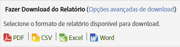

# Agendamento e distribuição de relatórios

Informações sobre agendamento, download e distribuição de relatórios.

Ao agendar um relatório para entrega no aplicativo Adobe Analytics, você pode usar as ferramentas de Agendamento e Distribuição para saber quais arquivos foram enviados automaticamente e modificar ou encerrar as entregas.

Devido às diferenças entre os mecanismos e plataformas de processamento, os diversos tipos de relatórios do Adobe Analytics que podem ser baixados e agendados têm diferentes limitações em relação ao número máximo de linhas que podem ser processadas em uma única solicitação. Estes são os limites de cada um:

* Word, CSV, Excel, HTML e PDF: o mesmo número de linhas visíveis no relatório. Por padrão, esse limite é de 50 linhas, mas ele pode ser aumentado para até 200. Relatórios de Detalhamento têm um limite rígido de 50 linhas.
* Extrações de dados: 50.000 linhas
* Data Warehouse: ilimitado

Essas limitações são para relatórios individuais programados e baixados; os painéis são limitados à quantidade de espaço disponível em um reportlet.

> [!NOTE] O "Tempo de entrega"/"Hora do dia" inserido pelo usuário especifica a hora em que o relatório deve começar a ser processado, não a hora em que será realmente entregue. O tempo real em que o relatório será entregue baseia-se principalmente no tempo necessário para o processamento (relatórios complexos e grandes demoram mais para serem processados do que relatórios mais simples). Por exemplo, se um relatório levar 15 minutos para ser processado, o tempo de entrega real será de pelo menos 15 minutos depois do "Tempo de entrega"/"Hora do dia" especificado originalmente.
>Além disso, existem outros fatores que podem aumentar ainda mais o atraso antes de o relatório ser efetivamente entregue:
>
> * **Execução de várias programações diferentes do mesmo tipo ao mesmo tempo** (por exemplo, muitos painéis etc.) pode sobrecarregar o sistema. O sistema de agendamento permite que apenas alguns (5-10) relatórios de qualquer tipo sejam executados simultaneamente. Portanto, quando mais de 5-10 forem todos agendados de uma só vez, alguns precisarão aguardar a conclusão de outros relatórios para que possam começar o processamento. Esse problema pode ser resolvido agendando os relatórios de uma empresa em momentos escalonados ao longo do dia ou da hora, em vez de simultaneamente.
> * Além do tipo de relatório específico (Painéis, etc.), os relatórios também aguardam em linha se a empresa tiver **mais de 15 a 20 de qualquer tipo de relatório programado de uma só vez (em todos os tipos de relatório diferentes)**. Isso pode ser atenuado por horários de programação impressionantes, em vez de muitos serem executados ao mesmo tempo.
> * **Problemas em serviços** downstream nos quais o Agendador depende também podem afetar a entrega de relatórios. Por exemplo, se você estiver usando independentemente as APIs para executar relatórios e preencher a fila de solicitações de API, seus relatórios agendados podem ser entregues lentamente enquanto você compete por esse recurso.
> * **A latência** do conjunto de relatórios (um atraso na coleta de dados) também pode atrasar alguns relatórios programados.

## Enviar um relatório {#task_27642CD33D484FD0BF59EBD159EEF52C}

Etapas que descrevem como fazer o download e enviar por email relatórios em vários formatos, além de agendar a entrega de um relatório.

1. Run a report, then click **[!UICONTROL More]** &gt; **[!UICONTROL Send]**.
1. Especifique as opções de entrega:

   | Opção | Descrição |
   |--- |--- |
   | Formato | Selecione PDF ou HTML. |
   | Enviar para | Forneça o endereço de email do destinatário.. |
   | Assunto | Assunto do email. |
   | Agendamento | Selecione para enviar o relatório imediatamente ou em um intervalo diferente. |

1. Click **[!UICONTROL Advanced Delivery Options]** to specify a delivery schedule.

| Opção | Descrição |
|--- |--- |
| Nome do arquivo de relatório | Digite o nome do relatório. The default format is `<report name> for <suite> - <report date range>`. Para especificar um nome personalizado, selecione [!UICONTROL Personalizado]. |
| Formato do Relatório | Permite que você especifique PDF, CSV, Excel, HTML, Word, ou formatos móveis para a entrega. Se você selecionar CSV, você também pode especificar a codificação para CSV:<ul><li>Shift-JIS: codificação de caracteres japoneses.</li><li>EUC-JP: Código Unix Extended, principalmente para japonês, coreano e chinês simplificado.</li></ul> |
| Conteúdos do relatório | <ul><li>Número de linhas na tabela: especifique o número de linhas que devem ficar visíveis na tabela do relatório que você está enviando.</li><li>Idioma para cabeçalho e rodapé: especifique o idioma para o cabeçalho e rodapé.</li><li>comentários: especifique o texto a ser exibido no começo do relatório.</li></ul> |
| Enviar arquivo de assinatura digital | Ao solicitar um relatório, como um relatório marcado ou solicitações do Data Warehouse, é possível solicitar uma assinatura de dados. A assinatura digital da Adobe não restringe quem tem acesso aos dados, mas a finalidade do Arquivo de assinatura digital (.sig) é verificar a validade do arquivo de relatório entregue. Usando a assinatura digital, os destinatários do relatório podem se certificar de que o arquivo veio da Adobe e que não foi alterado. |
| Destino do Relatório | <ul><li>Email: permite definir as configurações de endereço de email, o assunto e notas.</li><li>FTP: permite configurar as definições de FTP, incluindo o host, porta, diretório, nome de usuário e senha.</li></ul> |

1. Click **[!UICONTROL Scheduling Options]**.

| Opção | Descrição |
|--- |--- |
| Enviar relatório agora | Envia o relatório imediatamente. |
| Agendar para mais tarde | Exibe opções para especificar um período de tempo e opções de entrega. |
| Intervalo de tempo dos relatórios | **Fixo**: impede que a data avance com o passar do tempo. **Em andamento**: permite que a data avance com o passar do tempo. Algumas considerações:<ul><li>Se você selecionar Em andamento para as datas de início e fim, e selecionar um relatório diário para o dia anterior, você receberá um email diariamente com um relatório do dia anterior.</li><li>Se você selecionar Fixo para o dia inicial e em andamento para o dia final, você receberá no primeiro dia um relatório do dia anterior. O segundo dia você receberá um relatório dos dois dias anteriores, no terceiro dia você receberá um relatório dos últimos três dias, e assim por diante.</li><li>Se você selecionar Fixo como datas de início e término, cada dia você receberá um relatório idêntico dos dias especificados.</li><li>Não é possível selecionar uma data inicial contínua e uma data de término fixa.</li></ul> |
| Frequência de entrega | <ul><li>**Por hora**: envia um email a cada hora, ou qualquer outro intervalo de horas.</li><li>**Diariamente**: envia um email todos os dias, em dias alternados, a cada três dias, ou qualquer outro intervalo de dias. Você também pode enviá-lo a cada dia da semana.</li><li>**Semanalmente**: envia o email toda semana, a cada duas semanas, a cada três semanas, ou qualquer outro intervalo de semanas. Você também pode especificar em qual dia da semana ele é enviado.</li><li>**Mensalmente**: especifica o intervalo em número de meses, e você também pode selecionar o dia do mês em que será enviado, ou o dia da semana em uma semana específica do mês.</li><li>**Anualmente**: especifica o dia do ano em que o relatório é enviado, ou você pode enviar em um dia específico da semana em qualquer semana do ano.</li><li>**Hora do dia**: aplica-se ao fuso horário anexado ao conjunto de relatórios selecionado.</li></ul> |
| Opções de finalização de entrega | <ul><li>**Nunca finalizar**: sem prazo final.</li><li>**Terminar após`value`ocorrências**: Especifica o número de ocorrências antes de terminar a entrega.</li><li>**Finalizar em**: permite especificar uma data específica. Se você desejar processar os dados na mesma data dos dados do relatório, o relatório conterá somente os dados que foram inseridos no banco de dados do no momento em que o relatório for enviado. Como o processamento completo para um dia pode demorar até 24 horas, os dados completos podem não estar disponíveis no momento em que o relatório é enviado. Para obter os dados completos, sempre defina o tempo de processamento durante 24 horas após o término do período do relatório.</li></ul> |

## Imprimir um relatório {#task_0F7CF6D6ED54462CAE4A793E271AF7E5}

Etapas que descrevem como imprimir um relatório.

1. Executar um relatório.
1. Click **[!UICONTROL More]** &gt; **[!UICONTROL Print]**.  

## Baixar um relatório com as opções básicas {#task_43660107A1C9485D92981CD75B562577}

Baixe informações detalhadas sobre um relatório específico nos formatos PDF, CSV, Excel ou Exportação de dados brutos.

1. Em **Análises** &gt; **[!UICONTROL Relatórios]**, selecione um relatório a ser exibido.
1. Clique em **[!UICONTROL Baixar]**.

   

1. Selecionar o formato desejado para o relatório:

   * **[!UICONTROL PDF]**: especifica que o relatório será baixado no formato Adobe PDF e permite compartilhar o relatório com outras pessoas, independentemente do sistema de computador usado.
   * **[!UICONTROL CSV]**: Especifica que o relatório será baixado em [!DNL .csv] (formato de valores separados por vírgulas).
   * **[!UICONTROL Excel]**: especifica que o relatório será baixado no formato do Microsoft Excel e permite compartilhar o relatório com outras pessoas que podem abri-lo em um programa de planilhas.
   * **[!UICONTROL Word]**: especifica que o relatório será baixado no formato do Microsoft Word.
   >[!NOTE]
   >
   >Se você usar um dos formatos de exportação brutos para baixar um relatório e o nome da página estiver em branco, o Adobe Analytics provavelmente não teve tempo suficiente para processar os dados. Baixe o relatório posteriormente.

## Gerenciar relatórios programados {#task_C17677C543454FF2B06D10EA5652DFBC}

Informações sobre como gerenciar relatórios agendados.

No [!UICONTROL Gerenciador de agendamento de relatório], é possível editar e excluir entregas de relatório recorrentes. Você pode criar prazos de entrega, que enviam seus relatórios via email ou FTP para um endereço especificado. Você pode configurar esses horários para enviar automaticamente relatórios em intervalos especificados por um período de tempo ou indefinidamente, ou interromper a entrega de um relatório periódico.

O [!UICONTROL Gerenciador de agendamento de relatório] mostra os itens criados por um usuários específico. Se a conta de usuário estiver desabilitada no aplicativo, todas as entregas programadas são interrompidas.

1. To access the manager, click **[!UICONTROL Analytics]** &gt; **[!UICONTROL Components]** &gt; **[!UICONTROL Scheduled Reports]**.

## Compartilhar um link de relatório {#task_9711DDE9E140451B8C914EC5513E21EC}

Etapas que descrevem como compartilhar um relatório gerando um link de relatório (URL) para enviar a outro usuário.

Quando o destinatário clica no link, o sistema solicita ao as credenciais de logon (nome da empresa, nome de usuário e senha). Após o logon, o relatório gerado pelo usuário original é exibido ao destinatário. Restrições de permissão padrão se aplicam.

**Compartilhamento de um link de relatório**

1. Executar um relatório.
1. Click **[!UICONTROL More]** &gt; **[!UICONTROL Link to This Report]**.

## Cancelar inscrição nos relatórios agendados {#concept_6B48360F935740B6851BA85D32DEF637}

É possível cancelar sua inscrição nos relatórios agendados. Você não vai mais receber os relatórios, mesmo que seu nome de usuário seja adicionado ao relatório agendado novamente.

>[!IMPORTANT]
>
>Para que você receba o relatório novamente, é necessário criar um novo agendamento.

Para cancelar a inscrição de um relatório agendado:

1. Vá até o email com o link para o relatório cuja inscrição você deseja cancelar.

   

1. Clique no link **[!UICONTROL clique aqui]**, ao lado de **[!UICONTROL Cancelar entrega automática deste relatório]**.

1. Confirme que você deseja cancelar a entrega do relatório.

   >[!NOTE]
   >
   >Esse fluxo de trabalho é o mesmo quer você seja o agendador do relatório ou o destinatário do relatório.

Cancelar a inscrição no relatório não cancela o relatório agendado.

Para cancelar um relatório agendado, navegue até o Gerenciador de agendamentos e clique no X vermelho ao lado do nome do relatório. [Mais...](/help/analyze/reports-analytics/scheduling.md#task_C17677C543454FF2B06D10EA5652DFBC)
