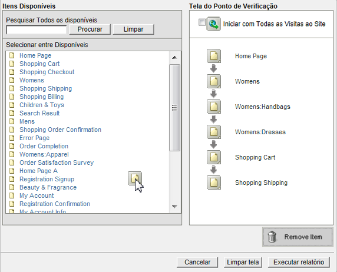
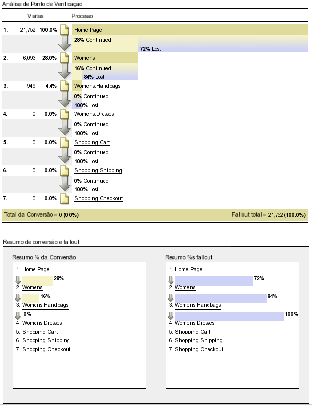
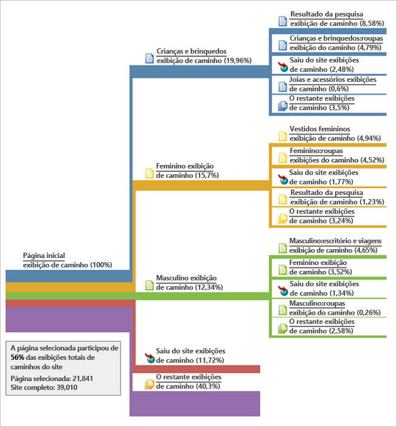
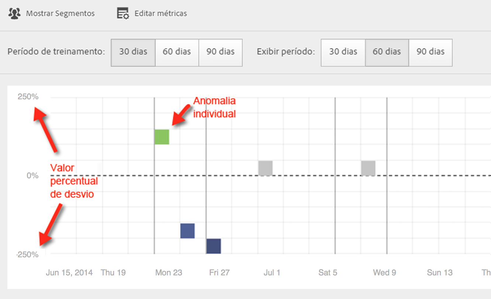
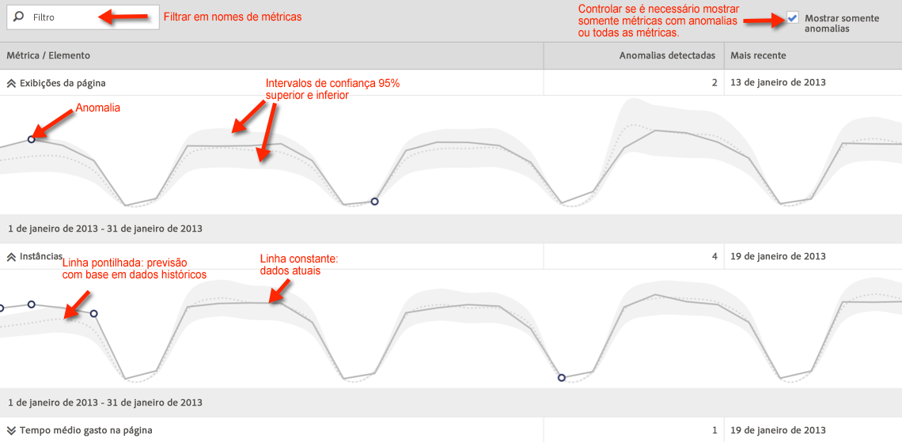
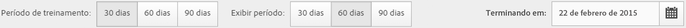
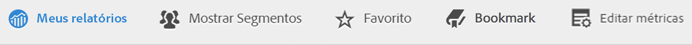
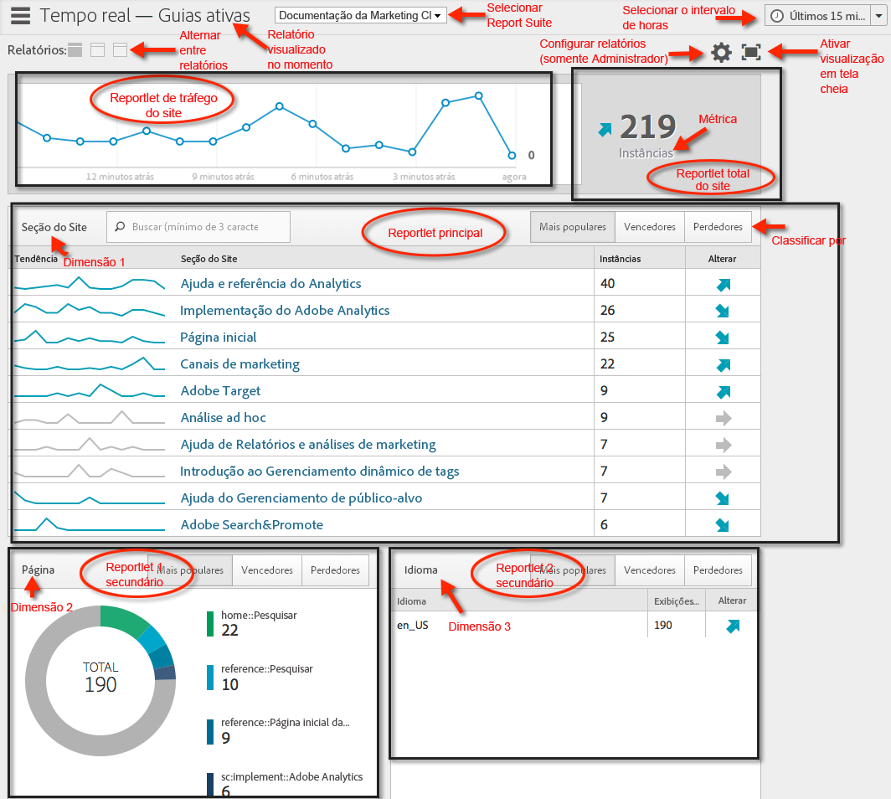
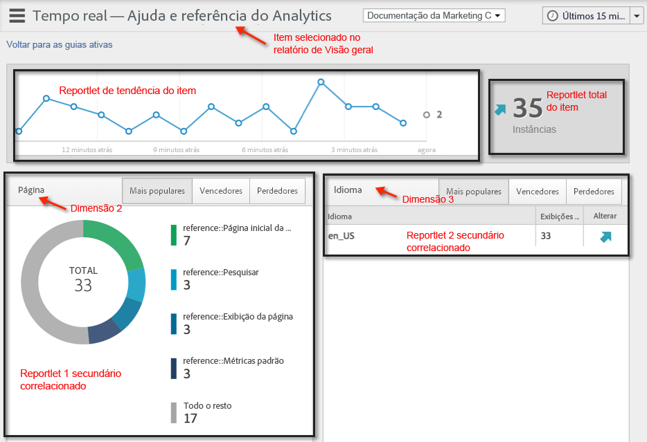

# Executar tipos de relatórios diferentes

Etapas para executar os diferentes tipos de relatório.

## Executar um relatório classificado {#task_C570BA4A213F4F2EB7B30E012934BE7D}

Em um relatório classificado, a tabela mostra a classificação das páginas do relatório em relação à métrica, de acordo com o número ou a porcentagem. Os relatórios classificados podem exibir diversas métricas em um mesmo relatório.

<!-- 

t_reports_ranked.xml

 -->

1. Generate a report, such as a [!UICONTROL Pages Report] ( **[!UICONTROL Reports]** &gt; **[!UICONTROL Site Content]** &gt; **[!UICONTROL Pages]**).
1. No cabeçalho do relatório, clique em **[!UICONTROL Classificado.]**
1. Para classificar o relatório, clique em um título de coluna na tabela.

   Os Relatórios classificados podem ter até 200 itens indicados na tabela (tais como produtos, categorias, páginas da Web, etc.) e dez métricas (receita, ordens, visualizações, etc.).

## Executar um relatório de tendências {#task_F03B4E760B9E4EA29FC3F654E6316887}

Os relatórios de tendência exibem as métricas ao longo do tempo. Você usa este tipo de relatório quando deseja ver como um segmento se comporta de um período de tempo para o seguinte.

<!-- 

t_reports_trended.xml

 -->

A maioria dos relatórios de Conversão e Tráfego tem uma exibição com Tendência disponível. Usando o [!UICONTROL Calendário], você pode mostrar a melhora de qualquer análise de período, inclusive dias de um mês, semanas de um ano, semanas de um trimestre, meses de um ano, etc. Relatórios de tendência mostram tendências para uma única métrica (receitas, pedidos, opiniões, etc.) para até cinco itens (como produtos, categorias, páginas da Web, etc.).

**Para executar um relatório de tendências**

1. Run a conversion or traffic report, such as **[!UICONTROL Reports]** &gt; **[!UICONTROL Site Content]** &gt; **[!UICONTROL Pages]**.
1. Under **[!UICONTROL Report Type]**, click **[!UICONTROL Trended.]**

## Executar um relatório de funil de conversão {#task_B926A74AA6A641138C2986C1635120CB}

Os relatórios de Funil de conversão exibem a porcentagem dos visitantes que avançaram por um conjunto de eventos para executar a ação desejada. Por exemplo, você pode visualizar quantos visitantes avançaram da visita inicial à sua página da Web à adicionar itens ao carrinho e, em seguida, à compra dos itens. Este relatório também mostra o número de visitantes que desistiram no meio do processo.

<!-- 

t_reports_conversion_funnel.xml

 -->

To run this report, select a report, such as a Pages report ( **[!UICONTROL Reports]** &gt; **[!UICONTROL Campaigns]** &gt; **[!UICONTROL Tracking Code]** &gt; **[!UICONTROL Campaign Conversion Funnel]**).

Consulte [Relatórios de conversão](https://marketing.adobe.com/resources/help/en_US/reference/reports_conversion.html) para uma descrição.

## Executar um relatório de fallout {#task_8FD97C8260464F9DA731A93DB8F80184}

O [!UICONTROL Relatório de desistências] exibe o número de visitantes que visitaram uma sequência pré-especificada de páginas. Ele também mostra as taxas de conversão e desistência entre cada etapa.

<!-- 

t_reports_fallout.xml

 -->

Dê uma olhada no novo painel [Análise de fallout](https://marketing.adobe.com/resources/help/en_US/analytics/analysis-workspace/fallout_flow.html) da Analysis Workspace!

1. In [!UICONTROL Adobe Analytics], click **[!UICONTROL Reports]** &gt; **[!UICONTROL Paths]** &gt; **[!UICONTROL Pages]** &gt; **[!UICONTROL Fallout]**.
1. Na página do [!UICONTROL Relatório de desistências]**, clique em[!UICONTROL Executar o Report Builder de Fallout]**.

   

1. Na página [!UICONTROL Definir pontos de verificação], especifique os pontos de verificação que deseja utilizar para o relatório.
1. Click **[!UICONTROL Run Report]**.

   

>[!MORELIKETHIS]
>
>* [Descrição do relatório de fallout](https://marketing.adobe.com/resources/help/en_US/reference/reports_fallout.html)

## Executar um relatório de fluxo de página {#task_133E8B87C3F04DA0A42D10CBA499305B}

Relatórios de fluxo de página exibem a ordem na qual seus visitantes acessam as páginas e navegam pelo seu site. Este relatório ajuda a descobrir essas respostas

<!-- 

t_reports_page_flow.xml

 -->

Dê uma olhada na nova [Visualização de fluxo](https://marketing.adobe.com/resources/help/en_US/analytics/analysis-workspace/flow.html) da Analysis Workspace!

Execute um relatório [Caminhos](https://marketing.adobe.com/resources/help/en_US/reference/reports_paths.html).

For example, click **[!UICONTROL Reports]** &gt; **[!UICONTROL Paths]** &gt; **[!UICONTROL Pages]** &gt; **[!UICONTROL Next Page Flow]**.

Este relatório é lido da esquerda para a direita, começando com a página selecionada. As páginas que foram visualizadas após a página selecionada são ilustradas como uma ramificação que se estende para a direita.

O percentual que cada página subsequente foi visualizada é apresentado ao lado do nome da página. A largura da linha conectada a cada próxima página descreve essa porcentagem relativa.

**[!UICONTROL Exibições de caminho]**: indica o número de vezes que uma página foi visualizada, quando restrita aos caminhos exibidos.

Por exemplo, a página Política de privacidade pode ter o total de 10.000 exibições da página, mas apenas 500 delas ocorreram imediatamente após a página inicial. Dessa forma, o termo exibição do caminho é usado.

A porcentagem relativa é representada pela largura relativa da linha. Por padrão, esse relatório mostra cinco ramificações de segundo nível e cinco ramificações de terceiro nível. É possível expandir o número de ramificações para exibir até dez ramificações de segundo nível e cinco de terceiro. Isso aumentará a altura do relatório e muito provavelmente será necessário rolar a página para visualizar todo o gráfico.

## Executar um relatório de funil {#task_2BBF6FACD48F479E8B2EE458919941CB}

Você pode selecionar eventos de sucesso e adicioná-los ao relatório [!UICONTROL Funil de conversão de compra] ou ao [!UICONTROL Funil de conversão de produto].

<!-- 

t_reports_funnel.xml

 -->

1. Click **[!UICONTROL Reports]** &gt; **[!UICONTROL Products]** &gt; [Products Conversion Funnel](https://marketing.adobe.com/resources/help/en_US/reference/reports_conversion_funnel.html).

## Executar um relatório de canal de marketing {#task_64ADED5CC75248319E06E3E029B47F78}

O relatório do canal de marketing fornece uma visão geral do relatório da alocação de canal de última hora, com métricas de relatório padrão, como receita, pedidos e custo. Este relatório permite analisar quanta receita foi gerada por cada canal. 

<!-- 

t_reports_marketing_channel.xml

 -->

Consulte o sistema de ajuda do [Marketing Channel](https://marketing.adobe.com/resources/help/en_US/mchannel/index.html) para obter mais informações.

## Executar um relatório de Detecção de anomalias {#task_4808C96327354D789C075823F5C3A049}

Descreve como interpretar os gráficos de Resumo e Métrica individual na Detecção de anomalias.

<!-- 

t_anomaly_view.xml

 -->

Dê uma olhada nos novos recursos [Detecção de anomalias e Análise de contribuições](https://marketing.adobe.com/resources/help/en_US/analytics/analysis-workspace/anomaly_detection.html) na Analysis Workspace!

**[!UICONTROL Relatórios]** &gt; Métricas **[!UICONTROL do]** site &gt; Detecção **[!UICONTROL de anomalias]** .

> [!NOTE] Você também pode executar a Detecção de anomalias em projetos da Analysis Workspace. [Mais...](https://marketing.adobe.com/resources/help/en_US/analytics/analysis-workspace/anomaly_detection.html)

Para obter informações sobre como configurar uma Detecção de anomalias, consulte o [Guia de referência](https://marketing.adobe.com/resources/help/en_US/sc/user/index.html#Setting_up_Anomaly_Detection).

A Detecção de anomalias mostra dois tipos de gráficos: um gráficos resumidos e de métricas individuais. Os gráficos de métricas individuais são mostrados somente se pelo menos uma anomalia foi detectada para essa métrica.

<table id="table_88163CD8FC164342855D90D01F9C581A"> 
 <thead> 
  <tr> 
   <th colname="col1" class="entry"> 
Tipo de gráfico 
 </th> 
   <th colname="col2" class="entry"> 
O que ele faz 
 </th> 
  </tr> 
 </thead>
 <tbody> 
  <tr> 
   <td colname="col1"> 
Gráfico de resumo 
 
 
 </td> 
   <td colname="col2"> 
 
     <ul id="ul_D26DA3024CD7468291369F549557B28A"> 
      <li id="li_1C22B6E02FFB479FB71EFAD89EB37A4E">Cada caixa representa uma anomalia, rastreada por dia, que corresponde a uma métrica abaixo. </li> 
      <li id="li_8FC587D3FF4E452D83263CC7A10B6675">Verde indica anomalias acima da linha de tendência, azul abaixo da linha de tendência. </li> 
      <li id="li_25135AB691BF443599AF2A3A60E2E71A">Indica a força da anomalia: quanto maior for a anomalia, mais escura é a cor do ponto de dados e mais distante da linha de tendência. </li> 
      <li id="li_0C42AFA8897D420D8AB1A5D0F65B3B3A">Clicar em anomalias individuais leva o gráfico da métrica individual da anomalia (abaixo do gráfico de resumo) para o início. </li> 
      <li id="li_85C0F426952547B5A75D6BD31DE19CA5">Os valores percentuais de desvio (à esquerda do gráfico) são calculados da seguinte forma: 
       <ul id="ul_BEC0A88BFFAC4CF78BC9885FEB749694"> 
        <li id="li_1BAB2F50482745B69937DFAF1E09982E">Se os limites superiores e o valor esperado são os mesmos, o % de desvio é de 100%. </li> 
        <li id="li_CA48064F5788448C8646CCE196161237">Caso contrário, o % de desvio é ((valor real - valor limite superior) / (valor limite superior - valor esperado)) * 100 </li> 
        <li id="li_4090357A0D214BC7B1C3DE0615875554">Se os limites inferiores e o valor esperado forem os mesmos, o % de desvio será -100% </li> 
        <li id="li_EF694E1A4E874ECD94E1E8F7302E494F">Caso contrário, o % de desvio é ((valor limite inferior - valor real) / (valor esperado - valor limite inferior)) * -100 </li> 
       </ul> </li> 
      <li id="li_5C05EF7023484CC993E96D63E842B65C">Clicar em Exibir segmentos exibe o painel de segmentos, que permite aplicar segmentos a um relatório de detecção de anomalias. <a href="https://marketing.adobe.com/resources/help/en_US/analytics/segment/"  > Mais</a> sobre a segmentação. </li> 
      <li id="li_1B41CABF13D1407886C68EE3BC201E60">Clicar em Editar métricas permite selecionar e desmarcar as métricas nas quais deseja detectar anomalias. </li> 
     </ul> 
 </td> 
  </tr> 
  <tr> 
   <td colname="col1"> 
Gráfico de métrica individual 
 
 
 </td> 
   <td colname="col2"> 
 
     <ul id="ul_739C5687013743A29B63089FDA763F45"> 
      <li id="li_456A0BDA4D4E46CE9CC1C3DBAA1E2220">Exibe os pontos de dados anômalos para métricas de tendências individuais (incluindo métricas calculadas) como pontos. </li> 
      <li id="li_89FD847C65F04F48BCA7CD38D0EC51CD">Mostra a anomalia mais recente no topo e classifica pelo número de anomalias. </li> 
      <li id="li_98B97A9706DE4455B8D8850904CBDE03">Exibe uma linha sólida para indicar dados reais coletados. Isso é comparado à previsão e à margem de erro para derivar se os pontos de dados são anômalos. </li> 
      <li id="li_0EEA38DDDC344BF3879430E67D74EB72">Exibe um linha pontilhada que representa uma previsão com base nos dados históricos (ou seja, o período de treinamento). </li> 
      <li id="li_035BD2725D004AEDB630BF8DFF4DA4F3">Exibe os intervalos/limites de confiança de 95% superior e inferior em cinza. </li> 
      <li id="li_021A3D1F2EDB4319B9B39620EF1C038A">Permite recolher e ampliar relatórios individuais ao clicar nas setas para cima e baixo ao lado do nome da métrica. </li> 
      <li id="li_722E4B9FC21047AC96D7B143197E293D">Altera a ordem na qual os gráficos de métricas aparecem ao reagir a detalhamentos no relatório de visão geral (consulte abaixo) </li> 
      <li id="li_A2441169B185475AA68A64F81E6E40B8">Permite você filtrar gráficos ao usar termos de pesquisa, como "página", para todas as métricas relacionadas à página. </li> 
      <li id="li_F1BBBFCA8E2A43C29658E4FCAA36C904">Permite exibir todas as métricas definidas ou somente aquelas com anomalias. </li> 
     </ul> 
 </td> 
  </tr> 
 </tbody> 
</table>

## Configuração da detecção de anomalias {#task_AF347B34F56E44A6AE70E019B6EB2F08}

Etapas para selecionar conjuntos de relatórios, métricas e períodos de treinamento/visualização para a detecção de anomalias.

<!-- 

t_anomaly_config.xml

 -->

Você configura uma Detecção de anomalias independentemente para cada conjunto de relatórios.

1. Navegue até **[!UICONTROL Análises &gt; Relatórios &gt; Métricas do site &gt; Detecção de anomalias]** .
1. Selecione o conjunto de relatórios para o qual você deseja rastrear a detecção diária de anomalias. Para exibir uma lista de conjuntos de relatórios, clique no menu suspenso do seletor do Conjunto de relatórios.
1. To select the metrics and/or define filtered metrics, click **[!UICONTROL Edit Metrics]** at the top right of the screen:  .

   Você pode coletar métricas da lista (incluindo métricas calculadas) de todas as métricas, ou a partir de uma lista de métricas rastreadas. Também é possível filtrar por termos específicos para limitar a lista. 1. Once the report has been generated, define the **[!UICONTROL Training Period]** and the **[!UICONTROL View Period]** for anomaly detection. (pense no período de treinamento como "período de aprendizado" do algoritmo). 

   

   Lembre-se:

* O período de treinamento termina antes do início do período de visualização.
* O padrão para ambos é 30 dias e você pode ampliá-lo para 60 a 90 dias.
* A ampliação do período de treinamento coloca seus dados em um contexto maior e pode reduzir o tamanho de uma anomalia.

   O relatório de métricas de Detecção de anomalias é atualizado sempre que você alterar um parâmetro.
1. (Optional) Apply segments to the report by clicking **[!UICONTROL Show Segments]** and selecting one or more existing segments or creating a new segment and applying it.

   

   Consulte o [Guia de Segmentação do Analytics](https://marketing.adobe.com/resources/help/en_US/analytics/segment/) para obter mais informações sobre a criação e o gerenciamento de segmentos. 1. (Opcional) Marque como favorito ou insira um marcador no relatório.
1. (Opcional) Altere a data final do Período de visualização. O padrão é ontem.
1. Você pode começar a interpretar o relatório. [Exibindo gráficos](/help/analyze/reports-analytics/t-running-report-types.md#task_4808C96327354D789C075823F5C3A049)de Detecção de anomalias.

## Executar um relatório em tempo real {#task_5D25929C918E40B18965222FA94176B0}

Descreve como visualizar e interpretar relatórios em tempo real.

<!-- 

reports_realtime.xml

 -->

**[!UICONTROL Relatórios &gt; Métricas do site &gt; Tempo real]** .

Os relatórios em tempo real oferecem dois relatórios principais - um relatório de visão geral e um relatório detalhado. Cada um consiste em vários reportlets.

Para obter informações sobre como configurar relatórios em tempo real, consulte o [Guia de referência do Analytics](https://marketing.adobe.com/resources/help/en_US/reference/index.html#RealTime_Reports_Configuration).

1. Take a look at the **[!UICONTROL Overview]** report and its components:  

   <table id="choicetable_8586BECF55E843B2B5CD41205567EA32"> 
   <thead class="chhead sthead"> 
   <th class="choptionhd"> Componente da interface do usuário </th> 
   <th class="chdeschd"> Descrição </th> 
   </thead> 
   <tr class="chrow strow"> 
   <td class="choption"><strong>Selecione o Conjunto de relatórios</strong></td> 
   <td class="chdesc stentry"> Mostra o conjunto de relatórios que esse relatório em tempo real cobre. Para alterar o conjunto de relatórios, consulte <a href="https://marketing.adobe.com/resources/help/en_US/reference/t_realtime_admin.html"  >Configuração dos relatórios em tempo real </a>. </td> 
   </tr> 
   <tr class="chrow strow"> 
   <td class="choption"><strong>Alternar entre relatórios</strong></td> 
   <td class="chdesc stentry"> Permite que você alterne entre relatórios configurados (máximo de 3). </td> 
   </tr> 
   <tr class="chrow strow"> 
   <td class="choption"><strong>Selecionar intervalo de tempo</strong></td> 
   <td class="chdesc stentry"> Permite que você escolha o intervalo de tempo geral que será usado por todos os reportlets no relatório. </td> 
   </tr> 
   <tr class="chrow strow"> 
   <td class="choption"><strong>Configurar relatórios</strong></td> 
   <td class="chdesc stentry"> O link com ícone de engrenagem está visível somente se você tem direitos de administrador. Ao clicar no link, você é levado ao Gerenciador de conjuntos de relatórios em Ferramentas do administrador &gt; Conjuntos de relatórios &gt; Editar configurações &gt; Tempo real  . </td> 
   </tr> 
   <tr class="chrow strow"> 
   <td class="choption"><strong>Visualização em tela inteira</strong></td> 
   <td class="chdesc stentry"> O ícone de visualização em tela inteira é visível somente se o monitore tem uma taxa de aspecto específica (16:9 ou 16:10) e se o navegador oferece suporte para isso. Observe que você não pode interagir com a tela enquanto está no modo de tela inteira (pressione Esc para sair). O modo de tela inteira não atinge o tempo limite. </td> 
   </tr> 
   <tr class="chrow strow"> 
   <td class="choption"><strong>Reportlet de tráfego do site</strong></td> 
   <td class="chdesc stentry"> Os dados da linha de tendência azul mostram o tráfego total do site geral. O eixo X utiliza identificadores literais (há 15 minutos, há 10 minutos) exceto pelo valor atual, que é mostrado como uma expressão em tempo real. </td> 
   </tr> 
   <tr class="chrow strow"> 
   <td class="choption"><strong>Reportlet de total do site</strong></td> 
   <td class="chdesc stentry"> Apresenta uma contagem do Total do site para a métrica selecionada dos relatórios em tempo real para os últimos N minutos. "N" é configurável através do seletor de Intervalo de tempo. 
A cor e a direção da set são baseadas no seguinte algoritmo: 
      <ul id="ul_9F40CEA33798467393CB1266BB36D500"> 
      <li id="li_CCD01A44F912487DA5681EA50113643C">Ganho relevante (Seta para cima): &gt; 100% </li> 
      <li id="li_7402491A9A614851B7F2AE0C77BD9A97">Ganho (Seta para cima, à direita): entre 5 % e 100% </li> 
      <li id="li_BCA79C08B5714D4B9315068112C66107"> Simples (Seta para direita): entre 5% e -5% </li> 
      <li id="li_234ECBD7D83A4AE680E4A70BF288681F"> Perda (Seta para baixo à direita): entre -5% e -100% </li> 
      <li id="li_10C5EA8803604C1CA714D3DB27478B31"> Perda significativa (Seta para baixo): &lt; -100% </li> 
      </ul> 
 
Se o total do site é informado em "instâncias", estas refletem a dimensão no reportlet principal. Se o nome de instância específico existe (como "Visualizações de página"), o total do site informa esse nome. 
 </td> 
   </tr> 
   <tr class="chrow strow"> 
   <td class="choption"><strong>Reportlet principal</strong></td> 
   <td class="chdesc stentry"> Relatório para a dimensão principal do relatório em tempo real e sua métrica. Apresenta uma linha de tendência para esse elemento no intervalo de tempo selecionado. O total da métrica representa a soma da linha de tendência completa. A seta indica se o item obtém muitos ganhos, ganhos, simples, perde ou perde bastante. </td> 
   </tr> 
   <tr class="chrow strow"> 
   <td class="choption"><strong>Caixa de diálogo de pesquisa</strong></td> 
   <td class="chdesc stentry"> A pesquisa afeta todos os reportlets. A pesquisa persiste enquanto você visualiza o relatório. </td> 
   </tr> 
   <tr class="chrow strow"> 
   <td class="choption"><strong>Classificar por... Mais popular/ganhadores/perdedores</strong></td> 
   <td class="chdesc stentry"> Você pode alternar para classificar por Mais popular (padrão), Ganhadores (dimensões que mostram o maior crescimento) e Perdedores (dimensões em uma trajetória descendente). 
Esta é a fórmula usada para determinar ganhadores ou perdedores: O tempo real procura a amostra mais antiga e a amostra próxima à mais recente e faz um cálculo simples de "% de alteração". Portanto, se "Últimos 15 minutos" for selecionado, e n representa o minuto atual, n-1 é comparado a n-15. No momento, o Tempo real não efetua ponderação. O minuto atual é ignorado, pois não está completo e provavelmente produz uma % de alteração falsa. 
 
Essa fórmula é consistente em todas as métricas usadas no relatório de tempo real. 
 </td> 
   </tr> 
   <tr class="chrow strow"> 
   <td class="choption"><strong>Reportlet 1 secundário</strong></td> 
   <td class="chdesc stentry"> Apresenta os Relatórios em tempo real para a dimensão dos relatórios provisionados em segundo lugar e para a métrica. 
O reportlet 1 secundário mostra as 4 principais categorias; a 5ª é um agregado de todos os valores restantes. Para cada categoria, é fornecida a visualização total bruta da categoria. Além disso, o total para todas as categorias são mostrados no centro. 
 
 Passar o mouse sobre uma seção destaca a categoria associada e exibe a linha de tendência da categoria abaixo da rosca. 
 
 Passar o mouse sobre um item de linha destaca-o, além da seção associada e exibe a linha de tendência da categoria abaixo da rosca. 
 </td> 
   </tr> 
   <tr class="chrow strow"> 
   <td class="choption"><strong>Reportlet 2 secundário</strong></td> 
   <td class="chdesc stentry"> Apresenta Relatórios em tempo real para a dimensão do terceiro relatório provisionado e para a métrica. Passar o mouse sobre a etiqueta do item desliza a etiqueta para a direita e revela uma linha de tendência para o item focalizado. </td> 
   </tr> 
   </table>

1. Click a list item in the Primary Reportlet to launch the **[!UICONTROL Details]** view for that list item:  

   | **Reportlet de tendência do item** | Apresenta a linha de tendência do item selecionado no Relatório de visão geral nos últimos N minutos. N é configurável através do seletor de Intervalo de tempo. |
   |---|---|
   | **Reportlet total do item** | Apresenta uma contagem de métrica total do item selecionado no Relatório de visão geral nos últimos N minutos. N é configurável através do seletor de Intervalo de tempo. |
   | **Reportlet 1 secundário correlacionado** | Esse reportlet é semelhante ao Reportlet 1 secundário. A única diferença é a fonte de dados usados para preencher esse relatório: neste exemplo, o relatório mostra a correlação (ou o detalhamento) entre uma página específica (aquela selecionada no reportlet primário do relatório de Visão geral) e as instâncias visualizadas. |
   | **Reportlet 2 secundário correlacionado** | Esse reportlet é semelhante ao Reportlet 2 secundário. A única diferença é a fonte de dados utilizada para preencher esse relatório: neste exemplo, o relatório mostra a correlação (ou o detalhamento) entre uma página específica (aquela selecionada no reportlet primário do relatório de Visão geral) e a dimensão do idioma. |
