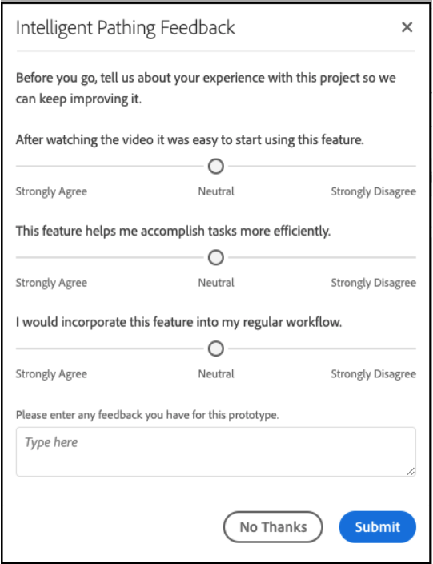

# [!UICONTROL Labs] Guia do usuário

[!UICONTROL Labs]O permite a prototipagem mais rápida de ideias em fase inicial. É uma combinação de ferramentas e processos que acelera o desenvolvimento de forma transparente, com foco no cliente. Isso permite que os usuários se envolvam com tecnologias emergentes, descubram informações valiosas e influenciem o desenvolvimento e as prioridades de recursos futuros. Você pode usar os Labs para obter acesso antecipado às inovações do Adobe Analytics e avaliar os recursos futuros no contexto de casos de uso e dados de sua própria empresa.

## Requisitos

[!UICONTROL Labs]O é ativado automaticamente para todos os administradores. Outros membros da equipe devem entrar em contato com os administradores do produto e solicitar acesso.

Se você ainda não tiver feito isso, leia e assine os formulários do Contrato de não divulgação e dos Termos e condições aplicáveis.

## Access the [!UICONTROL Labs] Portal

Para acessar [!UICONTROL Labs]:

1. If you do not already have access to [!UICONTROL Workspace] and [!UICONTROL Labs], ask your administrator for permissions.

1. Click the **[!UICONTROL Labs]** tab.

## Avaliar um protótipo

Para iniciar e avaliar um protótipo:

1. Na [!UICONTROL Labs] tela, clique **[!UICONTROL Launch]** no protótipo que você deseja ver. Quando o protótipo for iniciado, você verá seu nome no canto superior esquerdo do ambiente do protótipo.

   

1. Watch a video that highlights the prototype by clicking **[!UICONTROL Watch Video]** in the upper right of the screen. Clique **[!UICONTROL Close]** quando o vídeo for concluído.

   

1. Trabalhar com o protótipo. Ao trabalhar no ambiente de protótipo:

* Os projetos criados no ambiente de protótipo não podem ser salvos ou compartilhados.

* Em um protótipo, você pode avaliar os dados com quaisquer dimensões, métricas, segmentos e visualizações que, de outra forma, teriam acesso no Workspace.

* Quaisquer alterações feitas em um protótipo não afetarão a coleta ou o processamento de dados.

* As alterações feitas ao criar ou modificar segmentos, métricas calculadas e alertas são mantidas fora do ambiente do protótipo.

## Deixar feedback

1. Click **[!UICONTROL Give Feedback]** to provide feedback in the message box at any point when working with the prototype.

   

1. Click **[!UICONTROL Submit]** to send your feedback.

1. To try a different prototype, or to exit the prototype environment, click **[!UICONTROL Leave Prototype]** in the upper right of the screen and complete the short survey for the prototype. As mudanças feitas em um projeto de protótipo são perdidas ao sair do ambiente do protótipo.

   

1. Click **[!UICONTROL Submit]** to return to the main Previews portal.

## Informações adicionais

* Some prototypes within [!UICONTROL Labs] become Adobe Analytics features, others may not. Seus comentários guiam a decisão, portanto, reveja os protótipos e informe à Adobe o quanto você os acha valiosos.
* O Labs está disponível para todos os direitos de SKU.
