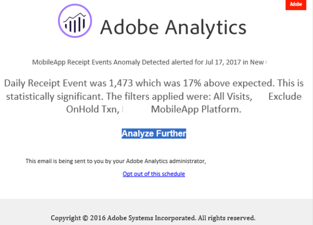

# Criar alertas {#create-alerts}

<!-- markdownlint-disable MD034 -->

>[!CONTEXTUALHELP]
>id="components_alerts_timegranularity"
>title="Granularidade de tempo"
>abstract="A granularidade de tempo refere-se à frequência com a qual o alerta é verificado."

<!-- markdownlint-enable MD034 -->

>[!NOTE]
>
>O uso de alertas com detecção de anomalias (também conhecidos como _Alertas inteligentes_) está disponível somente para organizações com um pacote do Adobe Analytics Prime ou Ultimate.

Os alertas no Adobe Analytics permitem que você receba uma notificação com base em porcentagens alteradas ou pontos de dados específicos. Dependendo do pacote do Adobe Analytics, também é possível usar alertas que são acionados com base em limites de anomalias. Os alertas de uso de chamadas do servidor são um tipo diferente de alerta disponível somente para admins do Analytics. Esses alertas notificam sobre o risco ou a ocorrência de um excesso nos dados de consumo de chamadas do servidor e de compromisso. Para obter mais informações, consulte [Alertas de uso de chamadas do servidor](/help/admin/tools/server-call-usage/scu-alerts.md).

Para informações mais detalhadas sobre os alertas, consulte [Visão geral dos alertas](alerts-overview.md).

Para criar um alerta:

1. Use qualquer um dos seguintes métodos para criar um alerta:

   * Abra um projeto no Analysis Workspace e selecione **[!UICONTROL Componentes]** > **[!UICONTROL Criar alerta]**.
   * Abra um projeto no Analysis Workspace e use o seguinte atalho: ***cmd + shift + a*** (macOS) ou ***ctrl + shift + a*** (Windows).
   * Abra um projeto no Analysis Workspace, escolha um ou mais itens de linha em uma tabela de forma livre, clique com o botão direito do mouse e selecione **[!UICONTROL Criar alerta a partir da seleção]**. Essa ação preenche instantaneamente o [Construtor de alertas](alert-builder.md) para criar um alerta com as métricas e filtros corretos.
   * Criar um alerta [a partir do gerenciador de alertas](/help/components/alerts/alert-manager.md#create-alerts).

   O construtor de alertas é exibido. Esta interface é semelhante à interface de construção de segmentos ou métricas calculadas no Analytics.

## Construtor de alertas

A interface do construtor de alertas é semelhante à interface usada para construir segmentos ou métricas calculadas no Customer Journey Analytics:

Especifique os seguintes detalhes no Construtor de alertas para um alerta:

| Elemento | Descrição |
|---------|----------|
| **[!UICONTROL Título]** | Especifique um nome para o alerta. O nome do alerta pode conter o nome do relatório ou o limite das métricas. |
| **[!UICONTROL Descrição (opcional)]** | Especifique uma descrição para o alerta. |
| **[!UICONTROL Granularidade de tempo]** | Selecione a frequência com que deseja verificar a métrica: por dia, hora ou mês.
 |
| **[!UICONTROL Destinatários]** | Especifique para onde o alerta pode ser enviado. Um alerta pode ser enviado a um usuário do Analytics, a um grupo do Analytics, a um endereço de email bruto ou a um número de telefone.
<b>Importante:</b> o número de telefone deve ser precedido por um `+` e o [código do país](https://countrycode.org/).

Um exemplo do email que o usuário recebe:

 |
| **[!UICONTROL Data de expiração]** | Defina a data e a hora em que deseja que o alerta expire. |
| **[!UICONTROL Atraso]** | O tempo necessário antes que os dados sejam concluídos e estejam disponíveis para serem relatados no Customer Journey Analytics muda de acordo com a organização, normalmente com uma variação de 3 a 9 horas após o horário do evento de dados. Para que os alertas sejam precisos, os dados de evento para um determinado intervalo de evento devem ser concluídos, o que significa que a Adobe não está mais recebendo dados de evento para o intervalo de evento especificado.
Para levar em conta esse atraso no tempo de ingestão, os alertas têm um atraso padrão de 9 horas antes de serem enviados.

É possível ajustar o atraso padrão de 9 horas para qualquer valor entre 0 e 24 horas. No entanto, diminuir o atraso para menos de 9 horas pode significar que você está relatando dados incompletos, o que resulta em informações de alerta imprecisas.

Leve em consideração o seguinte ao diminuir o tempo de atraso:
<ul><li>**Entenda a diferença entre disponibilidade e integridade dos dados**: os dados em lote são assimilados por um conjunto de dados da Experience Platform somente após um período de três a nove horas. Para que os alertas sejam precisos, a ingestão de dados deve ser concluída, com todos os dados em lote disponíveis no conjunto de dados.</li><li>**Determine quanto tempo leva para que seus dados sejam concluídos e estejam disponíveis no conjunto de dados**: os tempos de ingestão de dados diferem de acordo com a organização. Certifique-se de que o tempo de atraso escolhido para a entrega de alertas é o mesmo ou menos frequente do que o tempo que leva para que os dados em lote fiquem disponíveis no conjunto de dados da Platform<!--add link? -->.</li>
**Dica:** a maneira mais precisa de saber o tempo necessário para que todos os dados em lote sejam concluídos e assimilados no conjunto de dados da Platform é consultar os engenheiros de dados em sua organização.

Como alternativa, você pode ter uma ideia geral de quanto tempo demora para que a entrega em lote na sua organização fique disponível no conjunto de dados da Experience Platform. Criação da seguinte tabela de forma livre no Analysis Workspace:
<ol><li>Em uma tabela de forma livre no Analysis Workspace, adicione uma métrica [!UICONTROL **Eventos**] e uma dimensão [!UICONTROL **Dia**].</li><li>Detalhe a dimensão [!UICONTROL **Dia**] usando uma dimensão [!UICONTROL **Horas**].
Horas que não possuem nenhum dado são mostradas como 0.
</li></ol><li>**Leve em conta os erros de cálculo**: se você diminuir o tempo de atraso padrão, configure o atraso para pelo menos uma hora além do tempo que a organização demora para concluir a ingestão de dados. Por exemplo, se houver um atraso de 3 horas antes da conclusão da ingestão de dados, você deve definir um atraso de 4 horas.</li> |
| **[!UICONTROL Enviar um alerta quando]**: | [!UICONTROL **Qualquer uma destas métricas aciona**]: <ol><li>Arraste e solte métricas (incluindo métricas calculadas) para criar acionadores para o alerta.
Uma mensagem *componentes incompatíveis* será exibida se nem todas as métricas, dimensões ou segmentos no alerta forem compatíveis com o conjunto de relatórios selecionado atualmente.

Determine o limite (para uma anomalia) que a métrica deve exceder ou o valor (em caso de acima, abaixo, igual ou alteração de porcentagem) a ser usado antes que um alerta seja definido.</li><li>Selecione uma das seguintes condições:<ul><li>existe uma anomalia</li><li>a anomalia está acima do esperado</li><li>a anomalia está abaixo do esperado</li><li>está acima ou é igual a</li><li>está abaixo ou é igual a</li><li>alterações por</li></ul></li><li>Selecione um valor de limite ou insira um valor.</li></ol>[!UICONTROL **Com todos estes filtros**]: arraste e solte segmentos ou dimensões para adicionar filtros ao alerta. Por exemplo, adicionar um segmento *Somente dispositivos móveis* significa que a regra será acionada apenas para dispositivos móveis. É possível adicionar filtros extras usando uma instrução AND. Você pode adicionar regras AND ou OR, clicando no ícone de engrenagem.

Consulte [Alertas - casos de uso](alerts-use-cases.md) para exemplos de casos de uso.
 |
| **[!UICONTROL Pré-visualizar]** | A visualização interativa de alertas mostra a frequência de acionamento aproximada de um alerta com base em experiências passadas.
Por exemplo, se você definir a granularidade de tempo para diário, a visualização pode informar se o alerta foi acionado para uma determinada métrica x vezes durante os últimos 30 ou 31 dias.

Se você constatar o acionamento de uma quantidade excessiva de alertas, ajuste o limite em [Gerenciar alertas](alert-manager.md).

{width="50%"}
 |
