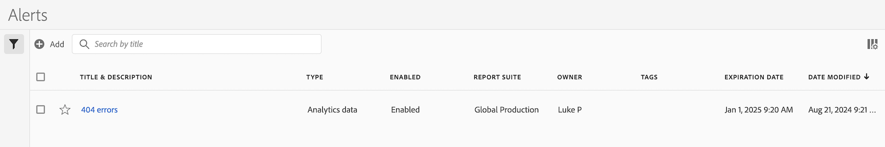

# Gerenciar alertas

Você pode filtrar, marcar, excluir, renomear, copiar, habilitar, desabilitar, renovar e exportar alertas de uma interface de gerenciamento central de [!UICONTROL Alertas]. Para gerenciar alertas:

* Selecione **[!UICONTROL Componentes]** na interface principal e **[!UICONTROL Alertas]**.

O gerenciador de Alertas está estruturado como o [Gerenciador de segmentos](/help/components/segmentation/segmentation-workflow/seg-manage.md) e o [Gerenciador de métricas calculadas](/help/components/calculated-metrics/workflow/cm-manager.md).

## Gerenciador de alertas

O gerenciador de Alertas tem os seguintes elementos de interface:

### Lista de alertas

A lista de alertas ➊ exibe todos os alertas que você possui, os alertas que foram segmentados para todos os seus projetos e os alertas que foram compartilhados com você. A lista tem as seguintes colunas:

| Coluna | Descrição |
|---|---|
|  | Selecione para favorecer  ou desfavorecer  um alerta. |
| **[!UICONTROL Título e descrição]** | Para editar o alerta, selecione o link de título, que abre o [Construtor de alertas](alert-builder.md#alert-builder). |
| **[!UICONTROL Tipo]** | O tipo do alerta: um alerta de dados do Adobe Analytics ou um alerta de uso de chamada de servidor. |
| **[!UICONTROL Habilitado]** | O alerta está ativado ou desativado. |
| **[!UICONTROL Conjunto de relatórios]** | Os conjuntos de relatórios aos quais este alerta se aplica. |
| **[!UICONTROL Proprietário]** | O proprietário do alerta. Como um usuário não administrador, você verá somente os alertas que possui ou os alertas que são compartilhados com você. |
| **[!UICONTROL Tags]** | As tags para este alerta. |
| **[!UICONTROL Data de validade]** | A data e hora em que o alerta está definido para expirar. |
| **[!UICONTROL Data de modificação]** | A data e a hora em que o alerta foi modificado pela última vez. |

<!-- 

When "Last used" column is added, add this information as the description: Shows the date when the alert was last used. 
This information can help you determine whether a component is valuable to users in your organization, where it is used, and if it needs to be deleted or modified.

Consider the following when viewing this column:
<ul><li>This information does not include usage from the API, Report Builder, or Data Warehouse.</li><li>For some components, this column might not contain data if the component was last used prior to September 2023.</li></ul>

-->

Use  para especificar quais colunas deseja exibir.

### Barra de ação

Você pode executar ações em alertas usando a barra de ações ➋. A barra de ação contém as seguintes ações:

| Ícone | Ação | Descrição |
|:---:|---|---|
|  | **[!UICONTROL Adicionar]** | Adicione outro alerta, usando o [Criador de alertas](alert-builder.md#alert-builder). |
|  | [!UICONTROL *Pesquisar por título*] | Quando nenhum alerta for selecionado na lista, procure por alertas usando esse campo de pesquisa. |
|  | **[!UICONTROL Tag]** | Marcar os alertas selecionados. Na caixa de diálogo **[!UICONTROL Alerta de Marca]**, selecione ou desmarque as marcas dos alertas selecionados. Selecione **[!UICONTROL Salvar]** para salvar as marcas dos alertas selecionados. |
|  | **[!UICONTROL Excluir]** | Excluir os alertas selecionados. Será solicitada uma confirmação. |
|  | **[!UICONTROL Renomear]** | Renomear um único alerta selecionado. Quando selecionada, você pode renomear o alerta em linha. |
|  | **[!UICONTROL Copiar]** | Copiar o alerta selecionado. Novos alertas são criados com o mesmo nome e sufixo `(Copy)`. |
|  | **[!UICONTROL Habilitar]** ou **[!UICONTROL Desabilitar]** | Ativar ou desativar os alertas selecionados. |
|  | **[!UICONTROL Renovar]** | Renova a data de expiração do alerta. A data de expiração se estende por 1 ano a partir do dia em que você seleciona essa opção, independentemente da data de expiração original. |
|  | **[!UICONTROL Exportar para CSV]** | Exportar os alertas para um arquivo `Alerts List.csv`. |

### Barra de filtros ativos

A barra de filtros ➌ mostra os filtros ativos aplicados do painel de filtros à lista de alertas (se houver). É possível remover um filtro rapidamente usando . Se mais de um filtro for especificado, você poderá remover todos os filtros usando **[!UICONTROL Remover tudo]**.

### Painel de filtro

Você pode filtrar a lista de alertas usando o  **[!UICONTROL Filtro]** no painel esquerdo ➍. O painel de filtros exibe o tipo de filtro e o número de alertas que respeitam o filtro específico.

1. Selecione  para abrir o painel Filtros. Se precisar de mais espaço para a lista Alertas, você pode selecionar  mais uma vez para fechar o painel.
1. Selecione filtros de qualquer uma das seções de filtro disponíveis.

#### Seção do filtro de tags

{{tagfiltersection}}

#### Seção de filtro do conjunto de relatórios

{{reportsuitefiltersection}}

#### Seção do filtro Proprietários

{{ownerfiltersection}}

#### Seção de filtro de status habilitado

{{enabledstatusfiltersection}}

#### Seção de filtro de tipo

{{typefiltersection}}

#### Seção de outros filtros

{{otherfiltersfiltersection}}

## Editar alertas

É possível editar um alerta

* Na lista [[!UICONTROL Alerta]](#alerts-list), selecione o título do alerta.

Você usa o [Criador de alertas](alert-builder.md#alert-builder) para editar o alerta.

## Solução de problemas de um alerta

Ao solucionar um problema com um alerta, forneça o número da JID (ID de instância de trabalho) ao suporte da Adobe. O número JID está localizado na parte inferior do email de notificação de alerta que você recebe.

<!--

# Manage alerts

You can manage existing alerts in the Alerts manager. You can perform various management tasks on alerts, such as tagging, renaming, deleting, and more.

The Alerts manager is structured very much like the [Segment Manager](/help/components/segmentation/segmentation-workflow/seg-manage.md) and the [Calculated Metric Manager](/help/components/calculated-metrics/calcmetric-workflow/cm-manager.md).

 

## Create alerts

To create alerts from the Alerts manager:

1. Select **[!UICONTROL Components]** > **[!UICONTROL Alerts]** to access the Alerts manager in Adobe Analytics.

   

1. Select [!UICONTROL **Add**] (or [!UICONTROL **Create new alert**] if you don't have any existing alerts).

1. Select the alert type that corresponds to the alert that you want to create:

   * [!UICONTROL **Analytics data alert**]: An alert to notify you when abnormal events occur in your data. 

     If you select this option, continue with [Create alerts](/help/components/alerts/alert-builder.md) for more details about creating alerts.

   * [!UICONTROL **Server call usage alert**]: An alert to notify you of the risk or occurrence of an overage in your server call consumption and commitment data. 

     If you select this option, continue with [Server call usage alerts](/help/admin/tools/server-call-usage/scu-alerts.md).

     >[!NOTE]
     >
     >You must be an Analytics administrator or a user with the Server call usage permission in order to have access to server call usage. 

## Manage existing alerts

You can perform various actions on existing alerts, such as tagging, renaming, deleting, and so forth.

To manage existing alerts in the Alerts manager:

1. Select **[!UICONTROL Components]** > **[!UICONTROL Alerts]** to access the Alerts manager in Adobe Analytics.

   

1. Select one or more alerts that you want to manage.

   

1. In the action bar, select any of the following options:

   | Action | Function | 
   |---------|----------|
   | [!UICONTROL **Tag**] | Apply a tag to an alert. This helps you to organize alerts for ease of use. | 
   | [!UICONTROL **Delete**] | Deletes the alert. | 
   | [!UICONTROL **Rename**] | Renames the alert. |
   | [!UICONTROL **Approve**] | Mark the alert as Approved. |
   | [!UICONTROL **Copy**] | Creates a copy (duplicate) of the alert. |
   | [!UICONTROL **Disable**] | Disables an alert that is currently enabled. |
   | [!UICONTROL **Enable**] | Enables an alert that is currently disabled. |
   | [!UICONTROL **Renew**] | Renews the alert expiration date. This extends the  expiration date to be 1 year from the day you selected this option, regardless of the original expiration date. |
   | [!UICONTROL **Export to CSV**] | Exports the alert to a .CSV file. |

## Edit an alert

To edit an existing alert:

1. Select **[!UICONTROL Components]** > **[!UICONTROL Alerts]** to access the Alerts manager in Adobe Analytics.

   

1. Select the alert name in the [!UICONTROL **Title and description**] column.

1. Edit the alert as desired. 

   Following are some of the things you can do when editing an alert:

   * Add alerts to other report suites
   * Add or modify the description
   * Modify the time granularity
   * Modify the recipients 
   * Modify the expiration date
   * Modify the metrics and filters

1. Select [!UICONTROL **Save**].

## Configure columns 

You can configure the information displayed for each alert in the Alerts manager by configuring the columns that are displayed.

To configure the visible columns in the Alerts manager:

1. In Adobe Analytics, select the **[!UICONTROL Components]** tab, then select **[!UICONTROL Alerts]**. 

1. In the Alert manager, select the **Customize columns** icon , then select the columns that you want to be displayed in the Alerts manager.

   The following columns are available:

   | Column title  | Description |
   |---|---|
   | Title and description | These values are provided in the Alert builder. To edit the title and description, select the title link to open the Alert builder.  |
   | Favorites  | Displays star icons next to each alert, allowing you to mark alerts as favorites. |
   | Type | Shows whether the alert is an Analytics data alert or a Server call usage alert. |
   | Enabled | Shows whether the alert is currently enabled or disabled. | 
   | Report suite | Indicates in which report suite the alert was last saved.  |
   | Owner | Indicates who owns the alert. As a non-admin, you can see only alerts you own or those that were shared with you.  |
   | Tags | Shows tags that were applied to the alert, either by you or by people who shared the alert with you.  |
   | Expiration date | Shows the date and time when the alert is set to expire. |
   | Date modified | Indicates the date when the alert was last modified.  |

   {style="table-layout:auto"}
   
   
    When "Last used" column is added, add this information as the description: Shows the date when the alert was last used. 
This information can help you determine whether a component is valuable to users in your organization, where it is used, and if it needs to be deleted or modified.

Consider the following when viewing this column:
<ul><li>This information does not include usage from the API, Report Builder, or Data Warehouse.</li><li>For some components, this column might not contain data if the component was last used prior to September 2023.</li></ul> 
   
-->

