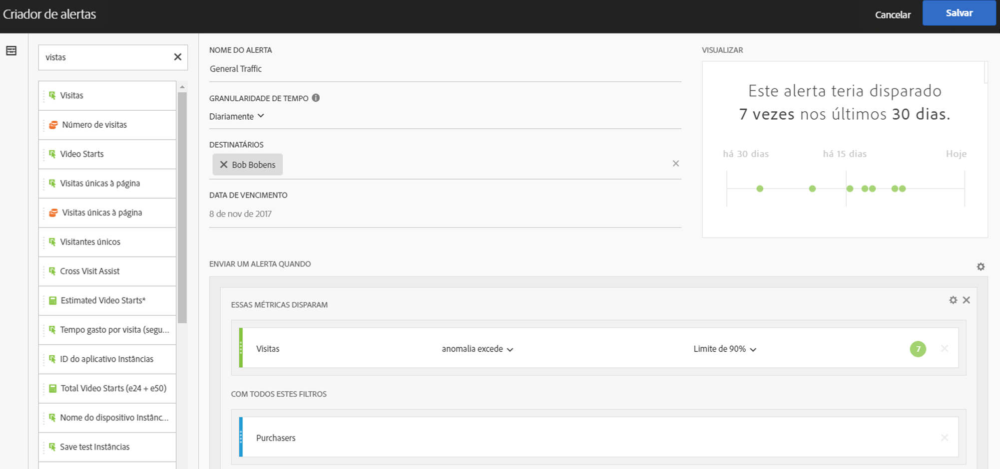
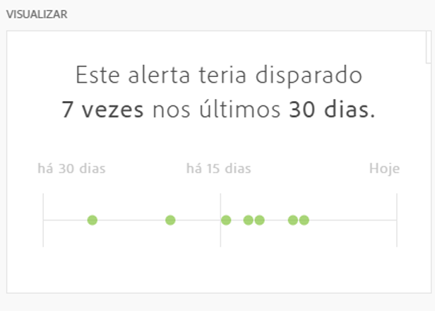

# Criador de alertas

>[!IMPORTANT]
>
>Os alertas inteligentes estão disponíveis somente para clientes do Adobe [!DNL Analytics] Prime e do Adobe [!DNL Analytics] Ultimate.

Acesse o Criador de alertas de uma das quatro maneiras:

* Usando o seguinte atalho no Analysis Workspace:

   `ctrl (or cmd) + shift + a`
* Acessando **[!UICONTROL Workspace]** > **[!UICONTROL Components]** > **[!UICONTROL New Alert]**.
* By selecting one or more freeform table line items, right-clicking and selecting **[!UICONTROL Create Alert from Selection]**.
* Dentro de um [!UICONTROL Reports & Analytics] relatório, indo até **[!UICONTROL More]** > **[!UICONTROL Add Alert]**.

A interface do Criador de alertas é semelhante àquela que cria segmentos ou métricas calculadas no [!DNL Analytics]:

**Nome do Alerta**

Especifique um nome para o alerta. O nome do alerta pode conter o nome do relatório ou o limite de métricas.

**Granularidade de tempo**

Especifique quando você deseja verificar a métrica: por hora, dia, semana ou mês.

>[!NOTE] Para conjuntos de relatórios com um calendário personalizado, não oferecemos suporte à granularidade mensal no Criador de alertas.

**Destinatários**

Especifique para onde o alerta pode ser enviado. Um alerta pode ser enviado a um usuário do [!DNL Analytics], a um grupo do [!DNL Analytics], a um endereço de email bruto ou a um número de telefone.

>[!IMPORTANT]
>
>O telefone deve ser precedido por um &quot;+&quot; e um [código de país](https://countrycode.org/).

**Data de validade**

Defina a data de expiração do alerta.

**Enviar um Alerta quando...**

*... qualquer uma dessas métricas forem acionadas*

* Arraste e solte métricas na tela que adicionará disparadores.

   Observe que uma mensagem **&quot;componentes incompatíveis&quot;** será exibida se nem todos os componentes (métricas/dimensões/segmentos) no alerta forem compatíveis com o conjunto de relatórios selecionado atualmente.

* Determine o limite que a métrica deve exceder antes de um alerta ser definido. É possível definir esse valor como um limite e, em seguida, como uma das seguintes condições:

   * a anomalia existe
   * a anomalia está acima do esperado
   * a anomalia está abaixo do esperado
   * anomalia excede
   * é igual ou superior a
   * é menor ou igual a
   * alterações por

* &quot;Anomalia excede&quot; é uma nova condição que vai além dos limites existentes (estáticos). Ele obtém algoritmos de Detecção de anomalias que definem dinamicamente o acionador. Você pode definir um limite de 90%, 95%, 99%, 99,75% e 99,9%.
* As granularidades por hora são definidas em um limite de 99,75% e as granularidades diárias em 99%.
* Observe que você também pode usar as métricas calculadas.

*... com esses filtros*

Arraste e solte segmentos ou dimensões para adicionar filtros. Por exemplo, adicionar um segmento &quot;Somente dispositivos móveis&quot; significaria que a regra dispara somente para dispositivos móveis.

filtros adicionais serão adicionados usando uma instrução E.

**Adicionar uma regra**

Você pode adicionar regras AND ou OR, clicando no ícone de engrenagem.

## Visualização de alertas {#section_10D75BA7B77E4C5FAF58A719C082E070}

A pré-visualização de alerta interativa mostra a frequência com que um alerta será acionado aproximadamente com base na experiência anterior.

Por exemplo, se você definir a granularidade de tempo como diária, a pré-visualização poderá informá-lo que o alerta teria sido disparado para uma determinada métrica x vezes durante os últimos 30 ou 31 dias.

Se você descobrir que muitos alertas teriam sido disparados, poderá ajustar o limite no Gerenciador de [alertas](/help/components/c-alerts/alert-manager.md).

