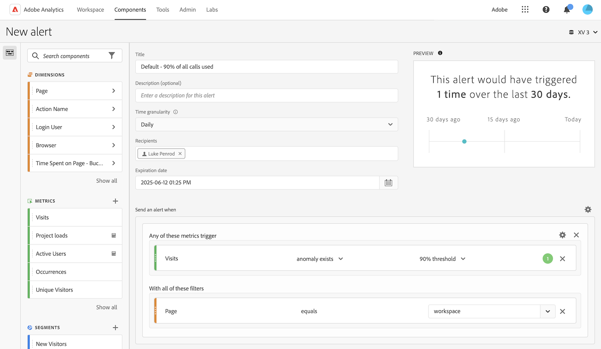

# Criar alertas {#create-alerts}

<!-- markdownlint-disable MD034 -->

>[!CONTEXTUALHELP]
>id="components_alerts_timegranularity"
>title="Granularidade de tempo"
>abstract="A granularidade de tempo se refere à frequência com a qual o alerta será verificado e ao que será incluído"

<!-- markdownlint-enable MD034 -->

>[!NOTE]
>
>O uso de alertas com detecção de anomalias (também conhecido como _Alertas inteligentes_) está disponível somente para organizações com um pacote do Adobe Analytics Prime ou Ultimate.

Os alertas na Adobe Analytics permitem que você seja notificado com base nas porcentagens alteradas ou em pontos de dados específicos. Dependendo do pacote do Adobe Analytics, também é possível usar alertas para serem acionados com base em limites de anomalias. Os alertas de uso de chamadas do servidor são um tipo diferente de alerta disponível somente para administradores do Analytics. Esses alertas notificam você sobre o risco ou a ocorrência de uma sobreposição no consumo de chamadas do servidor e nos dados de compromisso. Para obter mais informações, consulte [Alertas de uso de chamadas do servidor](/help/admin/admin/c-server-call-usage/scu-alerts.md).

Para obter mais informações de visão geral sobre alertas, consulte [Visão geral dos alertas](/help/components/c-alerts/intellligent-alerts.md).

Para criar um alerta:

1. Comece a criar um alerta acessando o criador de alertas. Você pode acessar o criador de alertas de qualquer uma das seguintes maneiras:

   * Abra um projeto no Analysis Workspace e selecione **[!UICONTROL Componentes]** > **[!UICONTROL Criar alerta]**.
   * Abra um projeto no Analysis Workspace e use o seguinte atalho: ***ctrl (ou cmd) + shift + a***.
   * Abra um projeto no Analysis Workspace, selecione um ou mais itens de linha em uma tabela de forma livre, clique com o botão direito do mouse e selecione **[!UICONTROL Criar alerta a partir da seleção]**. Essa ação preenche automaticamente o criador de alertas para criar um alerta com as métricas e filtros corretos.
   * Criar um alerta [no gerenciador de alertas](/help/components/c-alerts/alert-manager.md#create-alerts).

   O criador de alertas é exibido. Essa interface é familiar à interface para criar segmentos ou métricas calculadas no Analytics:

   

1. Especifique as seguintes opções para configurar o alerta:

   | Opção | Descrição |
   |---------|----------|
   | [!UICONTROL **Título**] | Especifique um nome para o alerta. O nome do alerta pode conter o nome do relatório ou o limite da métrica. |
   | [!UICONTROL **Descrição (opcional)**] | Especifique uma descrição para o alerta. |
   | [!UICONTROL **Granularidade de tempo**] | Selecione a frequência com que deseja verificar a métrica: por hora, dia, semana ou mês.
<b>Observação:</b> para conjuntos de relatórios com um calendário personalizado, não há suporte para granularidade mensal no Criador de alertas.<!--true?-->
 |
   | [!UICONTROL **Destinatários**] | Especifique para onde o alerta pode ser enviado. Um alerta pode ser enviado a um usuário do Analytics, a um grupo do Analytics, a um endereço de email bruto ou a um número de telefone.
<b>Importante:</b> o número de telefone deve ser precedido por `+` e um [código do país](https://countrycode.org/).

O email que um usuário receberia depois que um alerta é acionado é semelhante a:

 |
   | [!UICONTROL **Data de expiração**] | Defina a data e a hora em que deseja que o alerta expire. |
   | [!UICONTROL **Enviar um alerta quando**] | [!UICONTROL **Qualquer uma destas métricas aciona**]: arraste e solte métricas (incluindo métricas calculadas) aqui para criar acionadores para o alerta.
Uma mensagem **&quot;componentes incompatíveis&quot;** será exibida se nem todas as métricas, dimensões ou segmentos no alerta forem compatíveis com a exibição de dados selecionada no momento.

Determine o limite que a métrica deve exceder antes de definir um alarme. Você pode definir este valor para um limite e, em seguida, para uma das condições a seguir:
<ul><li>a anomalia existe</li><li>a anomalia está acima do esperado</li><li>a anomalia está abaixo do esperado</li><li>é igual ou maior que</li><li>é igual ou menor que</li><li>alterações por</li><li>Você pode definir um limite de 90%, 95%, 99%, 99,75% e 99,9%.</li></ul>
[!UICONTROL **Com todos esses filtros**]: arraste e solte segmentos ou dimensões para adicionar filtros. Por exemplo, adicionar um segmento &quot;Somente dispositivos móveis&quot; significaria que a regra seria acionada somente para dispositivos móveis. Você pode adicionar filtros extras usando uma instrução AND. Você pode adicionar regras AND ou OR, clicando no ícone de engrenagem.

Consulte [Alertas - Casos de uso](/help/components/c-alerts/alerts-use-cases.md), por exemplo.
 |
   | [!UICONTROL **Pré-visualizar**] | A visualização de alertas interativa mostra a frequência de disparo aproximada de um alerta com base na experiência passada.
Por exemplo, se você definir a granularidade de tempo como diária, a visualização poderá informar que o alerta teria sido acionado por uma determinada métrica x vezes durante os últimos 30 ou 31 dias. A janela de aproximação de pré-visualização é estabelecida pela configuração de frequência de alerta. Para frequências de alerta diárias, a janela de pré-visualização se aproxima dos 30 dias anteriores. Para frequências de alerta semanais, a janela de pré-visualização se aproxima das últimas 12 semanas. Para frequências de alerta mensais, a janela de pré-visualização se aproxima dos 12 meses anteriores.

Se você achar que muitos alertas serão disparados, poderá ajustar o limite no [Gerenciador de Alertas](/help/components/c-alerts/alert-manager.md).

 |

1. Selecione [!UICONTROL **Salvar**].
