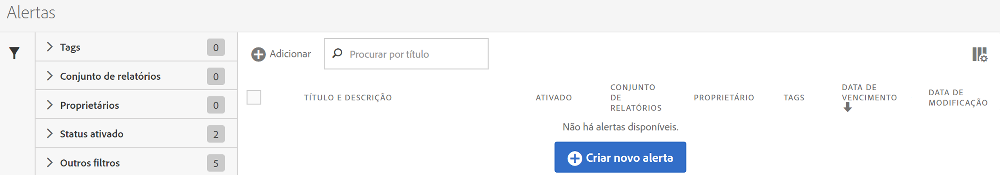
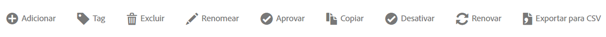

# Gerenciador de Alerta

O Gerenciador de alertas (**[!UICONTROL Analytics]** > **[!UICONTROL Componentes]** > **[!UICONTROL Alertas]**) está estruturado de maneira semelhante ao [Gerenciador de segmentos](https://marketing.adobe.com/resources/help/pt_BR/analytics/segment/seg_manage.html) e ao [Gerenciador de métricas calculadas](https://marketing.adobe.com/resources/help/pt_BR/analytics/calcmetrics/cm_manager.html) e permite

* Acesse o Criador de alertas, clicando em **[!UICONTROL + Adicionar]**.
* Marcar alertas. Isso permite organizá-los para facilitar o uso.
* Excluir alertas.
* Renomear alertas.
* Aprovar alertas.
* Copiar alertas.
* Ativar/desativar alertas.
* **Renovar** uma data de expiração para o alerta. Quando um ou mais alertas são selecionados, podem ser renovados ao clicar em **[!UICONTROL Renovar]**. Isso estende as datas de expiração em 1 ano a partir do dia de **[!UICONTROL Renovação]**, independentemente da data de expiração original.
* Exportar um alerta para um arquivo .CSV.
* Editar alertas ao clicar duas vezes no título do alerta.
* Pesquisar por alertas.
* Adicionar alertas a outros conjuntos de relatórios.
* Especificar/alterar o proprietário de um alerta.
* Adicionar outros filtros.
* Definir uma **data de expiração** para o alerta.

