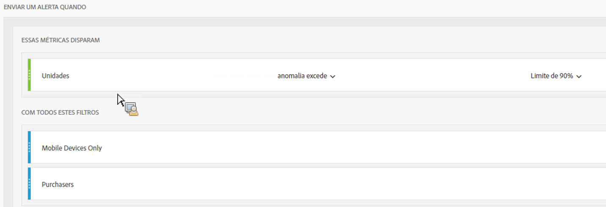
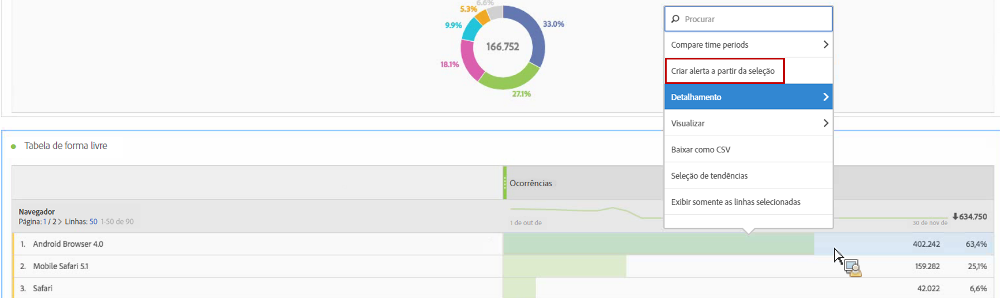
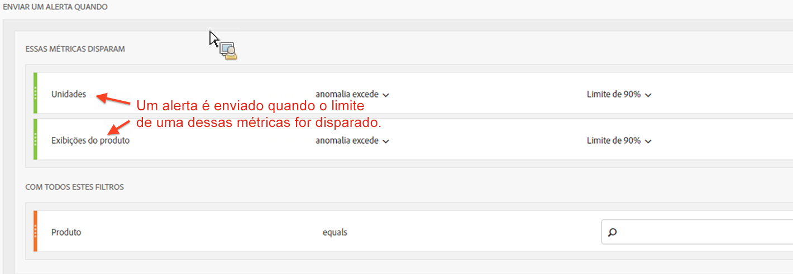

# Alertas inteligentes - Casos de uso

## Criar alertas simples filtrados por dois segmentos {#section_2E96FFFA93D44F7D8DBCEC97203204AA}

<!-- 

Update screenshots for better readability.

 -->

## Criar um alerta a partir de uma seleção de tabela {#section_AE6D42E1255D498D908A2FA60370A419}

Nas Tabelas de forma livre, agora você pode criar alertas de contexto, clicando com o botão direito do mouse em uma linha da tabela e selecionando **[!UICONTROL Criar alerta a partir da seleção]**.

Essa ação preenche o Criador de alertas automaticamente para criar um alerta com as métricas e os filtros corretos.

## Consolidar (empilhar) alertas em vez de criar vários alertas  {#section_B27B0856BA104B9FB6D0BBB317633F18}

O empilhamento de alertas garante que os alertas sejam combinados e você não receba vários alertas separados.

