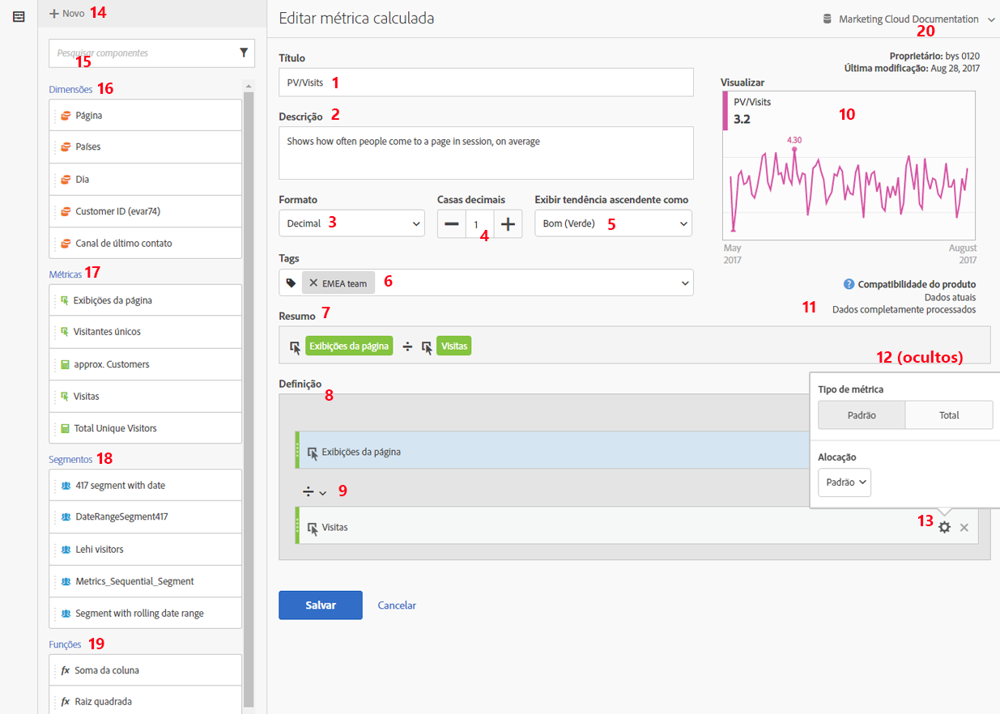
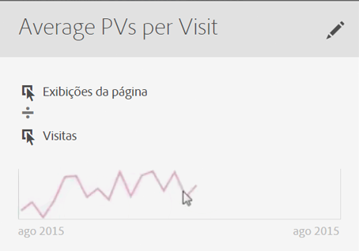

# Criar métricas

O Criador de métricas calculadas oferece uma tela para arrastar e soltar dimensões, métricas, segmentos e funções a fim de criar métricas personalizadas com base em lógicas de hierarquia de contêiner, regras e operadores. Essa ferramenta de desenvolvimento integrado permite criar e salvar métricas calculadas simples ou métricas calculadas avançadas complexas.

Há várias maneiras de acessar o Criador de métricas calculadas:

* In Analysis Workspace, open a project and click  **[!UICONTROL + New]** &gt; **[!UICONTROL Create Metric]** .
* In [!DNL Analytics], go to **[!UICONTROL Components]** &gt; **[!UICONTROL Calculated Metrics]**.

* Click **[!UICONTROL + Add]** at the top of the [Calculated Metric Manager](../../../../../components/c-calcmetrics/c-workflow/cm-workflow/cm-manager.md#concept_BA6815CB06D842D5825766396B691653), or

* Go to **[!UICONTROL Analytics]** &gt; **[!UICONTROL Reports]**, open any report and click the Metrics icon   to bring up the Metrics rail, then click **[!UICONTROL Add]**.

## Componentes da interface do usuário {#section_9382AEEBA4244DD6A9F6C1DD3F6D076B}

<table id="table_60A82936321047D1A335331BF83B0972"> 
 <thead> 
  <tr> 
   <th colname="col2" class="entry"> Campo </th> 
   <th colname="col3" class="entry"> Descrição </th> 
  </tr> 
 </thead>
 <tbody> 
  <tr> 
   <td colname="col2">  Título  </td> 
   <td colname="col3"> 
É obrigatório fornecer um nome para a métrica. Não é possível salvar a métrica sem um nome. 
 </td> 
  </tr> 
  <tr> 
   <td colname="col2">  Descrição  </td> 
   <td colname="col3"> 
Forneça uma descrição simples para mostrar sua utilização e diferenciá-la de métricas similares. 
 
A descrição também será exibida em um relatório. É melhor NÃO colocar a fórmula na descrição; em vez disso, descreva quando ela deve ou não ser utilizada. (A fórmula é gerada conforme você cria a métrica, abaixo do cabeçalho Resumo. Como resultado, não é necessário adicionar a fórmula à descrição.) 
 </td> 
  </tr> 
  <tr> 
   <td colname="col2">  Formato  </td> 
   <td colname="col3"> 
As opções incluem Decimal, Hora, Porcentagem e Moeda. 
 </td> 
  </tr> 
  <tr> 
   <td colname="col2">  Casas decimais  </td> 
   <td colname="col3"> 
Mostra quantas casas decimais serão exibidas no relatório. O número máximo de casas decimais que você pode especificar é 10. 
 </td> 
  </tr> 
  <tr> 
   <td colname="col2">  Mostrar tendência para cima como...  </td> 
   <td colname="col3"> 
Essa configuração de polaridade de métrica mostra se [! O DNL Analytics deve considerar uma tendência para cima na métrica como boa (verde) ou ruim (vermelho). Como resultado, o gráfico do relatório será exibido em verde ou vermelho ao subir. 
 </td> 
  </tr> 
  <tr> 
   <td colname="col2">  Tags  </td> 
   <td colname="col3"> 
Adicionar tags é uma boa maneira de organizar as métricas. Todos os usuários podem criar tags e aplicar uma ou mais tags a uma métrica. No entanto, você pode visualizar tags somente para seus segmentos ou os compartilhados com você. Que tipos de tags você deve criar? Estas são algumas sugestões para tags úteis: 
     <ul id="ul_9A6CE5F179424687A39F2D5C1A953258"> 
      <li id="li_A8815F2D8D284874AD701A7B103D82A3">Tags com base em <b>nomes de equipe</b>, como Marketing social, Marketing móvel. </li> 
      <li id="li_A51A4515A541488E9D90296A955E9F4F">Tags de <b>projeto</b> (tags de análise), como análises de página de entrada. </li> 
      <li id="li_B4605470A7094026AC168420B64BBCC3">Tags de <b>categoria</b>: masculino; geografia. </li> 
      <li id="li_B6EAB0F2A96C41209C4EC97B9E64390B">Tags de <b>fluxo de trabalho</b>: para ser aprovado; auxiliar para (uma unidade de negócios específica) </li> 
     </ul> 
 </td> 
  </tr> 
  <tr> 
   <td colname="col2">  Resumo  </td> 
   <td colname="col3"> 
A fórmula Resumo é atualizada sempre que a definição da métrica é alterada. Esta fórmula também é exibida no painel Métricas à esquerda, ao passar o mouse sobre uma métrica e clicar no ícone . 
 </td> 
  </tr> 
  <tr> 
   <td colname="col2">  Definição  </td> 
   <td colname="col3"> 
Aqui você pode arrastar métricas/métricas calculadas, segmentos e/ou funções para criar a métrica calculada. 
 
 
     <ul id="ul_B13401A266354DC594C6176025DB61CB"> 
      <li id="li_01776C32C7C5440AA1F847096CBED92B">Se você arrastar uma métrica calculada, ela expandirá automaticamente sua definição de métrica. </li> 
      <li id="li_A483D352522E4572AB43042473053359">Você pode aninhar definições em contêineres. Contudo, diferentemente dos contêineres de segmentos, esses contêineres funcionam como uma expressão matemática e determinam a ordem das operações. </li> 
     </ul> 
 </td> 
  </tr> 
  <tr> 
   <td colname="col2">  Operador  </td> 
   <td colname="col3"> 
Dividido por (  ) é o operador padrão, além dos operadores +, - e x. 
 </td> 
  </tr> 
  <tr> 
   <td colname="col2">  Visualizar  </td> 
   <td colname="col3"> 
Fornece uma leitura rápida sobre possíveis erros. A visualização abrange os últimos 90 dias. Esta é uma maneira de medir, ao menos de maneira inicial, se você selecionou os componentes certos para a sua métrica. Um resultado inesperado significa que você precisa analisar a definição da métrica novamente. 
 </td> 
  </tr> 
  <tr> 
   <td colname="col2">  Compatibilidade do produto  </td> 
   <td colname="col3"> 
A compatibilidade do produto mostra se a métrica é compatível com os <a href="https://marketing.adobe.com/resources/help/en_US/reference/data_latency.html" format="https" scope="external">Dados atuais</a>, com os Dados totalmente processados ou somente com os relatórios do Canal de marketing (alocação de primeiro contato). 
Observação: os dados atuais não suportam todas as métricas. Métricas que contêm segmentos ou funções não são compatíveis com os dados atuais. <a href="../../../../../components/c-calcmetrics/cm-compatibility.md#concept_906480DEBEEC4D279BBBBD4CE7DFE70C" format="dita" scope="local">Mais...</a> 
 
 </td> 
  </tr> 
  <tr> 
   <td colname="col2">  Adicionar  </td> 
   <td colname="col3"> 
Para todos os tipos de métricas calculadas, é possível adicionar contêineres e números estáticos à definição. Para métricas calculadas avançadas, também é possível adicionar funções e segmentos. 
 
 
     <ul id="ul_607C1B303F334062BC620317667DE490"> 
      <li id="li_53462789B8AF4F1AA9B45565D37CF22B">Os contêineres funcionam como uma expressão matemática e determinam a ordem das operações. Todo o conteúdo do contêiner será processado antes da próxima operação. </li> 
      <li id="li_401A9E0D8B3B468990289DBF66A06F63">Arrastar um segmento para um contêiner segmenta todo o conteúdo do mesmo. (Somente métricas calculadas avançadas) </li> 
      <li id="li_F191B200D7A944F9ADC0573A9A82A6DA">É possível empilhar vários segmentos em um contêiner. </li> 
     </ul> 
 </td> 
  </tr> 
  <tr> 
   <td colname="col2"> Ícone de engrenagem (Tipo de métrica,  Atribuição ) </td> 
   <td colname="col3"> 
Selecting the gear icon next to a metric lets you specify the <a href="../../../../../components/c-calcmetrics/c-workflow/cm-workflow/c-build-metrics/m-metric-type-alloc.md#concept_B7A1FCFEFA9D4C4883208ACE8C9C8E5E" format="dita" scope="local"> metric type and attribution models </a>. 
 </td> 
  </tr> 
  <tr> 
   <td colname="col2">  + Novo  </td> 
   <td colname="col3"> 
Permite criar um novo componente, como um novo segmento (que leva você ao <a href="https://marketing.adobe.com/resources/help/en_US/analytics/segment/seg_build_ui.html" format="https" scope="external">Construtor de segmentos </a>.) 
 </td> 
  </tr> 
  <tr> 
   <td colname="col2"> 
Pesquisar componentes 
 </td> 
   <td colname="col3"> 
Esta barra de pesquisa permite que você pesquise dimensões, métricas, segmentos (somente métricas calculadas avançadas) e funções (somente métricas calculadas avançadas). 
 </td> 
  </tr> 
  <tr> 
   <td colname="col2"> 
Lista de dimensões 
 </td> 
   <td colname="col3"> 
Em vez de sair do Criador de métricas calculadas para criar um segmento simples (no Construtor de segmentos), por exemplo “Página = Página inicial”, é possível arrastar para a Página e selecionar Página inicial diretamente do Criador de métricas calculadas. 
 
Isso resulta em um fluxo de trabalho mais simplificado para a criação de métricas calculadas segmentadas. 
 </td> 
  </tr> 
  <tr> 
   <td colname="col2"> 
Lista de métricas 
 </td> 
   <td colname="col3"> 
As métricas possuem 3 categorias: 
 
    <ul id="ul_7BF50F4964EF45858FBA1634FBFA45CF"> 
     <li id="li_90F2312927A6499CA1CE04F8FFC912CF">Métricas padrão ( ) </li> 
     <li id="li_A3F59083E79B4AC780D6F8CEDFFD20C9">Métricas calculadas ( ) </li> 
     <li id="li_8735E76637ED4C3F983731A66E04C93E">Modelos de métricas () - na parte inferior da lista. </li> 
    </ul> 
Ao passar o mouse sobre uma métrica, é possível ver o ícone Informações à direita: . Clicar neste ícone fornece as seguintes informações: 
 
    <ul id="ul_DF35DDB9FBFA40C8A93FA0F2286A0BBE"> 
     <li id="li_4215AA9BF93F4C8B941002A7A4D2F50B">A fórmula de como é calculado. </li> 
     <li id="li_6A8E39EB6DCE4377B0B594B6D4FC0294">Uma tendência prevista da métrica. </li> 
     <li id="li_44C1595E4BE64ED69D1DB3BB6655ED55">Um ícone para editar (lápis) localizado na parte superior direita que direciona você para o Criador de métricas calculadas, onde é possível editar a métrica calculada. </li> 
    </ul> 
 
 </td> 
  </tr> 
  <tr> 
   <td colname="col2"> 
Lista de segmentos 
 </td> 
   <td colname="col3"> 
(Somente métricas calculadas avançadas) Como administrador, esta lista mostra todos os segmentos criados na sua empresa de logon. Caso você seja um usuário não administrativo, esta lista mostra os segmentos possuídos por você e compartilhados com você. <a href="https://marketing.adobe.com/resources/help/en_US/analytics/segment/seg_rights.html" format="https" scope="external">Mais...</a> 
 </td> 
  </tr> 
  <tr> 
   <td colname="col2"> 
Lista de funções 
 </td> 
   <td colname="col3"> 
(Somente métricas calculadas avançadas) As funções estão divididas em duas listas: <a href="../../../../../components/c-calcmetrics/cm-reference/cm-functions.md#concept_E3022D5EEEE145B69A23438BAF7016B2" format="dita" scope="local"> Básico </a> (usado com mais frequência) e <a href="../../../../../components/c-calcmetrics/cm-reference/cm-adv-functions.md#concept_A5FB9127D70F4E1AA02D1ACBF4F54174" format="dita" scope="local"> Avançado </a>. 
 </td> 
  </tr> 
  <tr> 
   <td colname="col2"> 
Seletor de conjuntos de relatórios 
 </td> 
   <td colname="col3"> 
Permite alternar para um conjunto de relatórios diferente. 
 </td> 
  </tr> 
 </tbody> 
</table>

