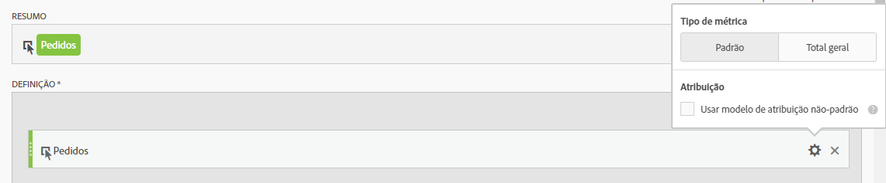
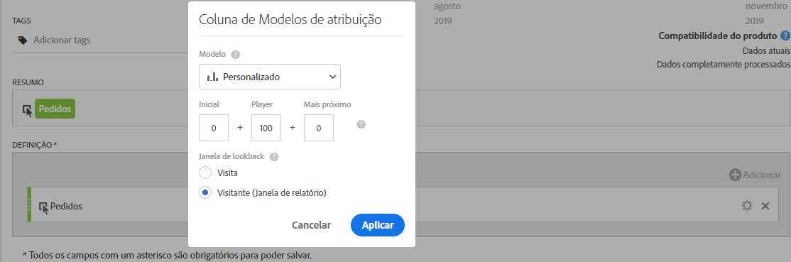
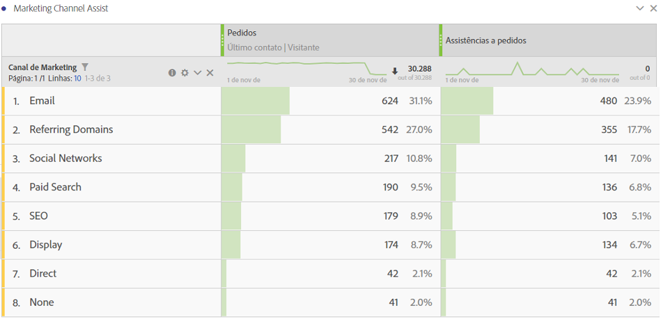

# Métrica de auxílio de pedidos

Explica como criar uma métrica que exibe quais Canais de marketing fornecem assistência em impulsionar pedidos. Isso pode ser adaptado a qualquer dimensão ou evento de sucesso de seu interesse.

1. No Construtor de métricas calculadas, nomeie a métrica “Pedidos com assistência”.
1. Na tela de Definição, arraste uma métrica de Pedidos. Em seguida, ajuste o modelo de atribuição por meio da engrenagem de configurações, marcando a caixa de seleção **[!UICONTROL Usar modelos de atribuição não padrão]**.

   

1. Selecione **[!UICONTROL Personalizado]** como o modelo de atribuição. Altere os valores para 0 (início), 100 (reprodução) e 0 (encerramento).

   

1. Salve a métrica.
1. Crie uma tabela de forma livre na Analysis Workspace com a dimensão Canal de marketing, Pedidos e sua nova métrica Pedidos com assistência.

   

Esse é um jeito fácil de averiguar quais Canais de marketing assistiram em impulsionar pedidos. Como alternativa, em uma tabela de forma livre, você pode clicar com o botão direito do mouse em qualquer métrica e ajustar o modelo de atribuição diretamente da tabela.
