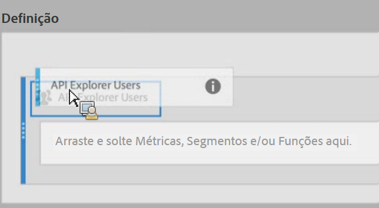

# Empilhar e substituir segmentos

Mostra como empilhar e substituir segmentos no Criador de métricas calculadas.

## Empilhar segmentos  {#section_3FC1118FEE2B40B7BB90F29C8521AF53}

Na tela Definição, basta soltar o novo segmento ao lado do segmento existente:

## Substituição de um segmento por outro  {#section_3DA899DF522A44D7A583C5DC8C0A033E}

Na tela Definição, basta soltar o novo segmento sobre o segmento existente:

