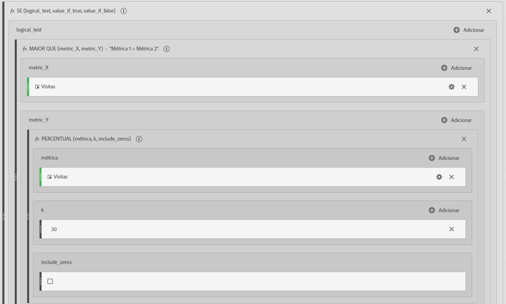
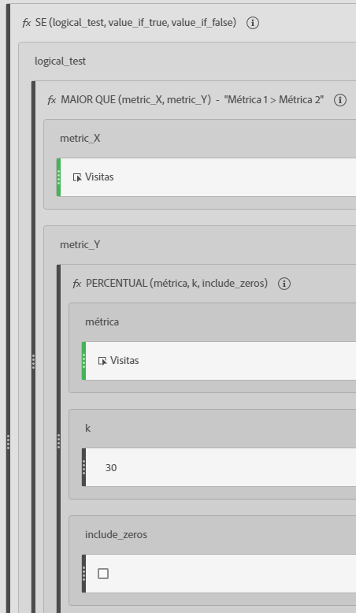
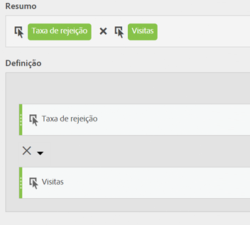

# Métricas filtradas e ponderadas

Mostra exemplos de métricas filtradas e ponderadas.

## Taxa de rejeição filtrada {#section_D42F2452E4464948934063EB6F2DAAB4}

Essa métrica filtrada simples mostra a taxa de rejeição das páginas com mais de 100 visitas:

Tenha em mente que esta fórmula depende de um intervalo de tempo consistente. Se você gerar um relatório para um único dia, qualquer página com mais de 20 visitas merece atenção. Se você gerar um relatório de um mês, pode querer filtrar para incluir mais visitas.

## Taxa de rejeição filtrada com percentil {#section_4F3E6D33A1FD438A932FA662B3510552}

Esse filtro mostra a Taxa de rejeição para os primeiros 30% das páginas, quando classificadas por visitas.

## Métrica ponderada {#section_F2D16B14569948289CF1310F9E6E3FC2}

Suponha que você deseja classificar pela taxa de rejeição em geral, mas ainda quer exibir as páginas com mais visitas no topo da lista. Você pode criar uma Taxa de rejeição ponderada com a seguinte aparência:

