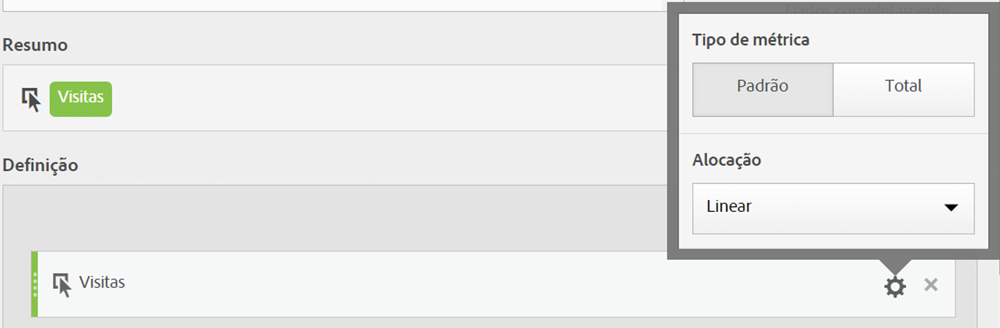

# Atribuição e tipo de métrica

Selecionar o ícone de engrenagem ao lado de uma métrica permite especificar o tipo de métrica e o modelo de atribuição.

* [Tipo de métrica](/help/components/c-calcmetrics/c-workflow/cm-workflow/c-build-metrics/m-metric-type-alloc.md#section_34A86FB402F94E988724232283BF18B7)
* [Modelo de atribuição de coluna](/help/components/c-calcmetrics/c-workflow/cm-workflow/c-build-metrics/m-metric-type-alloc.md#section_F9690FD1943B403AB28E2FAC54EFE032)
* [Como a alocação linear funciona (desde 19 de julho de 2018) ](/help/components/c-calcmetrics/c-workflow/cm-workflow/c-build-metrics/m-metric-type-alloc.md#section_EDBB2E14A6C248C5A79C0913C02D7CA1)

## Tipo de métrica

| Tipo de métrica | Definição |
|---|---|
| Padrão | Essas métricas são as mesmas métricas usadas nos relatórios padrão do [!DNL Analytics]. Se uma fórmula consistir em uma única métrica padrão, ela exibirá dados idênticos à sua contrapartida de métricas não calculadas. As métricas padrão são úteis para criar métricas calculadas específicas para cada item de linha individual. Por exemplo, [Pedidos] / [Visitas] pega os pedidos de um item de linha específico e divide pelo número de visitas do item de linha específico. |
| Total | Use o total do período de relatórios em cada item de linha. Se uma fórmula consistir em uma única métrica total, ela exibirá o mesmo número total em cada item de linha. As métricas totais são úteis para a criação de métricas calculadas que se comparam aos dados totais do site. Por exemplo, [Pedidos] / [Total de visitas] mostra a proporção de pedidos com relação a TODAS as visitas ao site, e não apenas visitas ao item de linha específico. |

## Modelo de atribuição de coluna

>[!IMPORTANT]
>
>Em julho de 2018, o [!DNL Analytics] introduziu o [Attribution IQ](https://marketing.adobe.com/resources/help/pt_BR/analytics/analysis-workspace/attribution.html), que reimaginou a maneira que modelos de alocação em métricas calculadas são avaliados. Como parte dessa alteração, as métricas calculadas que usam um modelo de alocação não padrão foram migradas para novos modelos de atribuição melhorados:
>
>* Para obter uma lista completa de modelos de atribuição não padrão e janelas de pesquisa suportadas, consulte a documentação do QI [de](https://marketing.adobe.com/resources/help/pt_BR/analytics/analysis-workspace/attribution.html) atribuição.
>* Os modelos de alocação &quot;Último contato do canal de marketing&quot; e &quot;Primeiro contato do canal de marketing&quot; serão migrados para os novos modelos de atribuição &quot;Último contato&quot; e &quot;Primeiro contato&quot;, respectivamente (Observe que &quot;Canais de marketing&quot; não será descontinuado - apenas os dois modelos de alocação que aparecem nas métricas calculadas o serão).
>* Além disso, corrigiremos a maneira como a alocação linear é calculada. Para clientes que usam métricas calculadas com modelos de alocação &quot;linear&quot;, os relatórios podem ser levemente alterados para refletir o novo modelo de atribuição corrigido. Essa alteração nas métricas calculadas será refletida na Analysis Workspace, Reports &amp; Analytics, na API de relatório, no Report Builder e na Ad Hoc Analysis. For more information, see **How Linear Allocation works (as of July 19, 2018**, below.
>

## Como a alocação linear funciona (a partir de 19 de julho de 2018)

Em julho de 2018, o Adobe alterou a maneira como a alocação linear é reportada para Métricas calculadas. Essa alteração afeta a Analysis Workspace, a Ad Hoc Analysis, o Reports &amp; Analytics, o Report Builder, o Activity Map e as APIs de relatórios. A alteração afeta principalmente as eVars e outras dimensões que têm persistência. Observe que essas alterações se aplicam somente às métricas calculadas e não afetam outros relatórios usando alocação linear (como o relatório Páginas no Relatórios e análises). Outros relatórios que utilizam a alocação linear continuarão a usar o método existente de alocação linear.

O exemplo a seguir ilustra como as métricas calculadas com alocação linear mudarão no relatórios:

|  | Ocorrência 1 | Ocorrência 2 | Ocorrência 3 | Ocorrência 4 | Ocorrência 5 | Ocorrência 6 | Ocorrência 7 |
|--- |--- |--- |--- |--- |--- |--- |--- |
| Dados enviados em | PROMO A | - | PROMO A | PROMO B | - | PROMO C | $10 |
| eVar de último toque | PROMO A | PROMO A | PROMO A | PROMO B | PROMO B | PROMO C | $10 |
| eVar de primeiro toque | PROMO A | PROMO A | PROMO A | PROMO A | PROMO A | PROMO A | $10 |
| Exemplo prop | PROMO A | - | PROMO A | PROMO B | - | PROMO C | $10 |

Neste exemplo, os valores A, B e C foram enviados para uma variável nas ocorrências 1, 3, 4 e 6 antes de uma compra de $10 ser realizada na ocorrência 7. Na segunda linha, esses valores persistem entre ocorrências em uma base de visita de último toque. A terceira linha ilustra uma persistência de visita de primeiro toque. Finalmente, a última linha ilustra como os dados seriam registrados para uma prop que não tem persistência.

## Diferenças em como a alocação linear funciona em Relatórios e análises versus Espaço de trabalho

Há algumas diferenças em como a atribuição linear funciona entre essas duas ferramentas:

* Em Relatórios e análises, a atribuição linear (processada) sempre é baseada em visita, enquanto no Workspace, pode ser baseada em visita ou visitante.
* Em Relatórios e análises, se Nenhum valor fosse transmitido na primeira ocorrência de uma visita, o valor (inicial) persistiria na visita anterior. Esse NÃO é o caso no Workspace (QI de atribuição). Se nenhum valor for transmitido na primeira ocorrência de uma visita, então &#39;Nenhum&#39; será o valor inicial.

## Como funcionou a alocação linear antes de julho de 2018

Antes de 19 de julho de 2018, a atribuição linear era calculada após a persistência de primeiro ou último toque já ter ocorrido. Isso significava que para a eVar de último toque acima, os $10 seriam distribuídos da seguinte forma: A = 10 * (3/6) = $5, B = 10 * (2/6) = $3,33, C = 10 * (1/6) = $1,67.

Para a eVar de primeiro toque acima, todos os $10 seriam fornecidos a A. Para a prop: A = 10 * (2/4) = $5, B = 10 * (1/4) = $2.50, e C = 10 * (1/4) = $2.50. Para resumir a alocação linear como funcionava anteriormente:

| Valores | eVar de último toque atual | eVar de primeiro toque atual | Prop atual |
|---|---|---|---|
| PROMO A | $5.00 | $10.00 | $5.00 |
| PROMO B | $3.33 | $0 | $2.50 |
| PROMO C | $1.67 | $0 | $2.50 |
| Total | $10.00 | $10.00 | $10.00 |

**Resumo de como a alocação linear funciona a partir de 19 de julho de 2018**

Após 19 de julho, corrigimos esse comportamento em métricas calculadas. Em vez de usar os valores persistentes com base no último contato ou no primeiro contato, o [!DNL Analytics] usa apenas os valores que foram passados (a primeira linha da tabela superior). Dessa forma, as configurações de alocação de dimensão não afetam mais a maneira como a alocação linear é calculada (ou seja, props e eVars serão tratados da mesma maneira), e os resultados refletem o que foi originalmente passado em vez dos valores de primeiro ou último toque que podem ter persistido. Assim, nos três casos, A = 10 * (2/4) = $5, B = 10 * (1/4) = $2.50, e C = 10 * (1/4) = $2.50.

| Valores | Nova eVar de último toque | Nova eVar de primeiro toque | Novo Prop |
|---|---|---|---|
| PROMO A | $5.00 | $5.00 | $5.00 |
| PROMO B | $2.50 | $2.50 | $2.50 |
| PROMO C | $2.50 | $2.50 | $2.50 |
| Total | $10.00 | $10.00 | $10.00 |

