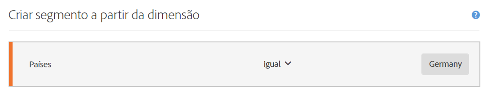
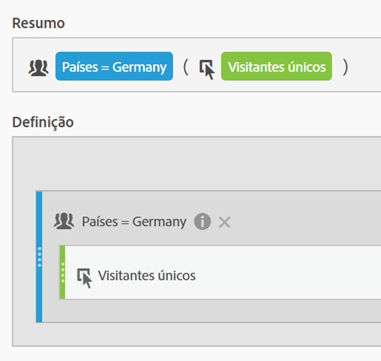
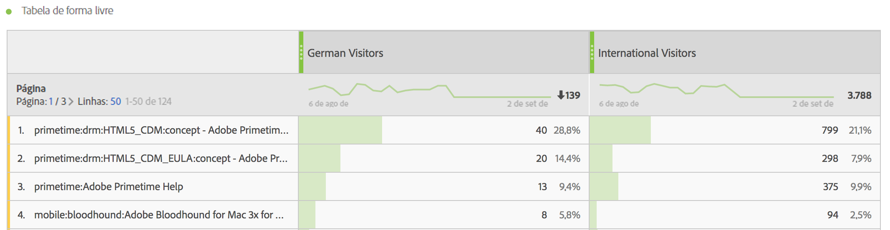
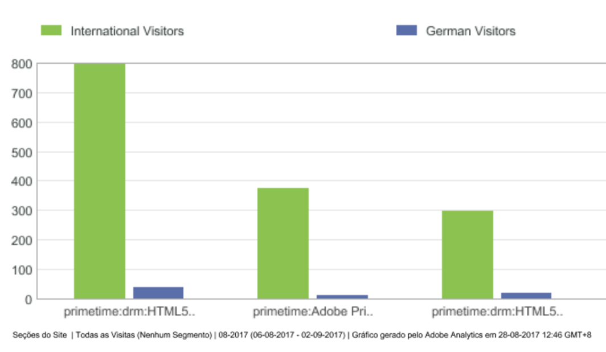
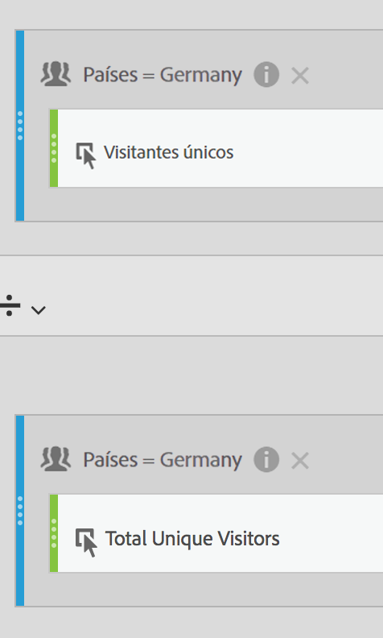
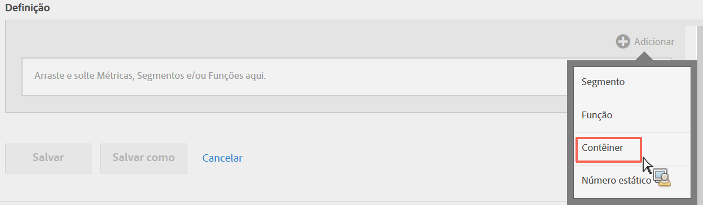
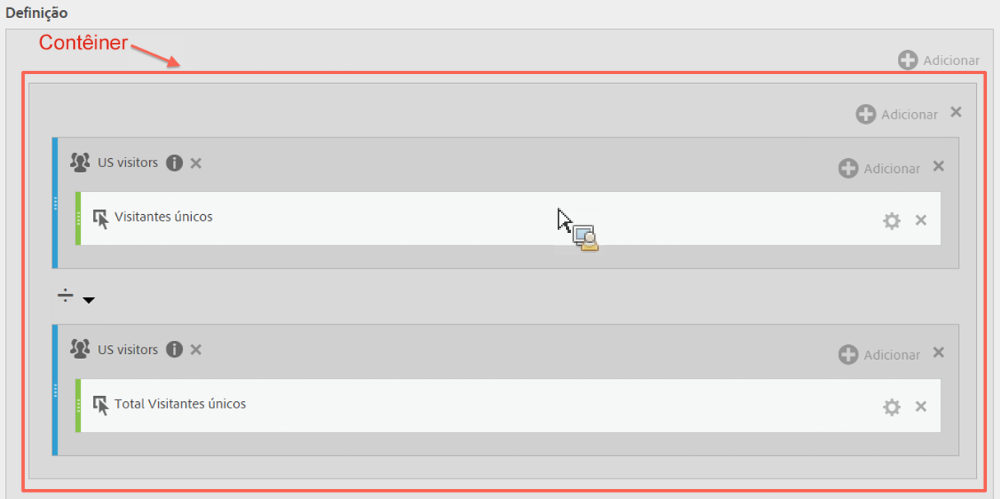
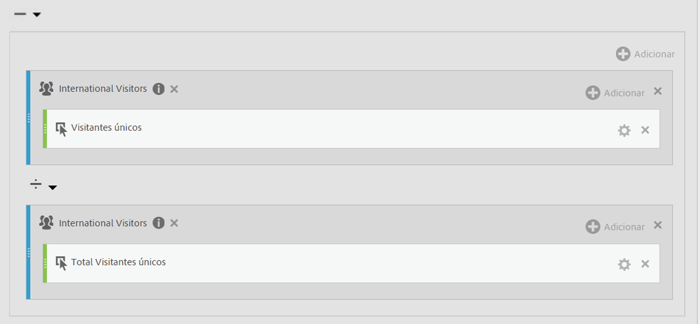
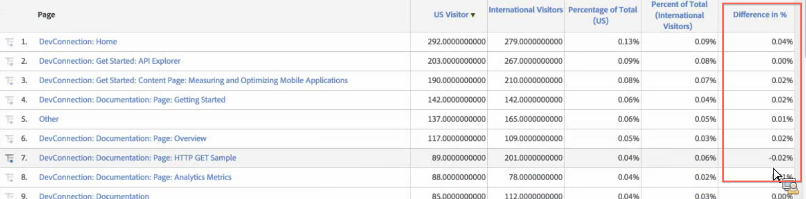

# Métricas segmentadas

Segmentar métricas individuais permite comparar métricas em um mesmo relatório. (Somente métricas derivadas)

## Comparação de segmentos {#section_29A6E0070F084BFDB6228FA9CE106F48}

Suponha que você deseja comparar diferentes aspectos dos segmentos de "Visitantes dos EUA" com os dos segmentos de "Visitantes internacionais". É possível criar métricas para obter insights como:

* Qual é a diferença de comportamento de navegação no conteúdo entre os dois grupos? (Outro exemplo seria: qual é a diferença da taxa de conversão entre os dois segmentos?)
* Como uma porcentagem do total de visitantes, quantos visitantes dos EUA navegam por determinadas páginas em relação aos visitantes internacionais?
* Quais são as maiores diferenças em termos de conteúdo acessado por esses diferentes segmentos?

Vamos explorar a primeira pergunta: qual é a diferença no comportamento de navegação no conteúdo entre os dois grupos?

1. Se você não tiver um segmento para comparação, crie um segmento interno no Criador de métricas calculadas chamado “Visitantes alemães”, onde “Países” corresponda a “Alemanha”. Basta arrastar a dimensão Países para a tela Definição e selecionar Alemanha como o valor:

   

   >[!NOTE]
   >
   >You can also do this in the [Segment Builder](https://marketing.adobe.com/resources/help/en_US/analytics/segment/seg_build.html), but we have simplified the workflow by making dimensions available in the Calculated Metric Builder.

   >[!NOTE]
   >
   >"Internal" means that the segment is not visible in the **[!UICONTROL Segments]** list in the left rail. Entretanto, é possível torná-lo público ao passar o mouse sobre o ícone "i" e clicar em **[!UICONTROL Tornar público]**.

1. Caso não possua um segmento comparável, crie um segmento chamado “Visitantes internacionais” no qual "Países” seja diferente de "Alemanha”.
1. Crie e salve uma métrica chamada “Visitantes alemães”. Para fazer isso, arraste o segmento Alemanha para a tela Definição e, em seguida, arraste a métrica Visitantes únicos dentro dele:

   

1. Repita a Etapa 3 com o segmento de Visitantes internacionais e a métrica Visitantes únicos, e crie uma métrica Visitantes internacionais.
1. Na Analysis Workspace, arraste a dimensão **[!UICONTROL Página]para uma Tabela de forma livre e arraste as 2 novas métricas calculadas para ficarem próximas na parte superior:**

   

1. Or, in [!UICONTROL Reports &amp; Analytics], open the [!UICONTROL Pages] report and click **[!UICONTROL Show Metrics]**, then apply the new US Visitors and International Visitors segmented metrics to see how their content browsing behavior compares.

   

## Comparação das porcentagens dos totais {#section_846CB89725F04388AE0352DB20189EE8}

É possível adicionar outro nível de apuramento por meio da comparação entre o comportamento de navegação dos visitantes em porcentagens normalizadas. Para fazer isso, crie duas novas métricas, “% do total de visitantes alemães” e “% do total de visitantes internacionais”:

1. Solte o segmento Visitantes alemães (ou internacionais) na tela.
1. Solte outro segmento Visitantes alemães (ou internacionais) abaixo. Mas, desta vez, clique no ícone de configurações (engrenagem) e selecione o Tipo de métrica "Total". O Formato deve ser "Porcentagem". O operador deve ser "dividido por". No final, você terá a seguinte definição de métrica:

   

1. Aplique esta métrica ao seu projeto:

   

## Comparação de diferenças nas porcentagens (usando contêineres) {#section_13D6353259B74C09B37BA6378A501938}

Caso queira ver imediatamente as maiores diferenças ente o comportamento de navegação de visitantes dos EUA e de visitantes internacionais, você pode criar uma métrica que subtraia as porcentagens das duas navegações. Para fazer isso, é possível usar a funcionalidade de contêiner, que funciona como parênteses ao redor dos dois conjuntos de métricas.

1. In the [!UICONTROL Definition] canvas, click **[!UICONTROL Add]** &gt; **[!UICONTROL Container]**:

   

1. Solte a métrica "% do total de visitantes dos EUA" criada anteriormente no primeiro contêiner. Ele será expandido para sua definição completa:

   

1. Crie outro contêiner abaixo e solte nele a métrica "% do total de visitantes internacionais".
1. Altere o operador entre os dois contêineres para um sinal de menos (-).

   

1. Salve a métrica (certifique-se de nomeá-la como "Diferença de % entre visitantes dos EUA e visitantes internacionais", por exemplo).
1. Quando aplicada ao relatório, é possível ver as principais diferenças nas porcentagens, bem como classificar o relatório apropriadamente.

   

