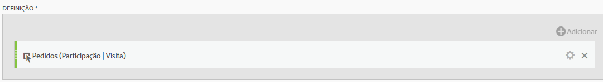

# Métrica de participação

Veja um caso de uso simples: um proprietário de conteúdo deseja saber quais páginas contribuíram para (participaram de) visitas com um pedido. Veja como:

>[!NOTE] Antes, era necessário fazer isso por meio das ferramentas de Admin. Você ainda pode ativar as métricas de participação nas Ferramentas administrativas, mas somente para eventos personalizados 1 - 100.

Veja um caso de uso simples: um proprietário de conteúdo deseja saber quais páginas contribuíram para (participaram de) visitas com cadastro via email. Veja como:

1. Crie uma nova métrica no Criador de métricas calculadas.
1. Arraste o evento bem sucedido &quot;Pedido&quot; para a tela Definição.
1. Change the [attribution model](/help/components/c-calcmetrics/c-workflow/cm-workflow/c-build-metrics/m-metric-type-alloc.md) of that event to **[!UICONTROL Participation]** under the **[!UICONTROL Settings]** gear. Selecione **[!UICONTROL Visit]** pesquisa. A definição deve ser semelhante a esta:

   

1. Salve a métrica.
1. Use the calculated metric in a **[!UICONTROL Pages]** report.

   

1. (Opcional) Compartilhe a métrica com outros usuários em sua organização.

