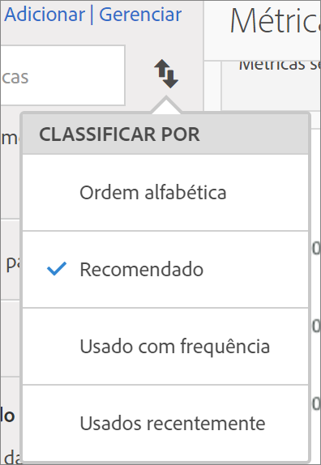
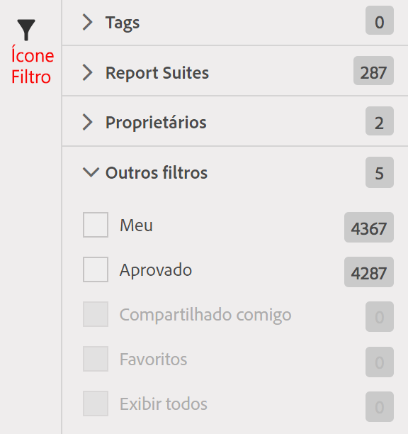

# Localizar métricas

Descreve as duas principais maneiras de encontrar suas métricas: por classificação e por filtragem.

## Classificação  {#section_89F9C4D515084F5796F2A54D468BF6C8}

Ao abrir um relatório e clicar no ícone Métricas  à esquerda de um relatório para exibir o painel Métricas, a lista suspensa **[!UICONTROL Classificar por]** do Seletor de métricas exibirá quatro opções de classificação:

| Opção | Quando usar |
|---|---|
| Ordem alfabética | Útil se você souber o nome. |
| Recomendado | Métricas comuns que as pessoas usam no relatório. São obtidas pelo back end a partir das métricas comumente usadas pelos usuários com este relatório. |
| Usado com frequência | Útil se você for um usuário novo e precisar ver o que costuma ser usado no relatório. |
| Usado recentemente | É útil ao trabalhar em um projeto com um mesmo conjunto de métricas repetidamente. |

## Filtragem - Seleção avançada  {#section_33818CC048C04F098703AC229693F8CA}

Ao abrir um relatório, clique no ícone Métricas e em **[!UICONTROL Gerenciar]**. Em seguida, clique no ícone Filtro. É possível filtrar de diversas formas.

<table id="table_269081BC9DF54FFDA4E949FFC7488F42"> 
 <thead> 
  <tr> 
   <th colname="col1" class="entry"> Caso queira </th> 
   <th colname="col2" class="entry"> Classifique por </th> 
  </tr>
 </thead>
 <tbody> 
  <tr> 
   <td colname="col1"> Exibir todas as métricas no conjunto de relatórios. </td> 
   <td colname="col2"> Outros filtros &gt; Exibir todos </td> 
  </tr> 
  <tr> 
   <td colname="col1"> Mostrar somente as suas métricas </td> 
   <td colname="col2"> Outros filtros &gt; Meus </td> 
  </tr> 
  <tr> 
   <td colname="col1"> Mostrar métricas compartilhadas comigo por outra pessoa </td> 
   <td colname="col2">Em Proprietários ou 
 Outros filtros &gt; Compartilhados comigo 
 </td> 
  </tr> 
  <tr> 
   <td colname="col1"> Mostrar somente métricas aprovadas pela empresa. </td> 
   <td colname="col2"> Aprovado </td> 
  </tr> 
  <tr> 
   <td colname="col1"> Filtrar as métricas de um projeto em que está trabalhando. </td> 
   <td colname="col2">Uma das Tags. </td> 
  </tr> 
 </tbody> 
</table>

