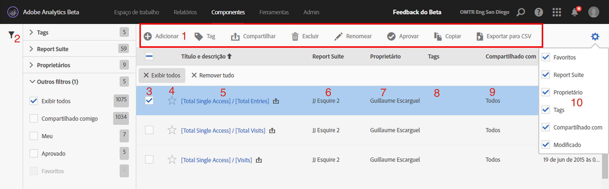

# Gerenciador de métricas calculadas

O Gerenciador de métricas calculadas permite cuidar de suas métricas de várias maneiras, como compartilhar, filtrar, marcar, aprovar, copiar, excluir e marcar como favoritos.

O Gerenciador de métricas calculadas mostra todos os segmentos que você possui e que foram compartilhados com você. Usuários de nível administrativo podem ver todas as métricas personalizadas da organização. Esta visão geral apresenta a interface do usuário e os recursos do Gerenciador de métricas calculadas. Para acessá-la:

* Going to **[!UICONTROL Analytics]** &gt; **[!UICONTROL Components]** in the left navigation. Em seguida, clique em **[!UICONTROL Métricas calculadas]**.

| Recurso da interface do usuário | Descrição |
|---|---|
| Barra de ferramentas para o gerenciamento de métricas calculadas | Esta barra de ferramentas é exibida assim que você marca uma métrica. A maioria das tarefas de gerenciamento podem ser concluídas a partir dessa barra de ferramentas. |
| Exibir/ocultar filtros | Clicar em Mostrar filtros abre o menu de filtros. É possível filtrar por Tags, Conjuntos de relatórios, Proprietários, Mostrar tudo (somente Admin), Compartilhados comigo, Meus, Favoritos e Aprovados. |
| Caixas de seleção | Marque uma métrica personalizada para gerenciá-la. |
| Favoritos | Ao clicar na estrela ao lado de uma métrica, aquela fique amarela e adiciona a métrica aos favoritos. |
| Títulos e descrições do segmento | Fornecido no Criador de métricas calculadas. Para editar o título e a descrição, clique no link de título. Você voltará para o Criador de métricas calculadas. |
| Conjuntos de relatórios | Essa coluna indica em qual conjunto de relatórios a métrica foi salva pela última vez. |
| Proprietário | Indica o proprietário da métrica personalizada. Como um usuário não administrativo, você pode ver somente as métricas que possui ou que foram compartilhadas com você. |
| Tags | Mostra as tags aplicadas à métrica por você e pelas pessoas que compartilharam o segmento com você. |
| Compartilhado com | Lista indivíduos ou grupos (somente Administrador) ou Todos (somente Administrador) com os quais você compartilhou o segmento. |
| Seletor de coluna | Permite marcar ou desmarcar colunas no Gerenciador de métricas calculadas de forma a personalizar a exibição. |
| Ícone Compartilhado (não exibido) | Indica que esta métrica personalizada foi compartilhada por você ou com você. |
| Ícone Aprovado (não exibido) | Indica que esta métrica personalizada foi aprovada por um administrador. |