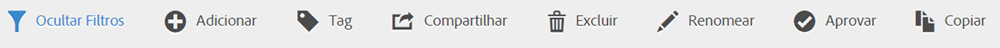
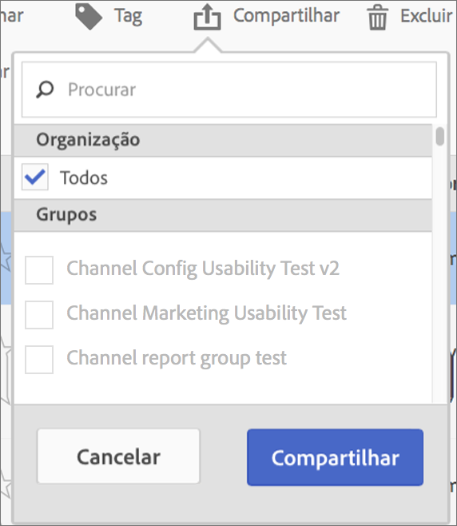

# Compartilhar métricas calculadas

Dependendo das suas permissões, é possível compartilhar métricas com toda a organização, com grupos ou com usuários individuais.

| Função | Permissões |
|---|---|
| Administrador | Pode compartilhar métricas com todos, com grupos e com usuários. Grupos estão configurados como grupos de permissões no Admin Console. |
| Não administrador | Pode compartilhar métricas apenas com os usuários individuais. |

Quando você deve compartilhar métricas com toda a empresa ou apenas com um grupo de usuários ou pessoas? Estas são algumas das práticas recomendadas que você pode seguir:

* Como administrador, compartilhe uma métrica com **[!UICONTROL Todos]** se ela for usada por toda a empresa e se todos souberem como utilizá-la. Nesse caso, você também deve considerar torná-la uma métrica aprovada.
* Como administrador, compartilhe uma métrica com um **[!UICONTROL Grupo]** específico se ela fornecer um bom valor de negócios para a equipe.
* Como administrador ou usuário individual, compartilhe uma métrica com outras pessoas para analisá-la e validá-la. Se não for útil, é possível descartá-la. Não aprove oficialmente esse tipo de métrica.

1. No Gerenciador de métricas calculadas, marque a caixa de seleção ao lado da métrica que deseja compartilhar. A barra de ferramentas é exibida:

   

1. Clique no ícone **[!UICONTROL Compartilhar]**.

   

   Se você for um administrador, poderá selecionar **[!UICONTROL Todos]** ou escolher **[!UICONTROL Grupos]** e (rolar até os)**[!UICONTROL Usuários]** da sua organização. Como um não Administrador, você pode usar somente os usuários individuais. Use o campo **[!UICONTROL Pesquisa]** para pesquisar por grupos ou usuários

1. Clique em **[!UICONTROL Compartilhar]**.

   O ícone Compartilhado é exibido ao lado da métrica:  

1. É possível filtrar as métricas compartilhadas com você em **[!UICONTROL Filtros]** > **[!UICONTROL Outros filtros]** > **[!UICONTROL Compartilhados comigo]**.

