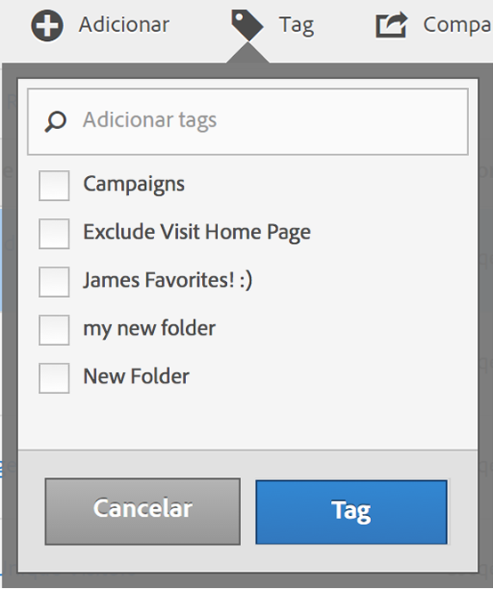

# Marcar métricas calculadas

No Gerenciador de métricas calculadas, a marcação de segmentos permite organizá-los.

Os usuários podem criar tags para métricas calculadas e aplicar uma ou mais tags a uma métrica. Contudo, só é possível ver as tags das métricas calculadas que você possui ou que foram compartilhadas com você. Que tipos de tags você deve criar? Estas são algumas sugestões para tags úteis:

* Tags com base em **nomes de equipe**, como Marketing social, Marketing móvel.
* Tags de **projeto** (tags de análise), como análises de página de entrada.
* Tags de **categoria**: masculino; geografia.
* Tags de **fluxo de trabalho**: para ser aprovado; auxiliar para (uma unidade de negócios específica)

1. No Gerenciador de métricas calculadas, marque a caixa de seleção ao lado da métrica à qual deseja adicionar uma tag. A barra de ferramentas de gerenciamento é exibida:
1. Clique em **[!UICONTROL Tag]e**

   * selecione a partir das tags existentes, ou
   * adicione um novo nome da tag na caixa de diálogo Adicionar tags/Pesquisar e pressione **[!UICONTROL Enter]**.

      

1. Clique em **[!UICONTROL tag]** novamente para adicionar uma tag à métrica.

A tag agora deve aparecer na coluna Tags. (Clique no ícone de engrenagem na parte superior direita para gerenciar suas colunas).

Também é possível filtrar as tags, acessando **[!UICONTROL Mostrar filtros]** &gt; **[!UICONTROL Tags]**.
