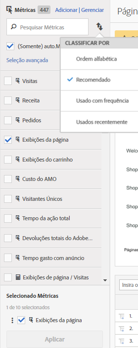

# Métricas calculadas e calculadas avançadas (derivadas)

Métricas calculadas e calculadas avançadas (ou derivadas) são métricas personalizadas que podem ser criadas a partir de métricas existentes.

>[!IMPORTANT]
>
>In July 2018, Adobe introduced [Attribution IQ](https://marketing.adobe.com/resources/help/en_US/analytics/analysis-workspace/attribution.html), which revised the way allocation models in calculated metrics are evaluated. Como parte dessa alteração, as métricas calculadas que usam um modelo de alocação não padrão foram migradas para novos modelos de atribuição melhorados:
>
>* Os modelos de alocação «Último contato do canal de marketing» e «Canal de marketing primeiro toque» foram migrados para os novos modelos de atribuição «Último contato» e «Primeiro toque» respectivamente (Observação: «Canais de marketing» não foram desaprovados - apenas os dois modelos de alocação que aparecem nas métricas calculadas foram).
>* Além disso, corrigimos a forma como a alocação Linear é calculada. Para clientes que usam métricas calculadas com modelos de alocação “linear”, os relatórios podem ser levemente alterados para refletir o novo modelo de atribuição corrigido. This change to calculated metrics is reflected in [!UICONTROL Analysis Workspace], [!UICONTROL Reports &amp; Analytics], the Reporting API, Report Builder, and Ad Hoc Analysis. Para obter mais informações, consulte [Como a alocação linear funcionará a partir de 19 de julho de 2018](../../components/c-calcmetrics/c-workflow/cm-workflow/c-build-metrics/m-metric-type-alloc.md#section_EDBB2E14A6C248C5A79C0913C02D7CA1).

Nossas ferramentas para métricas calculadas oferecem uma maneira muito mais flexível para criar, gerenciar e preparar métricas. They allow you as marketers, product managers and analysts to ask questions of the data without having to change your [!DNL Analytics] implementation. The custom metrics available in each [!DNL Analytics] package are:

* [!DNL Analytics] Adobe Foundation: Calculado
* [Adobe Analytics Select](https://www.adobe.com/data-analytics-cloud/analytics/select.html): Calculadas + Calculadas avançadas
* [Adobe Analytics Prime](https://www.adobe.com/data-analytics-cloud/analytics/prime.html): Calculadas + Calculadas avançadas
* [Adobe Analytics Ultimate](https://www.adobe.com/data-analytics-cloud/analytics/ultimate.html): Calculadas + Calculadas avançadas

Veja uma comparação entre os recursos de Métricas calculadas e Métricas calculadas avançadas:

| Opções do criador | Métricas calculadas | Métricas calculadas avançadas (derivadas) |
|---|---|---|
| [Tipos de formatos (decimal, hora, percentual, moeda)](../../components/c-calcmetrics/c-workflow/cm-workflow/c-build-metrics/cm-build-metrics.md#concept_5EC82A91EB9C44FC870326C85F9D0B18) | Sim | Sim |
| [Alterações de atribuição (padrão, linear, participação etc.)](../../components/c-calcmetrics/c-workflow/cm-workflow/c-build-metrics/m-metric-type-alloc.md#concept_B7A1FCFEFA9D4C4883208ACE8C9C8E5E) | Sim | Sim |
| [Tipos de métrica (padrão, total)](../../components/c-calcmetrics/c-workflow/cm-workflow/c-build-metrics/m-metric-type-alloc.md#concept_B7A1FCFEFA9D4C4883208ACE8C9C8E5E) | Sim | Sim |
| Operadores básicos (adição, subtração, multiplicação, divisão) | Sim | Sim |
| [Aplicar segmentos](../../components/c-calcmetrics/c-workflow/cm-workflow/c-build-metrics/metrics-with-segments.md#concept_21C77BD86E7E45E79AF030D8ED54DB3E) | Não | Sim |
| [Funções básicas (contagem, valor absoluto, meio etc.)](../../components/c-calcmetrics/cm-reference/cm-functions.md#concept_E3022D5EEEE145B69A23438BAF7016B2) | Não | Sim |
| [Funções avançadas (regressão, if/then, t-score etc.)](../../components/c-calcmetrics/cm-reference/cm-adv-functions.md#concept_A5FB9127D70F4E1AA02D1ACBF4F54174) | Não | Sim |

## Capacidades {#section_A0A5C275B68A4D628950BBB0B1EE631F}

É possível

* Create metrics across [!UICONTROL Analysis Workspace], [!UICONTROL Reports &amp; Analytics], [!UICONTROL Ad Hoc Analysis], [!UICONTROL Report Builder], [!UICONTROL Anomaly Detection], and [!UICONTROL Contribution Analysis].
* Crie métricas segmentadas derivadas do tempo de execução do relatório, sem precisar [alterar a implementação](https://youtu.be/CuQTm9RaUpY). Essas métricas podem ser exibidas historicamente, pois se baseiam em segmentos.
* Compartilhe métricas em conjuntos de relatórios. Isso significa que todas as métricas recém-criadas se aplicam a todos os conjuntos de relatórios da mesma empresa de logon.
* (Somente métricas calculadas avançadas) Segmente as métricas. Por exemplo, é possível criar uma métrica para “Novos visitantes”, com uma contagem de pessoas para as quais esta é a primeira sessão.
* (Somente métricas calculadas avançadas) Incorpore funções estatísticas para ajudar a descrever melhor seus dados. Por exemplo, é possível contar o número de itens em um relatório ou adicionar o número de desvios padrão para cada item.
* Utilize metrics created in [!UICONTROL Ad Hoc Analysis] in the other [!DNL Analytics] tools and vice versa.

   >[!NOTE]
   >
   >Você pode continuar a criar métricas na Análise ad hoc. Agora, a interface do usuário do criador de métricas calculadas é similar ao novo criador de métricas.

## Limitações {#section_CB878B02451541D68A68B508D4DBD19A}

Some [!DNL Analytics] features let you use events but not calculated metrics:

* Funis no Reports &amp; Analytics
* Fallout na Analysis Workspace
* [!UICONTROL Análise de coorte na Analysis Workspace]
* [!UICONTROL Data Warehouse]
* [!UICONTROL Segmentos]
* [!UICONTROL Relatórios em Tempo real]
* [!UICONTROL Relatórios de Dados atuais]
* [!DNL Analytics] for [!DNL Target]

## Ferramentas {#section_D65E9C067E9C45E1A50DD30F50561BB2}

Here is a short overview of the [!UICONTROL Calculated Metrics] tools:

<table id="table_520AFE97DB514958ABE23FD3C9CE0ABD"> 
 <thead> 
  <tr> 
   <th colname="col1" class="entry"> Ferramenta </th> 
   <th colname="col2" class="entry"> Capacidades </th> 
  </tr>
 </thead>
 <tbody> 
  <tr> 
   <td colname="col1"><a href="../../components/c-calcmetrics/c-workflow/cm-workflow/c-build-metrics/cm-build-metrics.md#concept_5EC82A91EB9C44FC870326C85F9D0B18" format="dita" scope="local"> Criador de métricas calculada</a> </td> 
   <td colname="col2"> 
    <ul id="ul_E6F02AB9DF204C2F9A0AC92A31594B3E"> 
     <li id="li_A4A6E716374243A190C539A3F4A41C0C">Crie métricas calculadas e calculadas avançadas usando modelos de alocação avançados. </li> 
     <li id="li_C8C97BA4E227463E98077ABA5818FFC6">Adicionar segmentos em linha às fórmulas de métricas. </li> 
     <li id="li_8503D9E06A3C46569B5CDB4B90F72446">Comparar segmentos em um mesmo relatório. É possível, por exemplo, comparar visitantes locais com visitantes internacionais. </li> 
     <li id="li_4B528FDE1F96400DBA0D3276408FF919">Usar funções estatísticas. </li> 
     <li id="li_C1162B1EA6784B8189A8A87E2B0DA79A">Fornecer descrições de métricas detalhadas (mostrar o que ela faz, quando usá-la, quando NÃO usá-la). </li> 
     <li id="li_DEA13F5E8BF94AF1B311C467FE6E2A74">Copiar definições em novas métricas. </li> 
     <li id="li_8C21F55015D44910904202D2BF74221C">Fornecer uma visualização da métrica em linha. </li> 
     <li id="li_3704F66C321C477F9D4F52E068C231BD">Definir a polaridade da métrica, que indica se ela é boa ou ruim caso um determinado evento personalizado (métrica) apresente uma tendência para cima. </li> 
     <li id="li_9D45319FA965476FB1C90DE8AA72BBD7">Adicionar tags às métricas. </li> 
    </ul> </td> 
  </tr> 
  <tr> 
   <td colname="col1"><a href="../../components/c-calcmetrics/c-workflow/cm-workflow/cm-manager.md#concept_BA6815CB06D842D5825766396B691653" format="dita" scope="local"> Gerenciador de métricas calculadas</a> </td> 
   <td colname="col2"> 
    <ul id="ul_E4D20D5DD3904CC6A85785B5BD4C1B1E"> 
     <li id="li_E0B216BA1478406EB6212263DF71D85B">Compartilhar métricas com outras pessoas. </li> 
     <li id="li_96EB16FAF3454211AAEF78EA5B08927F">Aprovar e controlar métricas. </li> 
     <li id="li_3ADBD2428EAC4B0AA61222D87C3AF2B7">Organizar (marcar com tags) suas métricas de forma que as pessoas possam encontrá-las. </li> 
     <li id="li_726F3C3390744E49BA63606FE196880E">Excluir métricas. </li> 
     <li id="li_F306BA4FA8AF4A6E987BA62634659A2F">Renomear as métricas. </li> 
    </ul> </td> 
  </tr> 
  <tr> 
   <td colname="col1"> Painel Seletor de métricas </td> 
   <td colname="col2"> 
Replaces the  Show Metrics popup in [!UICONTROL Reports &amp; Analytics]. 
 
Permite pesquisar e adicionar/aplicar métricas ao relatório. Também é possível alterar a ordem de <a href="../../components/c-calcmetrics/c-workflow/cm-workflow/cm-finding.md#concept_A09845053A934CB7B755391D76E76C08" format="dita" scope="local"> classificação</a> (as opções incluem: alfabética, recomendado, usados com frequência, usados recentemente.) Além disso, é possível filtrar os Conjuntos de relatórios para mostrar apenas as métricas criadas em um conjunto de relatórios específico. 
 
Para acessar o Seletor de métricas, clique no ícone Métricas  à esquerda de um relatório. O Seletor de métricas tem a seguinte aparência: 
 
 
 </td> 
  </tr> 
  <tr> 
   <td colname="col1"><a href="https://www.adobe.io/apis/experiencecloud/analytics/docs.html#!AdobeDocs/analytics-2.0-apis/master/README.md" format="https" scope="external"> API para métricas calculadas</a> </td> 
   <td colname="col2"> 
Parte do conjunto de Api 2.0 do Adobe Analytics. 
 </td> 
  </tr> 
 </tbody> 
</table>

