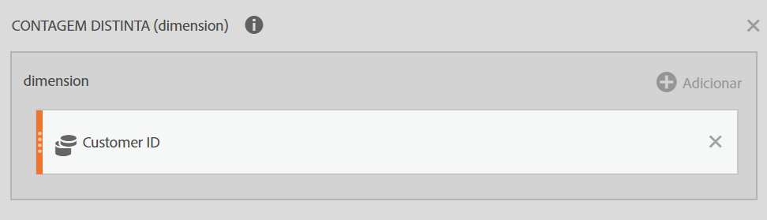

# Referência: funções avançadas

<!-- 

cm_adv_functions.xml

 -->

Access these functions by checking **[!UICONTROL Show Advanced]** in the **[!UICONTROL Functions]** drop-down list.

## Funções de tabela versus Funções de linha {#section_8977BE40A47E4ED79EB543A9703A4905}

Uma função de tabela exibe um resultado igual para cada linha da tabela. Uma função de linha exibe um resultado diferente para cada linha da tabela.

## O que significa o parâmetro Incluir zeros? {#section_C7A2B05929584C65B308FD372CB8E8E3}

Informa se os zeros devem ou não ser incluídos no cálculo. Muitas vezes, zero significa "nada"; mas em alguns casos, pode ser importante.

Por exemplo, se você possuir uma métrica de Receita e adicionar a métrica de Exibições de página ao relatório, aparecerão mais linhas com valores iguais a zero para sua receita. Você provavelmente não quer que isso afete nenhum cálculo de MÉDIA, MÍN, QUARTIL etc. que você possui na coluna de receita. Neste caso, você deve marcar o parâmetro Incluir zeros.

Por outro lado, se você possuir duas métricas de interesse, pode não ser correto dizer que uma tem uma média ou valor mínimo maior que a outra por causa dos zeros de algumas linhas. Neste caso, é melhor não marcar o parâmetro Incluir zeros.

## E {#concept_E14513FE464F4491AD0D4130D4EE621C}

Retorna o valor do seu argumento. Use NÃO para garantir que um valor não seja igual a um determinado valor.

>[!NOTE]
>
>0 (zero) significa Falso, e qualquer outro valor é Verdadeiro.

```
AND(logical_test1,[logical_test2],...)
```

| Argumento | Descrição |
|---|---|
| *logical_test1* | Obrigatório. Qualquer valor ou expressão que possa ser avaliado como VERDADEIRO ou FALSO. |
| *logical_test2* | Opcional. Condições adicionais que você deseja avaliar como VERDADEIRO ou FALSO |

## Contagem distinta aproximada (dimensão) {#concept_000776E4FA66461EBA79910B7558D5D7}

Retorna a contagem distinta aproximada de itens de dimensão em referência à dimensão selecionada. A função usa o método HyperLogLog (HLL) de aproximação de contagens distintas.  Está configurada para garantir que o valor fique entre 5% do valor inteiro em 95% das vezes.

```
Approximate Count Distinct (dimension)
```

| Argumento |  |
|---|---|
| *dimension* | A dimensão cuja contagem distinta de itens você deseja obter. |

## Caso de uso de exemplo {#section_424E3FC5092948F0A9D655F6CCBA0312}

A Contagem distinta aproximada (eVar de ID de cliente) é um caso de uso comum para essa função.

Definição de uma nova métrica calculada “Número aproximado de clientes”:



A métrica “Número aproximado de clientes” deve ser usada em relatórios da seguinte maneira:


## Únicos excedidos {#section_9C583858A9F94FF7BA054D1043194BAA}

Como Count() e RowCount(), Approximate Count Distinct() está sujeita a [limites “únicos excedidos”](https://marketing.adobe.com/resources/help/en_US/reference/metrics_uniques_high_numbers.html). Se o limite “únicos excedidos” for atingido dentro de um mês específico relativo a uma dimensão, o valor será contado como 1 item de dimensão.

## Comparação de funções de contagem {#section_440FB8FB44374459B2C6AE2DA504FC0B}

Approximate Count Distinct() é uma melhoria das funções Count() e RowCount(), pois a métrica criada pode ser usada em qualquer relatório dimensional para renderizar uma contagem aproximada de itens de uma dimensão separada. Por exemplo, a contagem de IDs de clientes usadas em um relatório de Tipo de dispositivo móvel.

Essa função será menos precisa que Count() e RowCount(), porque usa o método HLL, em comparação a Count() e RowCount(), que são contagens exatas.

## Arco cosseno (Linha) {#concept_1DA3404F3DDE4C6BAF3DBDD655D79C7B}

Retorna o arco cosseno, ou o cosseno inverso, de uma métrica. O arco seno é o ângulo cujo cosseno é um número. O ângulo retornado é fornecido em radianos, no intervalo de 0 (zero) a pi. Caso queira converter o resultado de radianos para graus, multiplique por 180/PI( ).

```
ACOS(metric)
```

| Argumento |  |
|---|---|
| *metric* | O cosseno do ângulo que você deseja de -1 a 1. |

## Arco seno (Linha) {#concept_90F00DEC46BA47F8A21493647D9668CD}

Retorna o arco seno, ou seno inverso, de um número. O arco seno é o ângulo cujo seno é um número. O ângulo é fornecido em radianos, no intervalo de -pi/2 a pi/2. Para expressar o arco seno em graus, multiplique o resultado por 180/PI( ).

```
ASIN(metric) 
```

| Argumento |  |
|---|---|
| *metric* | O cosseno do ângulo que você deseja de -1 a 1. |

## Arco tangente (Linha) {#concept_3408520673774A10998E9BD8B909E90C}

Retorna o arco tangente, ou a tangente inversa, de um número. O arco tangente é o ângulo cuja tangente é um número. O ângulo é fornecido em radianos, no intervalo de -pi/2 a pi/2. Para expressar o arco tangente em graus, multiplique o resultado por 180/PI( ).

```
ATAN(metric)
```

| Argumento |  |
|---|---|
| *metric* | O cosseno do ângulo que você deseja de -1 a 1. |

## Regressão exponencial: valor previsto de Y (Linha) {#concept_25615693312B4A7AB09A2921083502AD}

Calcula os valores previstos de y (metric_Y), levando em conta os valores de x conhecidos (metric_X) e usando o método dos quadrados mínimos para calcular a linha de melhor ajuste baseada em .

```
ESTIMATE.EXP(metric_X, metric_Y)
```

| Argumento | Descrição |
|---|---|
| *metric_X* | Uma métrica que você designaria como um dado dependente. |
| *metric_Y* | Uma métrica que você gostaria de designar como um dado independente. |

## Cdf-T {#concept_4E2F2673532A48B5AF786521DE428A66}

Retorna o percentual dos valores em uma distribuição t de student com n graus de liberdade, que conta com uma pontuação Z menor que x.

```
cdf_t( -∞, n ) = 0 
cdf_t(  ∞, n ) = 1 
cdf_t( 3, 5 ) ? 0.99865 
cdf_t( -2, 7 ) ? 0.0227501 
cdf_t( x, ∞ ) ? cdf_z( x )
```

## Cdf-Z {#concept_99C97ACC40A94FADBCF7393A17BC2D12}

Retorna o percentual dos valores em uma distribuição normal que conta com uma pontuação Z menor que x.

```
cdf_z( -∞ ) = 0 
cdf_z( ∞ ) = 1 
cdf_z( 0 ) = 0.5 
cdf_z( 2 ) ? 0.97725 
cdf_z( -3 ) ? 0.0013499 
 
```

## Limite máximo (Linha) {#concept_A14CDB1E419B4AA18D335E5BA2548346}

Retorna o menor número inteiro não inferior a um valor especificado. Por exemplo, caso você não queira relatar os decimais na receita e um produto apresentar um valor de US$569,34, use a fórmula LIMITE MÁXIMO(*Receita*) para arredondar a receita para cima; neste caso, US$570.

```
CEILING(metric)
```

| Argumento | Descrição |
|---|---|
| *metric* | A métrica que deseja arredondar. |

## Cosseno (Linha) {#concept_DD07AA1FB08145DC89B69D704545FD0A}

Retorna o cosseno do ângulo especificado. Se o ângulo estiver em graus, multiplique-o por PI( )/180.

```
COS(metric)
```

| Argumento | Descrição |
|---|---|
| *metric* | O ângulo, em radianos, para o qual você deseja obter o cosseno. |

## Raiz cúbica {#concept_BD93EFA45DF7447A8F839E1CA5B5F795}

Retorna a raiz cúbica positiva de um número. A raiz cúbica de um número é o valor dele elevado à potência de 1/3.

```
CBRT(metric)
```

| Argumento | Descrição |
|---|---|
| *metric* | A métrica para a qual você deseja obter a raiz cúbica. |

## Cumulativo {#concept_3D3347797B6344CE88B394C3E39318ED}

Retorna a soma de x para as últimas N linhas (conforme ordenado pela dimensão, usando valores de hash para campos baseados em sequências).

Se N &lt;= 0, usa todas as linhas anteriores. Já que é ordenado pela dimensão, é útil somente em dimensões com ordem natural como datas ou comprimento do caminho.

```
| Date | Rev  | cumul(0,Rev) | cumul(2,Rev) | 
|------+------+--------------+--------------| 
| May  | $500 | $500         | $500         | 
| June | $200 | $700         | $700         | 
| July | $400 | $1100        | $600         | 
 
```

## Média acumulada {#concept_ABB650962DC64FD58A79C305282D3E61}

Retorna a média das últimas N linhas.

Se N &lt;= 0, usa todas as linhas anteriores. Já que é ordenado pela dimensão, é útil somente em dimensões com ordem natural como datas ou comprimento do caminho.

>[!NOTE]
>
>Isso não funciona como esperado com métricas de taxa como receita/visitante: Calcula as taxas em vez de resumir a receita dos últimos N e somar visitantes nos últimos N e depois dividi-los. Em vez disso, use

```
cumul(revenue)/cumul(visitor)
```

## Igual {#concept_A3B97152B5F74E04A97018B35734BEEB}

Retorna itens que possuem o mesmo valor numérico ou de sequência.

## Regressão exponencial_ Coeficiente de correlação (Tabela) {#concept_C18BBFA43C1A499293290DF49566D8D8}

Returns the correlation coefficient, *r*, between two metric columns ( *metric_A* and *metric_B*) for the regression equation .

```
CORREL.EXP(metric_X, metric_Y)
```

| Argumento | Descrição |
|---|---|
| *metric_X* | Uma métrica que você gostaria de correlacionar a *metric_Y*. |
| *metric_Y* | Uma métrica que você gostaria de correlacionar a *metric_X*. |

## Regressão exponencial: intercepto (Tabela) {#concept_0047206C827841AD936A3BE58EEE1514}

Returns the intercept, *b*, between two metric columns ( *metric_X* and *metric_Y*) for

```
INTERCEPT.EXP(metric_X, metric_Y)
```

| Argumento | Descrição |
|---|---|
| *metric_X* | Uma métrica que você designaria como um dado dependente. |
| *metric_Y* | Uma métrica que você gostaria de designar como um dado independente. |

## Regressão exponencial: inclinação (Tabela) {#concept_230991B0371E44308C52853EFA656F04}

Returns the slope, *a*, between two metric columns ( *metric_X* and *metric_Y*) for .

```
SLOPE.EXP(metric_X, metric_Y)
```

| Argumento | Descrição |
|---|---|
| *metric_X* | Uma métrica que você designaria como um dado dependente. |
| *metric_Y* | Uma métrica que você gostaria de designar como um dado independente. |

## Limite mínimo (Linha) {#concept_D368150EC3684077B284EE471463FC31}

Retorna o maior número inteiro não superior a um valor especificado. Por exemplo, caso você não queira relatar os decimais na receita e um produto apresentar um valor de US$569,34, use a fórmula LIMITE MÍNIMO(*Receita*) para arredondar a receita para baixo; neste caso, US$569.

```
FLOOR(metric)
```

| Argumento | Descrição |
|---|---|
| *metric* | A métrica que deseja arredondar. |

## Maior que {#concept_A83734A0C0C14646B76D2CC5E677C644}

Retorna itens cuja contagem numérica é superior ao valor inserido.

## Maior que ou igual {#concept_8CA6DF1F84784D50849BF1C566AE1D37}

Retorna itens cuja contagem numérica é superior ou igual ao valor inserido.

## Cosseno hiperbólico (Linha) {#concept_79DD5681CE9640BDBA3C3F527343CA98}

Retorna o cosseno hiperbólico de um número.

```
COSH(metric)
```

| Argumento | Descrição |
|---|---|
| *metric* | O ângulo, em radianos, para o qual você deseja descobrir o cosseno hiperbólico. |

## Seno hiperbólico (Linha) {#concept_96230731600C45E3A4E823FE155ABA85}

Retorna o seno hiperbólico de um número.

```
SINH(metric)
```

| Argumento | Descrição |
|---|---|
| *metric* | O ângulo, em radianos, para o qual você deseja descobrir o seno hiperbólico. |

## Tangente hiperbólica (Linha) {#concept_BD249013732F462B9863629D142BCA6A}

Retorna a tangente hiperbólica de um número.

```
TANH(metric)
```

| Argumento | Descrição |
|---|---|
| *metric* | O ângulo, em radianos, para o qual você deseja descobrir a tangente hiperbólica. |

## Se (Linha) {#concept_6BF0F3EAF3EF42C288AEC9A79806C48E}

A função SE retorna um valor se uma condição especificada for considerada VERDADEIRO, e outro valor se a condição for considerada FALSO.

```
IF(logical_test, [value_if_true], [value_if_false])
```

| Argumento | Descrição |
|---|---|
| *logical_test* | Obrigatório. Qualquer valor ou expressão que possa ser avaliado como VERDADEIRO ou FALSO. |
| *[value_if_true]* | O valor que você deseja retornar se o argumento *logical_test* for considerado VERDADEIRO. (Caso não tenha sido incluído, o padrão para este argumento é 0.) |
| *[value_if_false]* | O valor que você deseja retornar se o argumento *logical_test* for considerado FALSO. (Caso não tenha sido incluído, o padrão para este argumento é 0.) |

## Menor que {#concept_A4A85C0FDF944AACAD4B8B55699D1B11}

Retorna itens cuja contagem numérica é inferior ao valor inserido.

## Menor que ou igual {#concept_99D12154DE4848B1B0A6327C4322D288}

Retorna itens cuja contagem numérica é inferior ou igual ao valor inserido.

## Regressão linear: Coeficiente de correlação {#concept_132AC6B3A55248AA9C002C1FBEB55C60}

Y = a X + b. Retorna o coeficiente de correlação

## Regressão linear: Intercepto {#concept_E44A8D78B802442DB855A07609FC7E99}

Y = a X + b. Retorna b.

## Regressão linear: Valor previsto de Y {#concept_9612B9BF106D4D278648D2DF92E98EFC}

Y = a X + b. Retorna Y.

## Regressão linear: Inclinação {#concept_12352982082A4DDF824366B073B4C213}

Y = a X + b. Retorna a.

## Logaritmo na base 10 (Linha) {#concept_4C65DF9659164261BE52AA5A95FD6BC1}

Retorna o logaritmo de base 10 de um número.

```
LOG10(metric)
```

| Argumento | Descrição |
|---|---|
| *metric* | O número real positivo para o qual você deseja obter o logaritmo de base 10. |

## Regressão logarítmica: coeficiente de correlação (Tabela) {#concept_F3EB35016B754E74BE41766E46FDC246}

Returns the correlation coefficient, *r*, between two metric columns (*metric_X* and *metric_Y*) for the regression equation [!DNL Y = a ln(X) + b]. É calculada usando a equação de CORREL.

```
CORREL.LOG(metric_X,metric_Y)
```

| Argumento | Descrição |
|---|---|
| *metric_X* | Uma métrica que você gostaria de correlacionar a *metric_Y*. |
| *metric_Y* | Uma métrica que você gostaria de correlacionar a *metric_X*. |

## Regressão logarítmica: intercepto (Tabela) {#concept_75A3282EDF54417897063DC26D4FA363}

Retorna o intercepto *b* como a regressão dos quadrados mínimos entre duas colunas de métrica (*metric_X* e *metric_Y*) para a equação de regressão [!DNL Y = a ln(X) + b]. É calculada usando a equação de INTERCEPTO.

```
INTERCEPT.LOG(metric_X, metric_Y)
```

| Argumento | Descrição |
|---|---|
| *metric_X* | Uma métrica que você designaria como um dado dependente. |
| *metric_Y* | Uma métrica que você gostaria de designar como um dado independente. |

## Regressão logarítmica: valor previsto de Y (Linha) {#concept_5F3A9263BBB84E6098160A4DFB9E3607}

Calculates the predicted [!DNL y] values (metric_Y), given the known [!DNL x] values (metric_X) using the "least squares" method for calculating the line of best fit based on [!DNL Y = a ln(X) + b]. É calculada usando a equação de ESTIMATIVA.

Em análises de regressão, esta função calcula os valores previstos de [!DNL y] (*metric_Y*), conhecidos os valores de [!DNL x] (*metric_X*) e usando o logaritmo para calcular a linha de melhor ajuste para a equação de regressão [!DNL Y = a ln(X) + b]. O valor de [!DNL a] corresponde a cada valor de x, e [!DNL b] refere-se a um valor constante.

```
ESTIMATE.LOG(metric_X, metric_Y)
```

| Argumento | Descrição |
|---|---|
| *metric_X* | Uma métrica que você designaria como um dado dependente. |
| *metric_Y* | Uma métrica que você gostaria de designar como um dado independente. |

## Regressão logarítmica: inclinação (Tabela) {#concept_B291EFBE121446A6B3B07B262BBD4EF2}

Returns the slope, *a*, between two metric columns (*metric_X* and *metric_Y*) for the regression equation [!DNL Y = a ln(X) + b]. É calculada usando a equação de INCLINAÇÃO.

```
SLOPE.LOG(metric_A, metric_B)
```

| Argumento | Descrição |
|---|---|
| *metric_A* | Uma métrica que você designaria como um dado dependente. |
| *metric_B* | Uma métrica que você gostaria de designar como um dado independente. |

## Logaritmo natural {#concept_D3BE148A9B84412F8CA61734EB35FF9E}

Retorna o logaritmo natural de um número. Logaritmos naturais se baseiam na constante *e* (2,71828182845904). LN é o inverso da função EXP.

```
LN(metric)
```

| Argumento | Descrição |
|---|---|
| *metric* | O número real positivo para o qual você deseja obter o logaritmo natural. |

## NÃO {#concept_BD954C455A8148A3904A301EC4DC821E}

Retorna 1 se o número for 0, ou retorna 0 se for qualquer outro número.

```
NOT(logical)
```

| Argumento | Descrição |
|---|---|
| *logical* | Obrigatório. Um valor ou expressão que pode ser avaliado como VERDADEIRO ou FALSO. |

A utilização do NÃO exige conhecer se as expressões (&lt;, &gt;, =, &lt;&gt; etc.) retornam os valores 0 ou 1.

## Diferente de {#concept_EC010B7A9D2049099114A382D662FC16}

Retorna todos os itens que não contêm a correspondência exata do valor inserido.

## Ou (Linha) {#concept_AF81A33A376C4849A4C14F3A380639D2}

Retorna TRUE se qualquer argumento for VERDADEIRO, ou FALSE se todos os argumentos forem FALSOS.

>[!NOTE]
>
>0 (zero) significa Falso, e qualquer outro valor é Verdadeiro.

```
OR(logical_test1,[logical_test2],...)
```

| Argumento | Descrição |
|---|---|
| *logical_test1* | Obrigatório. Qualquer valor ou expressão que possa ser avaliado como VERDADEIRO ou FALSO. |
| *logical_test2* | Opcional. Condições adicionais que você deseja avaliar como VERDADEIRO ou FALSO |

## Pi {#concept_41258789660D4A33B5FB86228F12ED9C}

Retorna a constante PI, 3,14159265358979, com precisão de 15 dígitos.

```
PI()
```

A função [!DNL PI] não tem argumentos.

## Regressão de potência: coeficiente de correlação (Tabela) {#concept_91EC2CFB5433494F9E0F4FDD66C63766}

Returns the correlation coefficient, *r*, between two metric columns (*metric_X* and *metric_Y*) for [!DNL Y = b*X].

```
CORREL.POWER(metric_X, metric_Y)
```

| Argumento | Descrição |
|---|---|
| *metric_X* | Uma métrica que você gostaria de correlacionar a *metric_Y*. |
| *metric_Y* | Uma métrica que você gostaria de correlacionar a *metric_X*. |

## Regressão de potência: intercepto (Tabela) {#concept_7781C85597D64D578E19B212BDD1764F}

Returns the intercept, *b*, between two metric columns (*metric_X* and *metric_Y*) for [!DNL Y = b*X].

```
 INTERCEPT.POWER(metric_X, metric_Y)
```

| Argumento | Descrição |
|---|---|
| *metric_X* | Uma métrica que você designaria como um dado dependente. |
| *metric_Y* | Uma métrica que você gostaria de designar como um dado independente. |

## Regressão de potência: valor previsto de Y (Linha) {#concept_CD652C0A921D4EFBA8F180CB8E486B18}

Calculates the predicted [!DNL y] values ( [!DNL metric_Y]), given the known [!DNL x] values ( [!DNL metric_X]) using the "least squares" method for calculating the line of best fit for [!DNL Y = b*X].

```
 ESTIMATE.POWER(metric_X, metric_Y)
```

| Argumento | Descrição |
|---|---|
| *metric_X* | Uma métrica que você designaria como um dado dependente. |
| *metric_Y* | Uma métrica que você gostaria de designar como um dado independente. |

## Regressão de potência: inclinação (Tabela) {#concept_5B9E71B989234694BEB5EEF29148766C}

Returns the slope, *a*, between two metric columns (*metric_X* and *metric_Y*) for [!DNL Y = b*X].

```
SLOPE.POWER(metric_X, metric_Y)
```

| Argumento | Descrição |
|---|---|
| *metric_X* | Uma métrica que você designaria como um dado dependente. |
| *metric_Y* | Uma métrica que você gostaria de designar como um dado independente. |

## Regressão quadrática: coeficiente de correlação (Tabela) {#concept_9C9101A456B541E69BA29FCEAC8CD917}

Returns the correlation coefficient, *r*, between two metric columns (*metric_X* and *metric_Y*) for [!DNL Y=(a*X+b)]****.

```
CORREL.QUADRATIC(metric_X, metric_Y)
```

| Argumento | Descrição |
|---|---|
| *metric_X* | Uma métrica que você gostaria de correlacionar a *metric_Y*. |
| *metric_Y* | Uma métrica que você gostaria de correlacionar a *metric_X*. |

## Regressão quadrática: intercepto (Tabela) {#concept_69DC0FD6D38C40E9876F1FD08EC0E4DE}

Returns the intercept, *b*, between two metric columns (*metric_X* and *metric_Y*) for [!DNL Y=(a*X+b)]****.

```
INTERCEPT.POWER(metric_X, metric_Y)
```

| Argumento | Descrição |
|---|---|
| *metric_X* | Uma métrica que você designaria como um dado dependente. |
| *metric_Y* | Uma métrica que você gostaria de designar como um dado independente. |

## Regressão quadrática: valor previsto de Y (Linha) {#concept_2F1ED70B1BDE4664A61CC09D30C39CBB}

Calculates the predicted [!DNL y] values (metric_Y), given the known [!DNL x] values (metric_X) using the least squares method for calculating the line of best fit using [!DNL Y=(a*X+b)]**** .

```
ESTIMATE.QUADRATIC(metric_A, metric_B)
```

| Argumento | Descrição |
|---|---|
| *metric_A* | Uma métrica que você designaria como um dado dependente. |
| *metric_B* | Uma métrica que você designaria como um dado dependente. |

## Regressão quadrática: inclinação (Tabela) {#concept_0023321DA8E84E6D9BCB06883CA41645}

Returns the slope, *a*, between two metric columns (*metric_X* and metric_Y) for [!DNL Y=(a*X+b)]****.

```
SLOPE.QUADRATIC(metric_X, metric_Y)
```

| Argumento | Descrição |
|---|---|
| *metric_X* | Uma métrica que você designaria como um dado dependente. |
| *metric_Y* | Uma métrica que você gostaria de designar como um dado independente. |

## Regressão recíproca: coeficiente de correlação (Tabela) {#concept_EBEC509A19164B8AB2DBDED62F4BA2A5}

Retorna o coeficiente de correlação *r* entre duas colunas de métrica (*metric_X* e *metric_Y*) para [!DNL Y = a/X+b].

```
CORREL.RECIPROCAL(metric_X, metric_Y)
```

| Argumento | Descrição |
|---|---|
| *metric_X* | Uma métrica que você gostaria de correlacionar a *metric_Y*. |
| *metric_Y* | Uma métrica que você gostaria de correlacionar a *metric_X*. |

## Regressão recíproca: intercepto (Tabela) {#concept_2DA45B5C69F140EC987649D2C88F19B3}

Returns the intercept, *b*, between two metric columns (*metric_X* and *metric_Y*) for [!DNL Y = a/X+b].

```
INTERCEPT.RECIPROCAL(metric_A, metric_B)
```

| Argumento | Descrição |
|---|---|
| *metric_X* | Uma métrica que você designaria como um dado dependente. |
| *metric_Y* | Uma métrica que você gostaria de designar como um dado independente. |

## Regressão recíproca: valor previsto de Y (Linha) {#concept_2CF4B8F417A84FE98050FE488E227DF8}

Calculates the predicted [!DNL y] values (metric_Y), given the known [!DNL x] values (metric_X) using the least squares method for calculating the line of best fit using [!DNL Y = a/X+b].

```
ESTIMATE.RECIPROCAL(metric_X, metric_Y)
```

| Argumento | Descrição |
|---|---|
| *metric_X* | Uma métrica que você designaria como um dado dependente. |
| *metric_Y* | Uma métrica que você gostaria de designar como um dado independente. |

## Regressão recíproca: inclinação (Tabela) {#concept_8A8B68C9728E42A6BFDC6BD5CBDCCEC5}

Returns the slope, *a*, between two metric columns (*metric_X* and *metric_Y*) for [!DNL Y = a/X+b].

```
SLOPE.RECIPROCAL(metric_X, metric_Y)
```

| Argumento | Descrição |
|---|---|
| *metric_X* | Uma métrica que você designaria como um dado dependente. |
| *metric_Y* | Uma métrica que você gostaria de designar como um dado independente. |

## Seno (Linha) {#concept_21C8C3AA835947A28B53A4E756A7451E}

Retorna o seno do ângulo especificado. Se o ângulo estiver em graus, multiplique-o por PI( )/180.

```
SIN(metric)
```

| Argumento | Descrição |
|---|---|
| *metric* | O ângulo, em radianos, para o qual você deseja obter o seno. |

## Pontuação T {#concept_80D2B4CED3D0426896B2412B4FC73BF7}

Alias da pontuação Z; mais especificamente, é o desvio da média dividido pelo desvio padrão

## Teste t {#concept_A1F78F4A765348E38DBCAD2E8F638EB5}

Realiza um teste t m-caudal com pontuação T de col e n graus de liberdade.

The signature is `t_test( x, n, m )`. Underneath, it simply calls `m*cdf_t(-abs(x),n)`. (This is similar to the z-test function which runs `m*cdf_z(-abs(x))`.

Aqui, `m` é o número de caudas, e `n` corresponde aos graus de liberdade. Estes devem ser os números (constantes para todo o relatório, isto é, sem alteração em uma base de linha por linha).

`X` é a estatística t-test, será sempre uma fórmula (por exemplo, zscore) com base em uma métrica e será avaliada em cada linha.

O valor de retorno é a probabilidade de exibição da estatística de teste x, dados os graus de liberdade e os números de caudas.

**Exemplos:**

1. Use-o para localizar exceções:

   ```
   t_test( zscore(bouncerate), row-count-1, 2)
   ```

1. Combine-o com `if` para ignorar taxas de devolução muito altas ou baixas e para contar visitas em outro local:

   ```
   if ( t_test( z-score(bouncerate), row-count, 2) < 0.01, 0, visits )
   ```

## Tangente {#concept_C25E00CB17054263AB0460D9EF94A700}

Retorna a tangente do ângulo especificado. Se o ângulo estiver em graus, multiplique-o por PI( )/180.

```
TAN (metric)
```

| Argumento | Descrição |
|---|---|
| *metric* | O ângulo, em radianos, para o qual você deseja obter a tangente. |

## Pontuação Z (Linha) {#concept_96BEAC79476C49B899DB7E193A5E7ADD}

Retorna a pontuação Z, ou pontuação normal, com base em uma distribuição normal. A pontuação Z é o número de desvios padrão de uma observação a partir da média. Uma pontuação Z de 0 (zero) significa que a pontuação é igual à média. Uma pontuação Z pode ser positiva ou negativa, indicando se está acima ou abaixo da média e o número de desvios padrão.

A equação da pontuação Z é:


onde [!DNL x] é a pontuação bruta, [!DNL μ] é a média da população e [!DNL σ] é o desvio padrão da população.

>[!NOTE]
>
>[!DNL μ] (mu) e[!DNL σ] (sigma) são automaticamente calculados a partir da métrica.

Pontuação Z (métrica)

<table id="table_AEA3622A58F54EA495468A9402651E1B"> 
 <thead> 
  <tr> 
   <th colname="col1" class="entry"> Argumento </th> 
   <th colname="col2" class="entry"> Descrição </th> 
  </tr> 
 </thead>
 <tbody> 
  <tr> 
   <td colname="col1"> <i>metric</i> </td> 
   <td colname="col2"> <p> Retorna o valor do seu primeiro argumento diferente de zero. </p> </td> 
  </tr> 
 </tbody> 
</table>

## Teste z {#concept_2A4ADD6B3AEB4A2E8465F527FAFC4C23}

Realiza teste z n-caudal com pontuação Z de A.

Retorna a probabilidade de a linha atual ser vista por acaso na coluna.

>[!NOTE]
>
>Assume que os valores normalmente são distribuídos.

