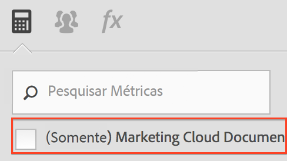

# Perguntas frequentes

Essas alterações no funcionamento das métricas calculadas do [!DNL Analytics] podem afetar você.

[Como faço para acessar o Criador de métricas calculadas?](/help/components/c-calcmetrics/cm-transition.md#section_D9AE9A0ACF824BACB5D05F0C2F7E9CA1)

[Como faço para acessar o Gerenciador de métricas calculadas?](/help/components/c-calcmetrics/cm-transition.md#section_DD0BD13E9EC940268EBE8BC88241A152)

[Por que vejo tantas métricas calculadas com o mesmo nome?](/help/components/c-calcmetrics/cm-transition.md#section_E15C5B6CCC58498CAEC3FBDA8988F0A1)

[O que aconteceu com minhas métricas calculadas globais?](/help/components/c-calcmetrics/cm-transition.md#section_7351D4C7361F4ABAA1B43F8E89AAD211)

[O que aconteceu com as métricas calculadas globais que foram compartilhadas com empresas de logon?](/help/components/c-calcmetrics/cm-transition.md#section_59E5CD948ED643AE9AD3D2E4277647F8)

[O que aconteceu com a métricas calculadas com uma classificação Numérico ou Numérico2?](/help/components/c-calcmetrics/cm-transition.md#section_71AFE6C4A7CD4AA19AB3A9D3C41D115B)

[O que aconteceu com as métricas vitalícias?](/help/components/c-calcmetrics/cm-transition.md#section_AEDB02EF24584DAD8731BED9DDCE4F48)

[O que preciso saber sobre métricas calculadas baseadas em métricas diárias/semanais/mensais/trimestrais/anuais de Visitantes únicos?](/help/components/c-calcmetrics/cm-transition.md#section_E9A77EBB41CE4881B196CC1C282B2DF3)

[E com relação a métricas calculadas criadas ou gerenciadas com os métodos da antiga API do conjunto de relatórios?](/help/components/c-calcmetrics/cm-transition.md#section_13ED1BAD02634674BDAEB479B060A4B6)

[Os dados atuais suportam todos os tipos de métricas calculadas?](/help/components/c-calcmetrics/cm-transition.md#section_1DAA718BB8DB4413BAF8AD4B4FAAFFA2)

[O que significa &quot;Nenhum nome fornecido&quot; quando exibido junto com métricas calculadas migradas?](/help/components/c-calcmetrics/cm-transition.md#section_C90CBB72A67644F38D583301981F8D03)

[O que acontece com as métricas calculadas de um usuário caso ele seja excluído?](/help/components/c-calcmetrics/cm-transition.md#section_42ED4C15830540879C4A161423690E5A)

[Por que vejo métricas calculadas &quot;desconhecidas&quot; que não são válidas para outros conjuntos de relatórios, apesar de terem sido criadas e aplicadas a esses conjuntos?](/help/components/c-calcmetrics/cm-transition.md#section_6772818EFDED46E9B7095D64C3B77211)

[Por que as alterações que fiz em minhas métricas calculadas herdadas não foram salvas?](/help/components/c-calcmetrics/cm-transition.md#section_81CDEFCA1FD542579AF183DA1494EAF0)

[Porque minhas métricas calculadas não são exibidas no Relatório de canais de marketing?](/help/components/c-calcmetrics/cm-transition.md#section_FC350359A775433AB5F43C7CAB304D62)

[Por que algumas métricas calculadas mostram fórmulas sem o parênteses que adicionei?](/help/components/c-calcmetrics/cm-transition.md#section_AC0D1E9714AD487F9A1C73359F518B5E)

[(Somente Ad Hoc Analysis) As métricas calculadas com definições de segmentos em linha ou integrados ainda são suportadas?](/help/components/c-calcmetrics/cm-transition.md#section_B25C924A282F49388AB604E3D826F44C)

[(Somente Report Builder) Por que as métricas calculadas desapareceram das minhas solicitações?](/help/components/c-calcmetrics/cm-transition.md#section_DA4792FE5D7945218CD5E6328DE08E82)

[Como funcionam os Totais das métricas calculadas?](/help/components/c-calcmetrics/cm-transition.md#section_57BA3A299C7948ABB82B0392A9B0F33E)

## Como faço para acessar o Criador de métricas calculadas? {#section_D9AE9A0ACF824BACB5D05F0C2F7E9CA1}

* Clique em **[!UICONTROL + Adicionar]** na parte superior do Gerenciador de métricas calculadas ou
* Nos relatórios do Analytics, clique no ícone Métricas  à esquerda de um relatório para exibir o painel Métricas e clique em **[!UICONTROL Adicionar]**.

## Como faço para acessar o Gerenciador de métricas calculadas? {#section_DD0BD13E9EC940268EBE8BC88241A152}

* Vá até **[!UICONTROL Analytics]** > **[!UICONTROL Componentes]** no painel de navegação esquerdo. Em seguida, clique em **[!UICONTROL Métricas calculadas]**.

* Nos relatórios do [!DNL Analytics], clique no ícone Métricas  à esquerda de um relatório para exibir o painel Métricas e clique em **[!UICONTROL Gerenciar]**.

## Por que vejo tantas métricas calculadas com o mesmo nome? {#section_E15C5B6CCC58498CAEC3FBDA8988F0A1}

(Anteriormente, métricas calculadas globais não eram propriedade de nenhum usuário administrativo específico e ficavam visíveis para todos os usuários do conjunto de relatórios. As métricas foram segregadas de acordo com o conjunto de relatórios. Se uma métrica de um conjunto de relatórios possuir o mesmo nome de uma métrica de um conjunto de relatórios diferente, elas serão exibidas aos usuários como métricas idênticas quando eles trocarem de conjuntos de relatórios.)

Agora, as métricas não são mais segregadas por conjuntos de relatórios. Se uma métrica de um conjunto de relatórios possuir o mesmo nome de uma métrica de um conjunto de relatórios diferente, ambas estarão visíveis no Criador de métricas calculadas e no Seletor de métricas e poderão ser exibidas como métricas duplicadas, mesmo que não tenham uma mesma definição.

Você verá várias métricas calculadas com um mesmo nome (mas criadas em conjuntos de relatórios diferentes) somente se desmarcar a caixa de seleção (Somente `<report suite>`), conforme mostrado aqui:

**O que você precisa fazer**

Considere consolidar as métricas calculadas com nomes e definições similares, mas tenha cuidado ao fazer isso. Você pode verificar o conjunto de relatórios para uma métrica calculada no Gerenciador de métricas calculadas, de modo a verificar o conjunto de relatórios original. Você também deve verificar as definições das métricas ao excluir possíveis duplicatas, a fim de garantir que está consolidando as métricas corretamente.

> [!NOTE] Ainda que as métricas calculadas não estejam mais vinculadas a um conjunto específico de relatórios e possam ser usadas em qualquer conjunto de relatórios visível para a empresa de logon, o conjunto de relatórios no qual a métrica calculada foi criada ou salva pela última vez ainda pode ser visualizado no Gerenciador de métricas calculadas.

> [!NOTE] Mesmo que uma métrica calculada seja excluída, os marcadores ou relatórios de painel que referenciam a métrica ainda funcionarão.

## O que aconteceu com minhas métricas calculadas globais? {#section_7351D4C7361F4ABAA1B43F8E89AAD211}

Anteriormente, um administrador podia criar métricas calculadas (conhecidas como &quot;métricas calculadas globais&quot; ou &quot;métricas calculadas do conjunto de relatórios&quot;) em um conjunto de relatórios utilizando as ferramentas administrativas. 

Agora, as métricas calculadas globais são possuídas pelo primeiro usuário administrativo da lista de usuários administrativos da empresa de logon. Elas serão compartilhadas com &quot;Todos&quot; por padrão. Este padrão segue o mesmo modelo de compartilhamento e planos de migração que os segmentos.

**O que você precisa fazer**

Nada. Contudo, o novo proprietário administrador deve tomar cuidado ao modificar ou excluir estas métricas calculadas; é possível que elas sejam usadas por vários relatórios e painéis marcados.

> [!NOTE] Mesmo que uma métrica calculada seja excluída, os marcadores ou relatórios de painel que referenciam a métrica ainda funcionarão.

## O que aconteceu com as métricas calculadas globais que foram compartilhadas com empresas de logon? {#section_59E5CD948ED643AE9AD3D2E4277647F8}

Anteriormente, um administrador podia criar métricas calculadas (conhecidas como &quot;métricas calculadas globais&quot; ou &quot;métricas calculadas do conjunto de relatórios&quot;) em um conjunto de relatórios utilizando as ferramentas administrativas. Estas métricas podem ser &quot;compartilhadas&quot; pelas empresas de logon, adicionando o conjunto de relatórios a várias empresas de logon.)

As métricas calculadas globais não podem mais ser compartilhadas com as empresas de logon. Elas não estão mais vinculadas a um conjunto de relatórios específico, e sim a uma empresa de logon específica. As métricas calculadas que foram compartilhadas com empresas de logon

* Foram migradas para todas as empresas de logon com acesso a esse conjunto de relatórios.
* Aplicadas ao padrão &quot;compartilhado com todos&quot;.
* Serão cópias independentes de todas as outras empresas de logon.

> [!NOTE] Caso a métrica calculada tenha sido usada em um marcador, painel, alerta ou relatório programado, a edição de uma nova cópia NÃO afetará a métrica calculada mantida.

## O que aconteceu com a métricas calculadas com uma classificação Numérico ou Numérico2? {#section_71AFE6C4A7CD4AA19AB3A9D3C41D115B}

(Anteriormente, as métricas calculadas com uma classificação Numérico ou Numérico2 ficavam visíveis apenas no [!UICONTROL Reports &amp; Analytics], no [!UICONTROL Report Builder] e nas APIs.)

Agora, as métricas calculadas com uma classificação Numérico ou Numérico2 permanecerão visíveis no [!UICONTROL Reports &amp; Analytics], no [!UICONTROL Report Builder] e nas APIs. Contudo, elas não serão mais suportadas em nenhum relatório com um segmento aplicado.

Além disso, métricas calculadas com uma classificação de Numérico ou Numérico2 não serão suportadas nos seguintes componentes: [!UICONTROL Ad Hoc Analysis], [!UICONTROL Analysis Workspace], [!UICONTROL Relatórios em tempo real], [!UICONTROL Detecção de anomalias] e [!UICONTROL Análise de contribuição]. Ao criar ou editar uma métrica calculada com uma classificação de Numérico ou Numérico2, você verá um aviso de compatibilidade informando que a métrica calculada não é compatível com determinadas áreas do produto.

**O que você precisa fazer**

Evitar criar métricas calculadas com classificações de Numérico ou Numérico2 caso pretenda usar a métrica com um segmento ou com qualquer um dos componentes não compatíveis.

## O que aconteceu com as métricas vitalícias? {#section_AEDB02EF24584DAD8731BED9DDCE4F48}

Métricas vitalícias não são mais suportadas ou exibidas na interface do usuário do [!UICONTROL Reports &amp; Analytics] ou em qualquer outra interface do usuário. Elas não podem ser consultadas pela API de relatórios.

Quaisquer marcadores, painéis, relatórios agendados ou alertas que continham uma métrica vitalícia continuarão a ser executados sem a métrica, contanto que haja ao menos uma outra métrica no relatório. Se a única métrica de um marcador, painel, relatório agendado ou alerta for uma métrica vitalícia, o relatório não será mais executado.

## O que preciso saber sobre métricas calculadas baseadas em métricas diárias/semanais/mensais/trimestrais/anuais de Visitantes únicos? {#section_E9A77EBB41CE4881B196CC1C282B2DF3}

As métricas calculadas baseadas nas métricas de Visitantes únicos estarão visíveis nos seguintes componentes do [!DNL Analytics]: [!UICONTROL Reports &amp; Analytics], [!UICONTROL Report Builder] e API de relatórios.

Contudo, essas métricas não serão suportadas nos seguintes componentes: [!UICONTROL Segmentos], [!UICONTROL Analysis Workspace], [!UICONTROL Relatórios em tempo real], [!UICONTROL Detecção de anomalias] e [!UICONTROL Análise de contribuição]. Ao criar ou editar uma métrica calculada baseada em métricas de Visitantes únicos, você verá um aviso de compatibilidade informando que a métrica não é compatível com determinadas áreas do produto.

Você pode usar uma métrica base de Visitantes únicos em um relatório com um segmento. É possível criar uma métrica calculada baseada em uma métrica de Visitantes únicos; contudo, essa métrica calculada não pode ser aplicada a um relatório com um segmento, e nem pode ter um segmento integrado a ela.

## O que acontece com as métricas calculadas criadas ou gerenciadas com os métodos da antiga API de conjunto de relatórios? {#section_13ED1BAD02634674BDAEB479B060A4B6}

Anteriormente, salvar uma métrica calculada com o método da API (1.3 ou 1.4) ReportSuite.SaveCalculatedMetrics era o mesmo que criar ou atualizar uma métrica calculada no Admin Console. O mesmo se aplica a ReportSuite.DeleteCalculatedMetrics. Além disso, a lista de métricas calculadas exibida no Admin Console ou ao chamar ReportSuite.GetCalculatedMetrics era a mesma.

Agora, os métodos da API (1.3 ou 1.4) ReportSuite CalculatedMetrics continuarão a salvar, excluir e recuperar métricas calculadas usando o armazenamento antigo. As métricas calculadas existentes serão migradas e estarão visíveis no novo Criador de métricas calculadas. **As novas métricas calculadas criadas com os métodos da API estarão visíveis somente na API. Elas ainda poderão ser usadas na API de relatórios.**

**O que você precisa fazer**

Se precisar usar a API e o Criador de métricas calculadas, será necessário parar de usar os métodos da API ReportSuite CalculatedMetrics e começar a usar os novos métodos da API CalculatedMetrics (obter, salvar, excluir e GetFunctions).

## Os dados atuais suportam todos os tipos de métricas calculadas? {#section_1DAA718BB8DB4413BAF8AD4B4FAAFFA2}

Os dados atuais não suportam métricas calculadas que contêm segmentos ou funções estatísticas. As únicas funções suportadas são as funções matemáticas básicas como adição, exclusão, multiplicação, divisão e negação (-x).

## O que significa &quot;Nenhum nome fornecido&quot; quando exibido junto com as métricas calculadas migradas? {#section_C90CBB72A67644F38D583301981F8D03}

&quot;Nenhum nome fornecido&quot; significa que nenhum nome de métrica está associado a esta métrica migrada (apenas uma fórmula sem um nome descritivo).

## O que acontece com as métricas calculadas de um usuário se ele for excluído? {#section_42ED4C15830540879C4A161423690E5A}

As métricas calculadas criadas por este usuário também serão excluídas. Contudo, as métricas calculadas excluídas ainda funcionarão como parte dos marcadores, painéis ou relatórios programados salvos.

## Por que vejo métricas calculadas &quot;desconhecidas&quot; que não são válidas para outros conjuntos de relatórios, apesar de terem sido criadas e aplicadas a esses conjuntos? {#section_6772818EFDED46E9B7095D64C3B77211}

A interface do usuário exibe &quot;desconhecido&quot; caso a métrica calculada contenha métricas ou dimensões base que não existem para o conjunto de relatórios selecionado.

## Por que as alterações que fiz em minhas métricas calculadas herdadas não foram salvas? {#section_81CDEFCA1FD542579AF183DA1494EAF0}

Isso pode ocorrer devido à duração da migração para o novo banco de dados de métricas calculadas, realizada entre 15 e 18 de junho de 2015.

**O que você precisa fazer**

Será necessário refazer as alterações feitas nas suas métricas herdadas.

## Porque minhas métricas calculadas não são exibidas no Relatório de canais de marketing? {#section_FC350359A775433AB5F43C7CAB304D62}

(Anteriormente, todas as métricas calculadas eram listadas no seletor de métricas nos relatórios de canais de marketing com as opções Primeiro contato e Último contato.)

Agora, somente as métricas calculadas que apresentarem um tipo de alocação especificamente configurado para Primeiro contato ou Último contato no Criador de métricas calculadas estarão disponíveis no seletor de métricas nos Relatórios de canais de marketing. Observe que qualquer métrica calculada já aplicada aos relatórios de Canal de marketing continuará a ser aplicada e a funcionar como antes. Para criar uma métrica calculada para os Canais de marketing, clique no ícone de configuração no criador de métricas e selecione Primeiro contato ou Último contato como tipo de alocação. Lembre-se de que isso tornará a métrica calculada compatível apenas com os relatórios de Canal de marketing, e ela não poderá ser usada em nenhum outro relatório.

## Por que algumas métricas calculadas mostram fórmulas sem o parênteses que adicionei? {#section_AC0D1E9714AD487F9A1C73359F518B5E}

Durante a migração, a Adobe removeu os parênteses desnecessários de algumas fórmulas. Foram removidos apenas os parênteses que não afetam o modo como a métrica é calculada. Isso não modifica os dados; apenas simplifica a fórmula.

## (Somente Ad Hoc Analysis) As métricas calculadas com definições de segmentos em linha ou integrados ainda são suportadas? {#section_B25C924A282F49388AB604E3D826F44C}

Antes, as métricas calculadas criadas na Ad Hoc Analysis podiam conter definições de segmentos em linha. Isso não é mais possível.

**O que você precisa fazer**

É necessário salvar o segmento explicitamente. As métricas calculadas existentes com definições de segmento em linha continuarão a ser executadas corretamente e poderão ser exibidas na Ad Hoc Analysis, mas não poderão ser salvas sem que você salve explicitamente o segmento.

## (Somente Report Builder) Por que as métricas calculadas desapareceram das minhas solicitações? {#section_DA4792FE5D7945218CD5E6328DE08E82}

Caso a solicitação tenha sido criada na v5.2 e possuir as métricas calculadas, elas não estarão visíveis na v5.1 (ou nas versões mais recentes). Isso ocorre porque as métricas calculadas agora usam IDs globais (IDs não específicas do conjuntos de relatórios).

**O que você precisa fazer**

Atualizar para v5.2 para poder ver essas métricas.

## Como funcionam os Totais das métricas calculadas? {#section_57BA3A299C7948ABB82B0392A9B0F33E}

Quando o [!UICONTROL Reports &amp; Analytics] exibe um total de métrica calculada no [!UICONTROL Reports &amp; Analytics], está apenas aplicando a fórmula do total. Por exemplo, o total da métrica calculada Pedidos/Visita divide o Total de Pedidos pelo Total de Visitas. Entretanto, em alguns casos, o total da métrica calculada não é apenas a soma dos itens por linha, mas um total para o site.

Exemplo 1: Visitantes de um termo de pesquisa: o mesmo visitante pode ter pesquisado diversos termos. Neste caso, o total de visitantes não é igual à soma dos itens por linha.

Exemplo 2: Exibições de página de produtos: no carrinho há diversos produtos e, como consequência, há diversas exibições para a página do carrinho. Para obter mais informações sobre a comparação entre a soma de itens por linha ao total dos relatórios, consulte [este artigo da base de conhecimento](https://helpx.adobe.com/br/analytics/kb/sum-line-items-different-from-total.html).
