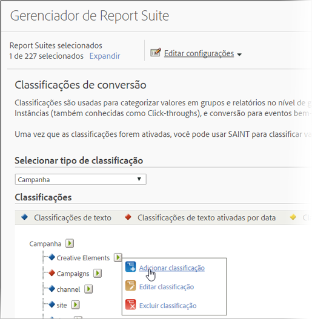

# Sobre as classificações

Classificação é uma forma de categorização de dados variáveis do Analytics, que exibe os dados de diferentes maneiras quando você gera os relatórios.

Visão geral em vídeo de [Classificações do Analytics](https://video.tv.adobe.com/v/16853/?captions=por_br).

**[!UICONTROL Admin]** > **[!UICONTROL Report Suites]** > **[!UICONTROL Edit Settings]** > *`<Traffic or Conversion>`*

Ao classificar, você está estabelecendo uma relação entre a variável e os metadados relacionados a ela. As classificações são usadas com mais frequência no campanha. Os dados coletados por meio de informações de variáveis (eVars, props e eventos) podem ser acumulados aplicando metadados aos valores coletados nas variáveis.

Depois de classificado, qualquer relatório que você puder gerar usando a variável-chave também poderá ser gerado usando os atributos associados. Por exemplo, você pode classificar [!UICONTROL Product IDs] com atributos de produto adicionais, como nome do produto, cor, tamanho, descrição e SKU. Aumentar os dados de relatórios e análises com atributos adicionais oferece oportunidades de relatórios mais profundas e complexas.

>[!IMPORTANT]
>
>A capacidade de importar classificações Numérico 2 e Ativadas por data foi removida da base de código. Essa alteração entrará em vigor com a versão de manutenção de junho de 2019. Se você tiver colunas Numéricas ou Ativadas por data no arquivo de importação, essas células serão ignoradas silenciosamente e todos os outros dados nesse arquivo serão importados normalmente. As classificações existentes ainda podem ser exportadas por meio do fluxo de trabalho de classificação padrão, e continuarão disponíveis nos relatórios.

>[!NOTE] Na Versão de manutenção do Analytics de 10 de maio de 2018, a Adobe começou a limitar a funcionalidade de classificações numéricas e habilitadas por data. Esses tipos de classificações foram removidos das interfaces Admin e Importador de classificações. Nenhuma nova classificação ativada por data e numérica pode ser adicionada. As classificações existentes ainda podem ser gerenciadas (atualizadas, excluídas) por meio do fluxo de trabalho de classificação padrão, e continuarão disponíveis nos relatórios.

Após criar as classificações, você pode aproveitar os novos atributos de dados em todo o Adobe Analytics.

**Exemplo de códigos de rastreamento**

Suponha que, em vez de exibir campanhas apenas pelo código de rastreamento, você queira ver os resultados da campanha pelo Mecanismo de pesquisa, Palavra-chave e Canal da Campanha. Em vez de dedicar variáveis de conversão para cada uma delas, você pode criar três classificações da variável de campanha para representar o Mecanismo de pesquisa, a Palavra-chave e o Canal de Campanha. Essa estratégia permite que você veja eventos bem-sucedidos do site por todas as quatro variáveis, sem marcação adicional.

O Relatórios e a análise incluem classificações predefinidas para a variável de código de rastreamento, que oferta relatórios baseados em classificação chamados Elementos Criativos e Campanhas. É necessário configurar manualmente as classificações para todas as outras variáveis de conversão e tráfego.

Consulte Classificações [de](/help/admin/admin/c-traffic-variables/traffic-classifications.md) tráfego e Classificações [de](https://marketing.adobe.com/resources/help/pt_BR/reference/conversion_classifications.html)conversão.

A tabela a seguir descreve os diferentes tipos de classificação disponíveis e os tipos de variáveis que os suportam. Revise as informações em  [Estrutura de arquivo geral](/help/components/c-classifications2/c-classifications-importer/c-saint-data-files.md) antes do upload dos arquivos de dados.

<table id="table_279728C28D9C40EE832ACC9F211B5F17"> 
 <thead> 
  <tr> 
   <th colname="col1" class="entry"> 
TIPO 
 </th> 
   <th colname="col2" class="entry"> 
DISPONIBILIDADE 
 </th> 
   <th colname="col3" class="entry"> 
DESCRIÇÃO 
 </th> 
  </tr> 
 </thead>
 <tbody> 
  <tr> 
   <td colname="col1"> 
  Texto 
 </td> 
   <td colname="col2"> 
Variáveis de conversão e tráfego 
 </td> 
   <td colname="col3"> 
As classificações de texto definem uma categoria que permite agrupar dados variáveis para fins de relatórios. 
 
Por exemplo, se você vende camisetas, talvez queira categorizar as vendas de camisetas (conversões) por cor, tamanho e estilo, de modo que você possa gerar relatórios que permitam ver as vendas de camisetas organizadas por essas categorias. 
 </td> 
  </tr> 
  <tr> 
   <td colname="col1"> 
  Texto ativado por data 
 
Observação: na Versão de manutenção do Analytics de 10 de maio de 2018, a Adobe começou a limitar a funcionalidade de classificações habilitadas por data. Esses tipos de classificações foram removidos das interfaces Admin e Importador de classificações. Nenhuma classificação habilitada por data pode ser adicionada. As classificações existentes ainda podem ser gerenciadas (atualizadas, excluídas) por meio do fluxo de trabalho de classificação padrão, e continuarão disponíveis nos relatórios. 
 </td> 
   <td colname="col2"> 
Variáveis de conversão 
 </td> 
   <td colname="col3"> 
Uma classificação de texto ativada por data permite atribuir intervalos de datas a uma classificação de texto. Isso é comumente utilizado em classificações de campanha, de modo que você pode aproveitar a exibição do gráfico de Gantt no relatório Campanhas. 
 
É possível incluir as datas da campanha atual no arquivo de dados que preenche os dados de classificação. 
 
O Reports &amp; Analytics coleta códigos de rastreamento da campanha mesmo se a data final da campanha já tiver passado, mas os dados da campanha coletados após sua data final não são associados à campanha. 
 </td> 
  </tr> 
  <tr> 
   <td colname="col1"> 
  Numérico 
Observação: na Versão de manutenção do Analytics de 10 de maio de 2018, a Adobe começou a limitar a funcionalidade de classificações numéricas. Esses tipos de classificações foram removidos das interfaces Admin e Importador de classificações. Nenhuma classificação numérica pode ser adicionada. As classificações existentes ainda podem ser gerenciadas (atualizadas, excluídas) por meio do fluxo de trabalho de classificação padrão, e continuarão disponíveis nos relatórios. 
 
 </td> 
   <td colname="col2"> 
Variáveis de conversão 
 </td> 
   <td colname="col3"> 
As classificações numéricas permitem que você aplique valores numéricos fixos para os relatórios de Conversão. Essas classificações aparecem como métricas nos relatórios. 
 
Ao estudar a possibilidade de adicionar uma classificação numérica, o valor numérico deve ser fixo e imutável ao longo do tempo. 
 </td> 
  </tr> 
 </tbody> 
</table>

