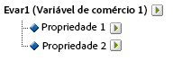
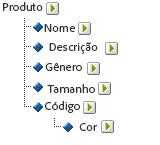

# Sobre as subclassificações

O Adobe Analytics suporta modelos de classificação de nível único e múltiplo. Uma hierarquia de classificação permite aplicar uma classificação a uma classificação.

> [!NOTE] Subclassificação é a capacidade de criar classificações das classificações. No entanto, não é o mesmo que [!UICONTROL Hierarquia de Classificação] usada para criar relatórios de [!UICONTROL Hierarquia]. Para obter mais informações sobre hierarquias de Classificação, consulte [Hierarquias de classificação](classification-hierarchies.md).

<!-- 

Removed sub-classifications in rule builder. Preserve subclass files in project for future reference. 

 -->

<!-- 

c_single-level_classifications.xml

 -->

Por exemplo:

Cada classificação neste modelo é independente e corresponde a um novo sub-relatório para a variável selecionada do relatório. Além disso, cada classificação constitui uma coluna de dados no arquivo de dados, com o nome de classificação igual ao cabeçalho da coluna. Por exemplo:

| CHAVE | PROPRIEDADE 1 | PROPRIEDADE 2 |
|---|---|---|
| 123 | ABC | A12B |
| 456 | DEF | C3D4 |

Para obter mais informações sobre o arquivo de dados, consulte [Arquivos de dados de classificação](/help/components/c-classifications2/c-classifications-importer/c-saint-data-files.md).

<!-- 

c_multiple-level_classifications.xml

 -->

As classificações de múltiplos níveis são compostas de classificações principais e secundárias. Por exemplo:

**Classificações principais:** uma classificação principal é qualquer classificação que tem uma classificação secundária associada. Uma classificação pode ser tanto principal como secundária. As classificações principais de nível superior correspondem às classificações de nível único (Consulte [Classificações de nível único](/help/components/c-classifications2/c-sub-classifications.md)).

**Classificações secundárias:** uma classificação secundária é qualquer classificação que tem outra classificação como principal em vez da variável. As classificações secundárias fornecem informações adicionais sobre sua classificação principal. Por exemplo, uma classificação [!UICONTROL Campanhas] pode ter uma classificação secundária Proprietário da campanha. Classificações [!UICONTROL numéricas] também funcionam como métricas nos relatórios de classificação.

Cada classificação, tanto principal como secundária, constitui uma coluna de dados no arquivo de dados. O cabeçalho de coluna para uma classificação secundária usa o seguinte formato de nomenclatura:

`<parent_name>^<child_name>`

Para obter mais informações sobre o formato do arquivo de dados, consulte [Arquivos de dados de classificação](/help/components/c-classifications2/c-classifications-importer/c-saint-data-files.md).

Por exemplo:

| CHAVE | PROPRIEDADE 1 | Propriedade 1&amp;Hat;Propriedade 1-1 | Propriedade 1&amp;Hat;Propriedade 1-2 | Propriedade 2 |
|---|---|---|---|---|
| 123 | ABC | Verde | Pequena | A12B |
| 456 | DEF | Vermelho | Grande | C3D4 |

Embora o modelo de arquivo para uma classificação de diversos níveis seja mais complexo, a vantagem desse tipo de classificação é que níveis separados podem ser carregados como arquivos separados. Essa abordagem pode ser usada para minimizar a quantidade de dados que precisa ser carregada periodicamente (diariamente, semanalmente, e assim por diante) agrupando os dados em níveis de classificação que mudam ao longo do tempo em contrate com aqueles que não mudam.

> [!NOTE] Se a coluna [!UICONTROL Chave] em um arquivo de dados estiver em branco, a Adobe automaticamente gera chaves exclusivas para cada linha de dados. Para evitar uma possível corrupção de arquivo ao fazer upload do arquivo de dados com dados de classificação de segundo nível ou maior, preencha cada linha da coluna [!UICONTROL Chave] com um asterisco (*).

Consulte [Problemas comuns no upload de classificação](https://marketing.adobe.com/resources/help/en_US/home/index.html#kb-common-saint-upload-issues) para obter ajuda com a resolução de problemas.

<!-- 

c_classifications_example.xml

 -->

>[!NOTE] Os dados de classificação do produto estão limitados aos atributos de dados diretamente relacionados ao produto. Os dados não se limitam a como os produtos são categorizados ou vendidos no site. Os elementos de dados como categoria de venda, nós do navegador do site ou itens de venda são dados de classificação de produto. Em vez disso, esses elementos são capturados nas variáveis de conversão do relatório.

Ao fazer upload dos arquivos de dados para essa classificação de produto, é possível fazer upload dos dados de classificação como um único arquivo ou como vários arquivos (veja abaixo). Separando o código de cor no arquivo 1 e o nome da cor no arquivo 2, os dados do nome da cor (que podem ter apenas algumas linhas) precisam ser atualizados somente quando os novos códigos de cor forem criados. Isso elimina o campo de nome da cor (CÓDIGO&amp;Hat;COR) do arquivo 1, que é atualizado com mais frequência, e reduz o tamanho e a complexidade do arquivo ao gerar o arquivo de dados.

## Classificação do produto - Arquivo simples {#section_E8C5E031869C449F9B636F5EB3BFEC17}

| CHAVE | NOME DO PRODUTO | DETALHES DO PRODUTO | GÊNERO | TAMANHO | CÓDIGO | CÓDIGO&amp;Hat;COR |
|---|---|---|---|---|---|---|
| 410390013 | Polo-MC | Camisa polo masculina, manga curta (M,01) | M | M | 01 | Pedra |
| 410390014 | Polo-MC | Camisa polo masculina, manga curta (G,03) | M | G | 03 | Urze |
| 410390015 | Polo-ML | Camisa polo feminina, manga longa (S,23) | F | S | 23 | Aqua |

## Classificação do produto - Vários arquivos (Arquivo 1) {#section_A99F7D0F145540069BA4EEC0597FF13F}

| CHAVE | NOME DO PRODUTO | DETALHES DO PRODUTO | GÊNERO | TAMANHO | CÓDIGO |
|---|---|---|---|---|---|
| 410390013 | Polo-MC | Camisa polo masculina, manga curta (M,01) | M | M | 01 |
| 410390014 | Polo-MC | Camisa polo masculina, manga curta (G,03) | M | G | 03 |
| 410390015 | Polo-ML | Camisa polo feminina, manga longa (S,23) | F | S | 23 |

## Classificação do produto - Vários arquivos (Arquivo 2) {#section_19ED95C33B174A9687E81714568D56A3}

| CHAVE | CÓDIGO | CÓDIGO&amp;Hat;COR |
|---|---|---|
| * | 01 | Pedra |
| * | 03 | Urze |
| * | 23 | Aqua |
