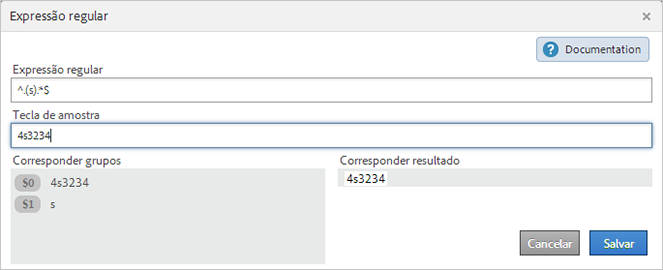
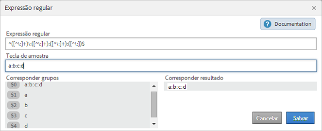
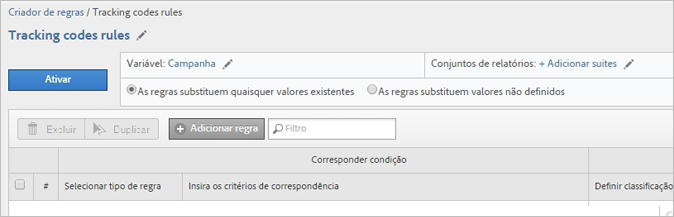
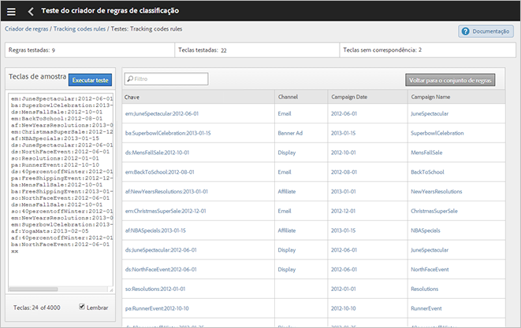

# Regras de classificação

As regras de classificação buscam regularmente termos não classificados. Se uma correspondência de regra for encontrada, as regras adicionarão os termos às tabelas de dados de classificação automaticamente. Você também pode usar regras de classificação para substituir chaves existentes.

**[!UICONTROL Analytics]** > **[!UICONTROL Admin]** > **[!UICONTROL Classification Rule Builder]**

O Construtor de regras permite criar um *`classification rule set`*, que é uma lista de *`classification rules`*. Uma regra corresponde aos critérios especificados por você e executa uma ação.

As regras de classificação são convenientes para:

* **Email** e **anúncios** de exibição: Crie regras de classificação para agrupar campanhas de anúncio de exibição individuais, de modo que você possa aprender como as campanhas de exibição estão se saindo em relação às campanhas de email.

* **Códigos** de rastreamento: Crie regras de classificação para categorizar os valores principais derivados de strings em códigos de rastreamento e corresponda-os a critérios específicos definidos por você.
* **Termos de pesquisa**: use  [expressões regulares](/help/components/c-classifications2/crb/classification-quickstart-rules.md) e curingas para simplificar a classificação de termos de pesquisa. Por exemplo, se um termo de pesquisa contém *`baseball`*, é possível definir uma classificação *`Sports League`* como *`MLB`*.

Por exemplo, digamos que um código de rastreamento de uma ID de campanha de email seja:

`em:Summer:2013:Sale`.

Você pode configurar três regras em um conjunto de regras que identifiquem as partes da sequência e classificar os valores:

| Selecionar tipo de regra | Inserir os critérios de correspondência | Definir a classificação | Para |
|---|---|---|---|
| Começa com | em: | Canal | Email  |
| Termina com | Venda | Tipo | Venda |
| Contém | 2013 | Ano | 2013 |

## Como as regras são processadas {#how-rules-are-processed}

Informações importantes sobre como as regras de classificação são processadas.

<!-- 

about_classification_rules.xml

 -->

* [Informações importantes sobre regras](/help/components/c-classifications2/crb/classification-rule-builder.md)
* [Quando as regras não classificam as teclas?](/help/components/c-classifications2/crb/classification-rule-builder.md)
* [Sobre a prioridade das regras](/help/components/c-classifications2/crb/classification-quickstart-rules.md)

>[!NOTE] O [!UICONTROL Rule Builder] não suporta classificações Numéricas 2.

## Informações importantes sobre regras

* Especifique permissões [de](https://marketing.adobe.com/resources/help/pt_BR/reference/groups.html) grupo para classificações em [!UICONTROL Admin Tools].

* **Expressões regulares**: a ajuda está disponível em [Expressões regulares nas regras de classificação](/help/components/c-classifications2/crb/classification-quickstart-rules.md).

* **Conjuntos** de relatórios: Não é possível escolher uma classificação até que pelo menos um conjunto de relatórios seja selecionado. Não é possível aplicar o conjunto de relatórios até que você tenha criado o conjunto de regras e atribuído uma variável.

   Ao testar o conjunto de regras, use as teclas (a variável que está sendo classificada) do relatório para ver como serão impactadas pelo conjunto de regras. (The [key](/help/components/c-classifications2/c-classifications-importer/c-saint-data-files.md) is the variable being classified, or the first column in the classification upload table.)

* **Prioridade** da regra: Se uma tecla corresponder a várias regras que definem a mesma classificação (na [!UICONTROL Set Classification] coluna), a última regra que corresponde à classificação será usada. Consulte [Sobre a prioridade das regras](/help/components/c-classifications2/crb/classification-quickstart-rules.md).

* **Limites do número de regras**: Não há limite definido para o número de regras que você pode criar. No entanto, um grande número de regras pode afetar o desempenho do navegador.
* **Processando**: As regras são processadas em intervalos frequentes, dependendo do volume de tráfego relacionado à classificação.

   As regras ativas processam a cada quatro horas, examinando os dados de classificação normalmente de um mês. As regras verificam automaticamente novos valores e carregam as classificações usando o importador.

* **Substituição de classificações existentes**: consulte [Quando as regras não classificam as teclas?](/help/components/c-classifications2/crb/classification-quickstart-rules.md) Se necessário, é possível excluir ou remover as classificações existentes usando o importador.

## Quando as regras não classificam as teclas?

Ao ativar regras, é possível substituir classificações existentes. Nas situações a seguir, uma regra de classificação não classifica uma  [chave](/help/components/c-classifications2/c-classifications-importer/c-saint-data-files.md) (variável) se:

* A tecla já estiver classificada e você não selecionar [Substituir classificações](/help/components/c-classifications2/crb/classification-rule-definitions.md).

   Você pode substituir classificações ao  [adicionar e ativar](/help/components/c-classifications2/crb/classification-quickstart-rules.md) uma regra, e quando ativar uma integração de Data Connectors. (Para conectores de dados, as regras são criadas por parceiros no Dev Center e exibidas no [!UICONTROL Classification Rule Builder].)

* Uma chave classificada não apareceu nos dados após um período especificado ao substituir uma chave, mesmo depois de ativar [Substituir classificações](/help/components/c-classifications2/crb/classification-rule-definitions.md).
* A chave não está classificada, e nunca deve ser passada para o [!DNL Adobe Analytics] após o período iniciado há cerca de um mês.

   >[!NOTE]
   >
   >Nos relatórios, as classificações se aplicam a todo período especificado, sempre que houve uma tecla. O intervalo de datas de um relatório não afeta o relatório.


## Expressões regulares em regras de classificação {#regex-in-classification-rules}

Use expressões regulares para corresponder valores de sequência formatados consistentemente com uma classificação. Por exemplo, é possível criar uma classificação a partir de caracteres específicos em um código de rastreamento. Você pode corresponder caracteres, palavras ou padrões de caracteres específicos.

<!-- 

regex_classification_rules.xml

 -->

* [Expressão regular - Rastreamento do exemplo de código](/help/components/c-classifications2/crb/classification-quickstart-rules.md#section_2EF7951398EB4C2F8E52CEFAB4032669)
* [Expressão regular - Classificação de um caractere específico ](/help/components/c-classifications2/crb/classification-quickstart-rules.md#section_5D300C03FA484BADACBFCA983E738ACF)
* [Expressões regulares - Correspondência de códigos de rastreamento de duração variável](/help/components/c-classifications2/crb/classification-quickstart-rules.md#section_E86F5BF5C2F44ABC8FFCE3EA67EE3BB2)
* [Expressões regulares - Exemplo &quot;Não contém&quot; ](/help/components/c-classifications2/crb/classification-quickstart-rules.md#section_FCA88A612A4E4B099458E3EF7B60B59C)
* [Expressões regulares - Tabela de referência](/help/components/c-classifications2/crb/classification-quickstart-rules.md#section_0211DCB1760042099CCD3ED7A665D716)

>[!NOTE] Como uma prática recomendada, as expressões regulares se encaixam melhor em códigos de rastreamento que usam delimitadores.

## Expressão regular - Rastreamento do exemplo de código {#section_2EF7951398EB4C2F8E52CEFAB4032669}

>[!NOTE] Se o código de rastreamento possuir codificação de URL, **ele não** será classificado pelo Construtor de regras.

Neste exemplo, suponha que você queira classificar a seguinte ID de campanha:

[!UICONTROL Sample Key]: `em:JuneSale:20130601`

As partes do código de rastreamento que deseja classificar são:

* `em` = email
* `JuneSale` = nome da campanha
* `20130601` = data

[!UICONTROL Regular Expression]: `^(.+)\:(.+)\:(.+)$`

Como a expressão regular se correlaciona à ID da campanha:


[!UICONTROL Match Groups]: Mostra como a expressão regular corresponde aos caracteres de ID da campanha, para que você possa classificar uma posição na ID da campanha.


Esse exemplo diz para a regra que a data da campanha `20140601` está no terceiro grupo `(.+)`, identificada por `$3`.

**[!UICONTROL Rule Builder]**

In the [!UICONTROL Rule Builder], configure the rule as follows:

| Selecionar tipo de regra | Inserir os critérios de correspondência | Definir a classificação | Para |
|---|---|---|---|
| Expressão regular | &amp;Hat;(.+)\:(.+)\:(.+)$ | Data da Campanha | $3 |

**Sintaxe**

| Expressão regular | Sequência ou resultado de correspondência | Grupos de Correspondência Correspondentes |
|--- |--- |--- |
| `^(.+)\:(.+)\:(.+)$` | em:JuneSale:20130601 | `$0`: em:JuneSale:20130601  `$1`: em  `$2`: JuneSale  `$3`: 20130601 |
| Construção da sintaxe | `^` = inicia a linha () = agrupa caracteres e permite extrair os caracteres correspondentes nos parênteses.  `(.+)` = captura um ( . ) caractere e ( + ) não mais  \ = início de uma string.  `$` = indica que o caractere anterior (ou grupo de caracteres) é o último na linha. |

Consulte [Expressões regulares - Tabela de referência](/help/components/c-classifications2/crb/classification-quickstart-rules.md#section_0211DCB1760042099CCD3ED7A665D716) para obter informações sobre o que significam caracteres em uma expressão regular.

## Expressão regular - Classificação de um caractere específico  {#section_5D300C03FA484BADACBFCA983E738ACF}

Uma maneira de usar uma expressão regular é classificar um caractere específico em uma sequência de caracteres. Por exemplo, suponha que o seguinte código de rastreamento contenha dois caracteres importantes:

[!UICONTROL Sample Key]: `4s3234`

* `4` = nome da marca
* `s` = identifica um mecanismo de pesquisa, como o Google



**[!UICONTROL Rule Builder]**

In the [!UICONTROL Rule Builder], configure the rule as follows:

| Selecionar tipo de regra | Inserir os critérios de correspondência | Definir a classificação | Para |
|--- |--- |--- |--- |
| Expressão regular | `^.(s).*$` | Marca e Mecanismo | `$0` (Captura os primeiros dois caracteres para o nome da marca e mecanismo de pesquisa.) |
| Expressão regular | `^.(s).*$` | Mecanismo de pesquisa | `$1` (Captura o segundo caractere para o Google.) |

## Expressões regulares - Correspondência de códigos de rastreamento de duração variável {#section_E86F5BF5C2F44ABC8FFCE3EA67EE3BB2}

Este exemplo mostra como identificar caracteres específicos entre delimitadores de dois pontos quando você tem códigos de rastreamento de comprimentos variáveis. A Adobe recomenda usar uma expressão comum para cada código de rastreamento.

Teclas de amostra:

* `a:b`
* `a:b:c`
* `a:b:c:d`

**Sintaxe**




**[!UICONTROL Rule Builder]**

In the [!UICONTROL Rule Builder], configure the rule as follows:

| Selecionar tipo de regra | Inserir os critérios de correspondência | Definir a classificação | Para |
|--- |--- |--- |--- |
| Expressão regular Para sequências de correspondência a:b | `^([^\:]+)\:([^\:]+)$` | a | `$1` |
| Expressão regular Para sequências de correspondência a:b | `^([^\:]+)\:([^\:]+)$` | b | `$2` |
| Expressão regular Para sequências de correspondência a:b:c | `^([^\:]+)\:([^\:]+)\:([^\:]+)$` | a | `$1` |
| Expressão regular Para sequências de correspondência a:b:c | `^([^\:]+)\:([^\:]+)\:([^\:]+)$` | b | `$2` |
| Expressão regular Para sequências de correspondência a:b:c | `^([^\:]+)\:([^\:]+)\:([^\:]+)$` | c | `$3` |
| Expressão regular Para sequências de correspondência a:b:c:d | `^([^\:]+)\:([^\:]+)\:([^\:]+)\:([^\:])$` | d | `$4` |

## Expressões regulares - Exemplo &quot;Não contém&quot; {#section_FCA88A612A4E4B099458E3EF7B60B59C}

Esse exemplo fornece uma expressão regular que corresponde a qualquer sequência que não contenha caracteres específicos, nesse caso `13`.

Expressão regular:

`^(?!.*13.*).*$`

Sequências de teste:

```
a:b:
a:b:1313
c:d:xoxo
c:d:yoyo
```

Resultados da correspondência:

```
a:b:
c:d:xoxo
c:d:yoyo
```

Neste resultado, `a:b:1313` não indica uma correspondência.

## Expressões regulares - Tabela de referência {#section_0211DCB1760042099CCD3ED7A665D716}

| Expressão | Descrição |
|---|---|
| `(?ms)` | Faz com que toda a expressão regular corresponda a uma entrada de várias linhas, permitindo que o . caractere curinga para corresponder a qualquer caractere de nova linha |
| (`?i`) | Toda a expressão regular deixa de distinguir letras maiúsculas de minúsculas |
| [`abc`] | Um caractere único de: a, b ou c |
| [`^abc`] | Qualquer caractere único exceto: a, b ou c |
| [`a-z`] | Qualquer caractere único no intervalo a-z |
| [`a-zA-Z`] | Qualquer caractere único no intervalo a-z ou A-Z |
| `^` | Início da linha (corresponde ao início da linha) |
| `$` | Corresponder ao final da linha (ou antes da nova linha no final) |
| `\A` | Início da sequência |
| `\z` | Final da sequência |
| `.` | Corresponder a qualquer caractere (exceto uma nova linha) |
| `\s` | Qualquer caractere invisível |
| `\S` | Sem caracteres diferentes de invisíveis |
| `\d` | Qualquer dígito |
| `\D` | Qualquer não dígito |
| `\w` | Qualquer caractere da palavra (letra, número, sublinhado) |
| `\W` | Qualquer caractere que não seja da palavra |
| `\b` | Qualquer limite da palavra |
| `(...)` | Capturar tudo delimitado |
| `(a|b)` | a ou b |
| `a?` | Zero ou um de a |
| `a*` | Zero ou mais de a |
| `a+` | Um ou mais de a |
| `a{3}` | Exatamente 3 de a |
| `a{3,}` | 3 ou mais de a |
| `a{3,6}` | Entre 3 e 6 de a |

Um bom recurso para testar a validade da expressão regular é https://rubular.com/.

## Sobre a prioridade das regras

Se uma tecla corresponder a várias regras e definir a mesma coluna de classificação mostrada na [!UICONTROL Set Classification] coluna, a última regra será usada. Dessa forma, você pode querer classificar o mais importante por último em seu conjunto de regras.

<!-- 

rule_priority.xml

 -->

Se você criar várias regras que não compartilham a mesma classificação, a ordem de processamento não importará.

O que segue um exemplo de regra de termo de pesquisa que classifica os tipos de pesquisa de um atleta:

| Número da regra | Tipo de regra | Correspondência | Definir a classificação | Para |
|---|---|---|---|---|
| 1 | Contém | Cowboys | Tipo de pesquisa | Equipe |
| 2 | Contém | Fantasia | Tipo de pesquisa | Fantasia |
| 3 | Contém | Romo | Tipo de pesquisa | Player |

Se um usuário pesquisa por  *`Cowboys fantasy Tony Romo`*, o termo *`Player`* é classificado, visto que corresponde à última classificação fornecida mostrada na coluna Definir classificação.

Da mesma forma, suponha que você configure duas regras em um conjunto para os seguintes termos de pesquisa:

| Número da regra | Tipo de regra | Correspondência | Definir a classificação | Para |
|---|---|---|---|---|
| 1 | Contém | Cowboys | Cidade | Dallas |
| 2 | Contém | Broncos | Cidade | Denver |

Um usuário pesquisa por  *`Cowboys vs. Broncos`*. Se o construtor de regras encontrar um conflito na correspondência da regra, a classificação da segunda regra (Denver) aplica-se a essa pesquisa.

## Adicionar uma regra de classificação a um conjunto de regras {#add-classification-to-rule-set}

<!-- 

t_classification_rule.xml

 -->

Etapas que descrevem como adicionar ou editar uma regra de classificação.

Adicione regras ao corresponder uma condição a uma classificação e especificar a ação.

>[!NOTE]
>
>Nesse procedimento, você deve aplicar as regras a um ou mais conjuntos de relatórios. O número recomendado de regras por conjunto de regras é entre 500 e 1000, no entanto não existe limite. Se houver mais de 100 regras, considere simplificar seu conjunto de regras usando  [subclassificações](/help/components/c-classifications2/c-sub-classifications.md).

1. [Criar um conjunto de regras de classificação](/help/components/c-classifications2/crb/classification-rule-set.md).
1. On the rule set page, click **[!UICONTROL Add Rule]**.

   

1. Next to **[!UICONTROL Report Suites]**, click **[!UICONTROL Add Suites]** to specify one or more report suites to assign to this rule set.

   A **[!UICONTROL Select Report Suites]** página é exibida.

   >[!NOTE]
   Os conjuntos de relatórios são exibidos nesta página *`only`*, quando as seguintes condições são atendidas:        >

   * Os conjuntos de relatórios têm pelo menos uma classificação definida para essa variável em [!UICONTROL Admin Tools].
   (See *`Variable`* in [Classification Rule Sets](/help/components/c-classifications2/crb/classification-rule-set.md) for an explanation about this prerequisite.)

   * You selected the report suite on the **[!UICONTROL Available Report Suites]** page, which displays after you click [Add Rule Set](/help/components/c-classifications2/crb/classification-rule-set.md) to create the rule set.


1. Especifique se deseja substituir os valores existentes:

   | **As regras substituem quaisquer valores existentes** | (Configuração padrão) Sempre sobrescreva as chaves de classificação existentes, incluindo classificações carregadas pelo importador (SAINT). |
   |---|---|
   | **As regras substituem valores não definidos** | Preencha apenas células em branco (não definidas). As classificações existentes não serão alteradas. |

1. [Defina a regra ou as regras](/help/components/c-classifications2/crb/classification-rule-definitions.md#section_4A5BF384EEEE4994B6DC888339833529). 

   

   Para obter exemplos de regras de criação, consulte [Construtor de regras de classificação](/help/components/c-classifications2/crb/classification-rule-builder.md) e [Expressões regulares nas regras de classificação](/help/components/c-classifications2/crb/classification-quickstart-rules.md).

   >[!NOTE]
   >
   >Se uma tecla corresponder a várias regras que definem a mesma classificação (na coluna Definir classificação), a última regra que corresponde à classificação será usada. Consulte **Sobre a prioridade de regras** acima para obter mais informações sobre como ordenar regras.

1. [Teste seu conjunto de regras](/help/components/c-classifications2/crb/classification-quickstart-rules.md).
1. After testing, click **[!UICONTROL Active]** to validate and activate the rule.

   Ativar uma regra constrói automaticamente o arquivo e o carrega para você.

   Definições de campo: consulte [Construtor de regras de classificação](/help/components/c-classifications2/crb/classification-rule-definitions.md) para obter informações sobre definições de opções de interface nessa página.

## Testar um conjunto de regras de classificação

<!-- 

t_classifications_test_rule.xml

 -->

Etapas que descrevem como testar uma regra de classificação ou um conjunto de regras. A execução de um teste verifica todas as regras em um conjunto.

1. [Criar um conjunto de regras de classificação](/help/components/c-classifications2/crb/classification-rule-set.md).
1. No [!UICONTROL Classification Rule Builder], clique no nome do conjunto de regras.
1. Assegure que o conjunto de regras esteja associado a um conjunto de relatórios.
1. On the rule editor, click **[!UICONTROL Test Rule Set]**.

   

1. Type or paste test keys in the [!UICONTROL Sample Keys] field.

   As chaves de amostra incluem:

   * Códigos de rastreamento
   * Palavras-chave ou frases de pesquisa
   See [Regular Expressions in Classification Rules](/help/components/c-classifications2/crb/classification-quickstart-rules.md) for information about testing regular expressions.
1. Clique em **[!UICONTROL Run Test]**.

   Rules that match are displayed in the [!UICONTROL Results] table.
1. (Optional) Click **[!UICONTROL Activate]** to activate the rule, and to overwrite existing classifications.

   Consulte para obter mais informações sobre como usar as regras para substituir as classificações existentes.

## Validar e ativar regras de classificação

<!-- 

t_validate_rules.xml

 -->

Etapas que descrevem como validar e ativar regras de classificação.

1. [Crie um Conjunto de regras de classificação](/help/components/c-classifications2/crb/classification-rule-set.md) e [adicione as regras de classificação](/help/components/c-classifications2/crb/classification-quickstart-rules.md) ao conjunto.
1. On the rule editor, click **[!UICONTROL Activate]**.

   

1. (Opcional) Para substituir classificações, ative **[!UICONTROL Overwrite classifications for]** *`<selection>`*.

   Essa opção permite que você substitua classificações existentes por teclas afetadas.

   Consulte Página [](/help/components/c-classifications2/crb/classification-rule-definitions.md#section_4A5BF384EEEE4994B6DC888339833529) Regras para obter uma definição dessa opção.
