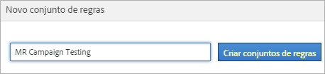
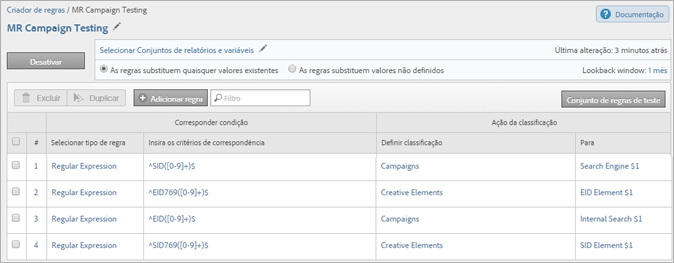

# Conjuntos de regras de classificação

Um conjunto de regras é um grupo de regras de classificação para uma variável específica. Você aplica uma variável ao conjunto de regras. Se deseja criar vários conjuntos de regras para uma variável, você deve aplicar cada conjunto de regras a vários conjuntos de relatórios.

## Conjuntos de regras de classificação

Um conjunto de regras é um grupo de regras de classificação para uma variável específica. Você aplica uma variável ao conjunto de regras. Se deseja criar vários conjuntos de regras para uma variável, você deve aplicar cada conjunto de regras a vários conjuntos de relatórios.

## Página do criador de regras de classificação {#section_C60B0888C76D49C596EF19F11808B718}

**[!UICONTROL Analytics]** &gt; **[!UICONTROL Administração]** &gt; **[!UICONTROL Construtor de regras de classificação]**

Os campos e opções a seguir encontram-se disponíveis no [!UICONTROL Construtor de regras de classificações].

<table id="table_A5D92409969747E39E041216A5AA32CD"> 
 <thead> 
  <tr> 
   <th colname="col1" class="entry"> Elemento </th> 
   <th colname="col2" class="entry"> Descrição </th> 
  </tr> 
 </thead>
 <tbody> 
  <tr> 
   <td colname="col1"> 
<a href="/help/components/c-classifications2/crb/classification-rule-set.md"  > Adicionar conjunto de regras</a> 
 </td> 
   <td colname="col2"> 
Cria um conjunto de regras. 
 </td> 
  </tr> 
  <tr> 
   <td colname="col1"> 
Regras 
 </td> 
   <td colname="col2"> Exibe o número de regras incluídas no conjunto. </td> 
  </tr> 
  <tr> 
   <td colname="col1"> 
Status 
 </td> 
   <td colname="col2"> Exibe o status da atividade do conjunto de regras, como Rascunho ou Ativo. As regras ativas processam diariamente, examinando os dados de classificação normalmente de um mês. As regras verificam automaticamente novos valores e carregam as classificações. </td> 
  </tr> 
  <tr> 
   <td colname="col1"> 
Última alteração 
 </td> 
   <td colname="col2"> Indica quando o conjunto de regras foi editado. </td> 
  </tr> 
  <tr> 
   <td colname="col1"> 
Duplicar 
 </td> 
   <td colname="col2"> Duplica (copia) um conjunto de regras, de modo que você possa aplicar o conjunto de regras a outra variável, ou à mesma variável em um conjunto de relatório diferente. </td> 
  </tr> 
 </tbody> 
</table>

## Criar um conjunto de regras de classificação {#create-classification-rule-set}

<!-- 

t_classification_rule_set.xml

 -->

Atribua um nome ao conjunto de regras de classificação, aplique a variável e defina as configurações de substituição.

1. (Pré-requisito) Defina a estrutura de classificação em **[!UICONTROL Administração]** &gt; **[!UICONTROL Conjuntos de relatórios]**.

   (Consulte [Classificações](https://marketing.adobe.com/resources/help/en_US/reference/classifications.html) na página de ajuda das Ferramentas administrativas para ver como adicionar classificações.)

   As variáveis serão exibidas no painel [!UICONTROL Novo conjunto de regras] somente após terem pelo menos uma classificação definida para aquelas variáveis.

   É possível criar classificações em uma variável em **[!UICONTROL Admin]** &gt; **[!UICONTROL Conjuntos de relatório]** &gt; **[!UICONTROL Tráfego]** &gt; **[!UICONTROL Classificações de tráfego]** (ou **[!UICONTROL Conversão]** &gt; **[!UICONTROL Classificações de conversão]**). Depois, selecione a variável e clique em **[!UICONTROL Adicionar classificação]**.

1. Para criar um conjunto de regras, clique em **[!UICONTROL Administração]** &gt; **[!UICONTROL Construtor de regras de classificação]** &gt; **[!UICONTROL Adicionar conjunto de regras]**.

   

1. Dê um nome ao conjunto de regras e clique em **[!UICONTROL Criar conjunto de regras]**.
1. Selecione o conjunto de regras a ser editado.

   

1. Clique em **[!UICONTROL Selecionar Conjuntos de relatórios e variáveis]**.

   A lista de conjunto de relatórios e variáveis é preenchida com todas as variáveis classificadas disponíveis em todos os conjuntos de relatórios em sua empresa de logon. Uma única variável em um conjunto de relatórios pode pertencer a somente um conjunto de regras.

   Consulte *`Variable`* nas definições da página [Construtor de regras de classificação](/help/components/c-classifications2/crb/classification-rule-definitions.md) para obter mais informações.
1. Especifique os conjuntos de relatórios e as variáveis disponíveis para uso e clique em **[!UICONTROL Salvar]**.
1. Contine ao [adicionar regras de classificação](/help/components/c-classifications2/crb/classification-rule-set.md) ao conjunto de regras. 
