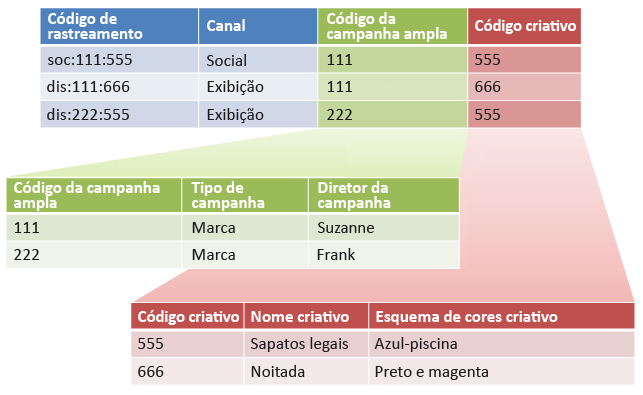

# Subclassificações e o Construtor de regras

É possível combinar o Construtor de regras de classificação com subclassificações se você garantir que cada subclassificação tenha um valor pai.

Combinar o Construtor de regras de classificação com subclassificações pode simplificar o gerenciamento de classificação e reduzir o número de regras necessárias. Isso pode ser feito se o código de rastreamento consistir em códigos que você gostaria de classificar separadamente.

Consulte [Subclassificação](/help/components/c-classifications2/c-sub-classifications.md) para informações conceituais sobre subclassificações.

## Exemplo

Considere o seguinte código de rastreamento:

`channel:broad_campaign:creative`

Uma hierarquia de classificação permite aplicar uma classificação a uma classificação (chamada de *`sub-classification`*). Ou seja, você pode usar o importador como um banco de dados relacional, com várias tabelas. Uma tabela mapeia códigos de rastreamento completos para chaves e outra mapeia essas chaves para outras tabelas.

Depois de colocar essa estrutura no lugar, é possível utilizar  [Construtor de regras de classificação](/help/components/c-classifications2/crb/classification-rule-builder.md) para carregar arquivos pequenos que atualizam apenas as tabelas de pesquisa (as tabelas verde e vermelha na imagem anterior). Em seguida, você pode usar o construtor de regras para manter a tabela de classificação principal atualizada.

A tarefa a seguir descreve como fazer isso.

## Configurar subclassificações usando o Construtor de relatórios {#task_2D9016D8B4E84DBDAF88555E5369546F}

Exemplo de etapas que descrevem como você pode fazer upload de subclassificações usando o Construtor de regras.

>[!NOTE]
>
>Essas etapas descrevem como realizar o caso de uso descrito em [Subclassificações e o construtor de regras](/help/components/c-classifications2/crb/sub-classification-rule-builder.md).

1. Criar classificações e subclassificação no [Gerenciador de classificações](https://marketing.adobe.com/resources/help/en_US/reference/classifications.html).

   Exemplo:

   

1. No [Construtor de regras de classificações](/help/components/c-classifications2/crb/classification-rule-builder.md), classifique a chave de subclassificação do código de rastreamento original. 

   Isso é realizado utilizando uma expressão regular. Nesse exemplo, a regra é preencher  *`Broad Campaign code`* usaria essa expressão regular:

   | `#` | Tipo de regra | Correspondência | Definir a classificação | Para |
   |---|---|---|---|---|
   |  | Expressão regular | `[^\:]:([^\:]):([^\:]`) | Código de campanha ampla | `$1` |
   |  | Expressão regular | `[^\:]:([^\:]):([^\:]`) | Código criativo | `$2` |

   >[!NOTE]
   >
   >Nesse ponto, você não preenche as subclassificações *`Campaign Type`* e *`Campaign Director`*.

1. Fazer upload de um arquivo de classificação que inclui somente as subclassificações especificadas.

   Consulte [Classificações de vários níveis](/help/components/c-classifications2/c-sub-classifications.md).

   Exemplo:

   | Chave | Canal | Código de campanha ampla | Código de campanha &amp;Hat;Tipo de campanha | Código de campanha &amp;Hat;Diretor de campanha | ... |
   |---|---|---|---|---|---|
   | * |  | 111 | Marca | Suzanne |  |
   | * |  | 222 | Marca | Frank |  |

1. Para manter as tabelas de pesquisa, carregue um pequeno arquivo (como mostrado acima).

   Esse arquivo é carregado quando, por exemplo, um novo *`Broad Campaign code`* é introduzido. Esse arquivo seria aplicado aos valores classificados anteriormente. Da mesma maneira, se você criar uma nova subclassificação (como  *`Creative Theme`* como uma subclassificação de *`Creative code`*), você faz upload somente do arquivo de subclassificação, em vez do arquivo de classificação inteiro.

   Para o relatórios, essas subclassificações funcionam exatamente como classificações de nível superior. Isso reduz a carga de gerenciamento necessária para usá-los.-->
