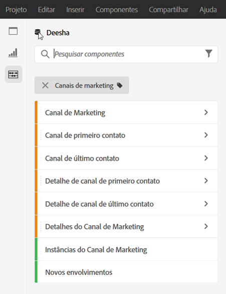
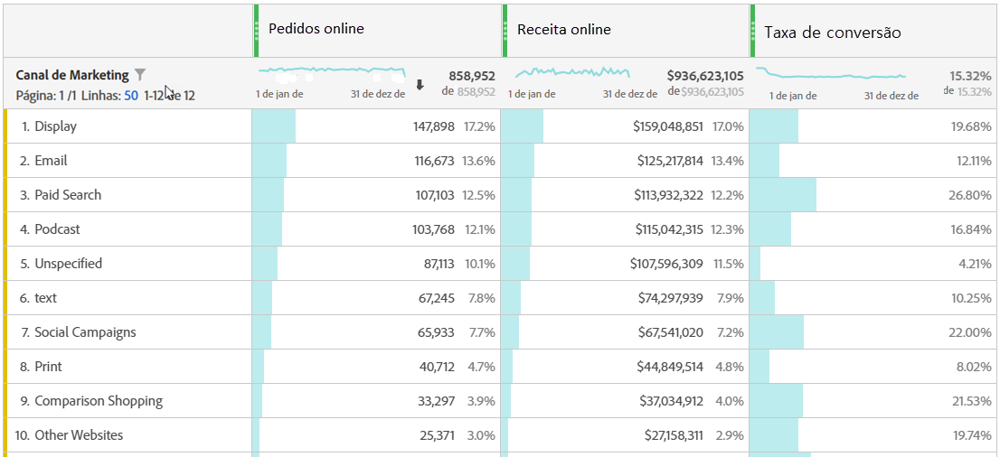
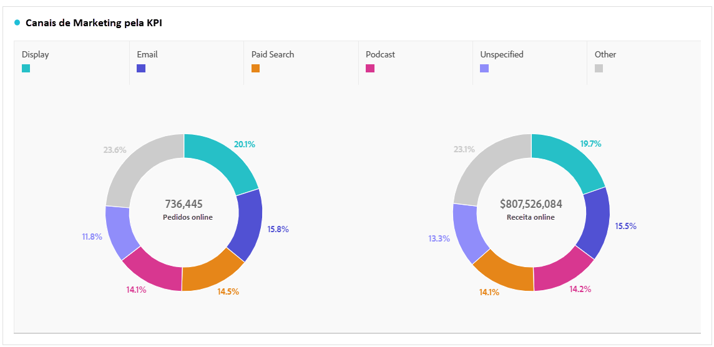
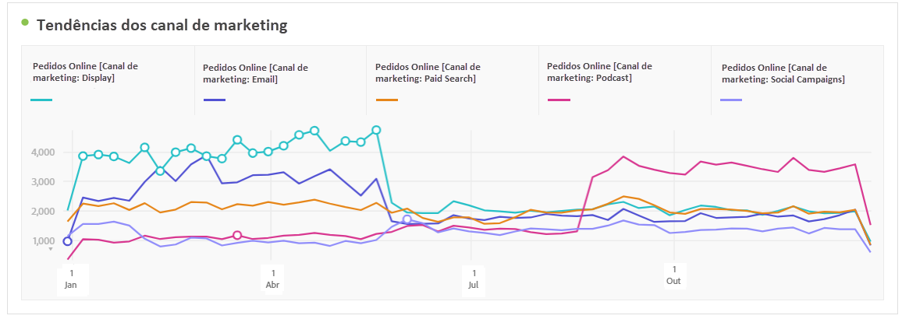
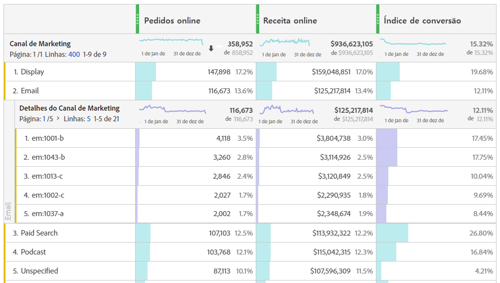
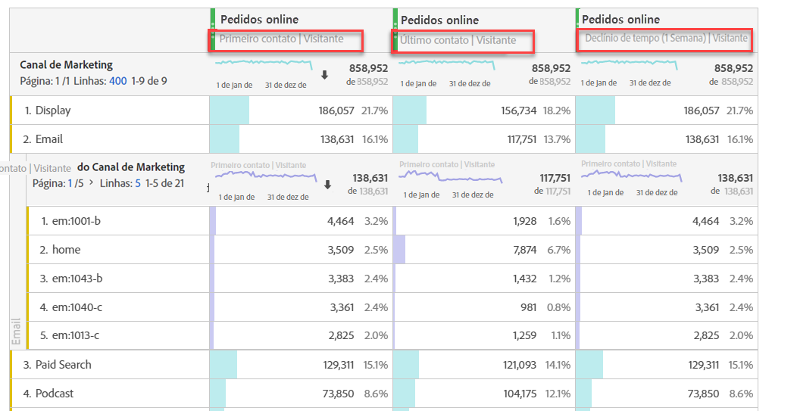
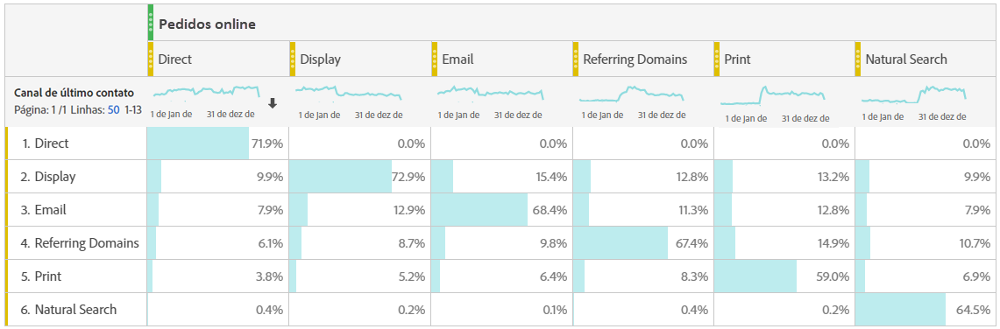

# Analisar canais de marketing

Você provavelmente quer saber qual dos seus canais de marketing é o mais eficaz, e com quem, para que você possa direcionar seus esforços e receber um melhor retorno sobre seus dólares de marketing. No Adobe Analytics, as dimensões e métricas dos Canais de marketing no Workspace são uma das ferramentas que podem ajudá-lo a rastrear a influência de diferentes canais em seus pedidos, receitas etc. e dar-lhe insights úteis do canal. Estas são as dimensões e métricas que você pode usar relacionadas aos Canais de marketing:

| Dimensão/métrica | Definição |
|---|---|
| Canal de Marketing | Esta é a dimensão Canais de marketing que recomendamos usar. Os modelos de IQ de atribuição podem ser aplicados a ele em tempo de execução. A dimensão Canais de marketing genéricos comporta-se de forma idêntica às dimensões do Canal de último toque, mas é rotulada de forma diferente para evitar confusão ao usá-la com um modelo de atribuição diferente. |
| Canal de Último Contato | Dimensão herdada, com modelo de atribuição pré-aplicado e inalterável. |
| Canal de Primeiro Contato | Dimensão herdada, com modelo de atribuição pré-aplicado e inalterável. |
| Instâncias do Canal de Marketing | Esta métrica... |
| Novos envolvimentos | Esta é uma métrica herdada que é aumentada somente quando um canal tem alocação de &#39;primeiro toque&#39; aplicada a ela. |

## Análise básica

Esta tabela de forma livre mostra as métricas Pedidos online, Receita online e Taxa de conversão para cada um dos Canais de marketing:

Aqui você vê os Pedidos online e a Receita online de cada Canal de marketing em um gráfico de rosca:

Este gráfico de Linha mostra as tendências em Pedidos Online para vários canais ao longo do tempo:

## Análise avançada

Os Detalhes dos canais de marketing aprofundam-se em cada canal para mostrar campanhas, disposições etc. específicas. Você pode dividir cada Canal de marketing em detalhes:

## Aplicar modelos de atribuição

Você pode usar o IQ [de](https://docs.adobe.com/content/help/en/analytics/analyze/analysis-workspace/panels/attribution/use-attribution.html) atribuição para aplicar modelos de atribuição diferentes instantaneamente:

Observe como a mesma métrica (Pedidos online) gera resultados diferentes quando você aplica modelos de atribuição diferentes.

Estes são alguns vídeos explicando o QI de atribuição com mais detalhes: Lista de reprodução [do IQ de](https://www.youtube.com/playlist?list=PL2tCx83mn7GuDzYEZ8jQlaScruZr3tBTR)atribuição.

## Análise de marketing entre guias

Usando o Canal de primeiro toque e o Canal de último toque herdados, você pode obter uma exibição útil das interações do canal:

Saiba mais sobre a análise de marketing entre guias [neste vídeo](https://www.youtube.com/watch?v=M3EOdONa-3E).