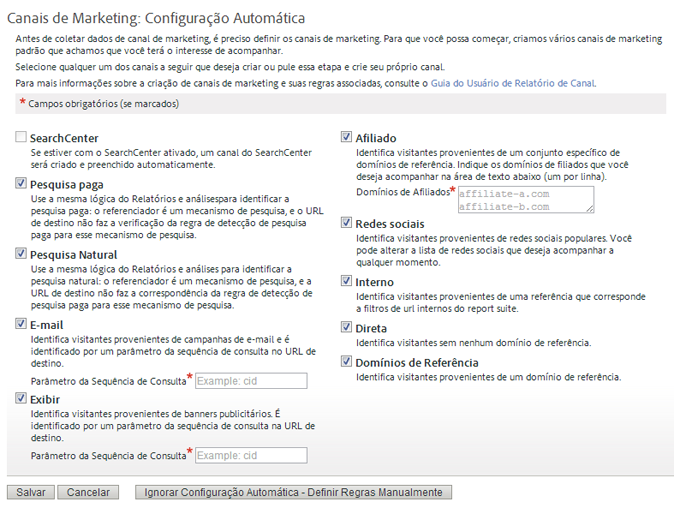

# Configuração automática

Execute a configuração única para o relatório de Canal de marketing.

## Automatic setup {#topic_E9ABE9E9E71B4E40A4E7EA9AD2C0372B}

Execute a configuração única para o relatório de Canal de marketing.

O Relatório de canal de marketing vem com uma página de configuração única para ajudá-lo a começar. Ele fornece diversos canais de marketing que podem ser utilizados para acompanhamento. É possível ignorar essa configuração inicial se você não encontrar problemas em criar canais e regras. No entanto, a Adobe recomenda que você permita que o assistente crie os canais para você. A configuração automática permite visualizar como as regras são construídas, ou editá-las conforme necessário. É possível desativar ou excluir canais predefinidos a qualquer momento.

## Executar a configuração automática para os Canais de marketing {#task_0F694146D48B4647BD7D5F060D394AB7}

Como executar a configuração automática para os Canais de marketing.

1. Click **[!UICONTROL Analytics]** &gt; **[!UICONTROL Admin]** &gt; **[!UICONTROL Report Suites]**.
1. No [!UICONTROL Gerenciador de conjunto de relatórios], selecione um conjunto de relatórios.
1. Click **[!UICONTROL Edit Settings]** &gt; **[!UICONTROL Marketing Channels]** &gt; **[!UICONTROL Marketing Channel Manager]**.

   

   >[!NOTE]
   >
   >The [!UICONTROL Marketing Channels: Auto Setup] page displays automatically when you access channel configuration applications in Admin Tools. (See [Marketing Channel Manager](../../components/c-marketing-channels/c-channels.md#topic_45CF1C6A783B4F96ABF6317EAB6A854F).) Essa página não será exibida se seu conjunto de ferramentas de relatório contiver um ou mais canais de marketing. Não é possível acessar essa página novamente a menos que seja selecionado outro conjunto de ferramentas de relatório que não contenha canais de marketing.

1. Certifique-se de que os canais que deseja criar estejam selecionados.

   When selected, **[!UICONTROL Email]**, **[!UICONTROL Display]**, and **[!UICONTROL Affiliate]** are required fields.

   See [Marketing Channel Manager](../../components/c-marketing-channels/c-channels.md#topic_45CF1C6A783B4F96ABF6317EAB6A854F).

1. Clique em **[!UICONTROL Salvar]**.
