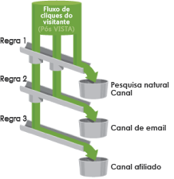

# Sobre canais e regras

Antes de ser possível exibir canais e dados de canal no relatório, é preciso criar os canais e as regras subjacentes que processam os dados. Você também pode criar valores de custo e orçamento para os canais associados no relatório, e especificar a duração desejada para o período de envolvimento do visitante. As tarefas de configuração do relatório são realizadas nas Ferramentas de administração.

Imagine um canal como um recipiente para as visitas. As regras atribuem as visitas ao recipiente apropriado.

A Adobe fornece diversos canais predefinidos durante uma [configuração automática](../../components/c-marketing-channels/c-channel-autosetup.md#topic_E9ABE9E9E71B4E40A4E7EA9AD2C0372B) que pode ser editada conforme seus requisitos.

>[!NOTE]
>
>A Adobe recomenda configurar seu relatório em um conjunto de relatórios que pode ser usado como modelo para fins de teste. É possível usar o modelo para aplicar globalmente as definições de canal e regras a um ou mais conjuntos de relatório de produção.
>
>Consulte [Aplicar configurações de conjuntos de relatório de modelo a múltiplos conjuntos de relatório](../../components/c-marketing-channels/t-template.md#task_0DE0A320EDA94FC5A6E5912868B6E2DC).

Leia os seguintes tópicos:

* [Pré-requisitos](../../components/c-marketing-channels/c-channels-rules.md#section_9913D2932E3140C099B7978CA95378B2)
* [Observações importantes de processamento](../../components/c-marketing-channels/c-channels-rules.md#section_DE372EEF02314F2395750CF2892DAAE1)

## Pré-requisitos {#section_9913D2932E3140C099B7978CA95378B2}

Se necessário, entre em contato com o Atendimento ao cliente para obter ajuda com esses pré-requisitos:

* In the Administration Console (General Account Settings), enable the **[!UICONTROL Conversion Level]** (e-commerce) option for the report suite.

   See [General Account Settings](https://marketing.adobe.com/resources/help/en_US/reference/general_acct_settings_admin.html) in Analytics help for more information.

* Configure o acesso do grupo de usuários ao **[!UICONTROL Relatório de Canal de marketing]**.

   See [Configure User Group Access](../../components/c-marketing-channels/t-user-groups.md#task_B156E7527FE94055A43A697338FE8C8C).

* Ensure that your account manager has enabled **[!UICONTROL Channel Reports]** for your report suite.

## Important processing notes {#section_DE372EEF02314F2395750CF2892DAAE1}

* O sistema processa as regras na ordem especificada e, quando uma regra é atendida, o sistema para de processar as regras restantes.
* As regras podem acessar variáveis definidas pelo VISTA, mas não podem acessar dados excluídos pelo VISTA.
* Os canais só armazenam métricas de conversão. As métricas de tráfego não estão disponíveis.
* Dois canais de marketing nunca recebem crédito pelo mesmo evento (como compras ou cliques). Dessa forma, os canais de marketing diferem das eVars (já que duas eVars podem receber crédito pelo mesmo evento).
* O relatório pode processar até 25 canais simultaneamente.

