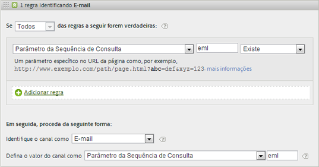
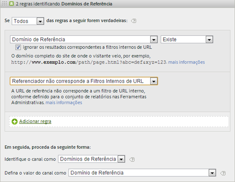
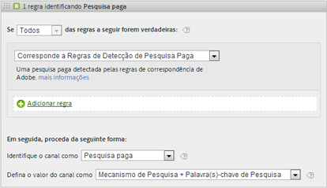
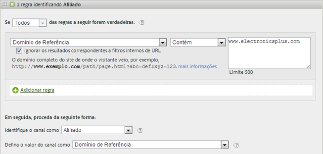
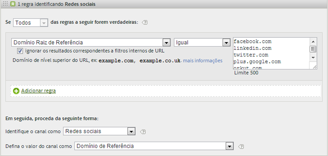
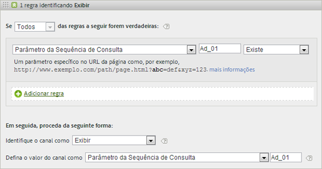
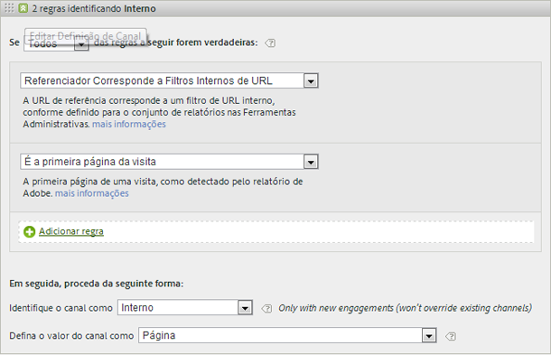
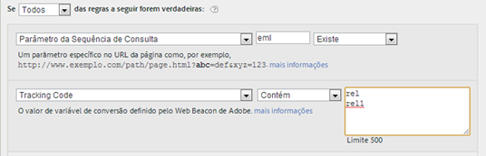
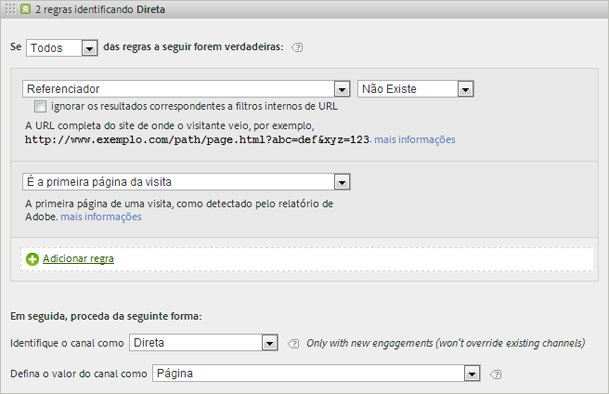

# Perguntas frequentes e exemplos

Leia sobre as práticas recomendadas e exemplos de como popular diversas regras que podem ser configuradas para seus canais de marketing.

* [Perguntas frequentes](../../components/c-marketing-channels/c-faq.md#section_E490CEAF0E76422C91D34D8A80A0C573)
* [Nenhum Canal Identificado](../../components/c-marketing-channels/c-faq.md#section_451E42994DA247A8A7B8559C715A5EE7)
* [Pesquisa paga](../../components/c-marketing-channels/c-faq.md#section_E934BFE182E4404A93FE07AFEAE64DC1)
* [Pesquisa natural](../../components/c-marketing-channels/c-faq.md#section_A4C6B8F0360449BE94F0128FF7C71386)
* [Afiliados](../../components/c-marketing-channels/c-faq.md#section_8D142C7074CD4DEC87DF55B691107622)
* [Redes sociais](../../components/c-marketing-channels/c-faq.md#section_492B72A3B261479D9C84F631E90C03D8)
* [Exibir](../../components/c-marketing-channels/c-faq.md#section_4FD846B89FCE4ECFB7781BD02874A1AB)
* [Interno](../../components/c-marketing-channels/c-faq.md#section_179A2BE5C8E24719A9E5C0DC09AF0947)
* [Email](../../components/c-marketing-channels/c-faq.md#section_4A927BE947B748E39595F4525B7280DE)
* [Direta](../../components/c-marketing-channels/c-faq.md#section_D0A1DD9D5EEF4A05A1CC81F9EADC074A)

Consulte [Criar Regras de Processamento de Canal de Marketing](../../components/c-marketing-channels/t-rules.md#task_84EDE9F46F404CB9B7CA0537328CEE08) para definições de campos exibidos na página [!UICONTROL Regras] de processamento de Canal de marketing.

## Perguntas frequentes {#section_E490CEAF0E76422C91D34D8A80A0C573}

Cada implementação das regras de canal de marketing pode ser diferente, dependendo dos códigos de acompanhamento. Configurar regras que forneçam os resultados que você procura pode exigir pensamento criativo para solucionar problemas.

**Pergunta:** Meus códigos de acompanhamento não seguem um padrão, e existem milhares deles a serem especificados para meu canal Afiliados.

* Use o processo de eliminação. Se os seus canais Email e Afiliados usam o mesmo parâmetro de sequência de consulta, mas você dispõe de apenas alguns códigos de acompanhamento de email, especifique os códigos de acompanhamento de email em um conjunto de regras que definam email. Em seguida, classifique todos os outros códigos de acompanhamento com *`affiliates.`*
* Em seu sistema de email, inclua um parâmetro da sequência de consulta para todos os URLs de página inicial, como *`&ch=eml`*. Crie um conjunto de regras que detecte se o parâmetro de consulta ch é igual a *`eml`*. If it does not contain *`eml`*, then it is an affiliate.

**Pergunta**: Os domínios de referência contêm mais dados que eu esperava.

* Os domínios de referência podem estar próximos demais do topo da lista de regras de processamento. Eles devem ser um dos últimos (ou os últimos) conjuntos de regras, porque a ordem de processamento é importante.

**Pergunta**: Criei uma regra que corresponde a um parâmetro de sequência de consulta e que não está funcionando.

* Certifique-se de que o nome do parâmetro esteja especificado nos campos de parâmetro da sequência de consulta (normalmente um valor alfanumérico). Além disso, certifique-se de que o valor de parâmetro está especificado após o operador, conforme mostrado no exemplo a seguir em uma regra de email.

   

**Pergunta**: Por que todo o meu tráfego de último toque é atribuído a um domínio interno?

*  Você possui uma regra que corresponde ao tráfego interno. Observe que essas regras processam todos os acessos de um visitante em seu site, não só a primeira visita. Se você tiver uma regra similar a *`Page URL exists`* sem outros critérios, o canal é correspondido em cada acesso sucessivo ao site, porque o URL da página sempre existe.

**Pergunta**: Como faço para depurar o tráfego exibido em Nenhum Canal Identificado no relatório?

*  As regras são processadas em ordem. Se não houver correspondência com critérios específicos, as ocorrências são incluídas em uma de três categorias:

1. Nenhum referenciador (visita direta).

2. Referenciador interno, na primeira página de visita.

3. Erro de processamento na página.

Verifique se você dispõe de canais para essas três possibilidades. Por exemplo, criar regras que indiquem:

1. **[!UICONTROL Referenciador]** e **[!UICONTROL Não Existe]** e **[!UICONTROL É a Primeira Página da Visita]**. (Consulte [Direto](../../components/c-marketing-channels/c-faq.md#section_D0A1DD9D5EEF4A05A1CC81F9EADC074A).)

2. **[!UICONTROL Referenciador Corresponde a Filtros Internos de URL]** e **[!UICONTROL É a Primeira Página da Visita]**. (Consulte [Interno](../../components/c-marketing-channels/c-faq.md#section_179A2BE5C8E24719A9E5C0DC09AF0947).)

3. **[!UICONTROL Referenciador]** e **[!UICONTROL Existe]** e **[!UICONTROL Referenciador Não Corresponde a Filtros Internos de URL]**.

Por último, crie um canal *Outro* para capturar as ocorrências restantes, conforme descrito em [Nenhum canal identificado](../../components/c-marketing-channels/c-faq.md#section_451E42994DA247A8A7B8559C715A5EE7).

## Nenhum Canal Identificado {#section_451E42994DA247A8A7B8559C715A5EE7}

Quando as regras não capturam dados ou se as regras não estão configuradas corretamente, o relatório exibe os dados na linha [!UICONTROL Nenhum Canal Identificado] do relatório. É possível criar um conjunto de regras chamado *Outros*, por exemplo, no fim da sua ordem de processamento, que também identifica o tráfego interno, como segue.

Esse tipo de regra é uma forma geral de garantir que o tráfego de canal sempre corresponda ao tráfego externo, e normalmente não acaba em **[!UICONTROL Nenhum canal identificado]**. Tenha cuidado para não criar uma regra que também identifique o tráfego interno. O modo mais comum e útil de criar uma regra Outro efetiva é configurar o valor do canal como **[!UICONTROL Domínio de Referência]** ou **URL de Página[!UICONTROL .]**

>[!NOTE]
>
>Ainda pode haver um pouco de tráfego de canal que pode cair na categoria Nenhum canal identificado. Por exemplo: um visitante entra no site, marca uma página e, na mesma visita, retorna à página por meio do marcador. Como não é a primeira página da visita, o tráfego não irá para o canal Direto nem para o canal Outro, pois não há um domínio de referência.

## Pesquisa paga {#section_E934BFE182E4404A93FE07AFEAE64DC1}

Uma pesquisa paga é uma palavra ou frase pela qual o mecanismo de pesquisa é pago a fim de colocá-la entre os resultados da pesquisa. Para corresponder às regras de detecção de pesquisa paga, o canal de marketing usa configurações definidas na página [!UICONTROL Detecção de pesquisa paga]. ( **[!UICONTROL Admin]** &gt; **[!UICONTROL Report Suites]** &gt; **[!UICONTROL Edit Settings]** &gt; **[!UICONTROL General]** &gt; **[!UICONTROL Paid Search Detection]**). O URL de destino corresponde à regra de detecção de pesquisa paga existente para o mecanismo de pesquisa.

Para a regra de canal de marketing, as configurações de [!UICONTROL Pesquisa Paga] são:

Consulte [Detecção de pesquisa paga](https://marketing.adobe.com/resources/help/en_US/reference/index.html?f=paid_search_detection) em Admin para obter mais informações.

## Pesquisa natural {#section_A4C6B8F0360449BE94F0128FF7C71386}

A pesquisa natural ocorre quando os visitantes encontram seu Web site por meio de uma pesquisa na Web, onde o mecanismo de pesquisa classifica seu site sem que você pague para entrar na listagem. É possível controlar o URL de destino usado pelo mecanismo de pesquisa para vincular a seu site. Esse URL permite que o Analytics identifique se uma pesquisa é natural.

Não existe detecção de pesquisa natural no Analytics. Após configurar a Detecção de pesquisa paga, o sistema saberá que se um referenciador de pesquisa não for do tipo pago, ele deve ser um referenciador de pesquisa natural. Para uma pesquisa natural, o URL de destino não corresponde à regra de detecção de pesquisa paga existente para esse mecanismo de pesquisa.

Para a regra de canal de marketing, as configurações de Pesquisa natural são as seguintes:

Consulte [Detecção de pesquisa paga](https://marketing.adobe.com/resources/help/en_US/reference/index.html?f=paid_search_detection) em Admin para obter mais informações.

## Afiliados {#section_8D142C7074CD4DEC87DF55B691107622}

Uma regra afiliada identifica os visitantes que se originam de determinado conjunto de domínios de referência. Na regra, você relaciona os domínios de afiliados que gostaria de acompanhar, como segue:

## Redes sociais {#section_492B72A3B261479D9C84F631E90C03D8}

Esta regra identifica os visitantes que se originam de uma rede social, como o Facebook*. As configurações podem ser as seguintes:

## Exibir {#section_4FD846B89FCE4ECFB7781BD02874A1AB}

Essa regra identifica visitantes que se originam de anúncios em banners. Ela é identificada por um parâmetro de sequência de consulta na URL de destino, neste caso *`Ad_01`*.

## Interno {#section_179A2BE5C8E24719A9E5C0DC09AF0947}

Esta regra identifica visitantes que se originam de um referenciador que corresponde aos filtros de URL interna do conjunto de relatório.

## Email {#section_4A927BE947B748E39595F4525B7280DE}

Para configurar esta regra, forneça o parâmetro de sequência de consulta para sua campanha de email. Neste exemplo, o parâmetro é *`eml`*:

Se sua regra contém Códigos de acompanhamento, insira um valor por linha, como mostrado aqui:

## Direta {#section_D0A1DD9D5EEF4A05A1CC81F9EADC074A}

Esta regra identifica visitantes que não têm domínio de referência. Essa regra inclui visitantes que vêm ao seu site diretamente, como a partir de um link dos Favoritos ou colando o link no navegador.

