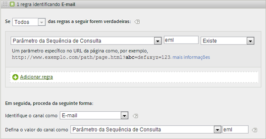
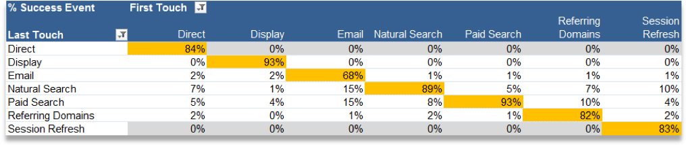
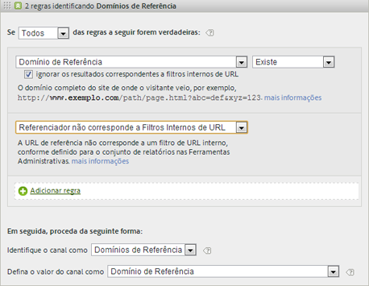

# Perguntas frequentes sobre canais de marketing

>[!NOTE]
>
>Para maximizar a eficácia dos canais de marketing para atribuição e análise da jornada do cliente, publicamos algumas [práticas recomendadas revisadas](/help/components/c-marketing-channels/mchannel-best-practices.md).
>
>Admins do Analytics podem gerenciar os canais de marketing de suas organizações, conforme descrito em [Gerenciar canais de marketing](/help/admin/tools/manage-rs/edit-settings/marketing-channels/c-channels.md).

Perguntas frequentes para canais de marketing.

## Meus códigos de acompanhamento não seguem um padrão, e existem milhares deles que devem especificados para meu canal Afiliados.

* Use o processo de eliminação. Se os canais de Email e Afiliados usarem o mesmo parâmetro de sequência de consulta, mas você tiver apenas alguns códigos de rastreamento de email, será possível especificar os códigos de rastreamento de email em um conjunto de regras que definem o email. Em seguida, classifique todos os outros códigos de acompanhamento com *`affiliates.`*
* Em seu sistema de email, inclua um parâmetro da sequência de consulta para todos os URLs de página de destino, como *`&ch=eml`*. Crie um conjunto de regras que detecte se o parâmetro de consulta ch é igual a *`eml`*. Se não contiver *`eml`*, será um afiliado.

## Os domínios referenciadores contêm mais dados que eu esperava.

Os domínios referenciadores podem estar muito altos na lista de regras de processamento. Ela deve ser um dos últimos (ou últimos) conjuntos de regras, pois a ordem de processamento é importante.

## Criei uma regra que corresponde a um parâmetro de sequência de consulta e que não está funcionando.

Verifique se o nome do parâmetro está especificado nos campos de parâmetro da string de consulta (normalmente um valor alfanumérico). Além disso, verifique se o valor do parâmetro é especificado após o operador, como mostrado no exemplo a seguir de uma regra de email.

## Por que todo o meu tráfego de último contato é atribuído a um domínio interno?

Você possui uma regra que corresponde ao tráfego interno. Observe que essas regras processam todos os acessos de um visitante em seu site, não só a primeira visita. Se você tiver uma regra como *`Page URL exists`* sem outros critérios, o canal é correspondido em cada ocorrência sucessiva do site, porque sempre há um URL de página presente.

## Como faço para depurar o tráfego exibido em Nenhum canal identificado no relatório?

As regras são processadas em ordem. Se nenhum critério específico tiver sido correspondido, as ocorrências se encaixarão em uma das três categorias:

1. Nenhum referenciador (visita direta).

2. Referenciador interno, na primeira página de visita.

3. Erro de processamento na página.

Certifique-se de ter um canal para essas três possibilidades. Por exemplo, crie regras que digam:

1. **[!UICONTROL Referenciador]** e **[!UICONTROL Não Existe]** e **[!UICONTROL É a Primeira Página da Visita]**. (Consulte [Direto.](/help/components/c-marketing-channels/c-faq.md))

2. **[!UICONTROL Referenciador Corresponde a Filtros Internos de URL]** e **[!UICONTROL É a Primeira Página da Visita]**. (Consulte [Interno](/help/components/c-marketing-channels/c-faq.md).)

3. **[!UICONTROL Referenciador]** e **[!UICONTROL Existe]** e **[!UICONTROL Referenciador Não Corresponde a Filtros Internos de URL]**.

Por último, crie um canal *Outro* para capturar as ocorrências restantes, conforme descrito em [Nenhum canal identificado](/help/components/c-marketing-channels/c-faq.md#no-channel-identified).

## Relação entre primeiro e último contato

Para entender a interação entre as dimensões de primeiro e último toque e confirmar que as substituições funcionam como esperado, você pode obter um relatório de canal de primeiro toque, sub-relacionado a um relatório de canal de último toque, com a métrica de sucesso principal adicionada (consulte o exemplo abaixo). O exemplo demonstra a interação entre canais de primeiro e último toque.

A intersecção onde primeiro é igual ao último toque é a diagonal da tabela. A Atualização direta e a Atualização de sessão recebem crédito de último toque somente se forem canais de primeiro toque, pois não podem receber crédito de outros canais persistentes (linhas destacadas).

## Motivos para Nenhum canal identificado {#no-channel-identified}

Quando as regras não capturam dados ou se as regras não estão configuradas corretamente, o relatório exibe os dados na linha [!UICONTROL Nenhum Canal Identificado] do relatório. Você pode criar um conjunto de regras chamado *Outros*, por exemplo, no final da ordem de processamento, que também identifica o tráfego interno.

Esse tipo de regra é uma forma geral de garantir que o tráfego de canal sempre corresponda ao tráfego externo, e normalmente não acaba em **[!UICONTROL Nenhum canal identificado]**. Tenha cuidado para não criar uma regra que também identifique o tráfego interno. O modo mais comum e útil de criar uma regra Outro efetiva é configurar o valor do canal como **[!UICONTROL Domínio de Referência]** ou **[!UICONTROL URL de Página]**.

>[!NOTE]
>
>Ainda pode haver algum tráfego de canal que caiba na categoria Nenhum canal identificado. Por exemplo: um visitante acessa o site e marca uma página e, na mesma visita, acessa a página por meio do marcador. Como essa não é a primeira página da visita, não será exibida no canal Direto nem no canal Outro porque não há um domínio de referência.

## Motivos para interno (Atualização da sessão) {#internal}

O último contato interno (atualização da sessão) só pode ocorrer se também tiver sido o primeiro contato. Consulte “Relacionamento entre o primeiro e o último contato” acima. Os cenários abaixo explicam como a Atualização de sessão pode ser um canal de primeiro contato.

* **Sessão expirada**: um visitante acessa o site e, em seguida, deixa a guia aberta no navegador para uso em uma data futura. O período de engajamento do visitante expira (ou ele exclui voluntariamente os cookies) e ele usa a guia aberta para visitar o site novamente. Como o URL de referência é um domínio interno, a visita será classificada como Atualização de sessão.

* **Nem todas as páginas do site são marcadas**: um visitante acessa a Página A, que não está marcada, em seguida se move para a página B, que está marcada. A página A seria vista como o referenciador interno e a visita seria classificada como Atualização de sessão.

* **Redirecionamentos**: se um redirecionamento não for configurado para transferir os dados do referenciador até a nova página de destino, os dados do referenciador de entrada real serão perdidos e agora a página de redirecionamento (provavelmente uma página interna) será exibida como o domínio de referência. A visita será classificada como Atualização de sessão.

* **Tráfego entre domínios**: um visitante se move de um domínio que é acionado para o Conjunto A, para um segundo domínio que é acionado para o Conjunto B. Se no Conjunto B, os filtros internos de URL incluírem o primeiro domínio, a visita no Conjunto B será registrada como Interna, já que os Canais de marketing a veem como uma nova visita no segundo conjunto. A visita será classificada como Atualização de sessão.

* **Longos tempos de carregamento da página de entrada**: um visitante acessa a página A, que tem bastante conteúdo, e o código do Adobe Analytics está localizado na parte inferior da página. Antes que todo o conteúdo (incluindo a solicitação de imagem do Adobe Analytics) possa ser carregado, o visitante clica na Página B. A Página B aciona sua solicitação de imagem do Adobe Analytics. Como a solicitação de imagem da Página A nunca foi carregada, a segunda página aparece como a primeira ocorrência da visita no Adobe Analytics, com a Página A como referenciador. A visita é classificada como Atualização de sessão.

* **Limpeza de cookies no meio do site**: um visitante acessa o site e, no meio da sessão, os cookies são apagados. Os canais Primeiro e Último contato seriam redefinidos e a visita seria classificada como Atualização da sessão (porque o referenciador seria interno).

A seguir, um exemplo de Interno (atualização de sessão) sendo definido como canal de primeiro e último contato:

* Dia 1: o usuário acessa o site em Exibir. Os canais de primeiro e último toque serão definidos como Exibir.
* Dia 2: o usuário acessa o site em Pesquisa natural. O primeiro toque permanece como Exibir e o Último toque é definido como Pesquisa natural.
* Dia 35: o usuário não visitou o site há 33 dias e retorna usando a guia que havia aberto em seu navegador. Presumindo uma janela de engajamento de 30 dias, a janela teria fechado e os cookies do Canal de marketing estariam expirados. O canal de primeiro e último toque será redefinido e definido como Atualização da sessão desde que o usuário tenha vindo de um URL interno.

## Por que alguns canais permanecem inalterados após a mudança das regras de processamento do canal de marketing?

Às vezes, as regras de processamento de canais de marketing são configuradas incorretamente, tornando necessário alterar as regras de processamento. Depois de aplicar as alterações, você pode ver algumas métricas ainda atribuindo dados a um canal incorreto. Há vários aspectos a serem considerados:

* **Os dados do Canal de marketing são coletados em tempo real**: os dados do canal de marketing são processados após a coleta de dados e são 100% permanentes. A alteração das regras de processamento não afeta os dados retroativamente.
* **A alteração das regras de processamento não afeta imediatamente os dados de primeiro contato**: Por exemplo:
   1. Um usuário entra por meio de seu canal de email porque ele foi configurado incorretamente e, em seguida, sai do site.
   2. No dia seguinte, você altera a regra de processamento de email para corrigi-la.
   3. Esse usuário volta vários dias depois por meio de uma pesquisa natural e faz uma compra.
   4. O canal de email recebe o crédito de Primeiro contato e a pesquisa natural recebe o crédito de Último contato.

  Mesmo vários dias depois de alterar as regras de processamento, os dados ainda poderão ser coletados no canal de primeiro contato incorreto. Os dados do primeiro contato são continuamente coletados no canal incorreto até que o engajamento do visitante do usuário expire.

A melhor maneira de corrigir essas discrepâncias é realizar uma ou ambas as ações a seguir:

* **Expirar manualmente todos os períodos de engajamento do visitante**: essa configuração expira instantaneamente todos os canais de primeiro e último contato em todos os visitantes:
   1. Acesse Ferramentas administrativas > Conjuntos de relatórios.
   2. Passe o mouse sobre Configurações de edição de imagem > Canais de marketing > Expiração de engajamento do visitante
   3. Clique em Expirar tudo.
   4. Clique em OK na janela pop-up de aviso, reconhecendo que você entende o que ela fará.

* **Visualizar apenas as métricas de último contato a partir do momento em que corrigiu suas regras**: as métricas de Último contato sempre seguem o conjunto de regras atual. A visualização do momento em que você alterou as regras de processamento reflete as regras de processamento mais atuais.
