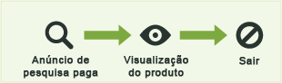
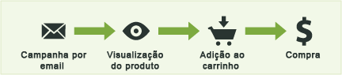
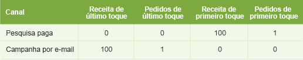
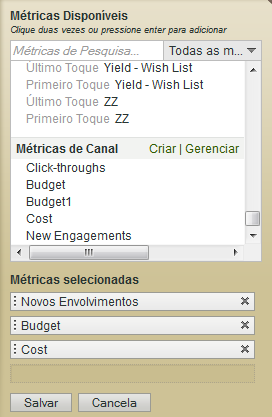

# Métricas usadas nos relatórios do Canal de marketing

Como usar métricas nos relatórios do Canal de marketing.

## Metrics used in Marketing Channel reports {#topic_F83F5D4C3E144967AD90D956F0E8A999}

Como usar métricas nos relatórios do Canal de marketing.

Adicione (ou edite) as métricas.

Adicionar uma coluna ao relatório.

## First and last-touch metrics {#concept_68D9A50204304BA58C1F8013451E7853}

O primeiro toque e o último toque são atributos de canal que permitem ver quantos novos envolvimentos (ou dados de métricas, como visualizações de produtos, receita e pedidos) resultam da atividade de um visitante no canal.

When a success event occurs, Analytics looks at the entire visitor's activity and history (back to the [visitor's engagement expiration](../../components/c-marketing-channels/visitor-engagement.md#topic_32ADFDB12D3A4F35843A4545AC97C49F)). Nota o primeiro canal pelo qual o usuário chegou, bem como o canal mais recente. Em seguida, dá o crédito do evento de sucesso a cada canal apropriado.

<!-- 

<note>
  A first-touch value has a rolling expiration based on the frequency of a visitor returning to the site. This first-touch expiration resets whenever a visitor returns to the site. This effects reporting by causing first-touch values to persist longer than you might expect. For example, this can occur if an instance of an first-touch channel was created a year ago. Remove the values on the eVar in the admin console to reset. 
</note>

 -->

**Exemplo**

Suponha que você tenha configurado até dois canais de marketing: Pesquisa paga e Campanha de email.

Pesquisa paga é um anúncio de um produto. Ele captura o interesse do visitante e gera uma visualização do produto, mas não resulta em um evento de conversão.

Um mês depois, você faz uma campanha por email para o mesmo produto. Ela resulta em uma compra de US$ 100,00 (ou outro evento de conversão desejado).

No Relatório de canal de marketing, o resultado pode ser exibido como segue:

O Canal de pesquisa paga recebe US$ 100,00 de crédito como canal de primeiro toque para receita, com 1 ordem de primeiro toque. O canal de Campanha por email recebe US$ 100,00 de crédito como canal de receita de último toque (o canal com que o usuário teve toque pela última vez antes do evento de conversão), e com 1 ordem de último toque. Em outras palavras, a finalidade principal do relatório é visualizar como a análise de receita entre canais de primeiro toque difere da análise de receita entre canais de último toque.

Toda instância de evento de sucesso terá exatamente um canal de Primeiro toque e exatamente um canal de Último toque. Isso significa que se você adicionar uma determinada coluna de métrica em algum evento de sucesso, ela sempre será exatamente igual ao total no mesmo período de tempo. Esse total também será exatamente igual ao número total de eventos no relatório adequado de [!UICONTROL Métricas do site] &gt; [!UICONTROL Eventos personalizados]. As métricas de evento de não sucesso, como visitas e visitantes, não corresponderão 1 a 1, visto que vários canais podem ser acionados na mesma visita.

>[!NOTE]
>
>Este relatório usa a versão de primeiro ou último toque de cada métrica. Portanto, os dados exibidos em um relatório de [!UICONTROL Canal de marketing] podem não corresponder aos dados exibidos em outros relatórios.

## Metric definitions {#section_364D003D34D748B79503DFA4DD208EDB}

| Métrica | Definição |
|--- |--- |
| Canal de primeiro toque | O primeiro canal de marketing que interagiu com um visitante. Tecnicamente, o canal de primeiro toque é uma evar com alocação original. |
| Visitante de primeiro toque | No relatório do canal, um visitante de primeiro toque é um Visitante único diário, originário de um canal. O envolvimento do visitante é armazenado pela duração do período de envolvimento com o site, que pode se estender por diversas visitas. |
| Canal de último toque | O canal de conversão, ou seja, o último canal de marketing que interagiu com o visitante e resultou em uma conversão. Apenas um canal é definido como canal de primeiro toque. O canal de último toque pode mudar com cada visita de retorno ao site. Cada visita tem um canal de primeiro e último toque, mas o valor do canal de primeiro toque nunca muda com visitas subsequentes. |

## Click-through {#reference_55E2254F02EF4E7EB0AD2838C948347A}

Um click-through é uma instância do canal de último toque. É uma eVar com a alocação mais recente.

Por exemplo, suponha que um usuário visite o seu site da Web uma vez por dia, e que cada visita tenha origem em um diferente canal de marketing:

* Dia 1: Pesquisa paga
* Dia 2: Exibição
* Dia 3: Pesquisa natural
* Dia 4: Exibição
* Dia 5: Pesquisa paga
* Dia 6: Exibição
* Dia 7: Pesquisa natural

O relatório de Canal de primeiro toque deve exibir um novo envolvimento para uma Pesquisa paga. Todos os outros canais devem exibir 0 novos envolvimentos. O relatório de Canal de último toque deve exibir 2 click-throughs para Pesquisas pagas, 3 para Exibição e 2 para Pesquisa natural.

## Adicionar métricas a um relatório de Canal de marketing {#task_D381139E00504666AB2402D553CFEA5B}

Adicione métricas um relatório de Canal de marketing. É possível adicionar até quatro métricas a cada coluna do relatório, e quantas colunas você quiser.

1. Abra o [!UICONTROL Relatório de canal de marketing].
1. Clique em Adicionar Métricas.

   

1. Em [!UICONTROL Métricas disponíveis], arraste e solte as métricas da seção [!UICONTROL Métricas disponíveis] para a seção [!UICONTROL Métricas selecionadas.]

   

1. Para criar métricas calculadas, procure por [!UICONTROL Métricas calculadas]**e clique em[!UICONTROL Criar]**.
1. Clique em **[!UICONTROL Salvar.]**
