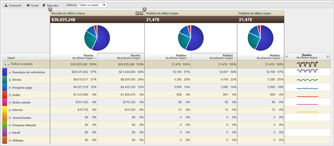

# Sobre os Relatórios de Canal de marketing

Os relatórios de Canal de marketing permitem que você visualize a receita gerada pelos seus canais de marketing. Esses relatórios fornecem um relatório de visão geral e alocação de canal de última hora, com métricas padrão do como, por exemplo, receita, pedidos e custo.

As regras de definição de canal são configuradas em Ferramentas de administração. As APIs específicas para os relatórios de canal encontram-se disponíveis. Nenhuma mudança de implementação externa é necessária para executar o relatório de [!UICONTROL Canal de marketing].

* [Relatório de exemplo](/help/components/c-marketing-channels/c-overview.md)
* [Relatórios disponíveis](/help/components/c-marketing-channels/c-overview.md)

## Relatório de exemplo {#example-rpt}

Os dados de canal são suportados em painéis, APIs, Construtor de relatórios (no Excel), Análise ad hoc, Data Warehouse e Extração de dados.

Adicione (ou edite) as métricas.

Adicionar uma coluna ao relatório.

## Relatórios disponíveis {#available-rpts}

Os seguintes relatórios do [!UICONTROL Canal de marketing] estão disponíveis na Experience Cloud.

| Relatório | Descrição |
|--- |--- |
| Visão geral do canal  | O relatório de visão geral é um resumo que exibe gráficos de pizza e gráficos que mostram as tendências ao longo do período de tempo selecionado. É possível adicionar as métricas do primeiro e último toque ou criar métricas calculadas para esse relatório. Também é possível entrar no canal de primeiro e último toque e nos relatórios de detalhes a partir da tabela visão geral. Outros relatórios de Canal de marketing fornecem maneiras de fazer uma análise mais profunda dos dados resumidos nesse relatório.  Ao expandir um canal em um relatório, você pode visualizar o relatório da análise dos valores do canal. Os valores do canal são valores não classificados no detalhe do canal. |
| Canal de primeiro ou último contato | Exibe as métricas mostrando dados sobre um canal de primeiro ou último toque específico. Nesses relatórios, é possível decompor canais e mostrar os detalhes de cada um. |
| Detalhe do canal de primeiro ou último contato | Exibe detalhes como nomes de página e referenciadores, que são obtidos dos valores de canal que você configurou na opção Definir o valor do canal para ao configurar regras. Os Relatórios de detalhes do canal permitem examinar detalhadamente os valores de detalhes do relatório de visão geral. |
