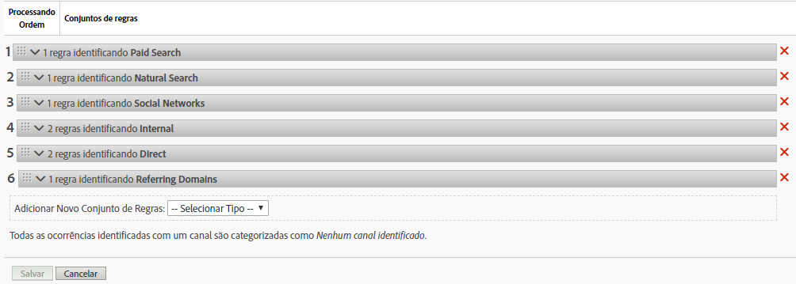
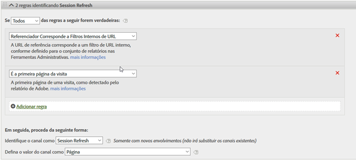
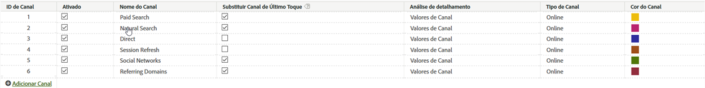

# Regras de processamento para Canais de marketing

As regras de processamento de Canais de marketing determinam se uma ocorrência de visitante atende aos critérios atribuídos a um canal. As regras processam cada acesso que um visitante faz ao seu site. Quando uma regra não atende aos critérios de um canal, ou se as regras não estiverem configuradas corretamente, o sistema atribui a ocorrência a Nenhum Canal identificado.

Estas são orientações importantes para a criação de regras:

* Classifique as regras na ordem em que deseja que sejam processadas.
* Ao fim da lista, inclua uma regra para capturar tudo como, por exemplo, Outros. Essa regra identifica o tráfego externo, mas não o tráfego interno.

   Consulte [Nenhum Canal Identificado.](/help/components/c-marketing-channels/c-faq.md)

>[!NOTE] Embora essas regras não afetem o relatório fora dos canais de marketing, afetam a coleção de dados do canal de marketing. Os dados coletados com essas regras são 100% permanentes e as regras alteradas após a coleta dos dados não são retroativas. É altamente recomendável revisar e considerar todas as circunstâncias antes de salvar [!UICONTROL Marketing Channel Processing Rules] para minimizar a coleta de dados em canais incorretos.

## Pré-requisitos

* Revise as informações conceituais em [Introdução aos Canais](/help/components/c-marketing-channels/c-getting-started-mchannel.md)de marketing.
* Crie um ou mais canais para poder atribuir regras a eles. Consulte [Adicionar canais de marketing.](/help/components/c-marketing-channels/c-channels.md)

## Criar regras de processamento de Canal de marketing

Crie regras de processamento do Canal de marketing. Elas determinam se uma ocorrência de visitante atende aos critérios atribuídos a um canal.

Este procedimento usa uma regra de email como exemplo. O exemplo supõe que você tenha adicionado um canal de email à sua lista de canais na página do Gerenciador de Canais de marketing.

1. Clique em **[!UICONTROL Analytics]** > **[!UICONTROL Admin]** > **[!UICONTROL Report Suites]**.
1. Selecione um conjunto de relatórios.

   If your report suite does not have channels defined, the [!UICONTROL Marketing Channels: Auto Setup] page displays.

   See [Run the Automatic Setup](/help/components/c-marketing-channels/c-getting-started-mchannel.md).

1. Clique em **[!UICONTROL Edit Settings]** > **[!UICONTROL Marketing Channels]** > **[!UICONTROL Marketing Channel Processing Rules]**.

   

1. No **[!UICONTROL Add New Rule Set]** menu, selecione **[!UICONTROL Email]**.

   Ao fazer isso, você não está selecionando o canal, mas um modelo que preenche a regra com alguns dos parâmetros necessários.

   

   Use lógica booleana (instruções if/then) para configurar uma regra. Por exemplo, em uma regra de canal de email, forneça as configurações ou informações enfatizadas na seguinte declaração de regra:

   `"If **[!UICONTROL All]** or **[!UICONTROL Any]** of the following are true:  **[!UICONTROL Query String Parameter]** *<value>* **[!UICONTROL exists]**...`

   `"Then identify the channel as **[!UICONTROL Email]**...`

   `"Then set the channel's value to **[!UICONTROL Query String Parameter]** *<value>*."`

   Nesse exemplo, *`<value>`* é o parâmetro de sequência de caracteres de consulta utilizado para a campanha de email como, por exemplo, *`eml`*.
1. Para continuar criando regras, clique em **[!UICONTROL Add Rule]**.
1. Para criar prioridades de regras, arraste-as e solte-as na posição desejada.
1. Clique em **[!UICONTROL Save.]**

>[!MORELIKETHIS]
>
>* [Perguntas mais frequentes e exemplos](/help/components/c-marketing-channels/c-faq.md)

## Critérios da regra do Canal de marketing

Essa tabela de referência define os campos, opções e atributos de acesso que você pode selecionar na página de Regras de processamento de canal de marketing.

| Termo | Definição |
|--- |--- |
| Tudo | Ativa esse canal somente quando todas as regras na regra numerada são verdadeiras. |
| Qualquer | Ativa esse canal quando qualquer regra no conjunto de regras é verdadeira. Essa opção está disponível somente se houver mais de uma regra na regra numerada. |
| ID do AMO | O código de rastreamento primário usado pelas integrações da Advertising Cloud e do Advertising Analytics. Quando uma dessas integrações estiver ativada, o prefixo do código de rastreamento poderá ser usado para identificar canais específicos da Advertising Cloud. Usar &quot;ID do AMO&quot; começa com &quot;AL&quot; para Pesquisa, &quot;AC&quot; para Exibição ou &quot;AO&quot; para Social. Quando a ID do AMO é usada em canais de marketing, as métricas de clique/custo/impressão podem ser atribuídas ao canal correto (quando não estiver configurado, essas métricas irão para Direto ou Nenhum). |
| ID do AMO ED | O código de rastreamento secundário usado pela Advertising Cloud. O objetivo principal desse código de rastreamento é atuar como a chave para enviar dados de volta para a Ad Cloud. No entanto, ele também pode ser usado para identificar ClickThroughs de exibição vs. ViewThroughs de exibição, se você desejar vê-los como dois canais de marketing separados. Isso pode ser feito definindo a lógica do canal de marketing para &quot;AMO EF ID&quot; termina com &quot;:d&quot; para ClickThroughs de exibição ou &quot;AMO EF ID&quot; termina com &quot;:i&quot; para ViewThroughs de exibição. Se você não desejar dividir a Exibição em dois canais, use a dimensão da ID do AMO. |
| Variáveis de conversão | Consiste de eVars ativadas para este conjunto de relatórios e se aplica somente quando essas variáveis são definidas por meio do código da Adobe na página.  Consulte o Guia de implementação . |
| Existe | Várias seleções estão disponíveis, incluindo:<ul><li>**Não existe**: especifica que o atributo da ocorrência não existe no pedido. Por exemplo, em um domínio de referência, se o usuário digitar um URL ou clicar em um marcador, o atributo de domínio de referência não existe.</li><li>**Está vazio**: especifica que existe um atributo de ocorrência, geralmente um eVar ou parâmetro de sequência de consulta, mas não há valor associado ao atributo de ocorrência.</li><li>**Não contém**: Permite especificar, por exemplo, que um domínio de referência não contém um valor específico (em vez de usar a seleção &quot;Contém&quot;).</li></ul> |
| Identificar o canal como | Associa a regra a um canal de marketing adicionado à página Gerenciador de canal de marketing.  Consulte Adicionar canais de marketing . |
| Corresponde a Regras de Detecção de Pesquisa Paga | Uma pesquisa paga detectada pela Adobe. Pesquisas pagas são quando as empresas pagam uma taxa para que o mecanismo de pesquisa relacione seus sites. As pesquisas pagas normalmente aparecem na parte superior ou na lateral direita dos resultados da pesquisa. |
| Corresponde a Regras de Detecção de Pesquisa Natural | Uma pesquisa não paga detectada pelo relatórios da Adobe. |
| Referenciador Corresponde a Filtros Internos de URL | Uma visita cujo URL da página corresponde a um filtro de URL interno, conforme definido para o conjunto de relatórios nas Ferramentas administrativas. |
| Referenciador não corresponde a Filtros Internos de URL | O URL de referência não corresponde a um filtro de URL interno, conforme definido para o conjunto de relatórios nas Ferramentas administrativas. Você pode utilizar essas configurações com   A  URL da página  e  existe  para configurar uma regra &quot;pega tudo&quot;, de forma que nenhuma visita chegue até a seção Nenhum canal identificado do relatório. |
| Ignorar ocorrências correspondentes a filtros de URL internos | (Para quem indicou) Rastreia somente ocorrências provenientes de sites com referência externa. Geralmente, deixe essa configuração ativada, a menos que deseje incluir tráfego interno. |
| É a primeira página da visita | A primeira página de uma visita detectada pelo relatórios da Adobe. |
| Página | O nome de uma página da Web no seu site que foi marcada usando o Web beacon. Este valor é equivalente a  s.pageName . Os exemplos incluem `Home Page` e `About Us`. |
| Domínio de página | O domínio da página onde o visitante chega, como `products.example.co.uk`. |
| Domínio e caminho da página | The domain and path, such as `products.example.co.uk/mens/pants/overview.html` . |
| Domínio raiz da página (TLD+1) | O domínio raiz da página onde o visitante chega como, por exemplo, example.co.uk . |
| URL da página | O URL de uma página da Web em seu site. |
| Domínio de referência | O domínio de onde seus visitantes vieram antes visitarem seu site, por exemplo, referenciadores vindos de `abcsite.com` x `xyzsite.com`. |
| Parâmetro da sequência de caracteres de consulta | If a page URL on your site looks like `https://example.com/?page=12345&cat=1`, then page and cat are both query string parameters. (Consulte `https://en.wikipedia.org/wiki/Query_string`.)  É possível especificar apenas um parâmetro da sequência de consulta por conjunto de regras. To add additional query string parameters, use `ANY` as your operator, then add new query string parameters to the rule. |
| Referenciador | O local da página da Web (URL completo) em que seus visitantes estavam antes de chegar ao site. Existe uma quem indicou fora do seu domínio definido. |
| Domínio e caminho de referência | A concatenação de domínio de referência e caminho de URL. Os exemplos incluem:    `www.example.com/products/id/12345` ou `ad.example.com/foo` |
| Parâmetro de Referência | Um parâmetro da sequência de consulta no URL do referenciador. Por exemplo, se seus visitantes vêm de `example.com/?page=12345&cat=1`, page e cat são os parâmetros de referência. |
| Domínio Raiz de Referência | O domínio raiz do referenciador. Existe uma quem indicou fora do seu domínio definido. |
| Mecanismo de pesquisa | Um mecanismo de pesquisa como Google ou Yahoo! que trouxe visitantes ao seu site. |
| Palavras-chave de pesquisa | Uma palavra usada para realizar uma pesquisa usando um mecanismo de pesquisa. |
| Mecanismo de pesquisa + Palavras-chave | Uma concatenação de palavra-chave de pesquisa e mecanismo de pesquisa para identificar de forma exclusiva o mecanismo de pesquisa. Por exemplo, se você pesquisar a palavra computador, o mecanismo de pesquisa e a palavra-chave serão identificados da seguinte maneira: `Search Tracking Code = "<search_type>:<search engine>:<search keyword>" where    search_type = "n" or "p", search_engine = "Google", and search_keyword = "computer"`**Observação:**n = natural; p = pago |
| Defina o valor do canal como | Além de saber qual canal de marketing traz um visitante ao seu site, talvez você também queira saber que anúncio de banner, palavra-chave de pesquisa ou campanha por email dentro do canal está obtendo crédito pela atividade de um visitante do site. Esse ID é um valor de canal armazenado juntamente com o canal. Geralmente, esse valor é uma ID de campanha incorporada à landing page ou ao URL de referência; em outros casos, é a combinação de mecanismos de pesquisa e palavras-chave de pesquisa, ou o URL de referência que identifica mais corretamente o visitante de um canal específico. |

## Canal interno (atualização de sessão)

O Canal interno (geralmente renomeado como Atualização de sessão) consiste em visitas ao site em que o URL de referência corresponde à configuração de Filtros internos de URL no Admin Console, o que significa que o visitante veio do site para iniciar sua visita.

### Substituir práticas recomendadas

É uma prática recomendada desmarcar a opção de substituição de último toque de canais Diretos e Internos, para que eles não possam receber crédito de outros canais de último toque persistentes (ou entre si).

>[!NOTE]Este documento supõe que as configurações de Substituição direta e de Atualização de sessão estejam desmarcadas.

### Período de envolvimento

Os canais de primeiro e último toque de um visitante são redefinidos após 30 dias de inatividade no navegador.

>[!NOTE] 30 dias é o padrão e pode ser modificado conforme necessário por meio das Configurações de administração.

Se o visitante usa o site com frequência, a janela de envolvimento será aberta com ele. Eles devem estar inativos por 30 dias para que o período expire e os canais sejam redefinidos.
Exemplo:

* Dia 1: o usuário acessa o site em Exibir. Os canais de primeiro e último toque serão definidos como Exibir.

* Dia 2: O usuário acessa o site em Pesquisa natural. O primeiro toque permanece como Exibir e o Último toque é definido como Pesquisa natural.

* Dia 35: o usuário não visitou o site há 33 dias e retorna usando a guia que havia aberto em seu navegador. Presumindo uma janela de envolvimento de 30 dias, a janela teria fechado e os cookies do Canal de marketing estariam expirados. O canal de primeiro e último toque será redefinido e definido como Atualização da sessão desde que o usuário tenha vindo de um URL interno.

### Relação entre primeiro e último contato

Para entender a interação entre o primeiro e o último toque e confirmar que as substituições funcionam como esperado, você pode obter um relatório de canal de primeiro toque, sub-relacionado a um relatório de canal de último toque, com a métrica de sucesso principal adicionada (consulte o exemplo abaixo). O exemplo demonstra a interação entre canais de primeiro e último toque.

A interseção em que primeiro toque é igual ao último é realçada em laranja. A Atualização direta e a Atualização de sessão recebem crédito de último toque somente se forem canais de primeiro toque, pois não podem receber crédito de outros canais persistentes (linhas destacadas em cinza).

### Por que a atualização da sessão ocorre?

Como sabemos que a Atualização de sessão de último toque só pode ocorrer se também for o primeiro toque, os cenários abaixo explicam como a Atualização de sessão pode ser um canal de primeiro toque.

**Cenário 1: tempo limite da sessão**

Um visitante acessa o site e, em seguida, deixa a guia aberta no navegador para uso em uma data futura. O período de envolvimento do visitante expira (ou ele exclui voluntariamente os cookies) e usam a guia aberta para visitar o site novamente. Como o URL de referência é um domínio interno, a visita será classificada como Atualização de sessão.

**Cenário 2: nem todas as páginas do site estão marcadas**

Um visitante acessa a Página A, que não está marcada, em seguida se move para a página B, que está marcada. A página A seria vista como o referenciador interno e a visita seria classificada como Atualização de sessão.

**Cenário 3: redirecionamentos**

Se um redirecionamento não for configurado para transferir os dados do referenciador até a nova página inicial, os dados do referenciador de entrada real serão perdidos e agora a página de redirecionamento (provavelmente uma página interna) será exibida como o domínio de referência. A visita será classificada como Atualização de sessão.

**Cenário 4: tráfego entre domínios**

Um visitante move de um domínio que é acionado para o Conjunto A, para um segundo domínio que é acionado para o Conjunto B. Se no Conjunto B, os filtros internos de URL incluírem o primeiro domínio, a visita no Conjunto B será registrada como Interna, já que os Canais de marketing a veem como uma nova visita no segundo conjunto. A visita será classificada como Atualização de sessão.

**Cenário 5: tempos de carregamento de entrada de página longos**

Um visitante acessa a página A, que é pesada no conteúdo, e o código do Adobe Analytics está localizado na parte inferior da página. Antes que todo o conteúdo (incluindo a solicitação de imagem do Adobe Analytics) possa ser carregado, o visitante clica na Página B. A Página B aciona sua solicitação de imagem do Adobe Analytics. Como a solicitação de imagem da Página A nunca foi carregada, a segunda página aparece como a primeira ocorrência da visita no Adobe Analytics, com a Página A como referenciador. A visita é classificada como Atualização de sessão.

**Cenário 6: limpar cookies no meio do site**

Um visitante acessa o site e, no meio da sessão, os cookies são limpos. Os canais Primeiro e Último toque seriam redefinidos e a visita seria classificada como Atualização da sessão (porque o referenciador seria interno).
