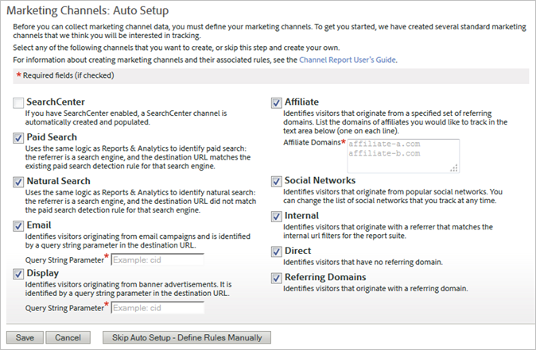

# Configuração automática

Execute a configuração única para o relatório de Canal de marketing.

O Relatório de canal de marketing vem com uma página de configuração, que é utilizada uma única vez, como introdução. Ele fornece diversos canais de marketing que podem ser utilizados para acompanhamento. É possível ignorar essa configuração inicial se você não encontrar problemas em criar canais e regras. No entanto, a Adobe recomenda que você permita que o assistente crie os canais para você. A configuração automática permite visualizar como as regras são construídas, ou editá-las conforme necessário. É possível desativar ou excluir canais predefinidos a qualquer momento.

## Executar a configuração automática para os Canais de marketing {#run-auto-setup}

Como executar a configuração automática para os Canais de marketing.

1. Clique em **[!UICONTROL Analytics]** > **[!UICONTROL Admin]** > **[!UICONTROL Report Suites]**.
1. Na página [!UICONTROL Report Suite Manager], selecione um conjunto de relatórios.
1. Clique em **[!UICONTROL Edit Settings]** > **[!UICONTROL Marketing Channels]** > **[!UICONTROL Marketing Channel Manager]**.

   

   >[!NOTE]
   >
   >The [!UICONTROL Marketing Channels: Auto Setup] page displays automatically when you access channel configuration applications in Admin Tools. (Consulte [Gerenciador de canal de marketing](/help/components/c-marketing-channels/mark-channel-mgr/c-channels.md).) Essa página não será exibida se seu conjunto de ferramentas de relatório contiver um ou mais canais de marketing. Não é possível acessar essa página novamente a menos que seja selecionado outro conjunto de ferramentas de relatório que não contenha canais de marketing.

1. Certifique-se de que os canais que deseja criar estejam selecionados.

   Quando selecionados, **[!UICONTROL Email]**, **[!UICONTROL Display]** e **[!UICONTROL Affiliate]** forem campos obrigatórios.

1. Clique em **[!UICONTROL Save]**.
