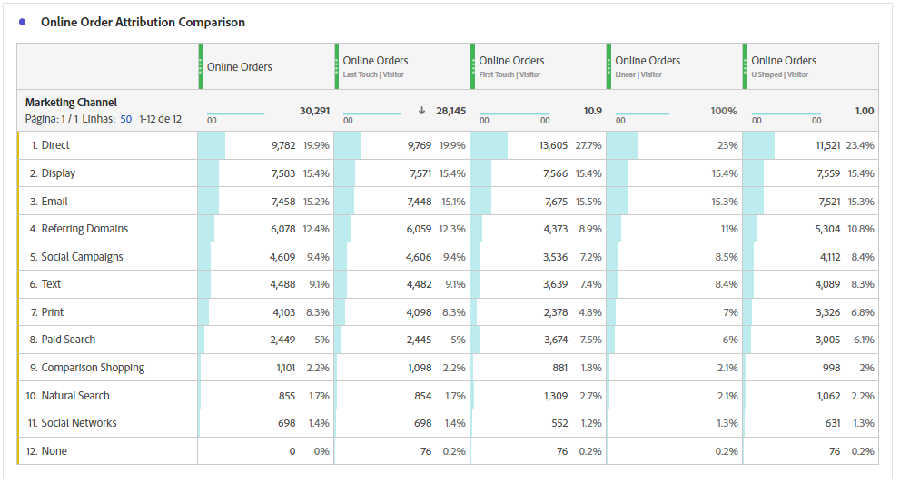
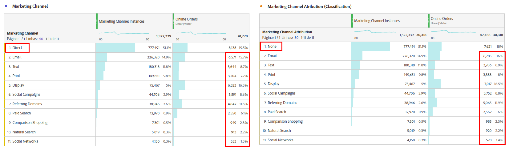
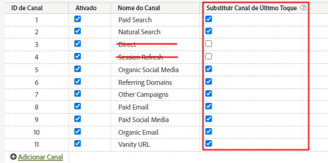
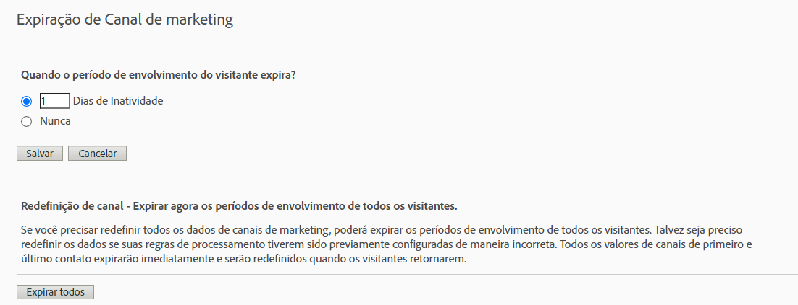

# Attribution IQ com Canais de marketing — Práticas recomendadas

[ Os canais de marketing](/help/components/c-marketing-channels/c-getting-started-mchannel.md) são um recurso valioso e eficiente do Adobe Analytics. As orientações atuais sobre a implementação do Canal de marketing foram formuladas em um momento em que não havia o [Attribution IQ](https://experienceleague.adobe.com/docs/analytics/analyze/analysis-workspace/attribution/overview.html?lang=pt-BR#analysis-workspace) nem o [Customer Journey Analytics](https://experienceleague.adobe.com/docs/analytics-platform/using/cja-usecases/marketing-channels.html?lang=pt-BR#cja-usecases).

Para garantir a implementação de Canais de marketing e a consistência dos relatórios com o Attribution IQ e o Customer Journey Analytics, estamos divulgando um conjunto de práticas recomendadas atualizadas. Se você já estiver usando os Canais de marketing, poderá escolher as melhores opções entre essas novas diretrizes. Se você nunca usou os Canais de marketing, recomendamos que siga todas as novas práticas recomendadas.

Quando os Canais de marketing foram introduzidos pela primeira vez, eles só contavam com as dimensões de primeiro e último contato. As dimensões explícitas de primeiro/último toque não são mais necessárias com a versão atual da atribuição. A Adobe fornece dimensões genéricas de &quot;Canal de marketing&quot; e &quot;Detalhes do canal de marketing&quot; para que você possa usá-las com o modelo de atribuição desejado. Essas dimensões genéricas se comportam de forma idêntica às dimensões do Canal de último contato, mas são rotuladas de forma diferente para evitar confusão em caso de uso de canais de marketing com um modelo de atribuição diferente.

Como as dimensões do Canal de marketing dependem de uma definição de visita tradicional (conforme definido por suas regras de processamento), a definição de visita não pode ser alterada usando conjuntos de relatórios virtuais. Essas práticas revisadas permitem janelas de pesquisa claras e controladas com o Attribution IQ e o CJA.

## Prática recomendada nº 1: aproveite o Attribution IQ para análise controlada

Recomendamos usar o [Attribution IQ](https://experienceleague.adobe.com/docs/analytics/analyze/analysis-workspace/attribution/overview.html?lang=en#analysis-workspace) em vez da atribuição existente do Canal de marketing para ajustar a análise do Canal de marketing. Siga as outras práticas recomendadas para garantir consistência e controles robustos da sua análise com o Attribution IQ.

* A configuração das dimensões do canal de marketing e do detalhe de canal de marketing estabelece pontos de contato a serem avaliados, de acordo com cada instância de canal de marketing.
* Para análise de métrica, sua organização deve se alinhar em um ou mais modelos de atribuição. Salve métricas personalizadas com esse modelo para reutilização fácil.
* Por padrão, os dados são alocados usando Último contato e a configuração do Período de envolvimento do visitante. Os modelos de métricas do Attribution IQ oferecem maior controle sobre as janelas de pesquisa e mais variedade, incluindo [atribuição algorítmica](https://experienceleague.adobe.com/docs/analytics/analyze/analysis-workspace/attribution/algorithmic.html?lang=pt-BR#analysis-workspace).

## Prática recomendada nº 2: nenhuma definição de canal de Atualização direta e de Sessão

Os canais de Atualização direta e interna/sessão não são recomendados para uso com modelos de atribuição personalizados (Attribution IQ).

E se sua organização já tiver as opções de Atualização direta e de Sessão configuradas? Nesse caso, recomendamos que você [crie uma classificação](https://experienceleague.adobe.com/docs/analytics/components/marketing-channels/classifictions-mchannel.html?lang=pt-BR) para Primeiro contato/Último contato e deixe os canais de atualização direta e de sessão sem classificação. A dimensão classificada produzirá os mesmos resultados do Attribution IQ como se esses canais nunca tivessem sido configurados.

## Prática recomendada nº 3: habilitar a substituição de canal de último toque para todos os canais

Modelos de atribuição personalizados usados com a dimensão Canal de marketing no Workspace funcionam melhor quando essa configuração é ativada. Habilitar essa configuração faz com que uma Instância de Canal de marketing seja contabilizada quando um novo canal/detalhe for encontrado. Você deve ativar essa opção para todos os canais, exceto para Atualização direta ou interna/sessão, que não é mais recomendado para uso com modelos de atribuição personalizados (Attribution IQ).

## Prática recomendada nº 4: minimizar o período de envolvimento do visitante

Definir o período de Envolvimento do visitante para o mínimo de &quot;1 dia&quot; minimiza a probabilidade de valores persistentes. Como os modelos de atribuição personalizados (AIQ) permitem janelas de pesquisa flexíveis, recomendamos definir o valor mínimo para minimizar o impacto dessa configuração.

## Prática recomendada nº 5: as Regras de processamento de canais de marketing devem existir somente para canais ativados

Remova todas as Regras de processamento de canal de marketing para canais desativados. As regras devem existir somente para Canais de marketing que estejam marcados como ativados.
