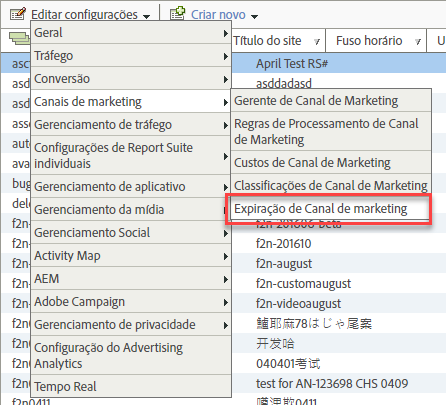

# Expiração de envolvimento do visitante

Saiba como especificar a expiração do envolvimento do visitante nos Canais de marketing.

O envolvimento do visitante indica quanto tempo você deseja permitir que a atividade anterior do visitante em seu site seja atribuída ao canal de primeiro toque.

Por exemplo, os visitantes muitas vezes clicam em uma campanha de Pesquisa paga e adicionam produtos ao carrinho, mas encerram a sessão antes do evento de conversão. Se o visitante retorna posteriormente para fazer a compra, é possível especificar se sua atividade anterior e a atual contam como um envolvimento. A configuração padrão de expiração é de 30 dias.

| Campo | Definição |
|--- |--- |
| Dias de inatividade | O número de dias que devem decorrer antes que o envolvimento de primeiro toque de um visitante expire. O valor padrão é 30. |
| Nunca | O período de envolvimento do visitante não expira. |
| Redefinição de canal | Expira todos os períodos de envolvimento do visitante.  Se você precisar redefinir todos os dados de canal de marketing, poderá expirar todos os períodos de envolvimento de visitantes. Talvez seja preciso redefinir os dados se suas regras de processamento tiverem sido previamente configuradas de maneira incorreta. Todos os valores de canais de primeiro e último toque expirarão imediatamente e serão redefinidos quando os visitantes retornarem. |

## Especificar a expiração de envolvimento do visitante {#specify-visitor-expire}

Especifique a expiração do envolvimento do visitante.

1. Clique em **[!UICONTROL Analytics]** &gt; **[!UICONTROL Administrador]** &gt; **[!UICONTROL Conjuntos de relatórios]**.
1. No [!UICONTROL Gerenciador de report suite], clique em **[!UICONTROL Editar configurações]** &gt; **[!UICONTROL Canais de marketing]** &gt; **[!UICONTROL Expiração de canal de marketing]**.

   

1. Configure os campos de expiração de envolvimento do visitante.
1. Clique em **[!UICONTROL Salvar.]**
