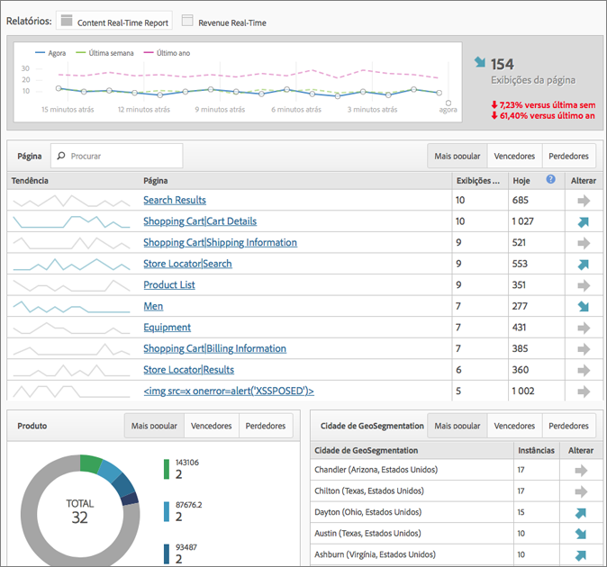

# Visão geral do relatório em tempo real

O relatório em tempo real exibe o tráfego da página da Web e classifica as exibições da página em tempo real. Oferece dados acionáveis para basear suas decisões comerciais.

> [!NOTE] O Relatório em tempo real não requer nenhuma implementação ou marcação adicional. Ele impulsiona sua implantação já existente do Adobe Analytics. Para configurar relatórios em tempo real, veja [Configuração de relatórios em tempo real](../../components/c-real-time-reporting/t-realtime-admin.md#task_1CD03E9B6BDB48B08E9E612183557F40).

**[!UICONTROL Métricas]** do site &gt; Tempo **[!UICONTROL real]**

O Tempo real responde as seguintes questões: Quais são os assuntos mais falados do meu site, e por quê? Permite que você, enquanto profissional de marketing, possa responder de maneira rápida e gerenciar ativamente o desempenho de seu conteúdo de marketing e de suas campanhas. Os dados em tempo real relatados possui menos de dois minutos de latência e é atualizado automaticamente em um intervalo de um em um minuto.

O painel inclui as métricas de alta frequência do Adobe Analytics e as análises do site da Web para reportar visualmente o tráfego e as visualizações de notícias dinâmicas e sites de varejo na página. A análise em tempo real entende as tendências em seus dados de minuto a minuto, segundos após o início da coleta. Coleciona e envia dados para uma interface que é atualizada automaticamente, através da correlação em tempo real, do rastreamento de conteúdo e da conversão.

Dois dos cenários de utilização mais recorrentes incluem editores que gostariam de promover/rebaixar histórias para alterações de atividade do usuário, e profissionais de marketing que gostariam de rastrear o lançamento de uma nova linha de produto.

Como Administrador, você pode

* Criar até três relatórios em tempo real para cada conjunto de relatórios, utilizando dimensões e métricas existentes. Utiliza as dimensões secundárias para correlacionar com (ou separar) a dimensão primária.
* Adicionar três dimensões (ou classificações) por relatório (uma primária e duas secundárias), além de uma métrica de site inteiro.
* Utiliza qualquer evento personalizado, evento de carrinho de compras ou instância.
* Exibir até duas horas de dados do histórico em tempo real e modificar essa configuração:

   * Últimos 15 minutos: granularidade de um minuto
   * Últimos 30 minutos: granularidade de um minuto
   * Última hora: granularidade de dois minutos
   * Últimas duas horas: granularidade de quatro minutos

* Por exemplo, compare os valores da semana anterior aos do último ano (bem como o total do dia).

Lembre-se que as eVars (métricas de conversão) não são suportadas, uma vez que não há conceito de persistência. Você pode selecionar métricas de conversão, mas elas funcionarão apenas se definidas na mesma página que a(s) dimensão(ões). Para obter mais informações, consulte a mensagem de aviso capturada em [Configuração de relatórios](../../components/c-real-time-reporting/t-realtime-admin.md#task_1CD03E9B6BDB48B08E9E612183557F40)em tempo real.

A configuração e a exibição dos relatórios em tempo real está restrita aos Administradores ou qualquer outro usuário que faça parte dos grupos "Todos os acessos de relatório" e "Relatórios avançados" . Porém, o Tempo real não respeita as permissões. Por exemplo, se você não possui os direitos para visualizar a receita, você não poderá visualizar um relatório em tempo real que inclui dados da mesma.

## Latência dos dados como resultado da configuração A4T {#section_806CE36354FC4C539A0DED9266A5C704}

After the A4T integration is enabled in Adobe [!DNL Target], you will experience an additional 5-10 minutes of latency in Adobe Analytics. This latency increase allows data from Analytics and [!DNL Target] to be stored on the same hit, allowing you to break down tests by page and site section.

Este aumento é refletido em todos os serviços e ferramentas do Adobe Analytics, incluindo a transmissão ao vivo e os relatórios em tempo real e aplicam-se nas seguintes situações:

* Para a transmissão ao vivo, relatórios em tempo real, solicitações de API e dados atualizados para as variáveis de tráfego, somente hits com uma ID de dados adicional são atrasadas.
* Para os dados atuais sobre as métricas de conversão, dados finalizados e feeds de dados, todos os hits são atrasados de 5 a 7 minutos.

Esteja ciente de que o aumento de latência começa após a implementação do Serviço de identidade, mesmo que você não tenha implementado essa integração totalmente.
