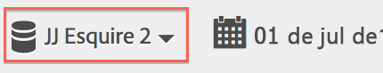
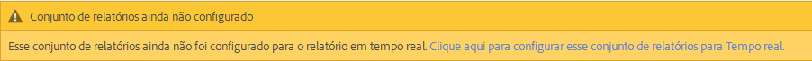
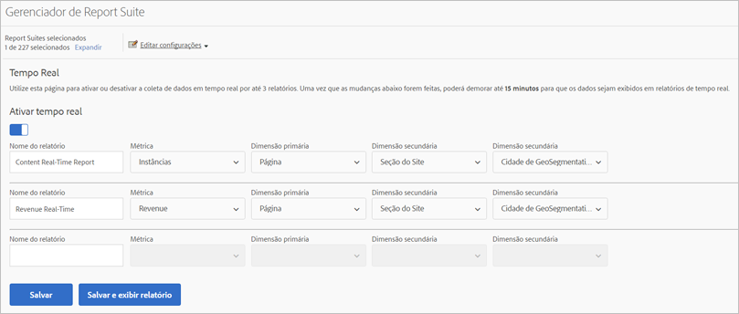
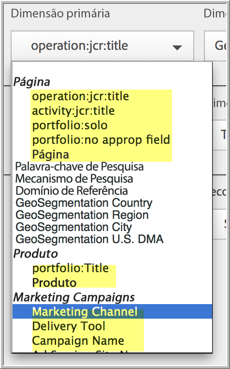
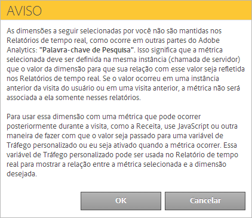

# Configurar relatórios em tempo real

Etapas administrativas para configurar relatórios em tempo real.

Setting up real-time reports within [!UICONTROL Reports &amp; Analytics] consists of selecting the report suite and configuring up to 3 reports for it.

1. Selecione o conjunto de relatórios para o qual você deseja ativar os relatórios em tempo real.

   Navigate to **[!UICONTROL Analytics]** &gt; **[!UICONTROL Reports]** &gt; **[!UICONTROL View All Reports &gt; Site Metrics]** &gt; **[!UICONTROL Real-Time]** and select the report suite from the drop-down at the top:

   

   Se você tentar exibir relatórios em tempo real para um conjunto de relatórios não configurado para relatórios em tempo real, uma mensagem exibe que você configurou o conjunto de relatórios.

   

1. Click **[!UICONTROL Configure]** (gear icon) to run the [!UICONTROL Report Suite Manager].

   (Also available under **[!UICONTROL Analytics]** &gt; **[!UICONTROL Admin &gt; Report Suites]** &gt; **[!UICONTROL Edit Settings]** &gt; **[!UICONTROL Real-Time]**.)

1. Turn on the **[!UICONTROL Enable Real-Time]** setting.
1. Configure a coleção de dados em tempo real para até três relatórios, com uma métrica e três dimensões ou classificações por relatório.

   

   For information on supported real-time metrics and dimensions, see [Supported Metrics and Dimensions](../../components/c-real-time-reporting/realtime-metrics.md#concept_B86D8DF89AD448839332AD84B1DF2AE7).

   Caso tenha criado classificações, elas serão exibidas recuadas abaixo da dimensão para a qual foram definidas:

   

   >[!NOTE]
   >
   >No momento, para um relatório em tempo real único, não oferecemos suporte à ativação de dimensões duplicadas, mesmo que uma classificação diferente seja selecionada para cada dimensão.

   For more information about classifications, see [About Classifications](../../components/c-classifications2/c-classifications.md#concept_4CEC7FF1A9E24204A7DA6B9AC70709DE).

   >[!NOTE]
   >
   >Algumas dimensões, como "Palavra-chave de pesquisa" ou "Produto", não persistem em Tempo real como fazem em outro lugar do Adobe Analytics. Quando selecionar uma métrica não persistente, este aviso será exibido:

   

1. Click **[!UICONTROL Save]** or **[!UICONTROL Save and View Report]**.

   Após essa configuração inicial de relatório, pode levar até 20 minutos para que o streaming de dados tenha início. A partir de então, os dados estarão imediatamente disponíveis. Para saber mais sobre a exibição de relatórios em tempo real, consulte [Executar um Relatório em tempo real](https://marketing.adobe.com/resources/help/en_US/sc/user/reports_realtime.html).

1. Por padrão, todos os usuários possuem acesso aos Relatórios em tempo real.
