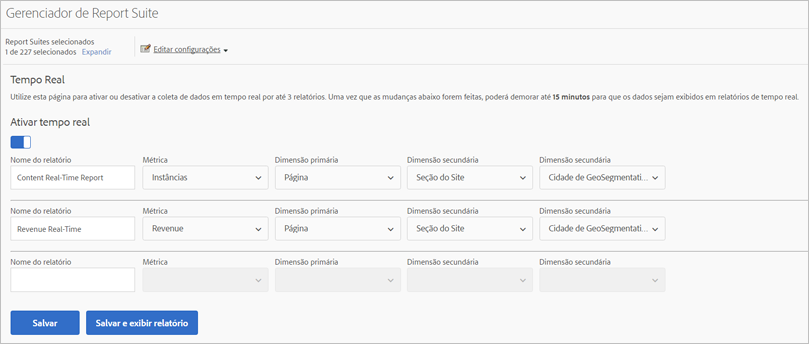
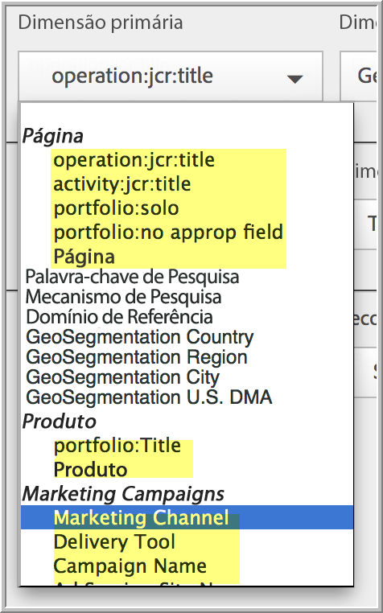

# Configurar relatórios em tempo real

As informações a seguir contêm etapas administrativas para configurar relatórios em tempo real.

Isso consiste em selecionar o conjunto de relatórios e configurar até três relatórios para ele.

1. Selecione o conjunto de relatórios para o qual você deseja habilitar os relatórios em tempo real.

   1. No Analysis Workspace, selecione a guia [!UICONTROL **Workspace**] e selecione [!UICONTROL **Relatórios**] > [!UICONTROL **Envolvimento**] > **[!UICONTROL Tempo real]**.

   1. Selecione o conjunto de relatórios no menu suspenso na parte superior:

      

      Se você tentar exibir relatórios em tempo real para um conjunto de relatórios não configurado para relatórios em tempo real, uma mensagem exibe que você configurou o conjunto de relatórios.

      

1. Selecione **[!UICONTROL Configurar]** para executar o [!UICONTROL Gerenciador de Conjunto de Relatórios].

   (Também disponível em **[!UICONTROL Analytics]** > **[!UICONTROL Administrador > Conjuntos de relatórios]** > **[!UICONTROL Editar configurações]** > **[!UICONTROL Tempo real]**.)

1. Habilite a configuração **[!UICONTROL Habilitar tempo real]**.
1. Configure a coleção de dados em tempo real para até três relatórios, com uma métrica e três dimensões ou classificações por relatório.

   

   Para obter informações sobre métricas e dimensões em tempo real compatíveis, consulte [Métricas e dimensões compatíveis](/help/admin/tools/manage-rs/edit-settings/realtime/realtime-metrics.md).

   Caso tenha criado classificações, elas serão exibidas recuadas abaixo da dimensão para a qual foram definidas:

   

   >[!NOTE]
   >
   >No momento, não oferecemos suporte para habilitar dimensões duplicadas para um relatório em tempo real, mesmo que uma classificação diferente seja selecionada para cada dimensão.

   >[!NOTE]
   >
   >Algumas dimensões, como &quot;Palavra-chave de pesquisa&quot; ou &quot;Produto&quot;, não persistem em tempo real como persistiriam em outro ponto do Adobe Analytics. Quando selecionar uma métrica não persistente, este aviso será exibido:

   

1. Selecione **[!UICONTROL Salvar]** ou **[!UICONTROL Salvar e exibir relatório]**.

   Após essa configuração inicial do relatório, pode levar até 20 minutos para que os dados comecem a transmitir. A partir de então, os dados ficam imediatamente disponíveis.

1. Por padrão, todos os usuários possuem acesso aos Relatórios em tempo real.
