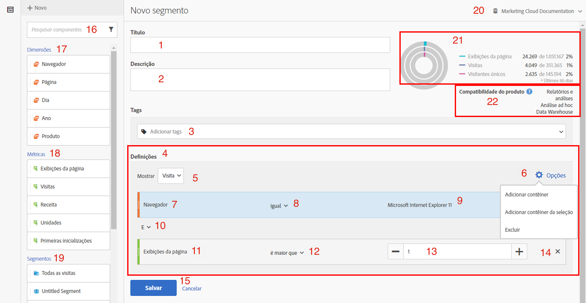
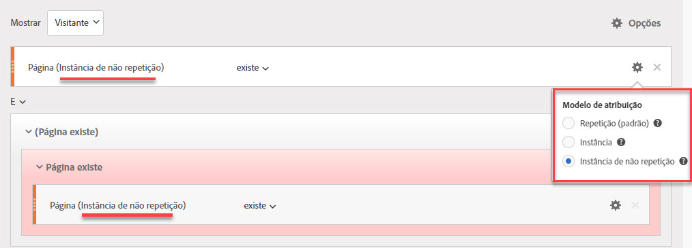
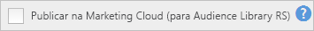
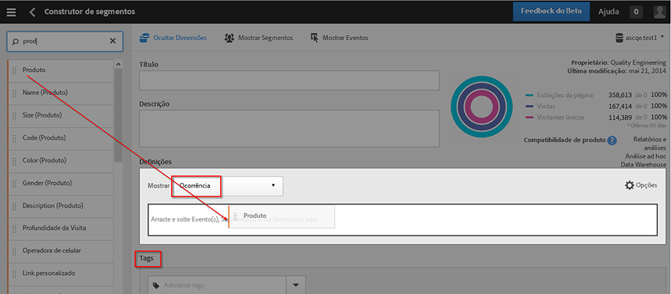
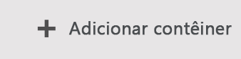
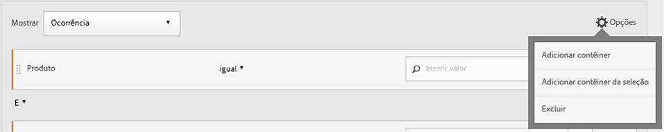
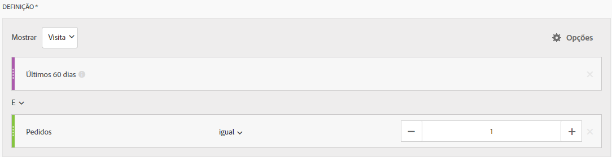
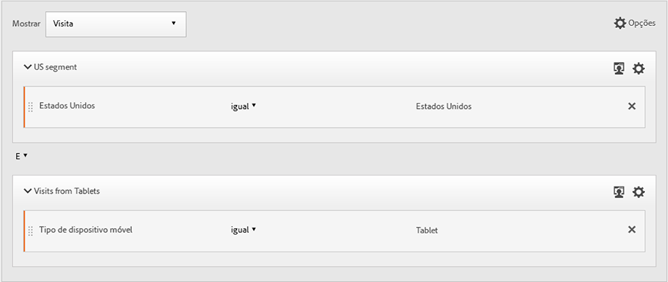
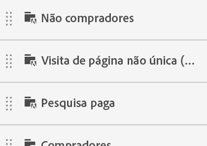
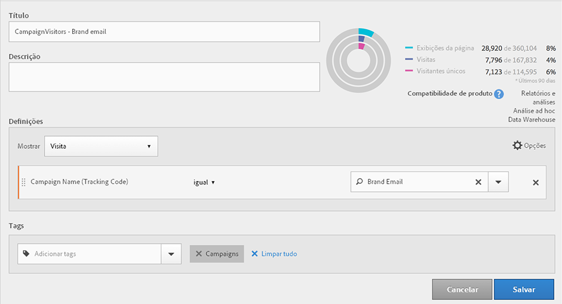

# Construtor de segmentos

O [!UICONTROL Construtor de segmentos] fornece uma tela para arrastar e soltar Métricas, Dimensões, Segmentos e Eventos para os visitantes do segmento com base na lógica, nas regras e nos operadores da hierarquia do contêiner. Essa ferramenta de desenvolvimento integrada permite construir e salvar segmentos simples ou complexos que identificam os atributos e as ações do visitante nas visitas e ocorrências da página.

>[!IMPORTANT]
>
>Introduzimos modelos de atribuição de dimensão na versão de junho de 2019. Consulte nº 6 em Recursos da interface do usuário da Web abaixo.

Há várias maneiras de acessar o Construtor de segmentos:

* **Navegação superior do Analytics**: clique em **[!UICONTROL Analytics]** > **[!UICONTROL Componentes]** > **[!UICONTROL Segmentos]**.
* **[!UICONTROL Analysis Workspace]**: clique em **[!UICONTROL Analytics]** > **[!UICONTROL Workspace]**, abra um projeto e clique em **[!UICONTROL + Novo]** > **[!UICONTROL Criar segmento]**.
* **[!UICONTROL Reports &amp; Analytics]**: clique em **[!UICONTROL Analytics]** > **[!UICONTROL Relatórios]**, abra um relatório existente e clique no ícone de Segmentos  na navegação à esquerda e, em seguida, clique em **[!UICONTROL Adicionar]**.
* **[!UICONTROL Ad Hoc Analysis]**: [criar segmentos na Ad Hoc Analysis](/help/components/c-segmentation/c-segmentation-workflow/seg-build.md#build-segments).
* **[!UICONTROL Report Builder]**: [adicionar ou editar segmentos no Report Builder](https://marketing.adobe.com/resources/help/pt_BR/arb/segmentation.html).

## Interface do usuário do Construtor de segmentos {#concept_643F2DF74C544796B58F4656ABC5F726}

O [!UICONTROL Construtor de segmentos] permite que você construa segmentos simples ou complexos que identificam atributos e ações do visitante e ocorrências da página. Fornece uma tela para arrastar e soltar dimensões de métrica, eventos, ou outros segmentos na ordem para visitantes de segmento com base em lógica, regras e operadores de hierarquia.

## Recursos de interface do usuário da Web  {#section_F61C4268A5974C788629399ADE1E6E7C}

O [!UICONTROL Construtor de segmentos] permite que você construa e edite segmentos na Interface do usuário da Web (ou em uma [Interface do usuário Java na Ad Hoc Analysis](/help/components/c-segmentation/c-segmentation-workflow/seg-workflow.md)). Você pode adicionar definições de regra e contêineres para refinar seus segmentos, empilhá-los e aninhá-los para refinar. Também é possível validar quantas visualizações de página, visitas e visitantes únicos resultam da definição de segmento atual. Também é possível salvar o segmento para necessidades futuras.

Acesse o Construtor de segmentos por:

* Exiba um relatório existente e clicar no ícone Segmentos  na navegação à esquerda. No painel de segmentos exibido, clique em **[!UICONTROL Adicionar]**.

* No Gerenciador de segmentos, ao clicar em **[!UICONTROL + Adicionar]**.
* Ao clicar em um título de segmento existente no Gerenciador de segmentos para editar o segmento no Construtor de segmentos.

1. **[!UICONTROL Título]**: permite nomear ou renomear o segmento.
1. **[!UICONTROL Descrição]**: forneça uma descrição para o segmento. Você deve fornecer uma descrição se deseja compartilhar o segmento.
1. **[!UICONTROL Tags]**: [marcar o segmentos](/help/components/c-segmentation/c-segmentation-workflow/seg-workflow.md) que você está criando ao selecionar de uma lista de tags existentes ou criar uma nova tag.
1. **[!UICONTROL Definições]**: é aqui que você [constrói e configura segmentos](/help/components/c-segmentation/c-segmentation-workflow/seg-workflow.md), adiciona regras, bem como aninha e faz a sequência de contêineres. Permite que você forneça uma descrição para o novo segmento ao selecionar o contêiner, e arrastar e soltar dimensões, segmentos ou métricas na definição.
1. **[!UICONTROL Mostrar]**: (seletor de contêiner superior.) Permite que você selecione o [contêiner de nível superior](/help/components/c-segmentation/seg-overview.md) ([!UICONTROL Visitante], [!UICONTROL Visita], [!UICONTROL Ocorrência]). O contêiner de nível superior padrão no contêiner Ocorrência.
1. Ícone **[!UICONTROL Opções]**: (engrenagem)

   * **[!UICONTROL + Adicionar contêiner]**: permite que você adicione um novo contêiner (abaixo do contêiner de nível superior) à definição do segmento.
   * **[!UICONTROL + Adicionar contêiner da seleção]**: permite que você crie um novo contêiner a partir dos elementos que você (multi-) selecionou no campo Definições.
   * **[!UICONTROL Excluir]**: permite que você defina o segmento ao excluir uma ou mais dimensões, segmentos ou métricas.

1. **[!UICONTROL Modelos de atribuição]**: para segmentação de dimensão. Os modelos de dimensão são especialmente úteis na segmentação sequencial, como nos que oferecem suporte para visualizações de Fluxo:

   * **[!UICONTROL Repetitivo]** (padrão): inclui instâncias e valores persistentes da dimensão.
   * **[!UICONTROL Instância]**: inclui instâncias da dimensão.
   * **[!UICONTROL Instância não repetitiva]**: inclui instâncias exclusivas (não repetitivas) da dimensão.
   

1. **[!UICONTROL Dimensões]**: as dimensões são arrastadas e soltas na lista Dimensões (barra lateral laranja).
1. **[!UICONTROL Comparação]**: é possível comparar e restringir valores com operadores selecionados.
1. **[!UICONTROL Valor]**: o valor inserido ou selecionado para a dimensão, semento ou métrica.
1. **[!UICONTROL E/Ou/Então]**: atribui os operadores [!UICONTROL E/OU/ENTÃO] entre contêineres ou regras. O operador ENTÃO permite que você [defina segmentos sequenciais](/help/components/c-segmentation/c-segmentation-workflow/seg-sequential-build.md).
1. **[!UICONTROL Métrica]**: (barra lateral verde) métrica que foi arrastada e solta na lista de Métricas.
1. Operador **[!UICONTROL Comparação]**: é possível comparar e restringir valores com operadores selecionados.
1. **[!UICONTROL Valor]**: o valor inserido ou selecionado para a dimensão, semento ou métrica.
1. **[!UICONTROL X]**: (excluir) permite que você exclua essa parte da definição de segmentos.
1. **[!UICONTROL Salvar]** ou **[!UICONTROL Cancelar]**: salva ou cancela o segmento. Depois de clicar em **[!UICONTROL Salvar]**, você é levado para o Gerenciador de segmentos onde é possível gerenciar o segmento.
1. **[!UICONTROL Pesquisa]**: pesquisa a lista de dimensões, segmentos ou métricas.
1. **[!UICONTROL Dimensões]**: (Lista) clique no cabeçalho para expandir.
1. **[!UICONTROL Métrica]**: clique no cabeçalho para expandir.
1. **[!UICONTROL Segmentos]**: clique no cabeçalho para expandir.
1. **[!UICONTROL Seletor do conjunto de relatórios]**: permite selecionar os conjuntos de relatórios em que esse segmento será salvo. Você ainda pode utilizar o segmento em todos os conjuntos de relatórios.
1. **[!UICONTROL Visualização de segmento]**: permite que você visualize as métricas principais para conferir se você tem um segmento válido e a amplitude deste. Represente o detalhamento do conjunto de dados que você pode esperar ao aplicar esse segmento. Mostra 3 círculos concêntricos e uma lista para mostrar o número e o percentual de correspondências para [!UICONTROL Ocorrências], [!UICONTROL Visitas] e [!UICONTROL Visitantes] para uma execução de segmentos em comparação ao conjunto de dados. Esse gráfico é atualizado imediatamente depois de criar ou efetuar alterações para sua definição de segmento.
1. **[!UICONTROL Compatibilidade de produto]**: fornece uma lista de quais produtos do Adobe Analytics (Analysis Workspace, [!UICONTROL Reports &amp; Analytics], Ad Hoc Analysis, Data Warehouse) são compatíveis com o segmento que você criou. A maioria dos segmentos são compatíveis com todos os produtos. Contudo, nem todos os operadores e dimensões são compatíveis com todos os produtos Analytics, especialmente o  [Data Warehouse](/help/components/c-segmentation/seg-reference/seg-compatibility.md). Esse gráfico é atualizado imediatamente depois de efetuar alterações na definição do segmento.

Segmentos com intervalos de datas incorporados continuarão a operar de forma diferente na Analysis Workspace com relação ao [!UICONTROL Reports &amp; Analytics]: na Workspace, um segmento com um intervalo de datas inserido substitui o intervalo de datas do painel. Ao contrário, o [!UICONTROL Reports &amp; Analytics] gera a interseção entre intervalo de datas do relatório e o intervalo de datas inserido do segmento.

**[!UICONTROL Publicar na Experience Cloud (para`<report suite name>`)]**: (não exibido na tela) essa opção aparecerá somente se o conjunto de relatórios em que você está salvando este segmento for [habilitado](/help/components/c-segmentation/c-segmentation-workflow/seg-workflow.md). Ao publicar um segmento na Experience Cloud, é possível usá-lo em atividades de marketing na [!UICONTROL Biblioteca de público-alvo], no [!DNL Target] e no [!DNL Audience Manager]. É necessário um título de segmento e uma descrição.

> [!NOTE]No Analytics, você pode editar ou excluir um segmento publicado. Se o segmento estiver em uso, uma mensagem de aviso será emitida quando um segmento for editado. Não é possível excluir um segmento publicado que esteja sendo usado pelo Adobe [!DNL Target].

>[!IMPORTANT]
>
>É preciso limitar para 20 o número de públicos-alvo compartilhados por meio do Analytics para evitar atrasos adicionais de processamento. Públicos-alvo compartilhados com a Experience Cloud a partir do Analytics não podem exceder 20 milhões de membros únicos. Além disso, devido a questões relacionadas ao cache, conjuntos de relatórios excluídos no Analytics permanecem exibidos na Experience Cloud por 12 horas após a exclusão.

>[!IMPORTANT]
>
>Depois que um visitante é qualificado para o público-alvo compartilhado do Analytics, existe um atraso de 24 a 48 horas antes de as informações serem ativadas no [!DNL Target], no [!DNL Advertising Cloud] e no [!DNL Campaign].

## Construir segmentos {#build-segments}

1. Arraste uma Dimensão, um Segmento ou Evento de métrica do painel esquerdo até o campo [!UICONTROL Definições].

   

   O contêiner de nível superior padrão [!UICONTROL Ocorrência] é mostrado após arrastar um elemento para [!UICONTROL Definições]. É possível alterar o tipo de contêiner até Visita ou Visitante do menu suspenso **[!UICONTROL Mostrar]**.

1. Defina o [operador](/help/components/c-segmentation/seg-reference/seg-operators.md) no menu suspenso.
1. Digite ou selecione um valor para o item selecionado.
1. Adicione contêineres adicionar se necessário, com as regras **[!UICONTROL E]**, **[!UICONTROL Ou]**, ou **[!UICONTROL Então]**.
1. Depois de colocar os contêineres e definir as regras, consulte os resultados do segmento no gráfico de validação na parte superior à direita. O validador indica o percentual e o número absoluto de visualizações de página, visitas e visitantes únicos que corresponde ao segmento criado.
1. Em **[!UICONTROL Tags]**, [marque](/help/components/c-segmentation/c-segmentation-workflow/seg-tag.md) o contêiner ao selecionar uma tag existente ou cria uma nova.
1. Clique em **[!UICONTROL Salvar]** para salvar o segmento.

Agora você é levado ao [Gerenciador de segmentos](/help/components/c-segmentation/c-segmentation-workflow/seg-manage.md), onde é possível marcar, compartilhar e gerenciar o segmento de várias maneiras.

## Construir e aninhar contêineres {#section_1C38F15703B44474B0718CEF06639EFD}

É possível [construir uma estrutura de contêineres](/help/components/c-segmentation/seg-overview.md) e, em seguida, colocar regras de lógica e operadores entre eles.

1. Clique em **[!UICONTROL Opções > Adicionar contêiner]**.

   

   Um novo contêiner [!UICONTROL Ocorrência] abre sem uma [!UICONTROL Ocorrência] (Visualização de página) identificada.

   

1. Altere o tipo de contêiner como necessário.
1. Arraste uma Dimensão, um Segmento ou Evento do painel esquerdo até o contêiner.
1. Continue a adicionar novos contêineres com o botão **[!UICONTROL Opções]** > **[!UICONTROL Adicionar contêineres]** na parte superior da definição, ou adicione contêineres de um contêiner para aninhar a lógica.

   **OU**

   Selecione uma ou mais regras, em seguida, clique em **[!UICONTROL Opções]** > **[!UICONTROL Adicionar contêiner a partir de uma seleção]**. Isso transforma sua seleção em um contêiner separado.

## Usar intervalos de datas em segmentos {#concept_252A83D43B6F4A4EBAB55F08AB2A1ACE}

É possível criar segmentos que contêm intervalos de datas flexíveis para responder questões sobre campanhas ou eventos em andamento.

Por exemplo, crie com facilidade um segmento que inclua &quot;todos que realizaram uma compra nos últimos 60 dias&quot;.

Crie um contêiner de Visita e adicione o intervalo [!UICONTROL Últimos 60 dias] e a métrica [!UICONTROL Pedido é superior ou igual a 1], com um operador E:

## Empilhar segmentos {#task_58140F17FFD64FF1BC30DC7B0A1B0E6D}

O empilhamento de segmentos funciona ao combinar os critérios em cada segmento com um operador &quot;e&quot;, em seguida, ao aplicar os critérios combinados.

Por exemplo, empilhar um segmento de &quot;usuários de telefones celulares&quot; e um segmento &quot;Geografia dos EUA&quot; retorna dados somente para usuários de telefones celulares nos EUA.

Pense nesses segmentos como blocos de construção ou módulos que você pode incluir em uma biblioteca de segmentos para que os usuários usem como necessário. Dessa forma, você pode reduzir dramaticamente o número de segmentos necessários. Por exemplo, considera que você tem 40 segmentos:

* 20 para usuários de telefones celulares em países diferentes (US_mobile, Germany_mobile, France_mobile, Brazil_mobile etc.)
* 20 para usuários de tablet em países diferentes (US_tablet, Germany_tablet, France_tablet, Brazil_tablet etc.)

Ao usar o empilhamento de segmentos, você pode reduzir a contagem de segmentos em 22 e empilhá-los como necessário. É necessário criar esses segmentos:

* um segmento para usuários móveis
* um segmento para usuários de tablets
* 20 segmentos para localidades geográficas diferentes

> [!NOTE] Ao empilhar dois segmentos, eles são unidos por padrão por uma instrução E. Isso não pode ser alterado para uma instrução OU.

1. Vá para o Construtor de segmentos.
1. Forneça um título e uma descrição para o segmento.

   Resultado da etapa 1. Clique em **[!UICONTROL Mostrar segmentos]** para trazer a lista de segmentos para frente no painel de navegação à esquerda.

   Resultado da etapa 1. Arraste e solte os segmentos que você deseja empilhar na área de definição de segmentos. Este é um exemplo de segmento que empilha os segmentos existentes &quot;Visitas de tablets&quot; e &quot;Geográfico EUA&quot;:

   

1. Salve o segmento.

   Resultado da etapa

## Usar modelos de segmentos {#concept_5098446CC78D441E93B8E4D1D1EA6558}

Os modelos representam os segmentos antigos pré-configurados e do pacote.

No Gerenciador de segmentos, clique em **[!UICONTROL Adicionar]**, você será direcionado para o Construtor de segmentos. Em seguida, clique no ícone Segmentos 

para exibir o painel de segmentos. Os modelos do segmento aparecem na parte inferior da lista de segmentos. É possível distingui-los por um ícone de pasta à esquerda do nome do modelo:

Você pode arrastar esses modelos para uma área de Definições e usá-los como foram definidos, ou modificá-los.

<table id="table_98B87D807E9344C9BEBF072C65D87B1B"> 
 <thead> 
  <tr> 
   <th colname="col1" class="entry"> Nome do modelo </th> 
   <th colname="col2" class="entry"> Definição </th> 
  </tr> 
 </thead>
 <tbody> 
  <tr> 
   <td colname="col1"> Abandonar carrinho </td> 
   <td colname="col2">Visualizar dados para visitantes que adicionaram itens aos carrinhos, mas não fizeram nenhum pedido. Em Definição de segmento, o contêiner é Visita. A regra para esse segmento sequencial é 
 Adições de carrinho não é nulo 
 
Então 
 
Pedidos equivale a 0. 
 </td> 
  </tr> 
  <tr> 
   <td colname="col1"> Novas visitas </td> 
   <td colname="col2">Exibição de dados para visitantes que visitaram [1] uma vez no máximo. Em Definição de segmento, o contêiner é Visita. A regra é 
Número de visitas é igual a 1. 
 </td> 
  </tr> 
  <tr> 
   <td colname="col1"> Não compradores </td> 
   <td colname="col2">Exibição de dados a visitantes que não participaram de um evento de compra. Na Definição do segmento, o contêiner é Visitante. Esse segmento usa a lógica Excluir. A regra é 
Pedidos não é nulo. 
 </td> 
  </tr> 
  <tr> 
   <td colname="col1"> Visita de página não única (sem retornos) </td> 
   <td colname="col2">Exibir dados para visitantes que visitaram mais de uma vez. Na Definição do segmento, o contêiner é Visitante. Esse segmento usa a lógica Excluir. A regra é 
Acesso único não é nulo. 
 </td> 
  </tr> 
  <tr> 
   <td colname="col1"> Pesquisa paga </td> 
   <td colname="col2">Exibir dados de visitantes de uma pesquisa paga. Em Definição de segmento, o contêiner é Visita. A regra é 
Pesquisa paga igual a 1. 
 </td> 
  </tr> 
  <tr> 
   <td colname="col1"> Compradores </td> 
   <td colname="col2">Exibição de dados a visitantes que participaram de um evento de compra. Na Definição do segmento, o contêiner é Visitante. A regra é 
Pedidos não é nulo. 
 </td> 
  </tr> 
  <tr> 
   <td colname="col1"> Visitas de Retorno </td> 
   <td colname="col2">Exibir dados de visitantes que visitaram pelo menos uma vez. Em Definição de segmento, o contêiner é Visita. A regra é 
Número de visitas superior a 1. 
 </td> 
  </tr> 
  <tr> 
   <td colname="col1"> Visitas únicas à página </td> 
   <td colname="col2"> Exibir dados de visitas onde você visualiza um valor de página única, embora você possa enviar várias visualizações de página durante essa visita. Visitas de página única com eventos de link de saída são incluídas no segmento. Em Definição de segmento, o contêiner é Visita. A regra é 
Visitas Únicas à Página é igual a 1. 
 </td> 
  </tr> 
  <tr> 
   <td colname="col1"> Produto visualizado não adicionado ao carrinho </td> 
   <td colname="col2">Exibir dados para visitantes que visualizaram produtos, mas não adicionaram nada ao carrinho. Em Definição de segmento, o contêiner é Visita. A regra para esse segmento sequencial é 
Visualizações de produto não é nulo 
 
Então 
 
 Adições de carrinho é igual a 0. 
 </td> 
  </tr> 
  <tr> 
   <td colname="col1"> Visitas da campanha </td> 
   <td colname="col2">Exibir de dados de visitantes enviados por redes sociais. Em Definição de segmento, o contêiner é Visita. A regra é 
Código de rastreamento não é nulo. 
 </td> 
  </tr> 
  <tr> 
   <td colname="col1"> Visitas de dispositivos móveis </td> 
   <td colname="col2">Exibir dados de visitantes com dispositivos móveis. Em Definição de segmento, o contêiner é Visita. A regra é 
Dispositivo móvel não é nulo. 
 </td> 
  </tr> 
  <tr> 
   <td colname="col1"> Visitas da pesquisa natural </td> 
   <td colname="col2">Exibir dados de visitantes não originários de uma pesquisa paga. Em Definição de segmento, o contêiner é Visita. A regra é 
Pesquisa paga igual a 0. 
 </td> 
  </tr> 
  <tr> 
   <td colname="col1"> Visitas de dispositivos não móveis </td> 
   <td colname="col2">Exibir dados de visitantes que não usam dispositivos móveis. Em Definição de segmento, o contêiner é Visita. Esse segmento usa a lógica Excluir. A regra é 
O tipo do dispositivo móvel equivale a telefone celular 
 
Ou 
 
O tipo do dispositivo móvel equivale a tablet. 
 </td> 
  </tr> 
  <tr> 
   <td colname="col1"> Visitas de telefones </td> 
   <td colname="col2">Exibir dados de visitantes com telefones. Em Definição de segmento, o contêiner é Visita. A regra é 
Tipo de dispositivo igual a Telefone móvel. 
 </td> 
  </tr> 
  <tr> 
   <td colname="col1"> Visitas de mecanismos de pesquisa </td> 
   <td colname="col2">Exibir dados de visitantes enviados por mecanismos de pesquisa. Em Definição de segmento, o contêiner é Visita. A regra é 
Tipo de referenciador igual a Mecanismos de pesquisa. 
 </td> 
  </tr> 
  <tr> 
   <td colname="col1"> Visitas de sites sociais </td> 
   <td colname="col2">Exibição de dados do visitante enviados por redes sociais. Em Definição de segmento, o contêiner é Visita. A regra é 
Tipo de referenciador igual às redes sociais. 
 </td> 
  </tr> 
  <tr> 
   <td colname="col1"> Visitas de tablets </td> 
   <td colname="col2">Exibir dados de visitantes com tablets. Em Definição de segmento, o contêiner é Visita. A regra é 
Tipo de dispositivo equivale a Tablet. 
 </td> 
  </tr> 
  <tr> 
   <td colname="col1"> Visitantes com cookie de ID do visitante </td> 
   <td colname="col2">Exibir dados de visitantes do site, onde é necessário um cookie persistente. Em Definição de segmento, o contêiner é Visita. A regra é 
Cookies persistentes igual a 1. 
 </td> 
  </tr> 
 </tbody> 
</table>

## Exemplo: Segmento de visitantes da campanha {#concept_61AC6115097B4EB3AEFE8CE98F38315D}

Mostra um exemplo deste segmento frequentemente usado.

Vários clientes desejam visualizar as métricas dos visitantes que responderam a campanhas específicas. A criação de um segmento de visitantes da campanha é uma forma fácil de obter esses dados.

A construção desse segmento no Construtor de segmentos significa que de um contêiner de Visita de nível superior você arrasta uma dimensão de campanha, neste caso Nome da campanha:

(Opcional) Você também pode aplicar uma tag de Campanhas a esse segmento, se você deseja filtrar facilmente todos os segmentos relacionados à campanha.
