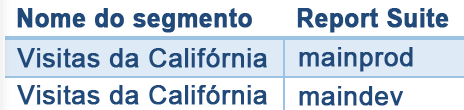

# Excluir segmentos

Lista alguns itens que devem ser considerados antes de excluir segmentos.

Quando você exclui um segmento,

* Os relatórios e painéis agendados com esse segmento aplicado continuam a funcionar normalmente, ou seja, o segmento ou painel continua a usar o segmento excluído.
* Os relatórios agendados não são atualizados quando você edita um segmento com o mesmo nome. Exemplo: imagine que você tem 2 segmentos com o mesmo nome em conjuntos de relatórios diferentes:

   

   Você tem um marcador que faz referência ao segmento para o conjunto de relatórios da produção principal. Em seguida, você exclui esse segmento, pois é uma duplicata. O marcador continuará a funcionar, com referência à definição do segmento excluído. Se você alterar a definição do segmento para o segmento restante para incluir a Ilha de Catalina e Tijuana no México, o segmento aplicado ao marcador não mudará. Usará a definição antiga. Para corrigir isso, atualize o marcador para fazer referência à nova definição. Se você não tiver certeza se um marcador, painel ou relatório agendado está usando um segmento excluído, é possível alterar o nome do segmento restante para que fique mais clara se o marcador usa o segmento restante.

## Editar segmentos integrados excluídos na Ad Hoc Analysis {#section_976D601DBD2244E38B0A0222E31D2610}

Agora, a Análise ad hoc permite editar segmentos excluídos no [Construtor de métricas calculadas](https://marketing.adobe.com/resources/help/en_US/analytics/calcmetrics/) e realizar uma operação “Salvar como” no segmento.

Contudo, quaisquer outros segmentos excluídos que referenciem o segmento excluído permanecerão inalterados.
