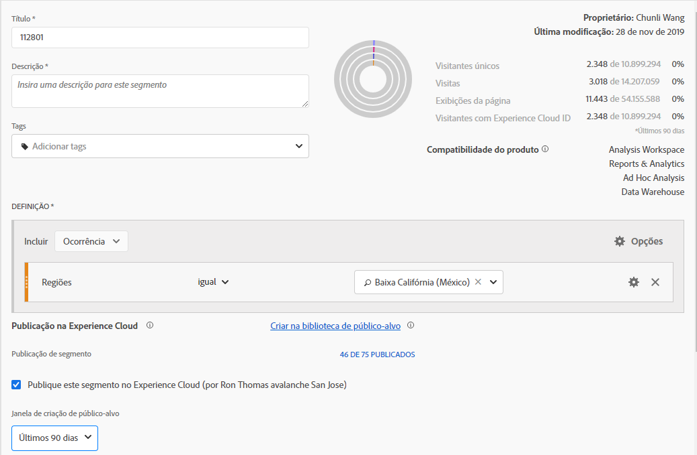
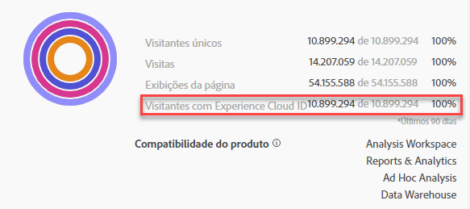
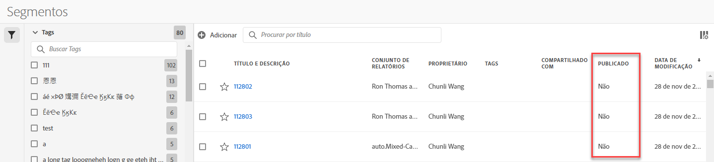
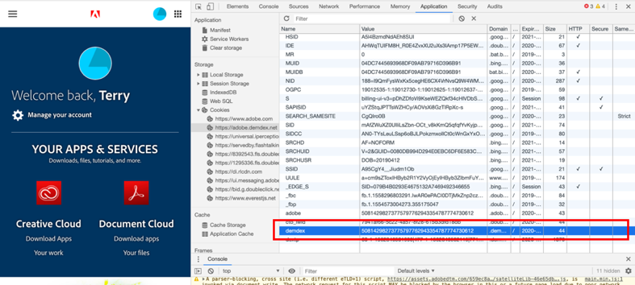

# Publicar segmentos na Experience Cloud

Publishing a segment to the Experience Cloud lets you use the segment for marketing activity in the [!UICONTROL Audience Library], [!DNL Target], [!DNL Audience Manager], [!DNL Advertising Cloud], and [!DNL Campaign]. Atualizações recentes otimizaram significativamente o fluxo de trabalho de publicação. Anteriormente, a publicação de um segmento utilizável levava aproximadamente 48 horas.

Agora o processamento pode levar até 8 horas, mas dependendo de outro tráfego e do tamanho do segmento, o processamento pode ser ainda mais rápido. (No entanto, não temos uma maneira de informar quando o segmento está disponível, portanto, você terá que verificar manualmente.) Também aumentamos o número máximo de segmentos publicáveis para 75 (de 20). É possível exibir segmentos publicados em Componentes > Segmentos.

> [!NOTE] O Adobe Campaign (Classic e Standard) se comporta de forma diferente, pois incorre em uma latência adicional de 24 horas acima da latência de 8 horas.

## Pré-requisitos

* Verifique se o conjunto de relatórios em que você está salvando este segmento está [habilitado para a Experience Cloud](https://docs.adobe.com/content/help/en/core-services/interface/audiences/t-publish-audience-segment.html). Caso contrário, não será possível publicar na Experience Cloud.
* Verifique se você está trabalhando em um conjunto de relatórios [mapeado para a sua organização da Experience Cloud](https://docs.adobe.com/content/help/en/core-services/interface/about-core-services/report-suite-mapping.html).
* Verifique se sua organização está usando Experience Cloud IDs.
* Before you can publish segments, your Admin needs to assign the [!UICONTROL Segment Publishing] permission to a product profile in the [Admin Console](https://docs.adobe.com/content/help/en/core-services/interface/manage-users-and-products/admin-getting-started.html), and add you to the product profile.

## Considerações

* **Limites do conjunto de relatórios**: você pode publicar até 75 segmentos por conjunto de relatórios. Este limite é aplicado. Se você já tiver 75 segmentos publicados, não poderá publicar segmentos adicionais até cancelar a publicação de segmentos suficientes para ficar abaixo do limite de 75 segmentos.
* **Limites de associação**: públicos-alvo compartilhados com a [!DNL Experience Cloud] a partir do Analytics não podem exceder 20 milhões de membros únicos.
* **Privacidade dos dados**: os públicos-alvo não são filtrados com base no estado de autenticação de um visitante. Se um visitante consegue navegar em seu site em estados de autenticação e de não autenticação, as ações que ocorrem quando um visitante não está autenticado podem fazer com que um visitante seja incluído em um público-alvo. Revise a [privacidade da Adobe Experience Cloud](https://www.adobe.com/privacy/experience-cloud.html) para entender todas as implicações de privacidade do compartilhamento de público-alvo.
* Para uma discussão sobre as **diferenças entre segmentos em[!DNL Adobe Analytics]e[!DNL Audience Manager]**, acesse[aqui](https://docs.adobe.com/content/help/en/analytics/integration/audience-analytics/audience-analytics-workflow/aam-analytics-segments.html).

## Linha do tempo de publicação do segmento

| O que está disponível | Quando está disponível | Onde está disponível |
|---|---|---|
| Metadados (título e definição do segmento) | Imediatamente após a publicação | [!DNL Audience Manager], [!UICONTROL Experience Cloud Audience Library], [!DNL Target] |
| Segmento utilizável com associação | ~ 8 horas após a publicação | Visualizador de perfil do visitante em [!DNL Audience Manager] |
| Características e população de associação | Em 24-48 horas | [!DNL Audience Manager] |

## Publicar segmentos em [!UICONTROL Segment Builder]

1. Navigate to **[!UICONTROL Analytics > Workspace > Components > Segments]> +**
1. Crie um segmento no [!UICONTROL Segment Builder].
1. Forneça um título e uma descrição para o segmento - caso contrário, você não poderá salvá-lo.
1. Verificar conjunto **[!UICONTROL Publish this segment to the Experience Cloud (for *de *relatórios)]**.

>[!IMPORTANT]
>
>Use &quot;Visitantes com Experience Cloud ID&quot; ao consultar as visualizações de segmentos no Analytics, em vez da visualização do segmento do total de &quot;visitantes únicos&quot;, ao comparar os números do Adobe Analytics com os números do Audience Manager:
>
>

| Elemento | Descrição |
|---|---|
| **[!UICONTROL Publish this segment to the Experience Cloud (for *<report suite>*)]** | Quando essa opção está ativada, o título e a definição do segmento (ou seja, o público-alvo da shell, como muitas vezes é usado em plataformas de anúncios) são compartilhados com a Experience Cloud instantaneamente, enquanto a associação do segmento é avaliada e compartilhada a cada quatro horas.   Quando esse público-alvo é associado a uma atividade no [!DNL Target], por exemplo, o [!DNL Analytics] começa a enviar IDs para os visitantes que se qualificaram para esse público-alvo da Experience Cloud e do [!DNL Target]. Nesse momento, o nome do público-alvo e os dados correspondentes começam a ser exibidos na página Públicos-alvo da Experience Cloud.   |
| **[!UICONTROL Audience Creation Window]** | O período selecionado é usado para criar o público-alvo com base no calendário rotativo. Por exemplo, &quot;Últimos 30 dias&quot; (padrão) inclui visitantes que se qualificaram para o público-alvo nos últimos 30 dias a partir da data de hoje (NÃO a partir da data original quando o segmento foi criado). |
| **[!UICONTROL Create in Audience Library]** | Os segmentos criados e publicados podem ser disponibilizados sem latência na Biblioteca de público-alvo da Experience Cloud. Eles não dependem das atualizações do Analytics. Esses segmentos não contam com o limite de 75 segmentos publicados. |
| **[!UICONTROL x of 75 Published]** | Mostra o número de segmentos publicados na Experience Cloud. Clique no link para ver uma lista de segmentos publicados e seu conjunto de relatórios associado e o proprietário. |
| **[!UICONTROL Save]** | Salva este segmento. |

## Cancelar a publicação ou excluir segmentos

Para excluir um segmento publicado na Experience Cloud, é necessário cancelar a publicação primeiro. Para cancelar a publicação de um segmento, basta **desmarcar** a caixa de seleção usada para publicá-lo.

> [!NOTE]**Não é possível** cancelar a publicação de um segmento que está em uso por qualquer uma das seguintes soluções da Adobe: [!DNL Analytics] (no [!DNL Audience Analytics]), [!DNL Campaign], [!DNL Advertising Cloud] (para cliente do [!DNL Core Service] e [!DNL Audience Manager]) e todos os outros parceiros externos (para clientes do [!DNL Audience Manager]). Você **pode** cancelar a publicação de um segmento em uso pelo [!DNL Target].

## View segment publishing status in the [!UICONTROL Segment Manager]

1. Navegue até [!UICONTROL Analytics > Components > Segments].
1. Notice the new [!UICONTROL Published] column. Sim/Não refere-se a se o segmento foi publicado na Experience Cloud ou não.

## Recuperar a [!DNL Audience Manager] UUID

Há duas maneiras de capturar a UUID do AAM associada ao navegador no momento:

* Adobe Experience Cloud Debugger
* Ferramenta de desenvolvedor nativa nos navegadores (por exemplo, Ferramentas de desenvolvedor do Chrome)

As capturas de tela a seguir mostram como recuperar a UUID do AAM no navegador e usá-la no Visualizador de perfil do visitante do Audience Manager, para validar a característica e a associação do segmento.

**Método 1: usar o Adobe Experience Cloud Debugger**

1. Baixe e instale o [Adobe Experience Cloud Debugger](https://docs.adobe.com/content/help/en/analytics/implementation/testing-and-validation/debugger.html) na loja na Web do Chrome.
1. Inicie o depurador ao carregar uma página.
1. Role até a seção Audience Manager e localize a UUID do AAM definida na página atual do navegador (`50814298273775797762943354787774730612` no exemplo abaixo)

**Método 2: usar as ferramentas de desenvolvedor do Chrome (ou as ferramentas de desenvolvedor de outro navegador)**

1. Inicie as Ferramentas de desenvolvedor do Chrome antes de carregar uma página
1. Carregue a página e marque Aplicativos > Cookies. A UUID do AAM deve ser definida no cookie Demdex de terceiros ([adobe.demdex.net](https://marketing.adobe.com/resources/help/en_US/aam/demdex-calls.html) no exemplo abaixo). O demdex de campo é a configuração de UUID do AAM no navegador (`50814298273775797762943354787774730612` no exemplo abaixo).

## Usar o Audience Manager [!UICONTROL Visitor Profile Viewer]

The AAM UUID on the browser will be used by default when [!UICONTROL Visitor Profile Viewer] is loaded. If verifying trait realizations for other users, input a UUID in the UUID field and click [!UICONTROL Refresh]. Consulte o [Visualizador de perfil do visitante](https://marketing.adobe.com/resources/help/en_US/aam/t_visitor_profile_viewer.html) para obter mais informações.

## Exibir as características do segmento em [!DNL Audience Manager]

No AAM, a lista de visitantes com ECIDs para um segmento específico é avaliada continuamente, à medida que o Analytics compartilha segmentos com a Experience Cloud.

1. Em [!DNL Audience Manager], vá para [!UICONTROL Audience Data > Traits > Analytics Traits]. Você verá uma pasta para cada conjunto de relatórios do Analytics mapeada para a organização da Experience Cloud. Essas pastas (para Características, Segmentos e Fontes de Dados) são criadas quando os serviços principais de Perfis e Públicos-alvo/Pessoas são iniciados ou provisionados.
1. Selecione a pasta do conjunto de relatórios em que você criou o segmento com o qual deseja compartilhar [!DNL Audience Manager]. Você verá o segmento/público-alvo criado. Quando você compartilha um segmento, duas coisas acontecem em [!DNL Audience Manager]:
* Uma característica é criada, primeiro sem dados. Aproximadamente. oito horas após o segmento ser publicado no [!DNL Analytics], a lista de ECIDs é atualizada e compartilhada com [!DNL Audience Manager] e outras soluções da Experience Cloud.

* Um segmento com uma única característica é criado. Ele usa a fonte de dados associada ao conjunto de relatórios em que você publicou o segmento.

## Exibir o segmento em [!DNL Adobe Target]

The [!UICONTROL Publish this segment to the Experience Cloud] checkbox during the segment creation process in Adobe Analytics allows the segment to be available within the Adobe Target&#39;s custom audience library. Um segmento criado no Analytics ou no Audience Manager pode ser usado em atividades no Target. Por exemplo, é possível criar atividades de campanha baseadas nas métricas de conversão do Analytics e nos segmentos de público-alvo criados no Analytics.
], click [!UICONTROL Audiences].
1. On the [!UICONTROL Audiences] page, locate the audience sourced from the [!DNL Experience Cloud]. Esses públicos-alvo estão disponíveis para uso em atividades [!DNL Target].

