# Construir segmentos sequenciais

Segmentos sequenciais são criados usando o operador ENTÃO, em vez de E ou OU. EM SEGUIDA, implica que ocorra um critério de segmento, seguido por outro. Por padrão, um segmento sequencial identifica todos os dados correspondentes, mostrados no filtro &quot;Incluir todos&quot;. Segmentos sequenciais podem ser filtrados ainda mais para um subconjunto de ocorrências correspondentes que usam as opções &quot;Apenas antes da sequência&quot; e &quot;Apenas após a sequência&quot;.

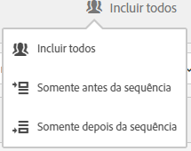

Além disso, é possível restringir os segmentos sequenciais a uma duração de tempo, granularidade e contagens específicas entre pontos de verificação ao usar os [operadores Depois e Dentro](/help/components/c-segmentation/c-segmentation-workflow/seg-sequential-build.md).

## Incluir todos {#section_75ADDD5D41F04800A09E592BB2940B35}

Ao criar o segmento usando a definição &quot;Incluir todos&quot;, o segmento identifica caminhos que correspondem ao padrão como um todo. Este é um exemplo de um segmento de sequência básico que procura por uma ocorrência (Página A) seguido por outra (Página B) como visitada pelo mesmo visitante. O segmento é definido como Incluir todos.

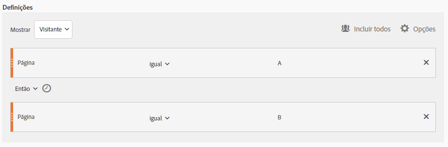

| Se o resultado for... | Sequência |
|--- |--- |
| Corresponde | A então B A então (em uma visita diferente) B A então D então B |
| Não corresponde | B depois A |

## Apenas antes da sequência ou apenas após a sequência  {#section_736E255C8CFF43C2A2CAAA6D312ED574}

As opções **[!UICONTROL Only Before Sequence]** e **[!UICONTROL Only After Sequence]** filtram o segmento para um subconjunto de dados antes ou depois da sequência especificada.

* **Apenas antes da sequência**: inclui todas as ocorrências antes de uma sequência + a primeira ocorrência da própria sequência (consulte o exemplo 1, 3). Se uma sequência aparece várias vezes em um caminho, &quot;Apenas antes da sequência&quot; inclui a primeira ocorrência da última ocorrência da sequência e todas as ocorrências anteriores (consulte o exemplo 2).
* **Apenas após a sequência**: inclui todas as ocorrências após uma sequência + a última ocorrência da própria sequência (consulte o exemplo 1, 3). Se uma sequência aparece várias vezes em um caminho, &quot;Apenas após&quot; inclui a última ocorrência da primeira ocorrência da sequência e todas as ocorrências posteriores (consulte o exemplo 2).

Por exemplo, uma sequência de B -> D. Os três filtros identificariam as ocorrências como se segue:considere 

**Exemplo 1: B e D aparecem uma vez**

| Exemplo | A | B | C | D | E | Sex |
|---|---|---|---|---|---|---|
| Incluir todos | A | B | C | D | E | Sex |
| Somente antes da sequência | A | B |  |  |  |  |
| Somente após a sequência |  |  |  | D | E | Sex |

**Exemplo 2: B e D aparecem várias vezes**

| Exemplo | A | B | C | D | B | C | D | E |
|---|---|---|---|---|---|---|---|---|
| Incluir todos | A | B | C | D | B | C | D | E |
| Somente antes da sequência | A | B | C | D | B |  |  |  |
| Somente após a sequência |  |  |  | D | B | C | D | E |

Também vamos modelar este conceito com a dimensão Profundidade da ocorrência.

**Exemplo 3: profundidade da ocorrência 3 então 5**

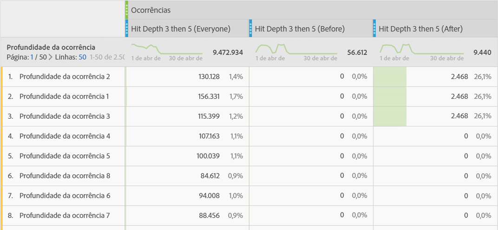

## Restrições de dimensão {#section_EAFD755F8E674F32BCE9B642F7F909DB}

Em uma cláusula &quot;dentro&quot;, entre instruções ENTÃO, é possível adicionar, por exemplo, &quot;dentro de uma instância de palavra-chave de pesquisa&quot;, &quot;dentro de uma instância eVar 47&quot;. Isso restringe o segmento a uma instância de uma dimensão.

Definir uma cláusula &quot;dentro da dimensão&quot; entre regras permite que o segmento restrinja dados a sequências que satisfazem a essa cláusula. Observe o exemplo abaixo, onde a restrição está definida como “Dentro de uma página”:

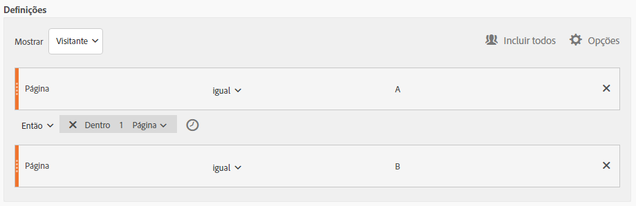

| Se o resultado for... | Sequência |
|--- |--- |
| Corresponde | A depois B |
| Não corresponde |  A então C então B (porque B não estava dentro de uma página de A) **Observação:** se a restrição de dimensão for removida, &quot;A então B&quot; e &quot;A então C então B&quot; corresponderão. |

## Sequência de visualização de páginas simples

Identifique visitantes que visualizaram uma página e, em seguida, outra página. Os dados no nível da ocorrência filtrarão essa sequência independentemente das sessões de visita anteriores, passadas ou temporárias ou do tempo ou número de visualizações de página que ocorrerem entre elas.

**Exemplo**: o Visitante visualizou a página A, em seguida, visualizou a página B na mesma visita ou em outra.

**Casos de uso**

A seguir estão exemplos de como o segmento pode ser usado.

1. Visitantes a um local de esportes visualização a landing page de futebol e visualização a landing page de basquete em ordem sequencial, mas não necessariamente na mesma visita. Isso faz com que uma campanha empurre o conteúdo do basquete para os espectadores de futebol durante a temporada de futebol.
1. O varejista de carro identifica uma relação entre aqueles que chegam na página de fidelidade do cliente e vão para a página de vídeo a qualquer momento durante a visita ou outra visita.

**Criar este segmento**

You nest two page rules within a top-level [!UICONTROL Visitor] container and sequence the page hits using the [!UICONTROL THEN] operator.

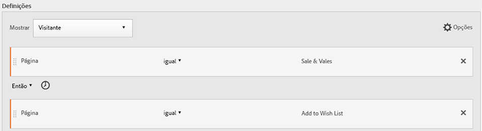

## Sequência do visitante em visitas

Identifique os visitantes que desistiram de uma campanha, mas voltaram para a sequência de exibições de página em outra sessão.

**Exemplo**: o Visitante visualizou a página A em uma visita, depois visualizou a página B em outra visita.

**Casos de uso**

A seguir estão exemplos de como esse tipo de segmento pode ser usado:

* Visitantes para a página de Esportes de um site de notícias revisita a página de Esportes em outra sessão.
* Um varejista de roupas vê uma relação entre visitantes que chegam em uma landing page em uma sessão e vão diretamente para a página de checkout em outra sessão.

**Criar este segmento**

This example nests two **[!UICONTROL Visit]** containers within the top-level **[!UICONTROL Visitor]** container and sequences the segment using the [!UICONTROL THEN] operator.

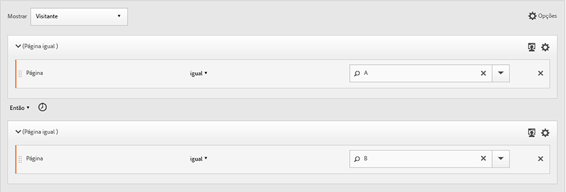

## Sequência de nível misto

Identifique visitantes que visualizam duas páginas em determinado número de visitas, mas visualize uma terceira página em uma visita separada.

**Exemplo**: os visitantes visitem a página A e depois a página B em uma ou mais visitas, seguido de uma visita à página C em uma visita separada.

**Casos de uso**

A seguir estão exemplos de como esse tipo de segmento pode ser usado:

* Os Visitantes primeiro visitam um site de notícias e depois visualização a página de esportes na mesma visita. Em outra visita, o visitante visita a página do tempo.
* O varejista define visitantes que entram na página Principal e vão para a página Minha conta. Em outra visita, eles visitam a página Carrinho de Visualizações.

**Criar este segmento**

1. Solte duas dimensões de Página dos painéis à esquerda em um [!UICONTROL Visitor] container de nível superior.
1. Adicione o operador ENTÃO entre eles.
1. Clique em **[!UICONTROL Options]** > **[!UICONTROL Add container]** e adicione um [!UICONTROL Visit] container abaixo do [!UICONTROL Visitor] nível e sequenciado usando o [!UICONTROL THEN] operador.

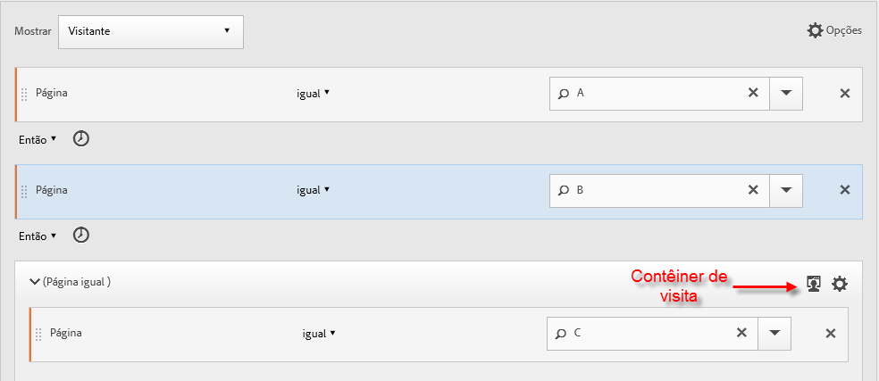

## Contêineres agregados

A adição de vários [!UICONTROL Hit] container em um [!UICONTROL Visitor] container permite empregar os operadores apropriados entre o mesmo tipo de container e usar regras e dimensões como Número de página e Número de visita para definir a visualização de página e fornecer uma dimensão de sequência dentro do [!UICONTROL Hit] container. A aplicação da lógica no nível da Ocorrência permite restringir e combinar correspondências em um mesmo nível de ocorrências no [!UICONTROL Visitor] container para criar diversos tipos de segmento.

**Exemplo**: Os Visitantes visitaram a página A após a primeira ocorrência na sequência de visualizações da página (página D no exemplo) e, em seguida, visitaram a página B ou C independentemente do número de visitas.

**Casos de uso**

A seguir estão exemplos de como esse tipo de segmento pode ser usado:

* Identifique os visitantes que vão para a landing page principal em uma visita, em seguida, visualização a página de roupas Masculinas em outra visita e visualização a landing page de Mulheres ou Crianças em uma visita diferente.
* Um e-zine captura os visitantes que vão ao Home page em uma visita, a página Esportes em outra visita e a página Opinião em outra visita.

**Criar este segmento**

1. Selecione o [!UICONTROL Visitor] container como container de nível superior.
1. Adicione container de dois [!UICONTROL Hit]níveis — uma dimensão com uma dimensão numérica apropriada unida no mesmo [!UICONTROL Hit] nível pelo operador [!UICONTROL AND] e [!UICONTROL OR] .
1. No [!UICONTROL Visit] container, adicione outro [!UICONTROL Hit] container e aninhe dois [!UICONTROL Hit] container adicionais unidos a um operador [!UICONTROL OR] ou [!UICONTROL AND] .

   Sequencie esses [!UICONTROL Hit] container aninhados com o [!UICONTROL THEN] operador.

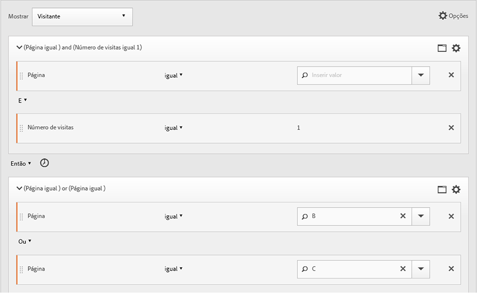

## &quot;Aninhamento&quot; em segmentos sequenciais

By placing checkpoints at both the [!UICONTROL Visit] and [!UICONTROL Hit] level, you can constrain the segment to meet requirements within a specific visit as well as a specific hit.

**Exemplo**: o visitante visitou a página A e a página B na mesma visita. Em uma nova visita, o visitante foi para a página C.

**Criar este segmento**

1. Underneath a top-level [!UICONTROL Visit] container, drag in two page dimensions.
1. Multisselecione ambas as regras, clique em **[!UICONTROL Options]** > **[!UICONTROL Add container from selection]** e altere-a para um [!UICONTROL Visit] container.
1. Junte-se a eles com um [!UICONTROL THEN] operador.
1. Crie um container de Ocorrência como um par para o [!UICONTROL Visit] container e arraste uma dimensão de página.
1. Junte a sequência aninhada no [!UICONTROL Visit] container ao [!UICONTROL Hit] container usando outro [!UICONTROL THEN] operador.

## Excluir ocorrências

As regras de segmento incluem todos os dados, a menos que você exclua [!UICONTROL Visitor], [!UICONTROL Visit]ou [!UICONTROL Hit] os dados usando a [!UICONTROL Exclude] regra. Ele permite que você ignore dados comuns e crie segmentos com mais foco. Ou permite que você crie segmentos excluindo grupos encontrados para identificar o conjunto de dados restante, como a criação de uma regra que inclua visitantes bem-sucedidos que fizeram pedidos e os excluíram para identificar &quot;não compradores&quot;. No entanto, na maioria dos casos, é melhor criar regras que excluam valores amplos em vez de tentar usar a [!UICONTROL Exclude] regra para público alvo de valores de inclusão específicos.

Por exemplo:

* **Excluir páginas**. Use uma regra de segmento para retirar uma página específica (como  *`Home Page`*) de um relatório, criar uma regra de Ocorrência em que a página seja igual à &quot;Página inicial&quot; e, então, excluí-la. Essa regra inclui automaticamente todos os valores, exceto o Home page.
* **Excluir domínios** de referência. Use uma regra que inclua apenas domínios de referência do Google.com e exclua todos os outros.
* **Identificar não compradores**. Identifique quando os pedidos são maiores que zero e depois exclua os [!UICONTROL Visitor].

O [!UICONTROL Exclude] operador pode ser empregado para identificar uma sequência em que visitas ou ocorrências específicas não sejam executadas pelo visitante. [!UICONTROL Exclude Checkpoints] também pode ser incluído em um Grupo lógico.

### Excluir entre pontos de verificação

Assegure lógica aos visitantes do segmento em que um ponto de verificação não tenha ocorrido explicitamente entre dois outros pontos de verificação.

**Exemplo**: os visitantes que visitaram a página A e, em seguida, visitaram a página C, mas não visitaram a página B.

**Casos de uso**

A seguir estão exemplos de como esse tipo de segmento pode ser usado:

* Visitantes para uma página de Estilo de vida e, em seguida, para a seção de Teatro sem ir para a página de Artes.
* Um revendedor automático vê uma relação entre aqueles que visitam a landing page principal e vão direto para a campanha Sem interesse sem ir para a página Veículo.

**Criar este segmento**

Crie um segmento como você faria para um segmento sequencial simples, de nível misto ou aninhado e, em seguida, defina o operador para o elemento de container. [!UICONTROL EXCLUDE] O exemplo abaixo é um segmento de agregação em que os três [!UICONTROL Hit] container são arrastados para a tela de desenho, o operador [!UICONTROL THEN] atribuído para unir a lógica do container e, em seguida, excluir o container de visualização da página central para incluir apenas visitantes que foram da página A para a página C na sequência.

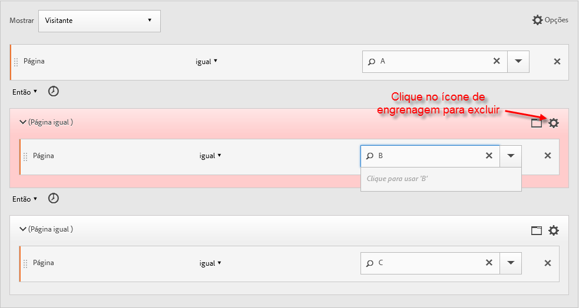

### Excluir no início da sequência

Se o ponto de verificação excluído estiver no início de um segmento sequencial, isso assegura que uma exibição de página excluída não ocorreu antes da primeira ocorrência não excluída.

**Exemplo**: o visitante visitou a página A e não a página B.

**Casos de uso**

Os seguintes exemplos de casos de uso sobre como esse tipo de segmento pode ser usado:

* Visitantes que visitaram a página A e não visitaram a página B.
* Um restaurante quer ver usuários inveterados que evitam a landing page principal e vão diretamente para a página Encomendar saída.

**Criar este segmento**

Crie dois container de Ocorrência separados em um container de Visitante de nível superior. Em seguida, defina o [!UICONTROL EXCLUDE] operador para o primeiro container.

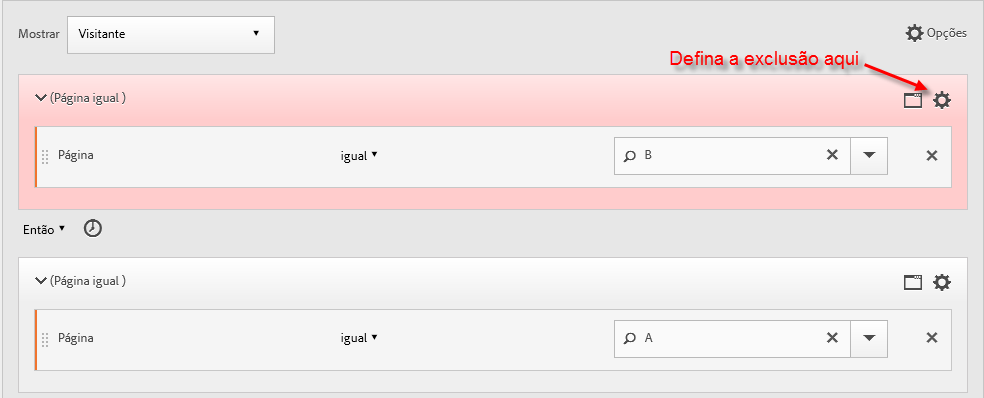

### Excluir no final da sequência

Se o ponto de verificação excluído estiver no final de uma sequência, isso garante que o ponto de verificação não ocorreu a partir do último ponto de verificação não excluído até o final da sequência do visitante.

**Exemplo**: os visitantes visitaram a página A e depois não visitaram a página B nas visitas atuais ou subsequentes.

**Casos de uso**

A seguir estão exemplos de como esse tipo de segmento pode ser usado:

* Visitantes que visitaram a página A e não visitaram a página B.
* Um restaurante quer ver usuários inveterados que evitam a landing page principal e vão diretamente para a página Encomendar saída.

**Criar este segmento**

Build a simple sequence segment by dragging two [!UICONTROL Hit] containers to the canvas and connecting them using the [!UICONTROL THEN] operator. Then assign the [!UICONTROL EXCLUDE] operator to the second [!UICONTROL Hit] container in the sequence.

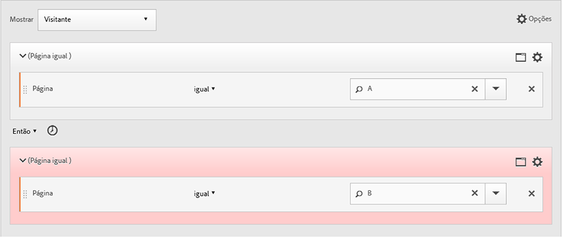

## Contêineres de Grupo lógico

Os contêineres do Grupo lógico são necessários para agrupar as condições em um único ponto de verificação de segmento sequencial. O contêiner especial do Grupo lógico está disponível somente na segmentação sequencial, para garantir que suas condições sejam atendidas após qualquer ponto de verificação sequencial anterior e antes de qualquer ponto de verificação sequencial posterior. As condições no próprio ponto de verificação do Grupo lógico podem ser cumpridas em qualquer ordem. Por outro lado, os contêineres não sequenciais (ocorrência, visita, visitante) não exigem que suas condições sejam atendidas na sequência geral, produzindo resultados não intuitivos, se usados com um operador ENTÃO.
The [!UICONTROL Logic Group] container was designed to treat *several checkpoints as a group*, *without any ordering* among the grouped checkpoints. Em outras palavras, a ordem dos pontos de verificação nesse grupo não é importante. For example, you can&#39;t nest a [!UICONTROL Visitor] container within a [!UICONTROL Visitor] container. But instead, you can nest a [!UICONTROL Logic Group] container within a [!UICONTROL Visitor] container with specific [!UICONTROL Visit]-level and [!UICONTROL Hit]-level checkpoints.

>[!NOTE] Um [!UICONTROL Logic Group] só pode ser definido em um segmento sequencial, o que significa que o operador [!UICONTROL THEN] é usado dentro da expressão.

| Hierarquia do contêiner | Ilustração | Definição |
|---|---|---|
| Hierarquia de Container padrão |  | No [!UICONTROL Visitor] container, os [!UICONTROL Visit] [!UICONTROL Hit] container e os  são aninhados em sequência para extrair segmentos com base nas ocorrências, no número de visitas e no visitante. |
| Hierarquia do contêiner lógico |  | A hierarquia de container padrão também é necessária fora do [!UICONTROL Logic Group] container. Mas dentro do [!UICONTROL Logic Group] container, os pontos de verificação não exigem uma ordem ou hierarquia estabelecida — esses pontos de verificação precisam apenas ser atendidos pelo visitante em qualquer ordem. |

Os grupos lógicos podem parecer intimidantes - veja algumas práticas recomendadas sobre como usá-los:

**Grupo lógico ou contêiner de Ocorrência/Visita?**
Se você quiser agrupar pontos de verificação sequenciais, seu &quot;contêiner&quot; será do Grupo lógico. No entanto, se esses pontos de verificação sequenciais precisarem ocorrer no escopo de uma única ocorrência ou visita, um contêiner de &quot;ocorrência&quot; ou &quot;visita&quot; será necessário. (É claro que a &quot;ocorrência&quot; não faz sentido para um grupo de pontos de verificação sequenciais, quando uma ocorrência não pode creditar mais de um ponto de verificação).

**Os Grupos lógicos simplificam a criação de segmentos sequenciais?**
Sim, eles podem. Suponhamos que você esteja tentando responder esta pergunta: um visitante **visualizou a página B, C ou D após a página A?**

Você pode criar esse segmento sem um contêiner do Grupo lógico, mas ele é complexo e trabalhoso:
* `Visitor Container [Page A THEN Page B THEN Page C THEN Page D] or`
* `Visitor Container [Page A THEN Page B THEN Page D THEN Page C] or`
* `Visitor Container [Page A THEN Page C THEN Page B THEN Page D] or`
* `Visitor Container [Page A THEN Page C THEN Page D THEN Page B] or`
* `Visitor Container [Page A THEN Page D THEN Page B THEN Page C] or`
* `Visitor Container [Page A THEN Page D THEN Page C THEN Page B]`

Um contêiner do Grupo lógico simplifica consideravelmente a criação desse segmento, como mostrado aqui:

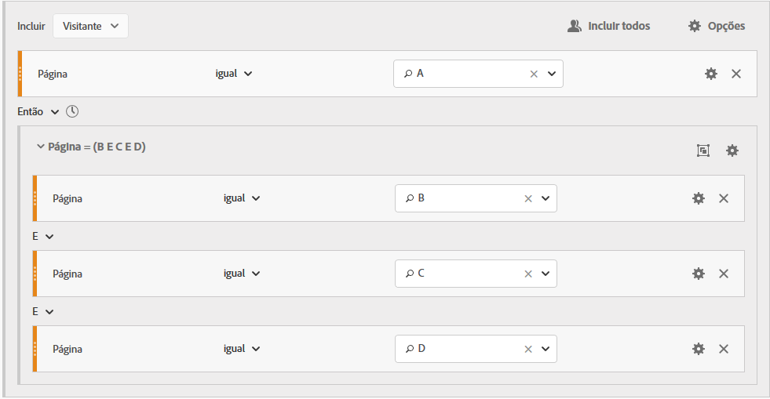

### Criar um segmento do Grupo lógico {#section_A5DDC96E72194668AA91BBD89E575D2E}

Como outros container, [!UICONTROL Logic Group] os container podem ser criados de várias formas dentro do [!UICONTROL Segment Builder]. Esta é uma maneira preferida de aninhar [!UICONTROL Logic Group] container:

1. Arraste dimensões, eventos ou segmentos dos painéis à esquerda.
1. Mude o container superior para um [!UICONTROL Visitor] container.
1. Altere o operador [!UICONTROL AND] ou [!UICONTROL OR] inserido por padrão para o operador ENTÃO.
1. Selecione os [!UICONTROL Hit] container (a Dimensão, Evento ou Item) e clique em **[!UICONTROL Options]** > **[!UICONTROL Add container from selection]**.
1. Click the container icon and select **[!UICONTROL Logic Group]**.  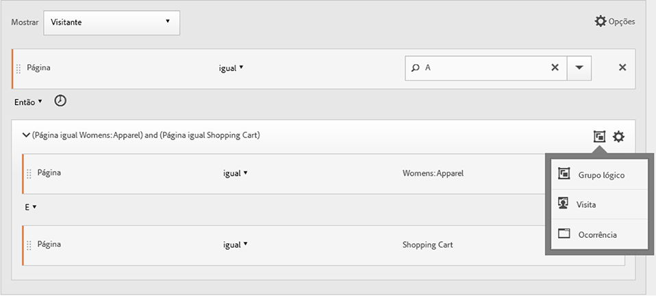
1. You can now set the [!UICONTROL Hit] within the [!UICONTROL Logic Group] container without regard to hierarchy.

### Pontos de verificação do grupo lógico em qualquer ordem

Using the [!UICONTROL Logic Group] lets you meet conditions within that group that reside outside of the sequence. This allows you to build segments where a [!UICONTROL Visit] or [!UICONTROL Hit] container happens irrespective of the normal hierarchy.

**Exemplo**: os visitantes que visitaram a página A visitaram depois as páginas B e C em qualquer ordem.

**Criar este segmento**

Page B and C are nested in a [!UICONTROL Logic Group] container within the outer [!UICONTROL Visitor] container. The [!UICONTROL Hit] container for A is then followed by the [!UICONTROL Logic Group] container with B and C identified using the [!UICONTROL AND] operator. Because it is in the [!UICONTROL Logic Group], the sequence is not defined and hitting both page B and C in any order makes the argument true.

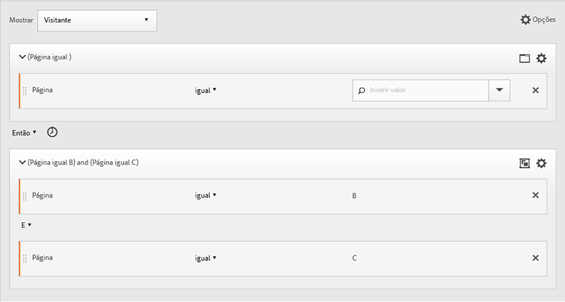

**Outro exemplo**: visitantes que visitaram a página B ou C, então a página A:

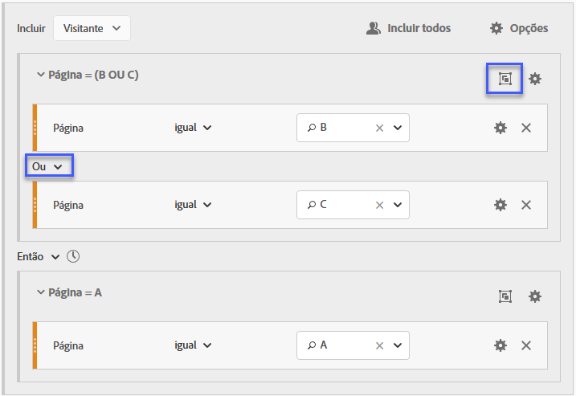

O segmento deve corresponder pelo menos a um dos pontos de verificação do grupo lógico (B ou C). Além disso, as condições do grupo lógico podem ser cumpridas na mesma ocorrência ou em várias ocorrências. 

### Primeira correspondência do grupo lógico

Using the [!UICONTROL Logic Group] lets you meet conditions within that group that reside outside of the sequence. Nesse segmento de primeira correspondência não ordenado, as [!UICONTROL Logic Group] regras são identificadas primeiro para serem uma visualização de página da página B ou C, depois a visualização necessária da página A.

**Exemplo**: os visitantes que visitaram a página B ou a página C, visitaram a página A.

**Criar este segmento**

Page B and page C dimensions are grouped within a [!UICONTROL Logic Group] container with the [!UICONTROL OR] operator selected, then the [!UICONTROL Hit]container identifying a page view of page A as the value.

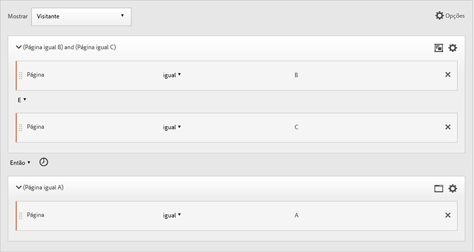

### Excluir E do Grupo lógico

Build segments using the [!UICONTROL Logic Group] where multiple page views are aggregated to define what pages were necessary to be hit while other pages were specifically missed. ****

**Exemplo**: o visitante visitou a página A e não visitou explicitamente a página B ou C, mas acessou a página D.

**Criar este segmento**

Construa esse segmento arrastando dimensões, eventos e segmentos pré-criados dos painéis à esquerda. Consulte [Construção de um segmento de grupo lógico](/help/components/c-segmentation/c-segmentation-workflow/seg-sequential-build.md).

Depois de aninhar os valores dentro do [!UICONTROL Logic Group], clique no **[!UICONTROL Exclude]** botão dentro do [!UICONTROL Logic Group] container.

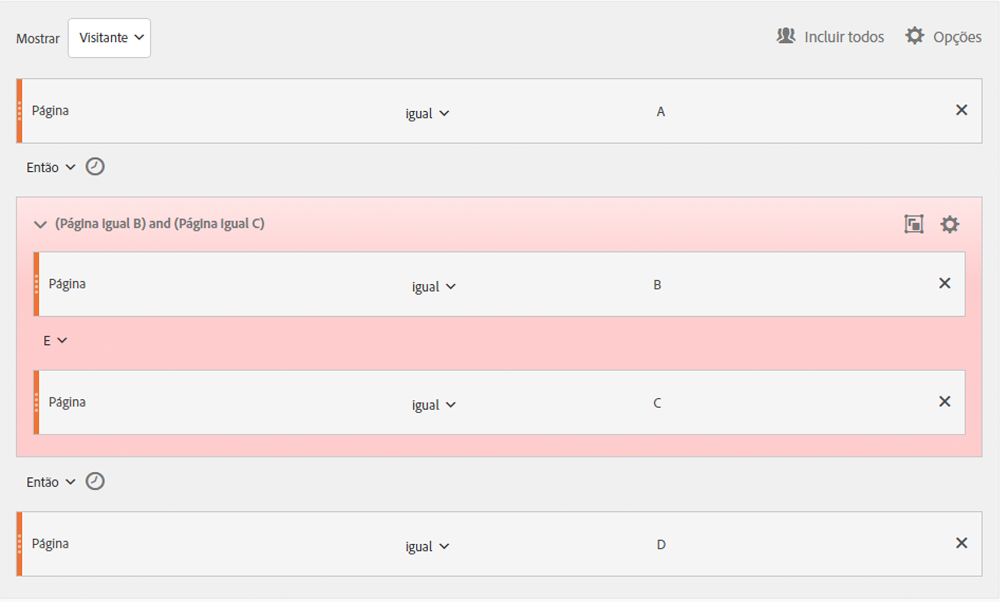

### Excluir OU do grupo lógico

Build segments using the [!UICONTROL Logic Group] where multiple page views are aggregated to define what pages were necessary to be hit while other pages were specifically missed.

**Exemplo**: os visitantes que visitaram a página A, mas não visitaram a página B ou C antes da página A.

**Criar este segmento**

The initial B and C pages are identified in a [!UICONTROL Logic Group] container that is excluded, and then followed by a hit to page A by the visitor.

Construa esse segmento arrastando dimensões, eventos e segmentos pré-criados dos painéis à esquerda.

Depois de aninhar os valores dentro do [!UICONTROL Logic Group], clique no **[!UICONTROL Exclude]** botão dentro do [!UICONTROL Logic Group] container.

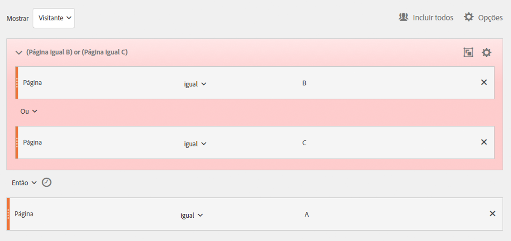

## Criar segmentos de tempo em e tempo após

Use os operadores [!UICONTROL Within] e [!UICONTROL After] incorporados ao cabeçalho de cada container para definir o tempo, os eventos e a contagem.

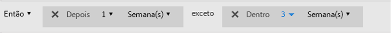

Você pode limitar a correspondência a uma duração de tempo especificada usando os [!UICONTROL Within] container e [!UICONTROL After] os  e especificando uma granularidade e contagem. The [!UICONTROL Within] operator is used to specify a max limit on the amount of time between two checkpoints. The [!UICONTROL After] operator is used to specify a minimum limit on the amount of time between two checkpoints.

### Operadores Depois e Dentro  {#section_CCAF5E44719447CFA7DF8DA4192DA6F8}

A duração é especificada por uma única letra maiúscula representando a granularidade seguida por um número representando a contagem de repetição da granularidade.

**[!UICONTROL Within]** inclui o endpoint (menor que ou igual a).

**[!UICONTROL After]** não inclui o endpoint (maior que).

| Operadores | Descrição |
|--- |--- |
| AFTER | O operador Depois é usado para especificar um limite mínimo na quantidade de tempo entre dois pontos de verificação. Ao definir os valores de Depois, o limite de tempo começará quando o segmento for aplicado. Por exemplo, se o operador Depois estiver definido em um contêiner para identificar visitantes que visitaram a página A, mas não retornam para visitar a página B depois de um dia, esse dia começará quando o visitante sair da página A. Para que o visitante seja incluído no segmento, no mínimo, 1440 minutos (um dia) devem se passar após sair da página A para visualizar a página B. |
| WITHIN | O operador Dentro é usado para especificar um limite máximo na quantidade de tempo entre dois pontos de verificação. Por exemplo, se o operador Dentro estiver definido em um contêiner para identificar visitantes que visitaram a página A e retornam para visitar a página B dentro de um dia, esse dia começará quando o visitante sair da página A. Para ser incluído no segmento, o visitante terá um tempo máximo de um dia antes de abrir a página B. Para que o visitante seja incluído no segmento, a visita à página B deve ocorrer dentro de no máximo 1440 minutos (um dia) após sair da página A para visualizar a página B. |
| DEPOIS/DENTRO | Ao usar ambos os operadores Depois e Dentro, é importante compreender que ambos os operadores começarão e terminarão simultaneamente, não em sequência.   Por exemplo, se você construir um segmento com o contêiner definido como:  `After = 1 Week(s) and Within = 2 Week(s)` , as condições para identificar os visitantes no segmentos serão atendidas somente entre 1 e 2 semanas. As duas condições são aplicadas a partir da primeira ocorrência da página. |

### Usar o operador Depois

* Tempo Depois permite rastrear por ano, mês, dia, hora e minuto para corresponder às visitas.
* A opção Tempo após só pode ser aplicada a um [!UICONTROL Hit] container porque é o único nível para o qual essa granularidade fina é definida.

**Exemplo**: os visitantes que visitaram a página A e, depois, a página B somente após 2 semanas.****

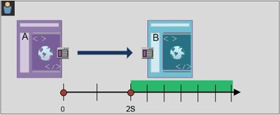

**Crie o segmento**: Esse segmento é criado adicionando um [!UICONTROL Visitor] container com dois [!UICONTROL Hit] container. You can then set the [!UICONTROL THEN] operator, and open the [!UICONTROL AFTER] operator drop down and set the number of weeks.

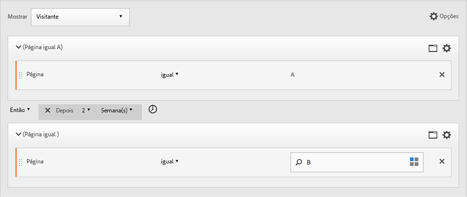

**Corresponde**

Ao determinar &quot;Após 2 semanas&quot;, se houver uma ocorrência na página A em 1° de junho de 2019 às 00:01, a próxima ocorrência na página B corresponderá contanto que seja realizada antes de 00:01 de 15 de junho de 2019 (14 dias depois).

| Ocorrência A | Ocorrência B | Correspondência |
|--- |--- |--- |
| Ocorrência **A**: 1 de junho de 2019 00:01 | **Ocorrência B**: 15 de junho de 2019 00:01 | **Corresponde**: essa restrição de tempo corresponde porque ocorre Depois de 1° de junho de 2019 (duas semanas). |
| Ocorrência **A**: 1 de junho de 2019 00:01 | Ocorrência **B**: 8 de junho de 2019 00:01 Ocorrência B: 15 de junho de 2019 00:01 | **Não corresponde**: a primeira correspondência na página B não corresponde porque está em conflito coma primeira restrição que exigia a ocorrência após duas semanas. |

### Usar o operador Dentro

* [!UICONTROL Within] permite rastrear por ano, mês, dia, hora e minuto para corresponder às visitas.
* [!UICONTROL Within] só pode ser aplicado a um [!UICONTROL Hit] container porque é o único nível para o qual essa granularidade fina é definida.

>[!IMPORTANT]
>
>Em uma cláusula &quot;dentro&quot;, entre instruções ENTÃO, é possível adicionar, por exemplo, &quot;dentro de uma instância de palavra-chave de pesquisa&quot;, &quot;dentro de uma instância eVar 47&quot;. Isso restringe o segmento a uma instância de uma dimensão.

**Exemplo**: os visitantes que visitaram a página A e, em seguida, visitaram a página B dentro de 5 minutos.

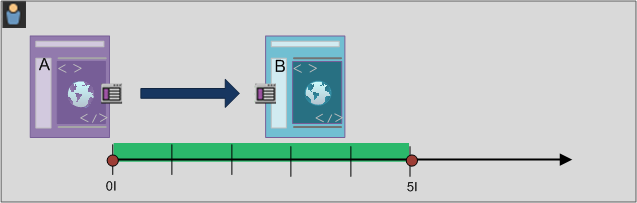

**Crie o segmento**: Esse segmento é criado adicionando um [!UICONTROL Visitor] container e, em seguida, arrastando com dois [!UICONTROL Hit] container. You can then set the [!UICONTROL THEN] operator, and open the [!UICONTROL AFTER] operator drop down and set the interval: hits, page views, visits, minutes, hours, days, weeks, months, quarters, or years.

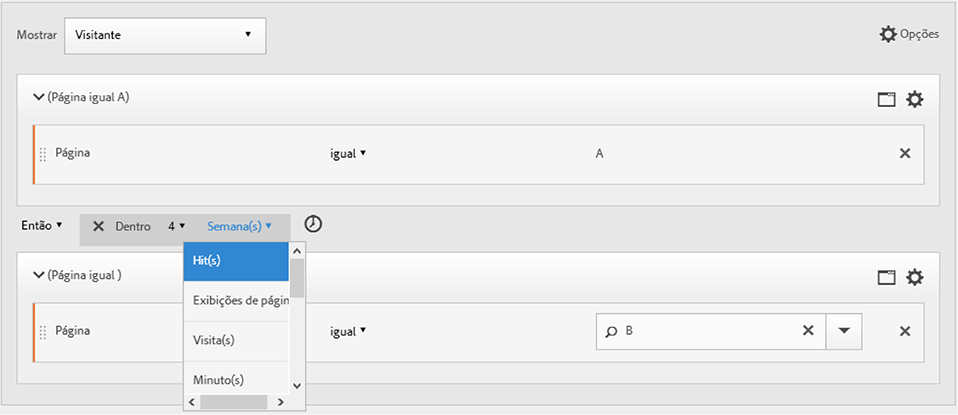

**Corresponde**

As correspondências devem ocorrer dentro do limite de tempo. Para a expressão, se um visitante faz uma ocorrência na página A às 00:01, a próxima ocorrência à página B corresponderá se acontecer em ou antes de 00:06 (cinco minutos depois, incluindo o mesmo minuto). As ocorrências dentro do mesmo minuto também corresponderão.

### Os operadores Dentro e Depois

Use [!UICONTROL Within] and [!UICONTROL After] to provide a maximum and minimum endpoint at both ends of a segment.

**Exemplo**: os visitantes que visitaram a página A e, em seguida, a página B após 2 semanas, mas dentro de 1 mês.

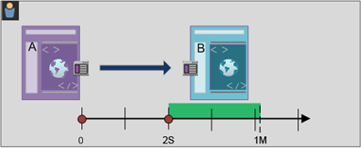

**Crie o segmento**: Crie o segmento sequenciando dois [!UICONTROL Hit] container em um [!UICONTROL Visitor] container. Em seguida, defina os operadores [!UICONTROL After] e [!UICONTROL Within] .

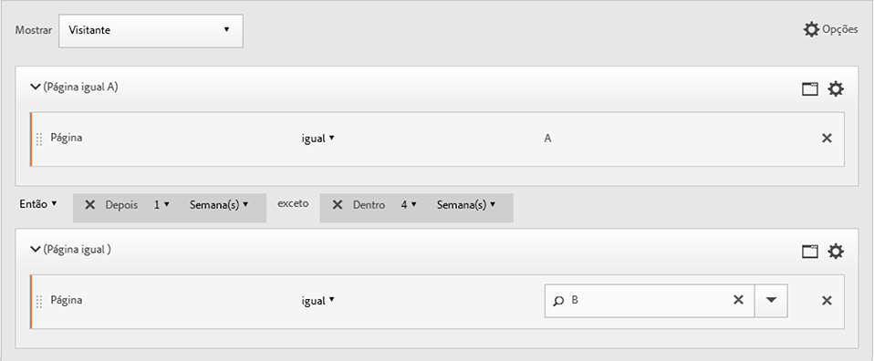

**Corresponde**

Todos os visitantes que acessam a página A em 1° de junho de 2019 voltam depois de 15 de junho de 2019 às 00:01, mas *antes* de 1° de julho de 2019 estão incluídos no segmento. Comparar com [Tempo entre exclusões](/help/components/c-segmentation/c-segmentation-workflow/seg-sequential-build.md).

Os operadores [!UICONTROL After] e [!UICONTROL Within] podem ser usados juntos para definir um segmento sequencial.

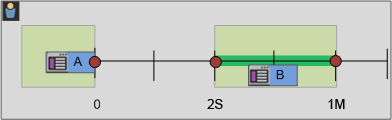

Este exemplo descreve uma segunda visita para atingir a página B após duas semanas, mas dentro de um mês.
