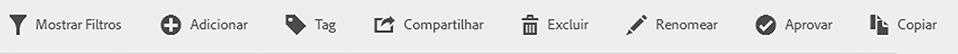
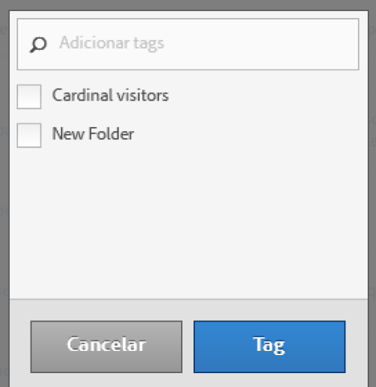

# Marcar segmentos

No Gerenciador de segmentos, a marcação de segmentos permite que você os organize.

Todos os usuários podem criar tags para segmentos e aplicar uma ou mais tags a um segmento. No entanto, você pode visualizar tags somente para seus segmentos ou os compartilhados com você. Que tipos de tags você deve criar? Estas são algumas sugestões para tags úteis:

* Tags com base em **nomes de equipe**, como Marketing social, Marketing móvel.
* Tags de **projeto** (tags de análise), como análises de página de entrada.
* Tags de **categoria**: masculino; geografia.
* Tags de **fluxo de trabalho**: para ser aprovado; auxiliar para (uma unidade de negócios específica)

1. No Gerenciamento de segmentos, marque a caixa de seleção ao lado do segmento que você deseja marcar. A barra de ferramentas de gerenciamento do segmento aparece:

   

1. Clique em **[!UICONTROL Tag]e**

   * selecione a partir das tags existentes, ou
   * adicione uma nova tag e pressione **[!UICONTROL Enter]**.

      

1. Clique em **[!UICONTROL Tag]novamente e marque o segmento.**

A tag agora deve aparecer na coluna Tags. (Clique no ícone de engrenagem na parte superior direita para gerenciar suas colunas).

You can also filter on tags by going to **[!UICONTROL Filters]** &gt; **[!UICONTROL Tags]**.
