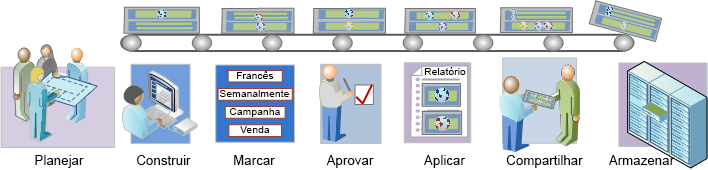

# Visão geral do fluxo de trabalho de segmentação

Descreve um fluxo de trabalho sugerido para segmentos criados com o Construtor de segmentos e gerenciado pelo Gerenciador de segmentos.

## Segmentation workflow overview {#concept_6D2E1A72A3AD4EBBB9135094F2D9DEDF}

Descreve um fluxo de trabalho sugerido para segmentos criados com o Construtor de segmentos e gerenciado pelo Gerenciador de segmentos.

<!-- 

seg_workflow.xml

 -->

[ Planejar segmentos](../../../components/c-segmentation/c-segmentation-workflow/seg-plan.md#concept_D8BE6AB8D8E540E58C3462F9E02F4847)

Você fez todas as perguntas apropriadas antes de construir segmentos e configurar um ambiente de gerenciamento de segmentos? Você projetou o segmento com a finalidade pretendida e uso distinto em mente?

Consulte a  Lista de verificação de segmento para obter ajudar no planejamento e na organização dos segmentos.

 [Construir segmentos](../../../components/c-segmentation/c-segmentation-workflow/seg-build.md#concept_BD4C17B01C5B4E378D0C14C852D055D4)

Construa e edite segmentos para uso em todos os recursos do Analytics.

Consulte [Construa segmentos sequenciais](../../../components/c-segmentation/c-segmentation-workflow/seg-sequential-build.md#concept_83AEC78CD25F442EBEE364856A889560) para criar segmentos com o operador ENTÃO.

[ Marcar segmentos](../../../components/c-segmentation/c-segmentation-workflow/seg-tag.md#concept_CD892CEB326C4986A1B67487052DBA50)

Marque segmentos para facilitar a organização e o compartilhamento. A marcação substitui as hierarquias da pasta na análise ad hoc. Consulte como planejar e atribuir tags para pesquisas e organização simples e avançada.

[ Aprovar segmentos](../../../components/c-segmentation/c-segmentation-workflow/seg-approve.md#concept_DF477F151A9E483A92ED1DDAAF035953)

Aprove segmentos para transformá-los em canônicos.

[ Aplicar segmentos](../../../components/c-segmentation/c-segmentation-workflow/t-seg-apply.md#task_13E69C7D428A43EF9CCCA7F1104F1E8F)

Você pode aplicar segmentos diretamente de um relatório, de um trilho de segmentos (Mostrar segmentos).

 [ Compartilhar segmentos](../../../components/c-segmentation/c-segmentation-workflow/t-seg-share.md#task_7DC54643083E42C28F918E4F0845C5A5)

Compartilhe seus segmentos com o público-alvo pretendido em outras ferramentas do Analytics e no Adobe Target e na Adobe Experience Cloud.

[ Filtrar segmentos](../../../components/c-segmentation/c-segmentation-workflow/t-seg-filter.md#task_B59946C6D38945629C1FEACF80A85746)

Filtrar por tags, proprietários e outros filtros (Mostrar tudo, Meu, Compartilhado comigo, Favoritos e Aprovado).

[ Marcar segmento como favoritos](../../../components/c-segmentation/c-segmentation-workflow/t-seg-favorite.md#task_F45DFA3FBF0C4082B46A0D032CB20FC5)

Outra maneira de organizá-los para facilitar o uso é marcar os segmentos como favoritos.

[Gerenciar segmentos](../../../components/c-segmentation/c-segmentation-workflow/seg-manage.md#concept_7A2E019317864065B7C641DC3315928F)

O Gerenciador de segmentos oferece várias formas de cuidar de segmentos, como compartilhar, filtrar, marcar, aprovar, copiar, excluir e marcar como favoritos.