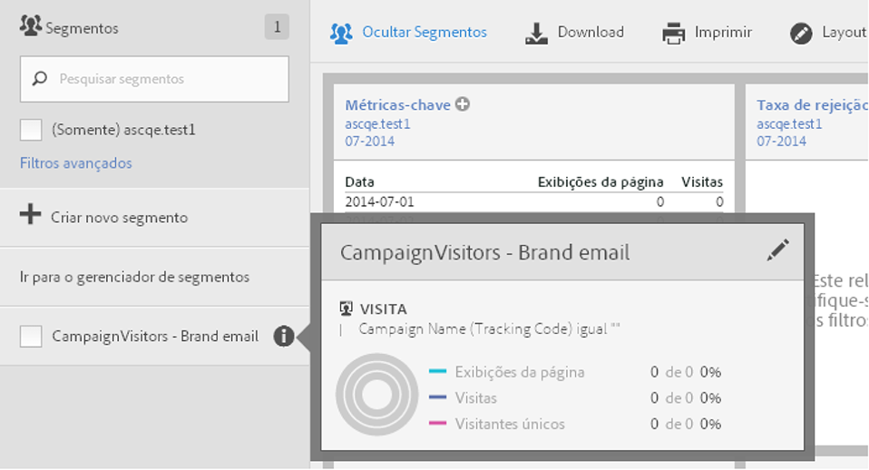
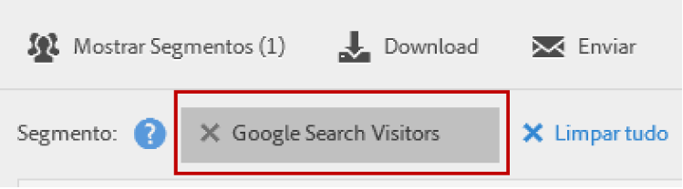

# Selecionar e aplicar segmentos

Como aplicar um ou mais segmentos a um relatório a partir do painel de segmentos.

1. Traga para frente o relatório ao qual você deseja aplicar um segmento, por exemplo, o [!UICONTROL Relatório de páginas].
1. Clique em **[!UICONTROL Mostrar segmentos]** acima do relatório. O trilho de segmentos abre.

   

1. Marque a caixa de seleção ao lado de um ou mais segmentos ou **[!UICONTROL Pesquise segmentos]** para encontrar o segmento apropriado.

   >[!NOTE]
   >
   >Você pode aplicar mais de um segmento a um relatório (isso se chama empilhamento de segmentos). Quando vários segmentos são aplicados, os critérios em cada segmento são combinados com um operador "e" e, em seguida, são aplicados. Não há limite para a quantidade de segmentos que podem ser empilhados.

   >[!NOTE]
   >
   >Clicar no ícone Informações (i) ao lado do nome do segmento permite que você visualize as métricas principais para conferir se você tem um segmento válido e a amplitude deste.

1. Você pode filtrar por conjunto de relatórios ao marcar a caixa de seleção **[!UICONTROL (Somente)`<report suite name>`]**. Isso exibirá somente os segmentos que foram salvos por último no conjunto de relatórios.
1. Clique em **[!UICONTROL Aplicar segmento]** e o relatório será atualizado. O segmento ou os segmentos que são aplicados agora são exibidos na parte superior do relatório:

   
