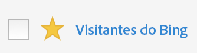

# Marcar segmentos como favoritos

Outra maneira de organizá-los para facilitar o uso é marcar os segmentos como favoritos.

1. No Gerenciador de segmentos, marque a estrala ao lado de qualquer segmento que você deseja marcar como favorito. Agora deve aparecer como uma estrela amarela:

   

1. You can also filter on favorites under **[!UICONTROL Filters]** &gt; **[!UICONTROL Other Filters]** &gt; **[!UICONTROL Favorites]**.
